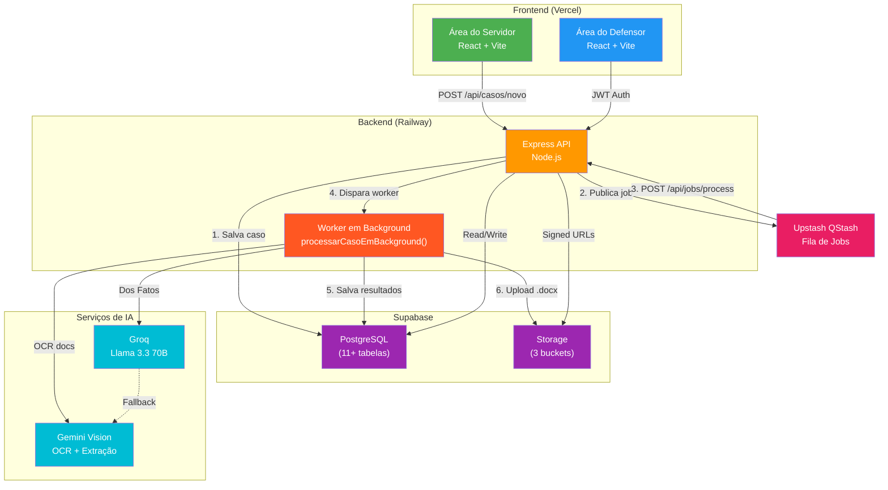
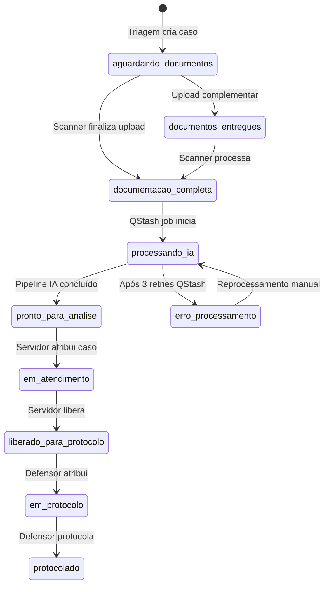
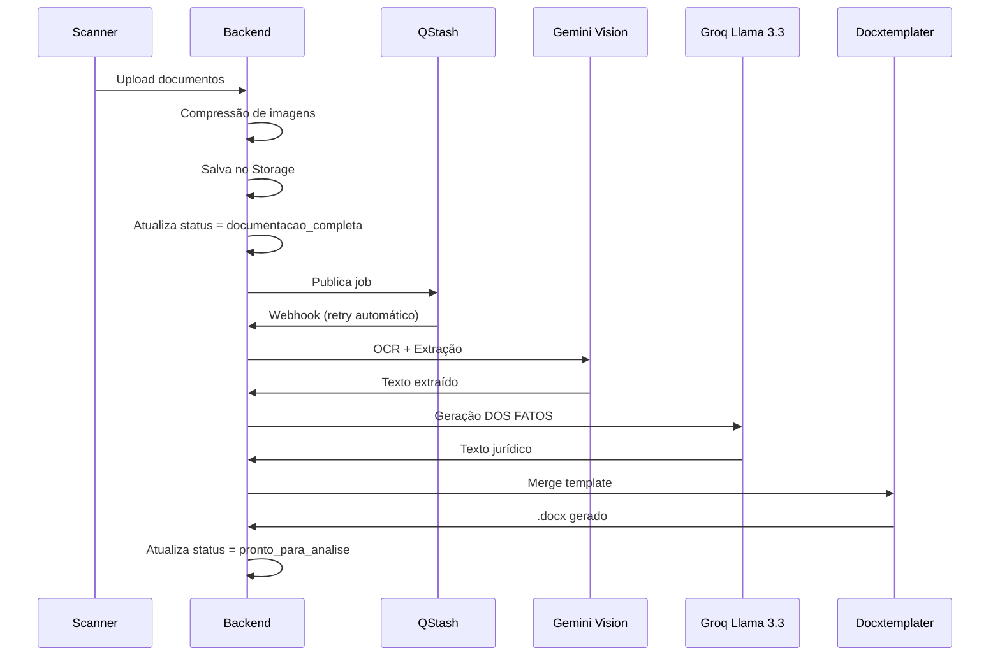

# Arquitetura do Sistema — Mães em Ação · DPE-BA

> **Versão:** 3.1 · **Atualizado em:** 2026-04-23 (Security Hardening + A11y + Design System)
> **Contexto:** Mutirão estadual da Defensoria Pública da Bahia

---

## 1. Visão Geral

O **Mães em Ação** é um sistema Full Stack desenvolvido para apoiar o mutirão estadual da Defensoria Pública da Bahia, cobrindo **35 a 52 sedes simultaneamente** durante **~5 dias úteis**. O sistema automatiza triagem, processamento de documentos via IA e geração de petições de Direito de Família para mães solo e em situação de vulnerabilidade.

**Diferença crítica:** Projetado para escalar de ~17 casos (versão anterior) para centenas de casos em poucos minutos, exigindo arquitetura robusta e processamento assíncrono.

---

## 2. Stack Tecnológica

### Frontend
- **React 18 + Vite** → Vercel (SPA estática)
- **Vanilla CSS** → Estilização personalizada via `index.css` (Tailwind v4 + Design Tokens)
- **React Router** → Navegação SPA

### Backend
- **Node.js + Express** → Railway Pro
- **ES Modules** → `"type": "module"` no `package.json`
- **Prisma ORM** → Abstração do banco (equipe/RBAC)
- **Supabase JS Client** → Core de casos e pipeline IA
- **Multer** → Upload de arquivos

### Banco de Dados
- **Supabase Pro** (PostgreSQL, sa-east-1) — projeto ISOLADO da versão anterior
- **Schema v1.0** → 11+ tabelas normalizadas (incluindo `assistencia_casos`, `notificacoes`)
- **Índices estratégicos** → CPF, protocolo, status, unidade

### Storage
- **Supabase Storage** (S3-compatible) — apenas signed URLs (1h de validade), nunca públicas
- **3 Buckets:** `audios`, `documentos`, `peticoes`
- **Compressão de imagens** → Redução automática antes do upload

### Fila & Processamento
- **Upstash QStash** — Fila de jobs assíncronos
- **Retry automático** → 3 tentativas com backoff de 30s
- **Fallback local** → `setImmediate()` quando QStash indisponível

### IA & OCR
- **Gemini Vision (Google)** → OCR primário para documentos
- **Groq Llama 3.3 70B** → Geração de texto jurídico (DOS FATOS)
- **Fallbacks:** Tesseract.js (imagens), Gemini Flash (texto)

### Autenticação
- **JWT** gerado no próprio backend Express (não Supabase Auth)
- **Payload:** `{ id, nome, email, cargo, unidade_id }`
- **Expiração:** 12h (cobre um dia de mutirão)
- **Servidores do balcão:** `X-API-Key` (string aleatória 64 chars)
- **Download Ticket JWT:** token de curta duração com `purpose: "download"`. **Hardened:** Agora exige `casoId` explícito no payload e validação estrita contra o parâmetro da rota (bloqueio de IDOR).

---

## 3. Diagrama de Módulos



---

## 4. Fluxo Operacional (4 Etapas)

### Etapa 1 — Triagem (Atendente Primário)

- Busca por CPF na `BuscaCentral.jsx` → verifica cadastro existente
- Se CPF com caso existente → detecta vínculo de irmãos (pré-preenche dados do representante)
- Preenche qualificação da assistida + dados do requerido + relato informal em `TriagemCaso.jsx`
- Seleciona tipo de ação no seletor configuração-driven (`familia.js`)
- Define se vai "Anexar Agora" ou "Deixar para Scanner"
- Status inicial: `aguardando_documentos` + protocolo gerado

### Etapa 2 — Scanner (Servidor B / Balcão)

- **Página Dedicada:** `ScannerBalcao.jsx` (novo, commit `3c9bb9e`)
- **Endpoint Dedicado:** `/api/scanner/upload` — otimizado para alto volume
- Busca por CPF ou protocolo
- Dropzone única — todos os documentos de uma vez
- Backend comprime imagens > 1.5MB antes de salvar no Storage
- Ao finalizar: status → `documentacao_completa`, job publicado no QStash
- Frontend retorna 200 imediatamente — IA processa em background

### Etapa 3 — Atendimento Jurídico (Servidor Jurídico)

- Filtra fila por `pronto_para_analise` + sua `unidade_id`
- **Locking Nível 1:** Atribuição via botão "Travar Atendimento"
- Revisa relato, DOS FATOS gerado, documentos
- **Múltiplas Minutas:** IA gera Prisão + Penhora simultaneamente (se dívida ≥ 3 meses)
- Pode editar e clicar "Regerar com IA"
- Ao concluir: status → `liberado_para_protocolo`

### Etapa 4 — Protocolo (Defensor)

- Filtra casos com status `liberado_para_protocolo`
- **Locking Nível 2:** Atribuição explícita (`defensor_id` + `defensor_at`)
- Protocola no SOLAR ou SIGAD
- Salva `numero_processo` + upload da capa
- **Manual Unlock:** Botão "Liberar Caso" devolve o processo à fila global
- Status → `protocolado`

---

## 5. Máquina de Estados



### Locking — Sessões e Concorrência

- **Nível 1 (Servidor):** Bloqueia edição de dados jurídicos e relato
- **Nível 2 (Defensor):** Bloqueia a etapa de protocolo e finalização
- **HTTP 423 (Locked):** Retorno padrão quando outro usuário detém o lock
- **Admin Bypass:** Administradores podem forçar destravamento via painel
- **Auto-release:** Lock liberado após 30min de inatividade

---

## 6. Banco de Dados (Schema Normalizado — v2.1)

### Principais Tabelas

| Tabela | Descrição | Relacionamentos |
|:-------|:----------|:----------------|
| `casos` | Núcleo do sistema | FK: unidades, defensores |
| `casos_partes` | Qualificação das partes | 1:1 com casos |
| `casos_juridico` | Dados jurídicos específicos | 1:1 com casos |
| `casos_ia` | Resultados de IA e URLs Duplas | 1:1 com casos |
| `documentos` | Arquivos enviados | N:1 com casos |
| `assistencia_casos` | Registro de colaboração/compartilhamento | N:N com casos e defensores |
| `unidades` | Sedes da DPE-BA | 1:N com casos |
| `defensores` | Usuários do sistema | N:1 com casos |
| `cargos` | Permissões por cargo | N:1 com defensores |
| `permissoes` | Sistema de RBAC | N:N com cargos |
| `notificacoes` | Alertas do sistema | N:1 com defensores |
| `logs_auditoria` | Auditoria de ações | N:1 com defensores, casos |
| `logs_pipeline` | Logs do pipeline IA | N:1 com casos |

### Campos Chave na Tabela `casos` (v2.1)

Além dos campos existentes, os seguintes campos foram adicionados nas fases recentes:

| Campo | Tipo | Descrição |
|:------|:-----|:----------|
| `compartilhado` | `Boolean` | `true` se o caso possui assistência colaborativa ativa |
| `agendamento_data` | `Timestamptz` | Data/hora do agendamento |
| `agendamento_link` | `String` | Link ou endereço do agendamento |
| `agendamento_status` | `String` | `"agendado"` ou `"pendente"` |
| `chave_acesso_hash` | `String` | Hash SHA-256 da chave de acesso pública |
| `feedback` | `String` | Feedback do defensor sobre o caso |
| `finished_at` | `Timestamptz` | Quando o caso foi finalizado/encaminhado |
| `url_capa_processual` | `String` | URL da capa processual no Storage |
| `assistencia_casos` | `Relation` | Vínculo N:N com `assistencia_casos` |

### Modelo `defensores` (v2.1)

| Campo novo | Descrição |
|:-----------|:----------|
| `supabase_uid` | UID do Supabase Auth (opcional, para integração futura) |
| `senha_hash` | Agora opcional (`String?`) — permite gestão externa de autenticação |
| `notificacoes` | Relação com nova tabela `notificacoes` |
| `assistencia_recebida` / `assistencia_enviada` | Relações de colaboração |

### Índices Estratégicos

```sql
-- Buscas frequentes
CREATE INDEX idx_casos_protocolo ON casos (protocolo);
CREATE INDEX idx_casos_status ON casos (status);
CREATE INDEX idx_casos_unidade_status ON casos (unidade_id, status);

-- Locking
CREATE INDEX idx_casos_lock_servidor ON casos (servidor_id);
CREATE INDEX idx_casos_lock_defensor ON casos (defensor_id);

-- Busca por CPF (query mais frequente)
CREATE INDEX idx_partes_cpf_assistido ON casos_partes (cpf_assistido);
CREATE INDEX idx_partes_representante_cpf ON casos_partes (representante_cpf);

-- BI e Performance (v3.0)
CREATE INDEX idx_casos_bi_status ON casos (arquivado, status);
CREATE INDEX idx_casos_bi_unidade_status ON casos (arquivado, unidade_id, status);
CREATE INDEX idx_casos_bi_tipo ON casos (arquivado, tipo_acao);
CREATE INDEX idx_casos_bi_processed_at ON casos (processed_at);
```

---

## 7. Sistema de Templates (docxtemplater)

### Modelos Disponíveis

| Modelo | Uso | Campos Principais |
|:-------|:---|:------------------|
| `executacao_alimentos_penhora.docx` | Execução de Alimentos — Rito da Penhora | {NOME_EXEQUENTE}, {data_nascimento_exequente}, {emprego_exequente} |
| `executacao_alimentos_prisao.docx` | Execução de Alimentos — Rito da Prisão | {NOME_EXECUTADO}, {emprego_executado}, {telefone_executado} |
| `executacao_alimentos_cumulado.docx` | Execução de Alimentos — Rito Cumulado | Todos os campos combinados |
| `cumprimento_penhora.docx` | Cumprimento de Sentença — Rito da Penhora | {valor_causa}, {valor_causa_extenso}, {data_pagamento} |
| `cumprimento_prisao.docx` | Cumprimento de Sentença — Rito da Prisão | {porcetagem_salario}, {data_inadimplencia}, {dados_conta} |
| `cumprimento_cumulado.docx` | Cumprimento de Sentença — Rito Cumulado | Todos os campos combinados |
| `fixacao_alimentos1.docx` | Fixação de Alimentos | {nome_representacao}, {endereço_exequente}, {email_exequente} |
| `termo_declaracao.docx` | Termo de Declaração | {relato_texto}, {protocolo} |

> **Nota:** Todos os templates foram revisados na sessão de 2026-04-22. Arquivos de lock temporários do LibreOffice (`.~lock.*.docx#`) foram removidos do repositório. A substituição manual de minutas via `POST /:id/upload-minuta` permite sobreescrever versões geradas pela IA.

---

## 8. Pipeline de IA (Assíncrono via QStash)

### Fluxo de Processamento



### Fallbacks

- **Gemini 429/500** → QStash retry automático (transparente)
- **Gemini 500** → status `erro_processamento` + alerta painel admin
- **Groq falha** → Gemini Flash como fallback de texto
- **Dos Fatos falha** → `buildFallbackDosFatos()` — texto templateado sem IA
- **QStash indisponível** → `setImmediate()` para processamento local síncrono

---

## 9. Segurança

### Regras Inegociáveis

- **Storage:** apenas `signed URLs` com expiração de 1 hora
- **Logs:** nunca registrar CPF, nome ou dados pessoais — apenas `caso_id`, `acao`, timestamps
- **Região:** sa-east-1 (Brasil) exclusivamente
- **JWT:** gerado no backend com `jsonwebtoken`, secret no Railway, expiração 12h
- **API Key servidores:** header `X-API-Key`, string aleatória 64 chars
- **Download Ticket:** `POST /:id/gerar-ticket-download` gera JWT `{ purpose: "download", caso_id }` para downloads sem expor o token principal nas URLs de download direto

### Permissões por Cargo (RBAC)

| Cargo | Leitura | Escrita | Admin |
|:------|:--------|:--------|:------|
| `admin` | ✅ | ✅ | ✅ |
| `defensor` | ✅ | ✅ | ❌ |
| `estagiario` | ✅ | ✅ | ❌ |
| `recepcao` | ✅ | ✅ | ❌ |
| `visualizador` | ✅ | ❌ | ❌ |

> **Middleware:** `requireWriteAccess` bloqueia `visualizador` de operações POST/PATCH/DELETE com HTTP 403.

---

## 10. Sistema de Colaboração (Compartilhamento de Casos)

### Tabela `assistencia_casos`

Registra o histórico completo de colaborações entre defensores:

| Campo | Tipo | Descrição |
|:------|:-----|:----------|
| `caso_id` | `BigInt` | FK para `casos` |
| `remetente_id` | `UUID` | Defensor que iniciou o compartilhamento |
| `destinatario_id` | `UUID` | Defensor que recebeu o caso |
| `acao` | `String` | Tipo de ação: `"compartilhado"`, `"aceito"`, `"recusado"` |
| `created_at` | `Timestamptz` | Timestamp da ação |

### Flag `compartilhado`

- `casos.compartilhado = true` indica que o caso possui assistência ativa
- Visibilidade no Dashboard: defensores não envolvidos NÃO vêem casos compartilhados de outras unidades (privacidade por design)
- Notificação automática gerada ao compartilhar (`tipo: "assistencia"`)

---

## 11. Frontend — Estrutura Modular (Atual)

### Área do Servidor

```
frontend/src/areas/servidor/
├── components/
│   ├── StepTipoAcao.jsx
│   ├── StepDadosPessoais.jsx      ← Suporta multi-casos (pré-fill representante)
│   ├── StepRequerido.jsx
│   ├── StepDetalhesCaso.jsx
│   ├── StepRelatoDocs.jsx
│   ├── StepDadosProcessuais.jsx
│   └── secoes/                    ← Seções específicas por tipo de ação
│       ├── SecaoCamposGeraisFamilia.jsx
│       ├── SecaoDadosDivorcio.jsx
│       ├── SecaoValoresPensao.jsx
│       └── SecaoProcessoOriginal.jsx
├── hooks/
│   ├── useFormHandlers.js         ← Event handlers, formatação, áudio
│   ├── useFormValidation.js       ← Validação CPF, campos obrigatórios
│   └── useFormEffects.js          ← Rascunho, prefill, health check
├── services/
│   └── submissionService.js       ← Validação + envio para API
├── state/
│   └── formState.js               ← initialState + formReducer
├── utils/
│   └── formConstants.js           ← fieldMapping, digitsOnlyFields
└── pages/
    ├── BuscaCentral.jsx            ← Busca por CPF + detecção de irmãos
    ├── TriagemCaso.jsx             ← Formulário multi-step (~280 linhas)
    ├── ScannerBalcao.jsx           ← [NOVO v2.1] Tela de scanner dedicada
    └── EnvioDoc.jsx                ← Upload avançado de documentos
```

### Área do Defensor

```
frontend/src/areas/defensor/
├── pages/
│   ├── Dashboard.jsx              ← Visão geral por status/unidade
│   ├── Casos.jsx                  ← Listagem com filtros
│   ├── DetalhesCaso.jsx           ← Detalhe completo + ações
│   ├── GerenciarEquipe.jsx        ← CRUD membros + CRUD unidades
│   └── CasosArquivados.jsx        ← Arquivo de casos encerrados
└── contexts/
    └── AuthContext.jsx            ← JWT, cargo, unidade
```

### Configuração Declarativa de Ações (`familia.js`)

A pasta `frontend/src/config/formularios/acoes/` contém arquivos de configuração que determinam **quais campos** são exibidos, obrigatórios ou ocultados para cada tipo de ação. O formulário não possui lógica hardcoded — apenas consome a configuração.

Flags chave:
- `exigeDadosProcessoOriginal` — exibe campos do processo originário (e ativa validação de `valor_debito` + `calculo_arquivo`)
- `ocultarDadosRequerido` — oculta seção da parte contrária
- `isCpfRepresentanteOpcional` — torna CPF da mãe opcional
- `labelAutor` — rótulo do autor (Mãe, Assistida, etc.)
- `ocultarDetalhesGerais` — oculta seção de campos gerais redundantes (fixação de alimentos)

---

## 12. Docker & Portabilidade

### Configuração Docker

```yaml
services:
  db:
    image: postgres:17
    ports: ["5432:5432"]

  backend:
    build: ./backend
    environment:
      DATABASE_URL: postgresql://maes:maes123@db:5432/maes_em_acao
      DIRECT_URL: postgresql://maes:maes123@db:5432/maes_em_acao
    ports: ["8001:8001"]
    depends_on: [db]

  frontend:
    build: ./frontend
    environment:
      VITE_API_URL: http://localhost:8001/api
    ports: ["3000:3000"]
    depends_on: [backend]
```

> **Nota:** `DIRECT_URL` é necessário no Prisma quando se usa o pooler do Supabase (Supabase Transaction Mode). Para Docker local, pode ser igual à `DATABASE_URL`.

---

## 13. Monitoramento & Logs

### Dois níveis de rastreabilidade

1. **`logs_auditoria`** → Rastreia ações humanas (quem fez o quê e quando)
2. **`logs_pipeline`** → Rastreia falhas técnicas na IA (etapa, erro, timestamp)

> [!CAUTION]
> **LGPD:** NUNCA grave CPFs, nomes ou dados pessoais nas colunas de `detalhes` dos logs. Use apenas IDs e referências genéricas.

---

## 14. Deploy & Produção

### Ambientes

- **Desenvolvimento:** Docker local + Prisma
- **Produção:** Railway Pro (backend) + Vercel (frontend) + Supabase Pro (banco/storage)

### Variáveis de Ambiente Essenciais

```bash
# Backend
SUPABASE_URL=https://xyz.supabase.co
SUPABASE_SERVICE_KEY=eyJ...
DATABASE_URL=postgresql://...       # Supabase pooler (para Prisma)
DIRECT_URL=postgresql://...         # Supabase direct (para migrations)
GEMINI_API_KEY=AIza...
GROQ_API_KEY=gsk_...
QSTASH_TOKEN=...
QSTASH_CURRENT_SIGNING_KEY=...
QSTASH_NEXT_SIGNING_KEY=...
JWT_SECRET=64_chars_random_string
API_KEY_SERVIDORES=64_chars_random
SALARIO_MINIMO_ATUAL=1621.00

# Frontend
VITE_API_URL=https://api.mutirao.dpe.ba.gov.br
```