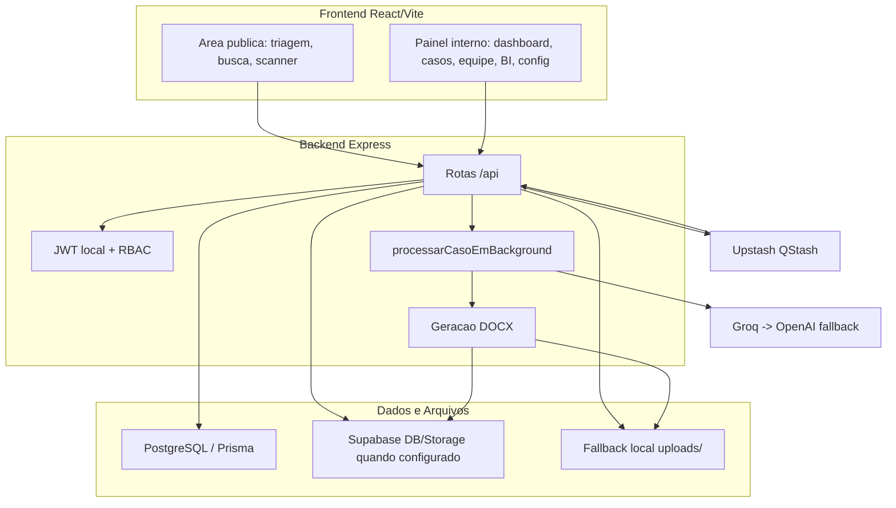
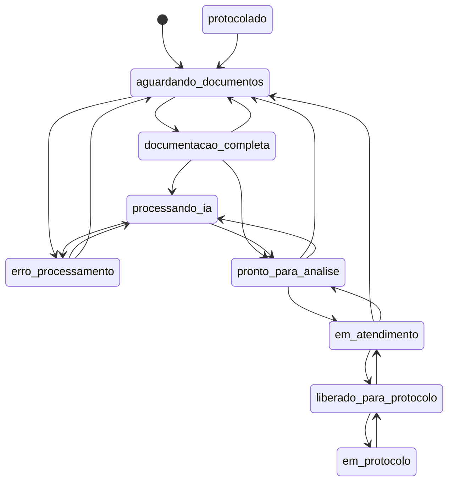

# Arquitetura do Sistema - Maes em Acao / DPE-BA

> **Versao:** 6.0
> **Atualizado em:** 2026-05-12
> **Fonte:** codigo atual do repositorio (`backend`, `frontend`, `docker-compose.yml`, `backend/prisma/schema.prisma`)

Este documento descreve a arquitetura implementada no codigo atual. Ele nao e historico de roadmap: quando houver conflito entre documentos antigos e este arquivo, este arquivo deve refletir a codebase.

---

## 1. Visao Geral

O Maes em Acao e uma aplicacao full stack para triagem, organizacao, analise juridica, geracao de documentos e protocolo de casos do mutirao da Defensoria Publica da Bahia.

O sistema e composto por:

- Frontend SPA em React/Vite.
- Backend Node.js/Express com JWT proprio.
- PostgreSQL acessado por Prisma e, quando configurado, tambem pelo Supabase JS Client.
- Supabase Storage para arquivos em producao, com fallback local em `uploads/`.
- Upstash QStash para fila assincrona, com fallback local por `setImmediate()`.
- Geracao de textos por Groq, com fallback OpenAI.
- Geracao de DOCX por docxtemplater/PizZip.

---

## 2. Stack Atual

### Frontend

- React `^19.1.1`
- React DOM `^19.1.1`
- React Router DOM `^7.9.3`
- Vite `^7.1.7`
- Tailwind CSS v4 via `@tailwindcss/vite`
- SWR para revalidacao de dados em telas protegidas
- Recharts para BI/relatorios
- Lucide React para icones
- `browser-image-compression` e `heic2any` para tratamento client-side de imagens

### Backend

- Node.js + Express 4
- ES Modules (`"type": "module"`)
- Prisma `^6.5.0`
- Supabase JS Client `^2.39.0`
- Upstash QStash `^2.5.0`
- Multer para upload temporario em disco
- Helmet + express-rate-limit
- bcrypt para senha de usuarios internos
- jsonwebtoken para JWT local
- Groq SDK, OpenAI SDK e Google Generative AI
- Tesseract.js disponivel, embora o fluxo principal atual ignore OCR por performance/privacidade
- docxtemplater/PizZip para documentos `.docx`
- archiver para ZIP de documentos
- ExcelJS para exportacao XLSX do BI

### Banco de Dados

- PostgreSQL
- Schema Prisma em `backend/prisma/schema.prisma`
- Supabase real e usado quando `SUPABASE_URL` e `SUPABASE_SERVICE_KEY` estao configurados.
- Sem Supabase configurado, o backend usa Prisma para dados e storage local/no-op para arquivos.

### Storage

- Buckets configuraveis:
  - `SUPABASE_DOCUMENTOS_BUCKET` ou `documentos`
  - `SUPABASE_PETICOES_BUCKET` ou `peticoes`
  - `SUPABASE_AUDIOS_BUCKET` ou `audios`
- URLs de visualizacao sao geradas por `createSignedUrl()` com expiracao `SIGNED_URL_EXPIRES` ou 3600s.
- Ha cache em memoria de URLs assinadas, com margem de renovacao de 15 minutos.
- Em desenvolvimento sem Supabase, o backend serve arquivos locais por `/api/files`.

---

## 3. Modulos Principais



---

## 4. Estrutura do Frontend

### Rotas Publicas

Definidas em `frontend/src/App.jsx`:

- `/` - busca inicial/area cidada
- `/novo-pedido` - formulario de triagem
- `/scanner/:protocolo` - upload de documentos do balcao/scanner com API key
- `/painel/login` - login de usuarios internos

### Rotas Protegidas do Painel

Todas abaixo de `/painel`:

- `/painel` - dashboard
- `/painel/casos` - listagem de casos
- `/painel/casos/arquivados` - arquivo
- `/painel/casos/:id` - detalhes do caso
- `/painel/equipe` - gestao de equipe
- `/painel/relatorios` - BI/relatorios
- `/painel/configuracoes` - configuracoes do sistema
- `/painel/cadastro` - cadastro de membros
- `/painel/treinamentos` - central de treinamentos
- `/painel/guia` - guia operacional

### Areas de Codigo

- `frontend/src/areas/servidor/`
  - `pages/BuscaCentral.jsx`
  - `pages/TriagemCaso.jsx`
  - `pages/ScannerBalcao.jsx`
  - `pages/FaqDuvidas.jsx`
  - `pages/LayoutCidadao.jsx`
  - componentes de formulario multi-step
  - hooks `useFormHandlers`, `useFormValidation`, `useFormEffects`
- `frontend/src/areas/defensor/`
  - paginas do painel interno
  - contexto `AuthContext.jsx`
  - layout, sidebar, header e componentes de detalhe
  - `components/detalhes/InfoAssistido.jsx` para revisao e edicao de dados preenchidos no detalhe do caso
- `frontend/src/config/formularios/`
  - configuracao declarativa das acoes e secoes de formulario
- `frontend/src/components/DocumentUpload.jsx`
  - upload client-side com conversao HEIC e compressao de imagem

---

## 5. Backend e Rotas

O `backend/server.js` registra:

- `/api/jobs`
- `/api/defensores`
- `/api/casos`
- `/api/status`
- `/api/debug`
- `/api/unidades`
- `/api/scanner`
- `/api/bi`
- `/api/config`
- `/api/files` para fallback local
- `/api/health`

Middlewares globais:

- `helmet()`
- `globalLimiter` com 5000 requests por 15 minutos
- CORS com origens oficiais e localhost
- JSON parser com captura de `rawBody` para QStash
- `express.urlencoded`

---

## 6. Autenticacao e Autorizacao

### JWT Interno

- Login em `POST /api/defensores/login`.
- JWT gerado pelo backend com `jsonwebtoken`.
- Algoritmo aceito: `HS256`.
- Expiracao atual do token interno: `1d`.
- Payload inclui dados do usuario, cargo e unidade.

### Cargos

O sistema usa os cargos:

- `admin`
- `gestor`
- `coordenador`
- `defensor`
- `servidor`
- `estagiario`

`requireWriteAccess` permite escrita para esses cargos. Cargos fora da whitelist ficam somente leitura/bloqueados para escrita.

### Isolamento por Unidade/Regional

`requireSameUnit` e aplicado a rotas numericas de caso (`/:id(\\d+)`) apos autenticacao:

- `admin` e `gestor`: bypass global.
- demais usuarios: acesso se o caso e da mesma unidade.
- `coordenador`: tambem pode acessar casos da mesma regional.
- colaborador com `assistencia_casos.status = "aceito"` tambem pode acessar.

---

## 7. Modelo de Dados Atual

Modelos Prisma atuais:

- `cargos`
- `permissoes`
- `cargo_permissoes`
- `unidades`
- `defensores`
- `casos`
- `casos_partes`
- `casos_juridico`
- `casos_ia`
- `documentos`
- `logs_auditoria`
- `logs_pipeline`
- `assistencia_casos`
- `configuracoes_sistema`
- `notificacoes`

Enums principais:

- `status_caso`
- `status_job`
- `tipo_acao`
- `sistema_judicial`
- `etapa_pipeline`
- `status_assistencia`

### Status de Caso

```text
aguardando_documentos
documentacao_completa
processando_ia
pronto_para_analise
em_atendimento
liberado_para_protocolo
em_protocolo
protocolado
erro_processamento
```

### Tipos de Acao no Enum

```text
exec_penhora
exec_prisao
exec_cumulado
def_penhora
def_prisao
def_cumulado
fixacao_alimentos
alimentos_gravidicos
```

O frontend ativo envia principalmente chaves de configuracao como `fixacao_alimentos` e `execucao_alimentos`; o backend normaliza a `acaoKey` e usa `dicionarioAcoes.js` para escolher templates.

---

## 8. Maquina de Estados

Fonte: `backend/src/utils/stateMachine.js`.



Observacoes:

- `admin` pode forcar transicoes por bypass.
- Alteracao manual para `protocolado` e bloqueada; deve ocorrer por `POST /api/casos/:id/finalizar`.
- Ao voltar para `pronto_para_analise` ou ir para `liberado_para_protocolo`, locks de servidor/defensor sao limpos.

---

## 9. Fluxos Operacionais

### 9.1 Criacao de Caso

1. Frontend envia `POST /api/casos/novo` com `multipart/form-data`.
2. Backend valida e normaliza dados.
3. Cria registros em `casos`, `casos_partes`, `casos_juridico` e `casos_ia`.
4. Salva documentos no Supabase Storage ou em `uploads/`.
5. Define status inicial:
   - `aguardando_documentos` quando usuario marcou envio posterior.
   - `documentacao_completa` quando documentos/dados ja permitem processamento.
6. Se o caso ja esta completo, publica job no QStash quando `QSTASH_TOKEN` e `API_BASE_URL` sao validos.
7. Se QStash indisponivel ou mal configurado, usa `setImmediate()` local.

### 9.2 Job QStash

1. QStash chama `POST /api/jobs/process`.
2. `qstashVerifyMiddleware` valida `upstash-signature` usando o `rawBody`.
3. Controller responde `200` rapidamente.
4. Processamento pesado roda em `setImmediate()`.
5. Status passa para `processando_ia`.
6. Ao final, registros de IA/documentos sao persistidos e status vira `pronto_para_analise`.
7. Em erro, status vira `erro_processamento`.

### 9.3 Scanner/Balcao

1. Frontend acessa `/scanner/:protocolo`.
2. Envia `POST /api/scanner/upload` com header `x-api-key`.
3. Backend salva os documentos e registra linhas em `documentos`.
4. Se o caso estava `aguardando_documentos`, altera para `documentacao_completa`.
5. O scanner **nao dispara geracao de minuta nem job de IA**. O proprio controller documenta que o caso aguarda o fluxo normal.

### 9.4 Upload Complementar Publico

1. `POST /api/casos/:id/upload-complementar`.
2. O caso pode ser buscado por ID, protocolo ou CPF.
3. Documentos sao anexados.
4. Se o status estiver em fase elegivel (`aguardando_documentos`, `documentos_entregues`, `erro_processamento`, `processando_ia`), o status vira `documentacao_completa` e o processamento local e disparado por `setImmediate()`.
5. Se o caso ja estiver em fase avancada, os documentos sao anexados e o status e preservado.

### 9.5 Atendimento e Protocolo

1. Casos prontos entram em `pronto_para_analise`.
2. Lock L1 atribui `servidor_id` e pode levar a `em_atendimento`.
3. Encaminhamento/distribuicao pode atribuir defensor e levar a `em_protocolo`.
4. Finalizacao por `POST /api/casos/:id/finalizar` grava `numero_solar`, `numero_processo`, capa processual e muda status para `protocolado`.

### 9.6 Edicao de Dados Preenchidos no Painel

1. Na aba de visao geral de `/painel/casos/:id`, `InfoAssistido` monta um estado editavel a partir dos dados normalizados do caso e de `dados_extraidos`.
2. O resumo compacto exibe nome, CPF, tipo de acao, unidade selecionada, nome da genitora e protocolo para revisao rapida.
3. O usuario interno pode revisar os dados e abrir secoes editaveis de assistido/representante, requerido e detalhes do caso.
4. Ao salvar, o frontend chama `PATCH /api/casos/:id/juridico` com payload separado em `partes`, `juridico` e `dados_extraidos`.
5. `InfoAssistido` remove pontuacao dos CPFs enviados em `partes` e `dados_extraidos`, incluindo CPF do assistido, representante, requerido e outros filhos.
6. O backend faz upsert parcial em `casos_partes`, `casos_juridico` e `casos_ia`, usando whitelist de campos e mesclando o JSON flexivel existente.
7. O backend valida `dados_extraidos` como objeto simples, bloqueia arquivos brutos/URLs geradas e normaliza CPFs antes da persistencia.
8. A transacao Prisma e executada antes dos upserts espelho no Supabase, quando Supabase esta configurado.
9. O fluxo nao regenera DOCX automaticamente. A interface avisa que a minuta deve ser regerada para refletir os dados salvos.
10. Admins podem alterar apenas a `cidade_assinatura` por um controle dedicado em `DetalhesCaso`, usando a mesma rota juridica e exibindo aviso sobre regerar a minuta.

### 9.7 FAQ Publica

`frontend/src/areas/servidor/pages/FaqDuvidas.jsx` concentra orientacoes operacionais para o usuario/servidor na area publica, incluindo:

- diferenca entre fixacao e execucao de alimentos;
- campos relevantes da execucao, como processo original, tipo de decisao, periodo e valor do debito;
- documentos essenciais de fixacao e execucao;
- erros comuns de preenchimento e duplicidade de protocolo.

---

## 10. Locking e Concorrencia

Fonte: `backend/src/controllers/lockController.js` e `distribuirCaso`.

- L1: `servidor_id` / `servidor_at`.
- L2: `defensor_id` / `defensor_at`.
- Em status `liberado_para_protocolo` e `em_protocolo`, o lock alvo e L2.
- `servidor` e `estagiario` nao podem adquirir L2 diretamente por `/lock`.
- Conflito de lock retorna HTTP 423.
- O lock atual e manual/permanente ate liberacao por `PATCH /api/casos/:id/unlock` ou por mudancas de status que limpam locks.
- `unlock` e permitido para `admin`, `gestor` e `coordenador`.
- `coordenador` nao destrava casos `protocolado` ou `processando_ia`.
- A dashboard calcula "ociosos" quando `servidor_at`/`defensor_at` passam de 20 minutos, mas isso nao libera o lock automaticamente.

---

## 11. IA, OCR e Geracao de Documentos

### IA

- `generateLegalText()` tenta Groq `llama-3.3-70b-versatile`.
- Em falha/timeout da Groq, tenta OpenAI `gpt-4o-mini`.
- Timeout padrao por chamada: 30s.
- Antes do envio para IA, dados sensiveis sao substituidos por placeholders quando `piiMap` e usado.

### OCR

- `visionOCR()` existe com Gemini `gemini-2.5-flash`.
- `documentService.js` tem Tesseract.js.
- No fluxo principal de `processarCasoEmBackground`, o OCR esta ignorado por decisao de performance/privacidade (`deveIgnorarIA = true`), usando dados do formulario e documentos informados.

### Templates DOCX

Templates presentes em `backend/templates`:

- `executacao_alimentos_cumulado.docx`
- `executacao_alimentos_penhora.docx`
- `executacao_alimentos_prisao.docx`
- `cumprimento_cumulado.docx`
- `cumprimento_penhora.docx`
- `cumprimento_prisao.docx`
- `nos_autos_cumulado.docx`
- `nos_autos_penhora.docx`
- `nos_autos_prisao.docx`
- `fixacao_alimentos1.docx`
- `termo_declaracao.docx`
- `termo_execucao.docx`

`execucao_alimentos` gera multiplos documentos conforme `backend/src/config/dicionarioAcoes.js`.

---

## 12. Downloads e Arquivos

### URLs Assinadas

Ao carregar detalhes do caso, o backend anexa URLs assinadas para:

- documentos originais
- peticoes/minutas
- termo de declaracao
- capa processual
- audio, quando houver

### Ticket de Download

- `POST /api/casos/:id/gerar-ticket-download`
- Cria JWT com:
  - `purpose: "download"`
  - `casoId`
  - `casoUnidadeId`
  - `path`
  - `bucket`
- Expiracao atual: 30s.
- Downloads diretos usam `?ticket=...`.
- O middleware valida `purpose`, `casoId`, path e bucket para reduzir IDOR/tampering.

---

## 13. Auditoria, Logs e LGPD

- `auditMiddleware` registra mutacoes protegidas em `logs_auditoria`.
- `logs_pipeline` registra etapas tecnicas do processamento.
- Logs devem evitar CPF, nomes e dados pessoais quando possivel.
- Alguns pontos legados ainda geram mensagens com nomes de usuarios internos; nao devem incluir dados pessoais das partes.
- `loggerService` e controllers usam metadados tecnicos como IDs, status e timestamps.

---

## 14. BI, Configuracoes e Avisos

### BI

Rotas em `/api/bi`:

- acesso: `admin`, `gestor`, `coordenador`
- exportacao em lote: `admin`, `gestor`
- gerenciamento de overrides: `admin`

O BI gera relatorios agregados e exportacao XLSX.

### Configuracoes

Rotas em `/api/config`:

- acesso: `admin`, `gestor`
- `GET /` lista configuracoes
- `PUT /` atualiza uma ou varias configuracoes

A tabela `configuracoes_sistema` tambem sustenta avisos/announcements e parametros operacionais.

---

## 15. Docker e Portabilidade

`docker-compose.yml` define:

- `db`: PostgreSQL `17-alpine`, porta `5432`
- `backend`: porta `8001`, `env_file: ./backend/.env.docker`
- `frontend`: porta `5173`, `env_file: ./frontend/.env.docker`

Observacao importante do estado atual do repositorio:

- O compose referencia `Dockerfile` em `backend` e `frontend`.
- No inventario atual aparecem `backend/doquer` e `frontend/offDockerfileoff`, nao `backend/Dockerfile` e `frontend/Dockerfile`.
- Portanto, o compose como esta exige restaurar/renomear esses Dockerfiles antes de um build local funcionar.

---

## 16. Variaveis de Ambiente Relevantes

Backend:

```bash
PORT=8001
DATABASE_URL=postgresql://...
DIRECT_URL=postgresql://...
SUPABASE_URL=https://...supabase.co
SUPABASE_SERVICE_KEY=...
SUPABASE_DOCUMENTOS_BUCKET=documentos
SUPABASE_PETICOES_BUCKET=peticoes
SUPABASE_AUDIOS_BUCKET=audios
SIGNED_URL_EXPIRES=3600
JWT_SECRET=...
API_KEY_SERVIDORES=...
QSTASH_TOKEN=...
QSTASH_CURRENT_SIGNING_KEY=...
QSTASH_NEXT_SIGNING_KEY=...
API_BASE_URL=https://...
GROQ_API_KEY=...
OPENAI_API_KEY=...
GEMINI_API_KEY=...
SALARIO_MINIMO_ATUAL=1621.00
ALLOWED_ORIGINS=...
DEFENSORIA_DEFAULT_COMARCA=...
DEFENSORIA_DEFAULT_DEFENSORA=...
```

Frontend:

```bash
VITE_API_URL=http://localhost:8001/api
VITE_API_KEY_BALCAO=...
```

---

## 17. Testes e Qualidade

Backend:

- Jest configurado em `backend/jest.config.js`
- suites em `backend/tests`
- coverage em `backend/logs/coverage`
- reporter `json-summary` habilitado

Frontend:

- Vitest configurado em `frontend/vitest.config.js`
- testes em `frontend/src/__tests__`
- coverage com V8 e reporter `json-summary`

Raiz:

- scripts de performance k6 em `tests/performance`
