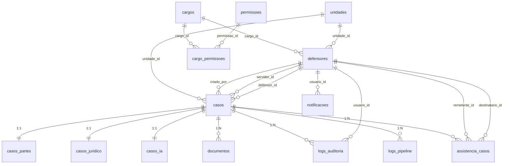

# Modelo de Dados - Maes em Acao / DPE-BA

> **Versao:** 6.0
> **Atualizado em:** 2026-05-12
> **Fonte canonica:** `backend/prisma/schema.prisma`

O banco real do sistema e definido pelo Prisma. Os arquivos SQL de referencia existem para leitura, bootstrap ou restauracao controlada, mas nao substituem o `schema.prisma`.

Arquivos relacionados:

- `backend/prisma/schema.prisma`: fonte real do schema.
- `arquivos/Conhecimento/01-Referencia/schema_maes_em_acao_v1.0.sql`: unico SQL mantido, derivado do Prisma para referencia/bootstrap.
- `docker-compose.yml`: monta o mesmo SQL unico em `/docker-entrypoint-initdb.d/01-schema.sql` para o PostgreSQL local.

---

## 1. Persistencia Atual

O backend usa duas camadas:

- Prisma como fonte tipada e fallback principal de banco.
- Supabase JS Client quando `SUPABASE_URL` e `SUPABASE_SERVICE_KEY` estao configurados, especialmente para queries diretas e Storage.

O controle de autenticacao da aplicacao e JWT local do backend. Supabase Auth/RLS nao e a regra operacional atual do codigo.

---

## 2. Entidades e Relacionamentos



---

## 3. Tabelas

### `cargos`

Perfis internos de acesso.

| Campo | Tipo Prisma | Regra |
|:--|:--|:--|
| `id` | `String @db.Uuid` | PK, `gen_random_uuid()` |
| `nome` | `String` | unico |
| `descricao` | `String?` | opcional |
| `ativo` | `Boolean` | default `true` |
| `created_at` | `DateTime @db.Timestamptz(6)` | default `now()` |

Cargos esperados pela aplicacao: `admin`, `gestor`, `coordenador`, `defensor`, `servidor`, `estagiario`.

### `permissoes`

Catalogo de permissoes. A aplicacao atual usa principalmente checks por cargo, mas a tabela existe para RBAC configuravel.

| Campo | Tipo Prisma | Regra |
|:--|:--|:--|
| `id` | `String @db.Uuid` | PK |
| `chave` | `String` | unico |
| `descricao` | `String` | obrigatorio |

### `cargo_permissoes`

Tabela N:N entre cargos e permissoes.

| Campo | Tipo Prisma | Regra |
|:--|:--|:--|
| `cargo_id` | `String @db.Uuid` | FK `cargos`, cascade |
| `permissao_id` | `String @db.Uuid` | FK `permissoes`, cascade |

PK composta: `(cargo_id, permissao_id)`.

### `unidades`

Sedes/unidades de atendimento.

| Campo | Tipo Prisma | Regra |
|:--|:--|:--|
| `id` | `String @db.Uuid` | PK |
| `nome` | `String` | obrigatorio |
| `comarca` | `String` | obrigatorio |
| `sistema` | `sistema_judicial` | default `solar` |
| `ativo` | `Boolean` | default `true` |
| `created_at` | `DateTime` | default `now()` |
| `regional` | `String?` | usado para acesso de coordenadores |

### `defensores`

Usuarios internos do painel.

| Campo | Tipo Prisma | Regra |
|:--|:--|:--|
| `id` | `String @db.Uuid` | PK |
| `supabase_uid` | `String?` | unico, legado/integracao futura |
| `nome` | `String` | obrigatorio |
| `email` | `String` | unico |
| `senha_hash` | `String?` | hash bcrypt; opcional no schema |
| `cargo_id` | `String @db.Uuid` | FK `cargos` |
| `unidade_id` | `String? @db.Uuid` | FK `unidades` |
| `regional` | `String?` | restricao operacional de coordenador |
| `ativo` | `Boolean` | default `true` |
| `created_at` | `DateTime` | default `now()` |
| `updated_at` | `DateTime` | `@updatedAt` |

### `casos`

Registro central do fluxo.

| Campo | Tipo Prisma | Regra |
|:--|:--|:--|
| `id` | `BigInt` | PK autoincrement |
| `protocolo` | `String` | unico |
| `unidade_id` | `String @db.Uuid` | FK `unidades` |
| `tipo_acao` | `tipo_acao` | obrigatorio |
| `status` | `status_caso` | default `aguardando_documentos` |
| `numero_vara` | `String?` | opcional |
| `servidor_id` | `String? @db.Uuid` | FK `defensores`, lock L1 |
| `servidor_at` | `DateTime?` | timestamp L1 |
| `defensor_id` | `String? @db.Uuid` | FK `defensores`, lock L2 |
| `defensor_at` | `DateTime?` | timestamp L2 |
| `numero_processo` | `String?` | processo externo |
| `numero_solar` | `String?` | numero SOLAR/SIGAD salvo no fluxo |
| `url_capa` | `String?` | legado |
| `url_capa_processual` | `String?` | capa processual |
| `protocolado_at` | `DateTime?` | quando protocolado |
| `status_job` | `status_job?` | default `pendente` |
| `erro_processamento` | `String?` | mensagem de erro |
| `retry_count` | `Int` | default `0` |
| `last_retry_at` | `DateTime?` | ultimo retry |
| `processed_at` | `DateTime?` | conclusao de pipeline |
| `processing_started_at` | `DateTime?` | inicio de pipeline |
| `arquivado` | `Boolean` | default `false` |
| `motivo_arquivamento` | `String?` | motivo |
| `observacao_arquivamento` | `String?` | observacao |
| `criado_por` | `String? @db.Uuid` | FK `defensores` |
| `created_at` | `DateTime` | default `now()` |
| `updated_at` | `DateTime` | `@updatedAt` |
| `agendamento_data` | `DateTime?` | campo legado/operacional |
| `agendamento_link` | `String?` | campo legado/operacional |
| `agendamento_status` | `String?` | campo legado/operacional |
| `chave_acesso_hash` | `String?` | legado; funcionalidade desativada |
| `data_sugerida_reagendamento` | `String?` | legado |
| `motivo_reagendamento` | `String?` | legado |
| `descricao_pendencia` | `String?` | pendencia operacional |
| `feedback` | `String?` | feedback do usuario interno |
| `finished_at` | `DateTime?` | finalizacao |
| `compartilhado` | `Boolean` | default `false` |

Observacao importante: nao existe coluna `dados_formulario` em `casos` no schema Prisma atual. Dados flexiveis ficam principalmente em `casos_ia.dados_extraidos` e nos modelos normalizados.

### `casos_partes`

Qualificacao das partes.

Campos obrigatorios:

- `id`
- `caso_id` unico
- `nome_assistido`
- `cpf_assistido`
- `exequentes` com default `[]`
- `created_at`
- `updated_at`

Campos opcionais incluem RG, emissor, estado civil, profissao, filiacao, endereco, telefone, email, dados do requerido, dados do representante, nacionalidades e datas de nascimento.

Indices:

- `idx_casos_cpf` em `cpf_assistido`
- `idx_casos_cpf_rep` em `cpf_representante`
- `idx_partes_caso` em `caso_id`

### `casos_juridico`

Dados juridicos e financeiros normalizados.

Campos de maior uso:

- `numero_processo_titulo`
- `percentual_salario`
- `vencimento_dia`
- `periodo_inadimplencia`
- `debito_valor`
- `debito_extenso`
- `debito_penhora_valor`
- `debito_prisao_valor`
- `dados_bancarios_deposito`
- `conta_banco`, `conta_agencia`, `conta_operacao`, `conta_numero`
- `empregador_nome`, `empregador_cnpj`, `empregador_endereco`, `empregador_email`
- `memoria_calculo`
- `descricao_guarda`, `opcao_guarda`, `bens_partilha`
- `situacao_financeira_genitora`
- `cidade_assinatura`, `cidade_originaria`, `tipo_decisao`, `vara_originaria`

`caso_id` e unico e possui cascade ao apagar o caso.

### `casos_ia`

Resultados do pipeline e metadados flexiveis.

| Campo | Uso |
|:--|:--|
| `relato_texto` | relato consolidado |
| `dados_extraidos` | JSONB flexivel com dados derivados, nomes de documentos e URLs extras |
| `dos_fatos_gerado` | texto dos fatos |
| `resumo_ia` | resumo |
| `peticao_inicial_rascunho` | rascunho textual |
| `peticao_completa_texto` | snapshot textual completo |
| `url_peticao` | minuta principal |
| `url_peticao_penhora` | minuta de penhora |
| `url_peticao_prisao` | minuta de prisao |
| `versao_peticao` | default `1` |
| `regenerado_at` | timestamp de regeneracao |
| `regenerado_por` | FK `defensores` |

URLs como termo de declaracao, cumulados e documentos extras podem estar dentro de `dados_extraidos`.

### `documentos`

Arquivos anexados.

| Campo | Uso |
|:--|:--|
| `storage_path` | caminho no bucket/local |
| `nome_original` | nome amigavel/original |
| `tipo` | rotulo do documento |
| `tamanho_bytes` | tamanho salvo |
| `tamanho_original_bytes` | tamanho antes de eventual compressao |

### `logs_auditoria`

Auditoria de acoes humanas.

Campos:

- `usuario_id`
- `caso_id`
- `acao`
- `detalhes` JSONB
- `criado_em`
- `entidade`
- `registro_id`

`caso_id` usa `ON DELETE SET NULL`.

### `logs_pipeline`

Auditoria tecnica do pipeline.

Campos:

- `caso_id`
- `job_tentativa`
- `etapa`
- `status`
- `duracao_ms`
- `detalhes`
- `erro_mensagem`
- `criado_em`

### `assistencia_casos`

Colaboracao entre usuarios internos.

| Campo | Regra |
|:--|:--|
| `caso_id` | FK `casos`, cascade |
| `remetente_id` | FK `defensores` |
| `destinatario_id` | FK `defensores` |
| `status` | enum `status_assistencia`, default `pendente` |
| `created_at` | default `now()` |

### `configuracoes_sistema`

Chave-valor para parametros e avisos.

| Campo | Regra |
|:--|:--|
| `chave` | PK `VARCHAR(100)` |
| `valor` | texto obrigatorio |
| `descricao` | opcional |
| `updated_at` | `@updatedAt` |

### `notificacoes`

Alertas internos.

| Campo | Regra |
|:--|:--|
| `usuario_id` | FK `defensores`, cascade |
| `titulo` | opcional |
| `mensagem` | obrigatoria |
| `lida` | default `false` |
| `tipo` | opcional |
| `link` | opcional |
| `referencia_id` | UUID opcional |

---

## 4. Enums

### `status_assistencia`

```text
pendente
aceito
recusado
```

### `status_caso`

```text
aguardando_documentos
documentacao_completa
processando_ia
pronto_para_analise
em_atendimento
liberado_para_protocolo
em_protocolo
protocolado
erro_processamento
```

### `status_job`

```text
pendente
processando
concluido
erro
```

### `tipo_acao`

```text
exec_penhora
exec_prisao
exec_cumulado
def_penhora
def_prisao
def_cumulado
fixacao_alimentos
alimentos_gravidicos
```

### `sistema_judicial`

```text
solar
sigad
```

### `etapa_pipeline`

```text
upload_recebido
compressao_imagem
ocr_gpt
extracao_dados
geracao_dos_fatos
merge_template
upload_docx
status_atualizado
```

---

## 5. Indices

Indices definidos no Prisma:

- `idx_casos_protocolo`
- `idx_casos_status`
- `idx_casos_unidade`
- `idx_casos_tipo`
- `idx_casos_status_job`
- `idx_casos_servidor`
- `idx_casos_defensor`
- `idx_casos_servidor_at`
- `idx_casos_defensor_at`
- `idx_casos_protocolado_at`
- `idx_casos_created_at`
- `idx_casos_arquivado`
- `idx_casos_bi_status`
- `idx_casos_bi_unidade_status`
- `idx_casos_bi_tipo`
- `idx_casos_bi_processed_at`
- `idx_casos_cpf`
- `idx_casos_cpf_rep`
- `idx_partes_caso`
- `idx_casos_ia_caso`
- `idx_docs_caso`
- `idx_logs_auditoria_caso`
- `idx_logs_auditoria_user`
- `idx_logs_auditoria_acao`
- `idx_logs_auditoria_entidade_data`
- `idx_logs_auditoria_caso_acao`
- `idx_logs_pipeline_caso`
- `idx_logs_pipeline_etapa`
- `idx_logs_pipeline_tempo`
- `assistencia_casos_caso_id_idx`
- `assistencia_casos_destinatario_id_idx`
- `notificacoes_usuario_id_idx`

---

## 6. Exclusoes e Cascades

| Relacao | Comportamento |
|:--|:--|
| `casos_partes.caso_id -> casos.id` | cascade |
| `casos_juridico.caso_id -> casos.id` | cascade |
| `casos_ia.caso_id -> casos.id` | cascade |
| `documentos.caso_id -> casos.id` | cascade |
| `logs_pipeline.caso_id -> casos.id` | cascade |
| `assistencia_casos.caso_id -> casos.id` | cascade |
| `logs_auditoria.caso_id -> casos.id` | set null |
| `notificacoes.usuario_id -> defensores.id` | cascade |
| `cargo_permissoes` | cascade para cargo/permissao |

---

## 7. Regras de Sincronizacao

Para atualizar documentos SQL a partir do schema real, use o binario local do Prisma:

```powershell
.\backend\node_modules\.bin\prisma.cmd migrate diff --from-empty --to-schema-datamodel backend\prisma\schema.prisma --script
```

Nao use `schema_maes_em_acao_v1.0.sql` como fonte para alterar o banco de producao. Primeiro altere `backend/prisma/schema.prisma`; depois gere migration/DDL.

---

## 8. Observacoes de Legado

- `supabase_uid` permanece no modelo, mas autenticacao operacional atual e JWT local.
- `chave_acesso_hash` permanece no modelo, mas a funcionalidade de reset de chave retorna HTTP 410.
- Campos de agendamento/reagendamento permanecem no banco, mas as rotas publicas legadas de reagendamento nao estao registradas no Express atual.
- O antigo `RESTAURACAO_COMPLETA_SUL.sql` continha RLS e trigger de Supabase Auth e foi removido por estar redundante/desatualizado. O projeto deve manter apenas um SQL de referencia.
