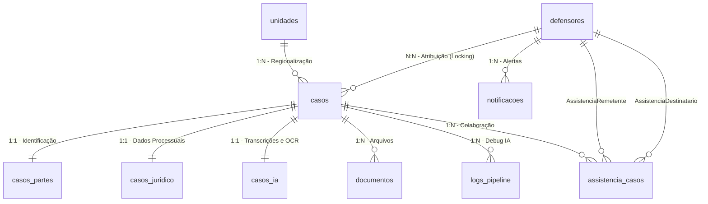

# Modelo de Dados e Persistência Híbrida — Mães em Ação

> **Versão:** 4.0 · **Atualizado em:** 2026-04-30 (System Configurations + Unit Soft-Lock Metadata)
> **Fonte:** `backend/prisma/schema.prisma`

O sistema utiliza uma abordagem híbrida para persistência, combinando o **Prisma ORM** (gestão de equipe e RBAC) com o **Supabase JS Client** (core dos casos e pipeline de IA).

---

## 1. Visão Geral Híbrida

| Componente | Ferramenta | Tabelas | Justificativa |
|:-----------|:-----------|:--------|:--------------|
| **Core & IA** | Supabase JS Client | `casos`, `casos_partes`, `casos_ia`, `casos_juridico`, `documentos` | Suporte a alto volume, JSONB, RLS e Storage integrado. |
| **Equipe & RBAC** | Prisma ORM | `defensores`, `unidades`, `cargos`, `permissoes`, `notificacoes`, `logs_auditoria` | Gestão robusta de FK e tipagem segura para usuários. |
| **Colaboração** | Prisma ORM | `assistencia_casos` | Auditoria de compartilhamentos com remetente + destinatário + ação. |

---

## 2. Diagrama de Relacionamentos



---

## 3. Detalhamento de Tabelas Principais

### 3.1 Tabela `casos`

O nó central. Cada registro representa **um filho (ou assistido direto)** dentro do sistema.

| Campo | Tipo | Descrição |
|:------|:-----|:----------|
| `id` | `BigInt` | PK auto-incremental |
| `protocolo` | `String UNIQUE` | Formato: `YYYYMMDD{categoria}{seq6}` |
| `unidade_id` | `UUID` | FK para `unidades` |
| `tipo_acao` | `Enum tipo_acao` | Tipo de petição selecionado |
| `status` | `Enum status_caso` | Estado atual na fila de trabalho |
| `dados_formulario` | `JSONB` | Todos os dados do formulário |
| `compartilhado` | `Boolean` | `true` se possui assistência colaborativa ativa |
| `servidor_id` | `UUID?` | Quem detém o Locking Nível 1 |
| `defensor_id` | `UUID?` | Quem detém o Locking Nível 2 |
| `agendamento_data` | `Timestamptz?` | Data/hora de agendamento |
| `agendamento_link` | `String?` | Link ou local do agendamento |
| `agendamento_status` | `String?` | `"agendado"` ou `"pendente"` |
| `chave_acesso_hash` | `String?` | Hash SHA-256 da chave pública do assistido |
| `feedback` | `String?` | Observações do defensor |
| `finished_at` | `Timestamptz?` | Timestamp de encaminhamento ao Solar |
| `url_capa_processual` | `String?` | URL Storage da capa processual |
| `url_capa` | `String?` | URL Storage de capa adicional |
| `numero_processo` | `String?` | Número do processo no Solar/SIGAD |
| `numero_vara` | `String?` | Número da vara |
| `arquivado` | `Boolean` | Soft delete (padrão: `false`) |
| `motivo_arquivamento` | `String?` | Obrigatório ao arquivar (mín. 5 chars) |

### 3.2 Tabela `casos_partes` (1:1)

Armazena a qualificação de assistidas, requeridos e representantes.

| Campo | Tipo | Descrição |
|:------|:-----|:----------|
| `cpf_assistido` | `String` | CPF do assistido (normalizado sem pontuação) |
| `representante_cpf` | `String` | CPF da mãe/representante legal (obrigatório) |
| `nome_assistido` | `String?` | Nome do filho/assistido |
| `exequentes` | `JSONB` | Array de filhos adicionais na mesma petição |

> **Multi-casos:** Uma representante (mãe) pode criar múltiplos casos para filhos diferentes, reaproveitando seus dados via `representante_cpf`. Cada caso tem `protocolo` único.

### 3.3 Tabela `casos_juridico` (1:1)

Campos técnicos que alimentam o template DOCX.

| Campo | Tipo | Descrição |
|:------|:-----|:----------|
| `debito_valor` | `String?` | Valor do débito (armazenado como string para preservar formatação) |
| `conta_banco` | `String?` | Dados bancários formatados |

### 3.4 Tabela `casos_ia` (1:1)

Resultados do processamento assíncrono.

| Campo | Tipo | Descrição |
|:------|:-----|:----------|
| `dos_fatos_gerado` | `String?` | Texto jurídico gerado pelo Groq Llama 3.3 |
| `dados_extraidos` | `JSONB?` | Resumo do OCR (Gemini Vision) para conferência |
| `url_documento_gerado` | `String?` | URL Supabase Storage do .docx da petição |
| `url_peticao_penhora` | `String?` | URL específica para rito de penhora |
| `url_peticao_prisao` | `String?` | URL específica para rito de prisão |
| `url_termo_declaracao` | `Virtual/JSONB` | Armazenado dentro de `dados_extraidos` para evitar coluna fantasma |
| `regenerado_por` | `UUID?` | FK para `defensores` (quem regenerou a IA) |

### 3.5 Tabela `assistencia_casos` (N:N)

Auditoria de colaborações entre defensores.

| Campo | Tipo | Descrição |
|:------|:-----|:----------|
| `caso_id` | `BigInt` | FK para `casos` |
| `remetente_id` | `UUID` | Defensor que iniciou o compartilhamento |
| `destinatario_id` | `UUID` | Defensor que recebeu |
| `acao` | `String` | `"compartilhado"`, `"aceito"`, `"recusado"` |
| `created_at` | `Timestamptz` | Timestamp da ação |

### 3.6 Tabela `notificacoes`

| Campo | Tipo | Descrição |
|:------|:-----|:----------|
| `defensor_id` | `UUID` | FK para `defensores` |
| `tipo` | `String` | `"upload"`, `"reagendamento"`, `"assistencia"` |
| `mensagem` | `String` | Texto da notificação |
| `referencia_id` | `BigInt?` | ID do caso relacionado |
| `lida` | `Boolean` | Padrão: `false` |
| `created_at` | `Timestamptz` | Timestamp |

### 3.7 Tabela `defensores` (v2.1)

| Campo novo | Tipo | Descrição |
|:-----------|:-----|:----------|
| `supabase_uid` | `String? UNIQUE` | UID do Supabase Auth (para integração futura) |
| `senha_hash` | `String?` | Agora opcional — permite auth externa |

### 3.8 Tabela `configuracoes_sistema`
Armazena configurações globais e avisos do sistema.
- `chave`: PK (ex: `AVISO_GLOBAL`, `BI_BLOCK_WINDOWS`).
- `valor`: Valor da configuração (string ou JSON serializado).
- `descricao`: Texto explicativo sobre a finalidade da chave.

---

## 4. Índices Estratégicos (Performance para o Mutirão)

```sql
-- Busca resiliente por CPF
CREATE INDEX idx_partes_cpf_assistido ON casos_partes (cpf_assistido);
CREATE INDEX idx_partes_representante_cpf ON casos_partes (representante_cpf);

-- Performance das filas de trabalho
CREATE INDEX idx_casos_unidade_status ON casos (unidade_id, status);
CREATE INDEX idx_casos_protocolo ON casos (protocolo);

-- Concorrência (Locking)
CREATE INDEX idx_casos_lock_servidor ON casos (servidor_id);
CREATE INDEX idx_casos_lock_defensor ON casos (defensor_id);

-- BI e Performance (v3.0)
CREATE INDEX idx_casos_bi_status ON casos (arquivado, status);
CREATE INDEX idx_casos_bi_unidade_status ON casos (arquivado, unidade_id, status);
CREATE INDEX idx_casos_bi_tipo ON casos (arquivado, tipo_acao);
CREATE INDEX idx_casos_bi_processed_at ON casos (processed_at);
```

---

## 5. Enums do Prisma

### `status_caso`

```
aguardando_documentos → documentacao_completa → processando_ia
→ pronto_para_analise → em_atendimento → liberado_para_protocolo
→ em_protocolo → protocolado
                     ↘ erro_processamento (→ reprocessamento)
```

### `tipo_acao`

Conforme `schema.prisma`: `exec_penhora`, `exec_prisao`, `exec_cumulado`, `def_penhora`, `def_prisao`, `def_cumulado`, `fixacao_alimentos`, `alimentos_gravidicos`

### `status_job`

`pendente`, `em_processamento`, `concluido`, `erro`

---

## 6. Configuração Prisma (Supabase Pooler)

```prisma
datasource db {
  provider  = "postgresql"
  url       = env("DATABASE_URL")   // Pooler mode (Transaction)
  directUrl = env("DIRECT_URL")     // Direct connection (migrations)
}
```

> **Importante:** O `directUrl` é necessário para que o Prisma execute migrations e introspections diretamente, sem passar pelo pooler de conexões do Supabase.

---

## 7. Auditoria e Logs

O sistema mantém dois níveis de rastreabilidade:
1. **`logs_auditoria`**: Rastreia ações humanas (ex: "Defensor Fulano alterou status do caso X").
2. **`logs_pipeline`**: Rastreia falhas técnicas na IA (ex: "Erro no OCR na etapa 3: Timeout").

> [!CAUTION]
> **Privacidade (LGPD):** NUNCA grave o conteúdo de campos sensíveis (como CPFs ou Nomes) nas colunas de `detalhes` dos logs. Use apenas IDs e referências genéricas.
