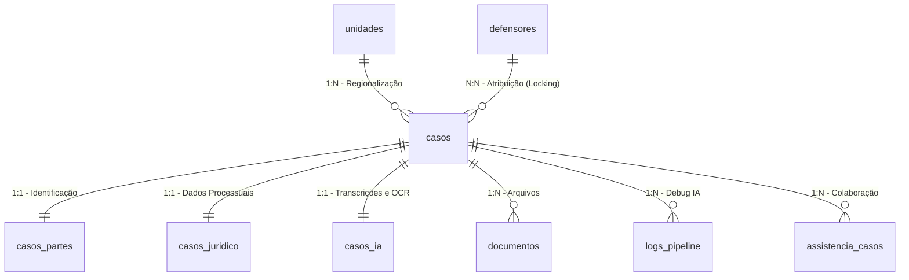

# Modelo de Dados e Persistência Híbrida — Mães em Ação

O sistema utiliza uma abordagem escalável para persistência, combinando a facilidade do **Prisma ORM** (para gestão de acessos e RBAC) com a performance e flexibilidade do **Supabase/PostgreSQL** (para o núcleo dos casos e pipeline de IA).

## 1. Visão Geral Híbrida

| Componente | Ferramenta | Tabelas | Justificativa |
|:-----------|:-----------|:--------|:--------------|
| **Core & IA** | Supabase JS Client | `casos`, `casos_partes`, `casos_ia`, `casos_juridico`, `documentos` | Suporte a alto volume, JSONB, RLS e Storage integrado em tempo real. |
| **Equipe & RBAC** | Prisma ORM | `defensores`, `unidades`, `cargos`, `permissoes`, `notificacoes`, `logs_auditoria` | Gestão robusta de chaves estrangeiras e tipagem segura para usuários. |

---

## 2. Diagrama de Relacionamentos (Coração do Sistema)



---

## 3. Detalhamento de Tabelas Principais

### 3.1 Tabela `casos`
O nó central. Cada registro representa um filho (ou assistido direto).
- **protocolo (UNIQUE):** ID público gerado no formato `AAAAMMDD + Categoria + Sequencial`.
- **status:** Enum que controla o fluxo da triagem ao protocolo.
- **compartilhado:** Boolean que indica se o caso possui assistência ativa.
- **Locking:** Campos `servidor_id` e `defensor_id` armazenam quem está com a "posse" da edição no momento.

### 3.2 Tabela `casos_partes` (1:1)
Armazena a qualificação de assistidas, requeridos e representantes.
- **campos chave:** `cpf_assistido`, `representante_cpf`, `nome_assistido`.
- **exequentes (JSONB):** Lista de filhos adicionais vinculados àquela mesma petição.

### 3.3 Tabela `casos_juridico` (1:1)
Campos técnicos que alimentam o template DOCX.
- **debito_valor:** Armazenado como string para preservar formatação original se necessário, mas convertido para cálculo de percentuais de salário mínimo.
- **conta_banco:** Campos segregados (agência, conta, banco) para facilitar o preenchimento automático.

### 3.4 Tabela `casos_ia` (1:1)
Resultados do processamento assíncrono.
- **dos_fatos_gerado:** Texto rico gerado pelo Groq Llama 3.3.
- **dados_extraidos (JSONB):** Resumo do OCR GPT-4o-mini para conferência do servidor.

---

## 4. Índices Estratégicos (Performance para o Mutirão)

Para suportar o volume de 35 sedes simultâneas, os seguintes índices são críticos e devem existir no PostgreSQL:

```sql
-- Busca resiliente por CPF (Normalização)
CREATE INDEX idx_partes_cpf_assistido ON casos_partes (cpf_assistido);
CREATE INDEX idx_partes_representante_cpf ON casos_partes (representante_cpf);

-- Performance das filas de trabalho
CREATE INDEX idx_casos_unidade_status ON casos (unidade_id, status);
CREATE INDEX idx_casos_protocolo ON casos (protocolo);

-- Concorrência (Locking)
CREATE INDEX idx_casos_lock_servidor ON casos (servidor_id);
CREATE INDEX idx_casos_lock_defensor ON casos (defensor_id);
```

---

## 5. Auditoria e Logs

O sistema mantém dois níveis de rastreabilidade:
1. **logs_auditoria:** Rastreia ações humanas (ex: "Defensor Fulano alterou status do caso X").
2. **logs_pipeline:** Rastreia falhas técnicas na IA (ex: "Erro no OCR na etapa 3: Timeout").

> [!CAUTION]
> **Privacidade (LGPD):** NUNCA grave o conteúdo de campos sensíveis (como CPFs ou Nomes) nas colunas de `detalhes` dos logs. Use apenas IDs e referências genéricas.
