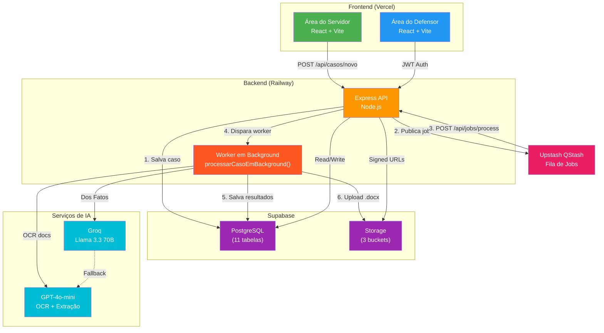
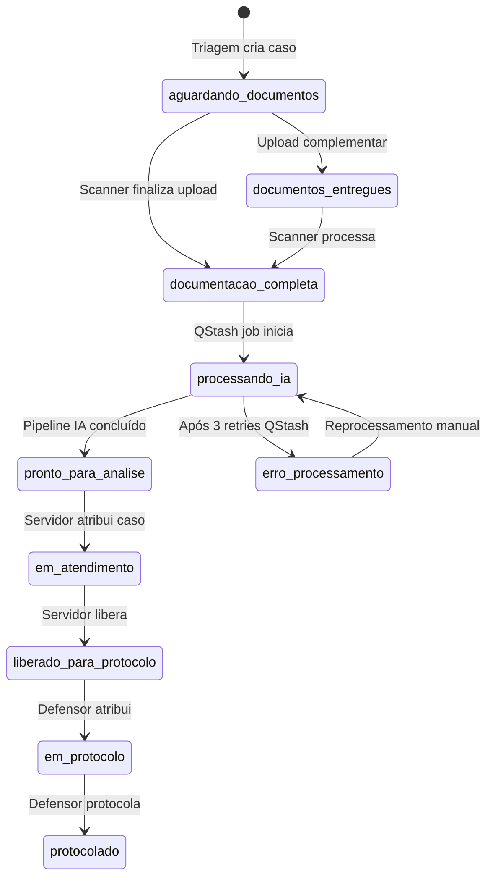
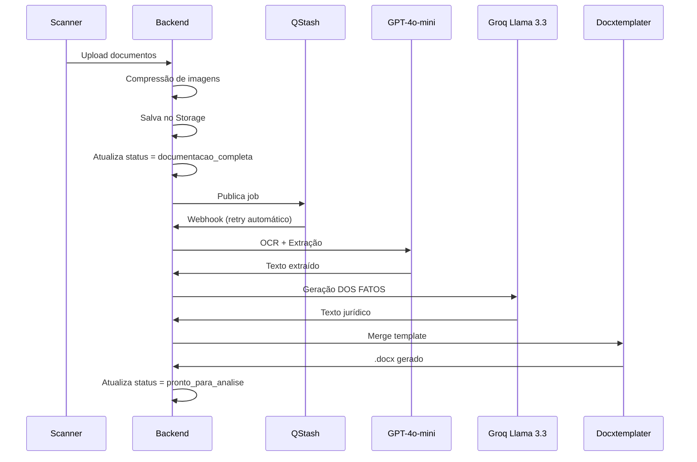

# Arquitetura do Sistema — Mães em Ação · DPE-BA

> **Versão:** 1.1 · **Atualizado em:** 2026-04-06  
> **Contexto:** Mutirão estadual da Defensoria Pública da Bahia

---

## 1. Visão Geral

O **Mães em Ação** é um sistema Full Stack desenvolvido para apoiar o mutirão estadual da Defensoria Pública da Bahia, cobrindo **35 a 52 sedes simultaneamente** durante **~5 dias úteis em maio de 2025**. O sistema automatiza triagem, processamento de documentos via IA e geração de petições de Direito de Família para mães solo e em situação de vulnerabilidade.

**Diferença crítica:** O sistema foi projetado para escalar de 17 casos (Def Sul) para centenas de casos em poucos minutos, exigindo arquitetura robusta e processamento assíncrono.

---

## 2. Stack Tecnológica

### Frontend
- **React 18 + Vite** → Vercel (Free — SPA estática, sem serverless)
- **TypeScript** → Tipagem segura
- **Tailwind CSS** → Estilização consistente
- **React Router** → Navegação SPA

### Backend
- **Node.js + Express** → Railway Pro ($20/mês)
- **ES Modules** → `"type": "module"` no package.json
- **Prisma ORM** → Abstração do banco de dados
- **Multer** → Upload de arquivos

### Banco de Dados
- **Supabase Pro** (PostgreSQL, sa-east-1) — projeto ISOLADO do Def Sul
- **Schema v1.0** → 11 tabelas normalizadas
- **Índices estratégicos** → Performance em buscas por CPF, protocolo e status

### Storage
- **Supabase Storage** (S3-compatible) — apenas signed URLs, nunca públicas
- **Compressão de imagens** → Redução de tamanho antes do upload

### Fila & Processamento
- **QStash (Upstash)** Pay-as-you-go — US Region
- **Processamento assíncrono** → Evita timeouts de 30s do Railway
- **Retry automático** → 3 tentativas com backoff de 30s

### IA & OCR
- **GPT-4o-mini (OpenAI)** → OCR e extração de documentos
- **Groq Llama 3.3 70B** → Geração de texto jurídico (DOS FATOS)
- **Fallbacks** → Tesseract.js para imagens, Gemini para texto

### Autenticação
- **JWT** gerado no próprio backend Express (não Supabase Auth)
- **Secret:** 64 chars aleatórios
- **Expiração:** 12h (cobre um dia de mutirão)
- **Payload:** `{ id, nome, email, cargo, unidade_id }` — permite filtro regional automático

---

## 3. Diagrama de Módulos



---

## 4. Fluxo Operacional (4 Etapas)

### Etapa 1 — Triagem (Atendente Primário)

- Busca por CPF → verifica cadastro existente
- Preenche qualificação da assistida + dados do requerido + relato informal
- Seleciona tipo de ação no seletor
- Define se vai "Anexar Agora" ou "Deixar para Scanner"
- Status inicial: `aguardando_documentos` + protocolo gerado

### Etapa 2 — Scanner (Servidor B)

- Busca por CPF ou protocolo
- Dropzone única — todos os documentos de uma vez
- Backend comprime imagens > 1.5MB antes de salvar no Storage
- Ao finalizar: status → `documentacao_completa`, job publicado no QStash
- Frontend retorna 200 imediatamente — IA processa em background

### Etapa 3 — Atendimento Jurídico (Servidor Jurídico)

- Filtra fila por `pronto_para_analise` + sua `unidade_id`
- Atribui caso ao seu nome → locking nível 1 (`servidor_id` + `servidor_at`)
- Revisa relato, DOS FATOS gerado, documentos
- Pode editar e clicar "Regerar com IA"
- Ao concluir: status → `liberado_para_protocolo`

### Etapa 4 — Protocolo (Defensor)

- Filtra casos com status `liberado_para_protocolo`
- Atribui ao seu nome → locking nível 2 (`defensor_id` + `defensor_at`)
- Protocola no SOLAR ou SIGAD (Salvador usa SIGAD)
- Salva `numero_processo` + upload da capa
- Status → `protocolado`

---

## 5. Máquina de Estados



### Locking — Dois Níveis Independentes

- **Nível 1:** `servidor_id` + `servidor_at` — expira após 30min de inatividade
- **Nível 2:** `defensor_id` + `defensor_at` — expira após 30min de inatividade
- **Unlock explícito** obrigatório nos botões "Finalizar" e "Cancelar"
- **HTTP 423 (Locked)** com nome do usuário ativo quando bloqueado

---

## 6. Banco de Dados (Schema Normalizado)

### Principais Tabelas

| Tabela | Descrição | Relacionamentos |
|:-------|:----------|:----------------|
| `casos` | Núcleo do sistema | FK: unidades, defensores |
| `casos_partes` | Qualificação das partes | 1:1 com casos |
| `casos_juridico` | Dados jurídicos específicos | 1:1 com casos |
| `casos_ia` | Resultados de IA e URLs Duplas | 1:1 com casos |
| `documentos` | Arquivos enviados | N:1 com casos |
| `unidades` | Sedes da DPE-BA | 1:N com casos |
| `defensores` | Usuários do sistema | N:1 com casos |
| `cargos` | Permissões por cargo | N:1 com defensores |
| `permissoes` | Sistema de RBAC | N:N com cargos |
| `logs_auditoria` | Auditoria de ações | N:1 com defensores, casos |
| `logs_pipeline` | Logs do pipeline IA | N:1 com casos |

> **Nota - Estratégia v2.0 (Multi-Casos):** O modelo `casos` suporta múltiplas instâncias (filhos) originadas por um único representante legal (mãe) mantendo a estrutura 1:1 de `casos_partes` isolada por caso, mas reaproveitando e agrupando via `representante_cpf`.

### Modelo `unidades` — Pivot Regional

A tabela `unidades` é o eixo central da regionalização:

- **Casos** são vinculados automaticamente à unidade cuja `comarca` corresponde à `cidade_assinatura` do formulário.
- **Defensores** são alocados a unidades pelo administrador (campo obrigatório no cadastro).
- **Filtro automático:** `listarCasos` e `resumoCasos` filtram por `unidade_id` do JWT (exceto admins).
- **CRUD administrativo:** Rota `/api/unidades` permite gestão completa (com validação de integridade na exclusão).

### Índices Estratégicos

```sql
-- Buscas frequentes
CREATE INDEX idx_casos_protocolo ON casos (protocolo);
CREATE INDEX idx_casos_status ON casos (status);
CREATE INDEX idx_casos_unidade ON casos (unidade_id);
CREATE INDEX idx_casos_tipo_acao ON casos (tipo_acao);

-- Locking
CREATE INDEX idx_casos_servidor ON casos (servidor_id, status);
CREATE INDEX idx_casos_defensor ON casos (defensor_id, status);

-- Busca por CPF (query mais frequente)
CREATE INDEX idx_partes_cpf ON casos_partes (cpf_assistido);
```

---

## 7. Sistema de Templates (docxtemplater)

### Modelos Disponíveis

| Modelo | Uso | Campos Principais |
|:-------|:---|:------------------|
| `exec_penhora.docx` | Execução de Alimentos — Rito da Penhora | {NOME_EXEQUENTE}, {data_nascimento_exequente}, {emprego_exequente} |
| `exec_prisao.docx` | Execução de Alimentos — Rito da Prisão | {NOME_EXECUTADO}, {emprego_executado}, {telefone_executado} |
| `def_penhora.docx` | Cumprimento de Sentença — Rito da Penhora | {valor_causa}, {valor_causa_extenso}, {data_pagamento} |
| `def_prisao.docx` | Cumprimento de Sentença — Rito da Prisão | {porcetagem_salario}, {data_inadimplencia}, {dados_conta} |
| `fixacao_alimentos.docx` | Fixação de Alimentos | {nome_representacao}, {endereço_exequente}, {email_exequente} |

### Tags Padronizadas

```javascript
// Loop de filhos/exequentes
{#lista_filhos} ... {/lista_filhos}
{NOME_EXEQUENTE}               → nome do filho/exequente (maiúsculo)
{data_nascimento_exequente}    → data de nascimento

// Representante legal (assistida)
{nome_representacao}           → nome da genitora/representante
{emprego_exequente}            → profissão da representante
{rg_exequente}                 → RG da representante
{cpf_exequente}                → CPF da representante

// Executado/requerido
{nome_executado}               → nome do requerido
{emprego_executado}            → profissão do requerido
{telefone_executado}           → telefone do requerido
{endereco_executado}           → endereço do requerido

// Processo
{numero_processo}              → número do processo
{NUMERO_VARA}                  → número da vara (maiúsculo)
{CIDADE}                       → cidade (maiúsculo)
{dados_conta}                  → dados bancários formatados
{data_pagamento}               → data de pagamento
```

---

## 8. Pipeline de IA (Assíncrono via QStash)

### Fluxo de Processamento



### Configuração de IA

```javascript
// Groq (geração de texto)
{
  model: "llama-3.3-70b-versatile",
  temperature: 0.3,
  max_tokens: 4096
}

// GPT-4o-mini (OCR)
{
  model: "gpt-4o-mini",
  temperature: 0.3,
  max_tokens: 4096
}
```

### Fallbacks

- **GPT-4o-mini 429** → QStash retry automático (transparente)
- **GPT-4o-mini 500** → status `erro_processamento` + alerta painel admin
- **Groq falha** → salva OCR do GPT e marca DOS FATOS como pendente

---

## 9. Segurança

### Regras Inegociáveis

- **Storage:** apenas `signed URLs` com expiração de 1 hora — zero URLs públicas permanentes
- **Logs:** nunca registrar CPF, nome ou dados pessoais — apenas `caso_id`, `acao`, timestamps
- **Região:** sa-east-1 (Brasil) exclusivamente
- **JWT:** gerado no backend com `jsonwebtoken`, secret no Railway, expiração 12h
- **API Key servidores:** header `X-API-Key`, string aleatória 64 chars

### Permissões por Cargo

```javascript
// Atendente (triagem e scanner)
'casos:criar', 'casos:buscar', 'docs:upload', 'docs:ver'

// Servidor (atendimento jurídico)
'casos:buscar', 'casos:ver_unidade', 'casos:atribuir',
'casos:liberar', 'docs:ver', 'ia:regenerar'

// Defensor (protocolo + atendimento)
'casos:buscar', 'casos:ver_unidade', 'casos:atribuir',
'casos:liberar', 'casos:protocolar', 'docs:ver',
'ia:regenerar', 'relatorios:ver'

// Admin (acesso total)
Todas as permissões do sistema
```

---

## 10. Docker & Portabilidade

### Arquitetura Docker

```yaml
services:
  db:
    image: postgres:17
    environment:
      POSTGRES_DB: maes_em_acao
      POSTGRES_USER: maes
      POSTGRES_PASSWORD: maes123
    volumes:
      - db_data:/var/lib/postgresql/data
    ports:
      - "5432:5432"

  backend:
    build: ./backend
    environment:
      DATABASE_URL: postgresql://maes:maes123@db:5432/maes_em_acao
      NODE_ENV: production
    volumes:
      - ./backend:/app
      - /app/node_modules
    ports:
      - "8001:8001"
    depends_on:
      - db

  frontend:
    build: ./frontend
    environment:
      VITE_API_URL: http://localhost:8001/api
    volumes:
      - ./frontend:/app
      - /app/node_modules
    ports:
      - "3000:3000"
    depends_on:
      - backend
```

### Comandos Docker

```bash
# Subir ambiente
docker compose up -d

# Verificar logs
docker compose logs -f backend

# Prisma no Docker
docker compose exec backend npx prisma studio

# Gerar client Prisma
docker compose exec backend npx prisma generate
```

---

## 11. Frontend - Estrutura Modular

### Organização de Pastas

```bash
frontend/src/areas/servidor/
├── components/           # Componentes reutilizáveis
│   ├── StepTipoAcao.jsx
│   ├── StepDadosPessoais.jsx
│   ├── StepRequerido.jsx
│   ├── StepDetalhesCaso.jsx
│   ├── StepRelatoDocs.jsx
│   └── StepDadosProcessuais.jsx
├── services/             # Lógica de negócio
│   └── submissionService.js
├── state/                # Estado global
│   └── formState.js
├── utils/                # Constantes e helpers
│   └── formConstants.js
└── hooks/                # Hooks personalizados
    ├── useFormHandlers.js
    ├── useFormValidation.js
    └── useFormEffects.js
```

### Principais Páginas

- **BuscaCentral.jsx** → Consulta instantânea por CPF com detecção de status `aguardando_documentos`
- **TriagemCaso.jsx** → Formulário de criação de casos (modularizado)
- **EnvioDoc.jsx** → Upload avançado de documentos (integrado com `DocumentUpload.jsx`)
- **Dashboard.jsx** → Visão geral por status e unidade (filtrada automaticamente)

### Páginas Administrativas (Defensor)

- **GerenciarEquipe.jsx** → Sistema de abas: **Membros** (com filtro por unidade) + **Unidades** (CRUD de sedes)
- **Cadastro.jsx** → Criação de novos membros com seletor de unidade obrigatório
- **DetalhesCaso.jsx** → Detalhes do caso com ações do defensor

---

## 12. Desafios de Escala

### Problemas Resolvidos

1. **Timeouts de Railway** → Processamento assíncrono via QStash
2. **Múltiplos usuários simultâneos** → Locking atômico com UPDATE WHERE
3. **Busca por CPF** → Índice dedicado + debounce no frontend
4. **Upload de arquivos** → Compressão automática + validação de tamanho
5. **Consistência de dados** → Transações completas + rollback em erros

### Estratégias de Performance

- **Debounce de 500ms** nas buscas por CPF
- **Índices estratégicos** para queries mais frequentes
- **Compressão de imagens** antes do upload
- **Signed URLs** com expiração curta
- **Retry automático** com backoff exponencial

---

## 13. Monitoramento & Logs

### Níveis de Logging

1. **Auditoria de Ações** → Quem fez o quê e quando
2. **Pipeline de IA** → Etapas do processamento de documentos
3. **Erros de Sistema** → Falhas de conexão, timeouts, validações

### Métricas de Monitoramento

- **Tempo médio de triagem** → Triagem → IA
- **Tempo médio de IA** → IA → Protocolo
- **Taxa de sucesso de IA** → Casos processados com sucesso
- **Tempo de resposta da API** → Latência das endpoints

---

## 14. Deploy & Produção

### Ambientes

- **Desenvolvimento:** Docker local + Prisma
- **Homologação:** Railway Pro + Supabase Pro
- **Produção:** Railway Pro + Supabase Pro (isolado)

### Variáveis de Ambiente

```bash
# Backend
SUPABASE_URL=https://xyz.supabase.co
SUPABASE_SERVICE_KEY=eyJ...
DATABASE_URL=postgresql://...
OPENAI_API_KEY=sk-...
GROQ_API_KEY=gsk_...
QSTASH_TOKEN=...
JWT_SECRET=64_chars_random_string

# Frontend
VITE_API_URL=https://api.mutirao.dpe.ba.gov.br
```

---

## 15. Próximos Passos

### Features Planejadas

1. **BuscaCentral.jsx** → Consulta instantânea por CPF com debounce
2. **Relatórios Avançados** → Exportação CSV/PDF para gestão
3. **Notificações** → Alertas para servidores sobre novos casos
4. **Integração Solar/SIGAD** → Envio automático de processos
5. **Mobile App** → Aplicativo para servidores em campo

### Otimizações Futuras

1. **Cache de Resultados** → Evitar reprocessamento de documentos
2. **CDN para Templates** → Reduzir tempo de download de .docx
3. **Clusterização** → Distribuir carga entre múltiplos servidores
4. **Backup Automatizado** → Backup diário do banco de dados

---

## 16. Considerações Finais

O **Mães em Ação** foi projetado para ser:

- **Escalável:** Suportar centenas de casos simultaneamente
- **Robusto:** Lidar com falhas de IA e timeouts
- **Seguro:** Proteger dados sensíveis de assistidas
- **Usável:** Interface intuitiva para servidores não técnicos
- **Manutenível:** Código modular e bem documentado

O sistema representa um avanço significativo na capacidade de atendimento da Defensoria Pública da Bahia, permitindo que mais mães em situação de vulnerabilidade recebam assistência jurídica de forma rápida e eficiente.