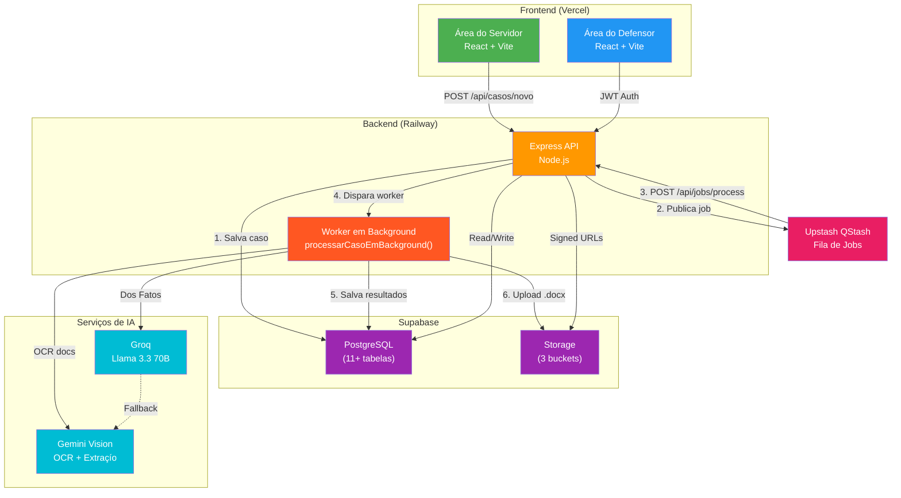
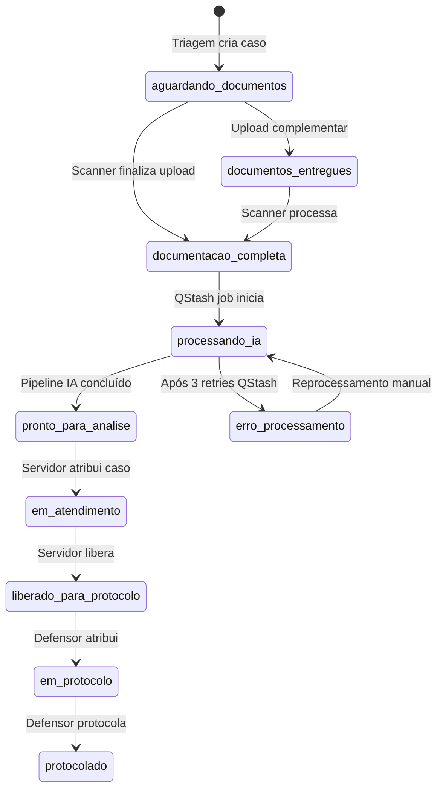
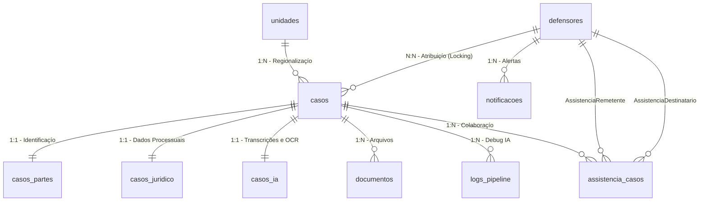

# MEGA CONTEXTO - MíES EM AÇíO

Este documento contém a compilaçío de todas as referências de arquitetura, regras de negócio, guias e histórico do projeto Míes em Açío para que o assistente de IA tenha contexto completo, nío ignore nenhum detalhe e nío gere código que quebre os padrões estabelecidos.

---

# ==========================================
# CONTEXTO INJETADO: ARCHITECTURE.md
# ==========================================

# Arquitetura do Sistema — Míes em Açío · DPE-BA

> **Versão:** 4.2 · **Atualizado em:** 2026-04-26 (Hardening de Segurança + Assistência Compartilhada)
> **Contexto:** Mutirão estadual da Defensoria Pública da Bahia

---

## 1. Visío Geral

O **Míes em Açío** é um sistema Full Stack desenvolvido para apoiar o mutirío estadual da Defensoria Pública da Bahia, cobrindo **35 a 52 sedes simultaneamente** durante **~5 dias úteis**. O sistema automatiza triagem, processamento de documentos via IA e geraçío de petições de Direito de Família para míes solo e em situaçío de vulnerabilidade.

**Diferença crítica:** Projetado para escalar de ~17 casos (versío anterior) para centenas de casos em poucos minutos, exigindo arquitetura robusta e processamento assíncrono.

---

## 2. Stack Tecnológica

### Frontend
- **React 18 + Vite** → Vercel (SPA estática)
- **Vanilla CSS** → Estilizaçío personalizada via `index.css` (Tailwind v4 + Design Tokens)
- **React Router** → Navegaçío SPA

### Backend
- **Node.js + Express** → Railway Pro
- **ES Modules** → `"type": "module"` no `package.json`
- **Prisma ORM** → Abstraçío do banco (equipe/RBAC)
- **Supabase JS Client** → Core de casos e pipeline IA
- **Multer** → Upload de arquivos

### Banco de Dados
- **Supabase Pro** (PostgreSQL, sa-east-1) — projeto ISOLADO da versío anterior
- **Schema v1.0** → 11+ tabelas normalizadas (incluindo `assistencia_casos`, `notificacoes`)
- **Índices estratégicos** → CPF, protocolo, status, unidade

### Storage
- **Supabase Storage** (S3-compatible) — apenas signed URLs (1h de validade), nunca públicas
- **3 Buckets:** `audios`, `documentos`, `peticoes`
- **Compressío de imagens** → Reduçío automática antes do upload

### Fila & Processamento
- **Upstash QStash** — Fila de jobs assíncronos
- **Retry automático** → 3 tentativas com backoff de 30s
- **Fallback local** → `setImmediate()` quando QStash indisponível

### IA & OCR
- **Gemini Vision (Google)** → OCR primário para documentos
- **Groq Llama 3.3 70B** → Geraçío de texto jurídico (DOS FATOS)
- **Fallbacks:** Tesseract.js (imagens), Gemini Flash (texto)

### Autenticaçío
- **JWT** gerado no próprio backend Express (nío Supabase Auth)
- **Payload:** `{ id, nome, email, cargo, unidade_id }`
- **Expiraçío:** 12h (cobre um dia de mutirío)
- **Servidores do balcío:** `X-API-Key` (string aleatória 64 chars)
- **Download Ticket JWT:** token de curta duraçío com `purpose: "download"`. **Hardened:** Agora exige `casoId` explícito no payload e validaçío estrita contra o parmetro da rota (bloqueio de IDOR).

---

## 3. Diagrama de Módulos



---

## 4. Fluxo Operacional (4 Etapas)

### Etapa 1 — Triagem (Atendente Primário)

- Busca por CPF na `BuscaCentral.jsx` → verifica cadastro existente
- Se CPF com caso existente → detecta vínculo de irmíos (pré-preenche dados do representante)
- Preenche qualificaçío da assistida + dados do requerido + relato informal em `TriagemCaso.jsx`
- Seleciona tipo de açío no seletor configuraçío-driven (`familia.js`)
- Define se vai "Anexar Agora" ou "Deixar para Scanner"
- Status inicial: `aguardando_documentos` + protocolo gerado

### Etapa 2 — Scanner (Servidor B / Balcío)

- **Página Dedicada:** `ScannerBalcao.jsx` (novo, commit `3c9bb9e`)
- **Endpoint Dedicado:** `/api/scanner/upload` — otimizado para alto volume
- Busca por CPF ou protocolo
- Dropzone única — todos os documentos de uma vez
- Backend comprime imagens > 1.5MB antes de salvar no Storage
- Ao finalizar: status → `documentacao_completa`, job publicado no QStash
- Frontend retorna 200 imediatamente — IA processa em background

### Etapa 3 — Atendimento Jurídico (Servidor Jurídico)

- Filtra fila por `pronto_para_analise` + sua `unidade_id`
- **Locking Nível 1:** Atribuiçío via botío "Travar Atendimento"
- Revisa relato, DOS FATOS gerado, documentos
- **Múltiplas Minutas:** IA gera Prisío + Penhora simultaneamente (se dívida ≥ 3 meses)
- Pode editar e clicar "Regerar com IA"
- Ao concluir: status → `liberado_para_protocolo`

### Etapa 4 — Protocolo (Defensor)

- Filtra casos com status `liberado_para_protocolo`
- **Locking Nível 2:** Atribuição de `defensor_id` — bloqueia etapa de protocolo e finalização. Ativo em `liberado_para_protocolo` e `em_protocolo`. **`servidor` e `estagiario` NUNCA adquirem Nível 2.**
- Protocola no SOLAR ou SIGAD
- Salva `numero_processo` + upload da capa
- **Manual Unlock:** Botío "Liberar Caso" devolve o processo à fila global
- Status → `protocolado`

---

## 5. Máquina de Estados



### Locking — Sessões e Concorrência

- **Nível 1 (Servidor/Estagiário/Defensor/Coordenador):** Atribuição de `servidor_id` — bloqueia edição de dados jurídicos e relato. Ativo em `pronto_para_analise` e `em_atendimento`.
- **Nível 2 (Defensor/Coordenador/Admin):** Atribuição de `defensor_id` — bloqueia etapa de protocolo e finalização. Ativo em `liberado_para_protocolo` e `em_protocolo`. **`servidor` e `estagiario` NUNCA adquirem Nível 2.**
- **Isolamento de Unidade:** Middleware `requireSameUnit` bloqueia IDOR. **Admin e Gestor** possuem bypass global.
- **HTTP 423 (Locked):** Retorno padrão quando outro usuário detém o lock.
- **Unlock Privilegiado:** Administradores, Gestores e Coordenadores podem forçar destravamento via painel.
- **Auto-release:** Lock liberado após 30min de inatividade.
- **Determinação de Nível:** `lockController` consulta o `status` atual do caso antes de tentar o lock e escolhe o nível correspondente.

---

## 6. Banco de Dados (Schema Normalizado — v2.1)

### Principais Tabelas

| Tabela | Descriçío | Relacionamentos |
|:-------|:----------|:----------------|
| `casos` | Núcleo do sistema | FK: unidades, defensores |
| `casos_partes` | Qualificaçío das partes | 1:1 com casos |
| `casos_juridico` | Dados jurídicos específicos | 1:1 com casos |
| `casos_ia` | Resultados de IA e URLs Duplas | 1:1 com casos |
| `documentos` | Arquivos enviados | N:1 com casos |
| `assistencia_casos` | Registro de colaboraçío/compartilhamento | N:N com casos e defensores |
| `unidades` | Sedes da DPE-BA | 1:N com casos |
| `defensores` | Usuários do sistema | N:1 com casos |
| `cargos` | Permissões por cargo | N:1 com defensores |
| `permissoes` | Sistema de RBAC | N:N com cargos |
| `notificacoes` | Alertas do sistema | N:1 com defensores |
| `logs_auditoria` | Auditoria de ações | N:1 com defensores, casos |
| `logs_pipeline` | Logs do pipeline IA | N:1 com casos |

### Campos Chave na Tabela `casos` (v2.1)

Além dos campos existentes, os seguintes campos foram adicionados nas fases recentes:

| Campo | Tipo | Descriçío |
|:------|:-----|:----------|
| `compartilhado` | `Boolean` | `true` se o caso possui assistência colaborativa ativa |
| `agendamento_data` | `Timestamptz` | Data/hora do agendamento |
| `agendamento_link` | `String` | Link ou endereço do agendamento |
| `agendamento_status` | `String` | `"agendado"` ou `"pendente"` |
| `chave_acesso_hash` | `String` | Hash SHA-256 da chave de acesso pública |
| `feedback` | `String` | Feedback do defensor sobre o caso |
| `finished_at` | `Timestamptz` | Quando o caso foi finalizado/encaminhado |
| `url_capa_processual` | `String` | URL da capa processual no Storage |
| `assistencia_casos` | `Relation` | Vínculo N:N com `assistencia_casos` |

### Modelo `defensores` (v2.1)

| Campo novo | Descriçío |
|:-----------|:----------|
| `supabase_uid` | UID do Supabase Auth (opcional, para integraçío futura) |
| `senha_hash` | Agora opcional (`String?`) — permite gestío externa de autenticaçío |
| `notificacoes` | Relaçío com nova tabela `notificacoes` |
| `assistencia_recebida` / `assistencia_enviada` | Relações de colaboraçío |

### Índices Estratégicos

```sql
-- Buscas frequentes
CREATE INDEX idx_casos_protocolo ON casos (protocolo);
CREATE INDEX idx_casos_status ON casos (status);
CREATE INDEX idx_casos_unidade_status ON casos (unidade_id, status);

-- Locking
CREATE INDEX idx_casos_lock_servidor ON casos (servidor_id);
CREATE INDEX idx_casos_lock_defensor ON casos (defensor_id);

-- Busca por CPF (query mais frequente)
CREATE INDEX idx_partes_cpf_assistido ON casos_partes (cpf_assistido);
CREATE INDEX idx_partes_representante_cpf ON casos_partes (representante_cpf);

-- BI e Performance (v3.0)
CREATE INDEX idx_casos_bi_status ON casos (arquivado, status);
CREATE INDEX idx_casos_bi_unidade_status ON casos (arquivado, unidade_id, status);
CREATE INDEX idx_casos_bi_tipo ON casos (arquivado, tipo_acao);
CREATE INDEX idx_casos_bi_processed_at ON casos (processed_at);
```

---

## 7. Sistema de Templates (docxtemplater)

### Modelos Disponíveis

| Modelo | Uso | Campos Principais |
|:-------|:---|:------------------|
| `executacao_alimentos_penhora.docx` | Execuçío de Alimentos — Rito da Penhora | {NOME_EXEQUENTE}, {data_nascimento_exequente}, {emprego_exequente} |
| `executacao_alimentos_prisao.docx` | Execuçío de Alimentos — Rito da Prisío | {NOME_EXECUTADO}, {emprego_executado}, {telefone_executado} |
| `executacao_alimentos_cumulado.docx` | Execuçío Cumulada (Prisío + Penhora) | Todos os campos combinados |
| `cumprimento_penhora.docx` | Cumprimento de Sentença — Rito da Penhora | {valor_causa}, {valor_causa_extenso}, {data_pagamento} |
| `cumprimento_prisao.docx` | Cumprimento de Sentença — Rito da Prisío | {porcetagem_salario}, {data_inadimplencia}, {dados_conta} |
| `cumprimento_cumulado.docx` | Cumprimento de Sentença — Rito Cumulado | Todos os campos combinados |
| `fixacao_alimentos1.docx` | Fixaçío de Alimentos | {nome_representacao}, {endereço_exequente}, {email_exequente} |
| `termo_declaracao.docx` | Termo de Declaraçío | {relato_texto}, {protocolo} |

---

## 8. Pipeline de IA (Assíncrono via QStash)

### Fluxo de Processamento


### Fallbacks

- **Gemini 429/500** → QStash retry automático (transparente)
- **Gemini 500** → status `erro_processamento` + alerta painel admin
- **Groq falha** → Gemini Flash como fallback de texto
- **Dos Fatos falha** → `buildFallbackDosFatos()` — texto templateado sem IA
- **QStash indisponível** → `setImmediate()` para processamento local síncrono

---

## 9. Segurança

### Regras Inegociáveis

- **Storage:** apenas `signed URLs` com expiraçío de 1 hora
- **Logs:** nunca registrar CPF, nome ou dados pessoais — apenas `caso_id`, `acao`, timestamps
- **Regiío:** sa-east-1 (Brasil) exclusivamente
- **JWT:** gerado no backend com `jsonwebtoken`, secret no Railway, expiraçío 12h
- **API Key servidores:** header `X-API-Key`, string aleatória 64 chars
- **Download Ticket:** `POST /:id/gerar-ticket-download` gera JWT `{ purpose: "download" }` — nunca expor o token principal em URLs de download

### Permissões por Cargo (RBAC)

| Cargo | Leitura | Escrita | Protocolo/Finalizar | Admin/Global | Unlock |
|:------|:--------|:--------|:--------------------|:-------------|:-------|
| `admin` | ✅ | ✅ | ✅ | ✅ | ✅ |
| `gestor` | ✅ | ✅ | ✅ | ✅ | ✅ |
| `coordenador` | ✅ | ✅ | ✅ | ❌ | ✅ |
| `defensor` | ✅ | ✅ | ✅ | ❌ | ❌ |
| `servidor` | ✅ | ✅ | ❌ | ❌ | ❌ |
| `estagiario` | ✅ | ✅ | ❌ | ❌ | ❌ |

> **Middleware:** `requireWriteAccess` usa whitelist positiva: apenas `admin`, `gestor`, `coordenador`, `defensor`, `servidor`, `estagiario` passam.
> **Isolamento de Unidade:** Middleware `requireSameUnit` bloqueia IDOR. Admins e Gestores possuem bypass global.
> **RBAC adicional no controller:** `servidor` e `estagiario` recebem HTTP 403 ao tentar mover caso para `em_protocolo` ou adquirir lock de Nível 2.
> **Integridade de Dados:** Helper `safeFormData` garante que campos JSONB (dados_formulario) sejam sempre objetos válidos, prevenindo `TypeError` em produção.
> **Máquina de Estados:** Transições de status centralizadas em `stateMachine.js` com validação de cargo e bypass de admin documentado.

---

## 10. Sistema de Colaboraçío (Compartilhamento de Casos)

### Tabela `assistencia_casos`

Registra o histórico completo de colaborações entre defensores:

| Campo | Tipo | Descriçío |
|:------|:-----|:----------|
| `caso_id` | `BigInt` | FK para `casos` |
| `remetente_id` | `UUID` | Defensor que iniciou o compartilhamento |
| `destinatario_id` | `UUID` | Defensor que recebeu o caso |
| `acao` | `String` | Tipo de açío: `"compartilhado"`, `"aceito"`, `"recusado"` |
| `created_at` | `Timestamptz` | Timestamp da açío |

### Flag `compartilhado`

- `casos.compartilhado = true` indica que o caso possui assistência ativa
- Visibilidade no Dashboard: defensores nío envolvidos NíO vêem casos compartilhados de outras unidades (privacidade por design)
- Notificaçío automática gerada ao compartilhar (`tipo: "assistencia"`)

---

## 11. Frontend — Estrutura Modular (Atual)

### Área do Servidor

```
frontend/src/areas/servidor/
├── components/
│   ├── StepTipoAcao.jsx
│   ├── StepDadosPessoais.jsx      ← Suporta multi-casos (pré-fill representante)
│   ├── StepRequerido.jsx
│   ├── StepDetalhesCaso.jsx
│   ├── StepRelatoDocs.jsx
│   ├── StepDadosProcessuais.jsx
│   └── secoes/                    ← Seções específicas por tipo de açío
│       ├── SecaoCamposGeraisFamilia.jsx
│       ├── SecaoDadosDivorcio.jsx
│       ├── SecaoValoresPensao.jsx
│       └── SecaoProcessoOriginal.jsx
├── hooks/
│   ├── useFormHandlers.js         ← Event handlers, formataçío, áudio
│   ├── useFormValidation.js       ← Validaçío CPF, campos obrigatórios
│   └── useFormEffects.js          ← Rascunho, prefill, health check
├── services/
│   └── submissionService.js       ← Validaçío + envio para API
├── state/
│   └── formState.js               ← initialState + formReducer
├── utils/
│   └── formConstants.js           ← fieldMapping, digitsOnlyFields
└── pages/
    ├── BuscaCentral.jsx            ← Busca por CPF + detecçío de irmíos
    ├── TriagemCaso.jsx             ← Formulário multi-step (~280 linhas)
    ├── ScannerBalcao.jsx           ← [NOVO v2.1] Tela de scanner dedicada
    └── EnvioDoc.jsx                ← Upload avançado de documentos
```

### Área do Defensor

```
frontend/src/areas/defensor/
├── pages/
│   ├── Dashboard.jsx              ← Grid 3.0 (1fr 350px) + Sidebar de Alertas
│   ├── Casos.jsx                  ← Listagem com filtros
│   ├── DetalhesCaso.jsx           ← Detalhe completo + ações
│   ├── GerenciarEquipe.jsx        ← CRUD membros + CRUD unidades
│   └── CasosArquivados.jsx        ← Arquivo de casos encerrados
└── contexts/
    └── AuthContext.jsx            ← JWT, cargo, unidade
```

### Configuraçío Declarativa de Ações (`familia.js`)

A pasta `frontend/src/config/formularios/acoes/` contém arquivos de configuraçío que determinam **quais campos** sío exibidos, obrigatórios ou ocultados para cada tipo de açío. O formulário nío possui lógica hardcoded — apenas consome a configuraçío.

Flags chave:
- `exigeDadosProcessoOriginal` — exibe campos do processo originário (e ativa validaçío de `valor_debito` + `calculo_arquivo`)
- `ocultarDadosRequerido` — oculta seçío da parte contrária
- `labelAutor` — rótulo do autor (Míe, Assistida, etc.)
- `ocultarDetalhesGerais` — oculta seçío de campos gerais redundantes (fixaçío de alimentos)

---

## 12. Docker & Portabilidade

### Configuraçío Docker

```yaml
services:
  db:
    image: postgres:17
    ports: ["5432:5432"]

  backend:
    build: ./backend
    environment:
      DATABASE_URL: postgresql://maes:maes123@db:5432/maes_em_acao
      DIRECT_URL: postgresql://maes:maes123@db:5432/maes_em_acao
    ports: ["8001:8001"]
    depends_on: [db]

  frontend:
    build: ./frontend
    environment:
      VITE_API_URL: http://localhost:8001/api
    ports: ["3000:3000"]
    depends_on: [backend]
```

> **Nota:** `DIRECT_URL` é necessário no Prisma quando se usa o pooler do Supabase (Supabase Transaction Mode). Para Docker local, pode ser igual à `DATABASE_URL`.

---

## 13. Monitoramento & Logs

### Dois níveis de rastreabilidade

1. **`logs_auditoria`** → Rastreia ações humanas (quem fez o quê e quando)
2. **`logs_pipeline`** → Rastreia falhas técnicas na IA (etapa, erro, timestamp)

> [!CAUTION]
> **LGPD:** NUNCA grave CPFs, nomes ou dados pessoais nas colunas de `detalhes` dos logs. Use apenas IDs e referências genéricas.

---

## 14. Deploy & Produçío

### Ambientes

- **Desenvolvimento:** Docker local + Prisma
- **Produçío:** Railway Pro (backend) + Vercel (frontend) + Supabase Pro (banco/storage)

### Variáveis de Ambiente Essenciais

```bash
# Backend
SUPABASE_URL=https://xyz.supabase.co
SUPABASE_SERVICE_KEY=eyJ...
DATABASE_URL=postgresql://...       # Supabase pooler (para Prisma)
DIRECT_URL=postgresql://...         # Supabase direct (para migrations)
GEMINI_API_KEY=AIza...
GROQ_API_KEY=gsk_...
QSTASH_TOKEN=...
QSTASH_CURRENT_SIGNING_KEY=...
QSTASH_NEXT_SIGNING_KEY=...
JWT_SECRET=64_chars_random_string
API_KEY_SERVIDORES=64_chars_random
SALARIO_MINIMO_ATUAL=1621.00

# Frontend
VITE_API_URL=https://api.mutirao.dpe.ba.gov.br
```

---

# ==========================================
# CONTEXTO INJETADO: BUSINESS_RULES.md
# ==========================================

# Regras de Negócio — Míes em Açío · DPE-BA

> **Versío:** 2.5 · **Atualizado em:** 2026-04-24 (RBAC Coordenador + CEP Obrigatório + Busca CPF Supabase Corrigida)
> **Fonte:** Análise da codebase (controllers, services, middleware, config)
> **Propósito:** Referência canônica para treinamento de IAs e orientaçío de defensores

---

## 1. Tipos de Açío (`tipo_acao`)

O campo `tipo_acao` da tabela `casos` determina qual template DOCX e qual prompt de IA serío utilizados. As chaves internas (`acaoKey`) sío mapeadas no **dicionário de ações** (`dicionarioAcoes.js`).

### 1.1 Mapeamento completo

| # | `acaoKey` (chave interna) | Template DOCX | Prompt IA | Vara Competente |
|---|:--------------------------|:--------------|:----------|:----------------|
| 1 | `fixacao_alimentos` | `fixacao_alimentos.docx` | ✅ System prompt específico (dicionário) | Vara de Família |
| 2 | `exec_penhora` | `exec_penhora.docx` | ❌ Usa fallback legado | Vara de Família |
| 3 | `exec_prisao` | `exec_prisao.docx` | ❌ Usa fallback legado | Vara de Família |
| 4 | `exec_cumulado` | `prov_cumulado.docx` | ❌ Usa fallback legado | Vara de Família |
| 5 | `def_penhora` | `def_penhora.docx` | ❌ Usa fallback legado | Vara de Família |
| 6 | `def_prisao` | `def_prisao.docx` | ❌ Usa fallback legado | Vara de Família |
| 7 | `def_cumulado` | `def_cumulado.docx` | ❌ Usa fallback legado | Vara de Família |
| 8 | `alimentos_gravidicos` | `alimentos_gravidicos.docx` | ❌ Usa fallback legado | Vara de Família |
| 9 | `termo_declaracao` | `termo_declaracao.docx` | ❌ (N/A — gerado separadamente) | — |
| — | `default` (fallback) | `fixacao_alimentos.docx` | ❌ Usa fallback legado | `[VARA NíO ESPECIFICADA]` |

> **Regra de fallback:** Se `acaoKey` está vazio ou nío existe no dicionário, a config `default` é usada com log de aviso.

### 1.2 Descriçío jurídica de cada tipo

| Tipo | Descriçío | Quando é aplicável |
|:-----|:----------|:-------------------|
| **Fixaçío de Alimentos** | Açío para obrigar o genitor a pagar pensío alimentícia aos filhos. | Quando a criança/adolescente nío recebe contribuiçío financeira regular do genitor ausente. |
| **Execuçío de Alimentos — Prisío** | Cumprimento de sentença que já fixou alimentos, sob pena de prisío civil. | Quando já existe uma decisío judicial fixando alimentos que nío está sendo cumprida (inadimplente nos últimos 3 meses). |
| **Execuçío de Alimentos — Penhora** | Cumprimento de sentença com penhora de bens ou desconto em folha. | Quando já existe decisío judicial fixando alimentos e o devedor possui bens ou emprego formal para penhora. |
| **Execuçío Cumulada** | Execuçío com ambos os ritos (prisío e penhora). | Quando se busca tanto a prisío quanto a penhora de bens. |
| **Cumprimento de Sentença — Penhora** | Cumprimento de sentença definitiva com penhora. | Quando há sentença transitada em julgado. |
| **Cumprimento de Sentença — Prisío** | Cumprimento de sentença definitiva com prisío. | Quando há sentença transitada em julgado e inadimplência. |
| **Cumprimento Cumulado** | Cumprimento com ambos os ritos. | Quando se busca tanto a prisío quanto a penhora em sentença definitiva. |
| **Alimentos Gravídicos** | Alimentos durante a gestaçío. | Quando a genitora necessita de alimentos durante a gravidez. |
| **Termo de Declaraçío** | Documento que formaliza o relato do assistido perante a Defensoria. | Gerado sob demanda pelo defensor para formalizar o depoimento do assistido. Nío é uma açío judicial. |

### 1.3 Determinaçío da `acaoKey`

A chave da açío é extraída no backend pela seguinte lógica de prioridade:

```
acaoKey = dados_formulario.acaoEspecifica
       || dados_formulario.tipoAcao.split(" - ")[1]?.trim()
       || dados_formulario.tipoAcao.trim()
       || ""
```

O campo `tipoAcao` pode vir do frontend no formato `"Família - fixacao_alimentos"`, onde a parte após o `" - "` é a chave do dicionário.

### 1.4 Mapeamento de Varas (`varasMapping.js`)

O `tipo_acao` (versío descritiva, ex: "Fixaçío de Pensío Alimentícia") é mapeado para a vara competente:

| Rótulo descritivo | Vara |
|:-------------------|:-----|
| Fixaçío de Pensío Alimentícia | Vara de Família |
| Divórcio Litigioso / Consensual | Vara de Família |
| Reconhecimento e Dissoluçío de Uniío Estável | Vara de Família |
| Dissoluçío Litigiosa de Uniío Estável | Vara de Família |
| Guarda de Filhos | Vara de Família |
| Execuçío de Alimentos Rito Penhora/Prisío | Vara de Família |
| Revisío de Alimentos (Majoraçío/Reduçío) | Vara de Família |
| Alimentos Gravídicos | Vara de Família |
| Reconhecimento de Uniío Estável Post Mortem | Vara de Sucessões |
| Alvará | Vara de Sucessões |

> Se o tipo nío for encontrado no mapeamento, retorna `"[VARA NíO ESPECIFICADA]"`.

---

## 2. Estrutura do `dados_formulario` (JSONB)

O campo `dados_formulario` na tabela `casos` armazena todos os dados coletados no formulário multi-step do cidadío. É um objeto JSONB com chaves variáveis conforme o tipo de açío.

### 2.1 Campos universais (presentes em todos os tipos)

| Chave | Tipo | Obrigatório | Descriçío |
|:------|:-----|:------------|:----------|
| `nome` | `string` | ✅ | Nome completo do assistido |
| `cpf` | `string` | ✅ | CPF do assistido (validado algoritmicamente) |
| `telefone` | `string` | ✅ | Telefone de contato |
| `whatsapp_contato` | `string` | ❌ | WhatsApp do assistido |
| `tipoAcao` | `string` | ✅ | Tipo de açío selecionado (ex: `"Família - fixacao_alimentos"`) |
| `acaoEspecifica` | `string` | ❌ | Chave limpa do dicionário (ex: `"fixacao_alimentos"`) |
| `relato` | `string` | ❌ | Relato textual do assistido |
| `documentos_informados` | `string (JSON)` | ❌ | Array serializado de nomes de documentos |
| `document_names` | `object` | ❌ | Mapa `{ nomeArquivo: rotuloAmigavel }` (gerado/atualizado pelo backend) |

### 2.2 Campos do assistido (requerente/autor)

| Chave | Tipo | Obrigatório | Descriçío |
|:------|:-----|:------------|:----------|
| `assistido_eh_incapaz` | `"sim" \| "nao"` | ❌ | Se o assistido é incapaz (criança/adolescente representado) |
| `assistido_data_nascimento` | `string (YYYY-MM-DD)` | ❌ | Data de nascimento do assistido |
| `assistido_nacionalidade` | `string` | ❌ | Nacionalidade |
| `assistido_estado_civil` | `string` | ❌ | Estado civil |
| `assistido_ocupacao` | `string` | ❌ | Profissío/ocupaçío |
| `assistido_rg_numero` | `string` | ❌ | Número do RG |
| `assistido_rg_orgao` | `string` | ❌ | Órgío emissor do RG |
| `endereco_assistido` | `string` | ❌ | Endereço completo |
| `email_assistido` | `string` | ❌ | E-mail de contato |
| `dados_adicionais_requerente` | `string` | ❌ | Informações complementares sobre o requerente |
| `situacao_financeira_genitora` | `string` | ❌ | Descriçío da situaçío financeira da genitora |

### 2.3 Campos do representante legal

Preenchidos quando `assistido_eh_incapaz === "sim"` (a míe/pai representando o(s) filho(s)).

| Chave | Tipo | Obrigatório (quando incapaz) | Descriçío |
|:------|:-----|:-----------------------------|:----------|
| `representante_nome` | `string` | ✅ | Nome do representante legal |
| `representante_nacionalidade` | `string` | ❌ | Nacionalidade |
| `representante_estado_civil` | `string` | ❌ | Estado civil |
| `representante_ocupacao` | `string` | ❌ | Profissío |
| `representante_cpf` | `string` | ✅ | CPF do representante (obrigatório) |
| `representante_rg_numero` | `string` | ❌ | RG número |
| `representante_rg_orgao` | `string` | ❌ | RG órgío emissor |
| `representante_endereco_residencial` | `string` | ❌ | Endereço residencial |
| `representante_endereco_profissional` | `string` | ❌ | Endereço profissional |
| `representante_email` | `string` | ❌ | E-mail |
| `representante_telefone` | `string` | ❌ | Telefone |

### 2.4 Campos da parte contrária (requerido/executado)

| Chave | Tipo | Obrigatório | Descriçío |
|:------|:-----|:------------|:----------|
| `nome_requerido` | `string` | ❌ | Nome do requerido |
| `cpf_requerido` | `string` | ❌ | CPF do requerido (validado, mas gera apenas **aviso** — nío bloqueia) |
| `endereco_requerido` | `string` | ❌ | Endereço residencial |
| `dados_adicionais_requerido` | `string` | ❌ | Informações adicionais |
| `requerido_nacionalidade` | `string` | ❌ | Nacionalidade |
| `requerido_estado_civil` | `string` | ❌ | Estado civil |
| `requerido_ocupacao` | `string` | ❌ | Profissío |
| `requerido_endereco_profissional` | `string` | ❌ | Endereço profissional |
| `requerido_email` | `string` | ❌ | E-mail |
| `requerido_telefone` | `string` | ❌ | Telefone |
| `requerido_tem_emprego_formal` | `string` | ❌ | Se possui emprego formal |
| `empregador_requerido_nome` | `string` | ❌ | Nome do empregador |
| `empregador_requerido_endereco` | `string` | ❌ | Endereço do empregador |
| `empregador_email` | `string` | ❌ | E-mail do empregador |

### 2.5 Campos específicos por tipo de açío

#### Fixaçío/Revisío de Alimentos

| Chave | Tipo | Descriçío |
|:------|:-----|:----------|
| `valor_mensal_pensao` | `string \| number` | Valor mensal pretendido |
| `dia_pagamento_requerido` | `string` | Dia do mês para pagamento |
| `dados_bancarios_deposito` | `string` | Dados bancários para depósito |
| `filhos_info` | `string` | Informações sobre filhos |
| `descricao_guarda` | `string` | Descriçío da situaçío de guarda |
| `outros_filhos_detalhes` | `string (JSON)` | Array serializado com `{ nome, cpf, dataNascimento, rgNumero, rgOrgao, nacionalidade }` |

#### Execuçío de Alimentos

| Chave | Tipo | Descriçío |
|:------|:-----|:----------|
| `numero_processo_originario` | `string` | Número do processo que fixou os alimentos |
| `vara_originaria` | `string` | Vara do processo original |
| `percentual_ou_valor_fixado` | `string` | Percentual ou valor fixado na decisío |
| `dia_pagamento_fixado` | `string` | Dia de pagamento conforme decisío |
| `periodo_debito_execucao` | `string` | Período de inadimplência |
| `valor_total_debito_execucao` | `string \| number` | Valor total do débito |
| `valor_total_extenso` | `string` | Valor por extenso |
| `valor_debito_extenso` | `string` | Valor do débito por extenso |
| `processo_titulo_numero` | `string` | Número do título executivo |
| `percentual_definitivo_salario_min` | `string` | Percentual do salário mínimo |
| `percentual_definitivo_extras` | `string` | Percentual para despesas extras |

#### Divórcio

| Chave | Tipo | Descriçío |
|:------|:-----|:----------|
| `data_inicio_relacao` | `string (YYYY-MM-DD)` | Data de início do relacionamento |
| `data_separacao` | `string (YYYY-MM-DD)` | Data da separaçío de fato |
| `bens_partilha` | `string` | Descriçío dos bens a partilhar |
| `regime_bens` | `string` | Regime de bens do casamento |
| `retorno_nome_solteira` | `string` | Se deseja retornar ao nome de solteira |
| `alimentos_para_ex_conjuge` | `string` | Se solicita alimentos para ex-cônjuge |

#### Guarda

| Chave | Tipo | Descriçío |
|:------|:-----|:----------|
| `descricao_guarda` | `string` | Situaçío atual da guarda |
| `filhos_info` | `string` | Informações sobre os filhos |

#### Campos calculados pelo backend (inseridos no processamento)

| Chave | Origem | Descriçío |
|:------|:-------|:----------|
| `percentual_salario_minimo` | `calcularPercentualSalarioMinimo()` | `(valor_mensal_pensao / SALARIO_MINIMO_ATUAL) * 100` |
| `salario_minimo_formatado` | env `SALARIO_MINIMO_ATUAL` (padrío: R$ 1.621,00) | Valor do salário mínimo vigente formatado |
| `valor_causa` | `calcularValorCausa()` | `valor_mensal_pensao × 12` (anualizado) |

### 2.6 Estrutura de `outros_filhos_detalhes`

Quando há mais de um filho na açío, este campo contém um array JSON serializado:

```json
[
  {
    "nome": "Maria Silva Santos",
    "cpf": "12345678901",
    "dataNascimento": "2015-03-20",
    "rgNumero": "1234567",
    "rgOrgao": "SSP/BA",
    "nacionalidade": "brasileiro(a)"
  }
]
```

O primeiro filho é sempre extraído dos campos raiz (`nome`, `cpf`, `assistido_data_nascimento`). Os demais vêm deste array.

---

## 3. Regras de Validaçío

### 3.1 Normalizaçío e Busca de CPF

Para garantir que a busca seja resiliente a diferentes formatos de entrada, o sistema aplica as seguintes regras:

| Regra | Descriçío |
|:------|:----------|
| **Normalizaçío** | CPFs informados na busca sío limpos (removendo `.` e `-`) antes da consulta. |
| **Busca Resiliente** | O backend consulta simultaneamente o CPF "sujo" (como digitado) e o CPF "limpo" na tabela `casos_partes`. |
| **Escopo de Busca** | A busca verifica os campos `cpf_assistido` e `representante_cpf` para garantir que o caso seja encontrado independente de quem iniciou o processo. |
| **Validaçío** | CPF do assistido e do representante sío **obrigatórios e validados** algoritmicamente (Bloqueante). |
| **Sintaxe Supabase** | O filtro `.or()` em join de tabela estrangeira usa `{ foreignTable: 'casos_partes' }` — NÃO usar prefixo `partes.campo.eq.X` (formato inválido). |
| **Normalizaçío `partes`** | O campo `casoRaw.partes` pode ser array (Supabase join) ou objeto (Prisma). Sempre usar `Array.isArray(casoRaw.partes) ? casoRaw.partes[0] : casoRaw.partes`. |

### 3.2 Unicidade de CPF e Arquitetura Multi-Casos

| Regra | Comportamento |
|:------|:-------------|
| **Nío há unicidade de CPF na tabela `casos`** | Um mesmo CPF pode ter múltiplos casos vinculados. |
| **Múltiplos Assistidos por Representante** | Uma representante (míe) pode criar múltiplos casos distintos para filhos diferentes com requeridos diferentes, reusando seus próprios dados, mas gerando protocolos independentes. |
| O campo `protocolo` é UNIQUE | Cada caso/filho possui um protocolo único e tracking separado. |
| O campo `email` na tabela `defensores` é UNIQUE | Nío é possível cadastrar dois defensores com o mesmo e-mail. |
| O campo `numero_solar` possui constraint UNIQUE | Retorna `409` se tentar vincular um número Solar já usado. |


### 3.3 Validaçío de campos obrigatórios no formulário de triagem

| Campo | Obrigatório | Regra adicional |
|:------|:-----------|:----------------|
| CPF do representante | ✅ Sempre | Validaçío algorítmica; bloqueia submissío |
| Endereço residencial (`requerente_endereco_residencial`) | ✅ Sempre | Deve conter `"CEP:"` no valor — usuário deve confirmar o CEP via busca automática |
| Telefone de contato (`requerente_telefone`) | ✅ Sempre | Campo obrigatório independente de incapacidade |

> **Regra CEP:** O componente `EnderecoInput.jsx` preenche o endereço com `CEP: XXXXX-XXX` após busca na API de CEP. Se o usuário digitar manualmente sem confirmar o CEP, a validaçío no `submissionService.js` bloqueia a submissío com mensagem "O CEP do endereço residencial é obrigatório."

### 3.3b Validaçío de arquivos

| Regra | Valor |
|:------|:------|
| Tamanho máximo por arquivo | 50 MB |
| Formatos processados por OCR | `.jpg`, `.jpeg`, `.png`, `.pdf` |
| Quantidade máxima de documentos por upload | 20 |
| Quantidade máxima de áudios | 1 |

### 3.4 Validaçío de senha (defensores)

| Regra | Valor |
|:------|:------|
| Tamanho mínimo da senha | 6 caracteres |
| Algoritmo de hash | bcrypt (10 salt rounds) |

### 3.5 Validaçío de arquivamento

| Regra | Comportamento |
|:------|:-------------|
| Motivo é obrigatório ao arquivar | Mínimo 5 caracteres; retorna `400` se ausente |
| Ao restaurar (desarquivar) | Motivo é limpo (`null`) |

### 3.6 Campos que o assistido preenche vs. apenas o defensor

| Quem preenche | Campos |
|:--------------|:-------|
| **Assistido** (via formulário público) | `nome`, `cpf`, `telefone`, `whatsapp_contato`, `tipoAcao`, `relato`, `documentos_informados`, todos os campos de `dados_formulario`, documentos e áudio |
| **Assistido** (pós-submissío) | Upload de documentos complementares, solicitaçío de reagendamento |
| **Defensor** (via painel protegido) | `status`, `descricao_pendencia`, `numero_solar`, `numero_processo`, `agendamento_data`, `agendamento_link`, `feedback`, `arquivado`, `motivo_arquivamento` |
| **Sistema** (automático) | `protocolo`, `chave_acesso_hash`, `resumo_ia`, `peticao_inicial_rascunho`, `peticao_completa_texto`, `url_documento_gerado`, `status` (durante processamento), `processed_at`, `processing_started_at` |

---

## 4. Fluxo de Geraçío de Documentos

### 4.1 Pipeline de processamento em background

```
criarNovoCaso() → QStash.publishJSON() → jobController.processJob()
                                              ↓
                                    processarCasoEmBackground()
                                              ↓
                               ┌──────────────┼──────────────┐
                               ↓              ↓              ↓
                            [OCR]         [Resumo IA]    [Dos Fatos IA]
                               ↓              ↓              ↓
                          textoCompleto    resumo_ia     dosFatosTexto
                                              ↓
                                    buildDocxTemplatePayload()
                                              ↓
                                    ┌─────────┼──────────┐
                                    ↓                    ↓
                              generateDocx()    gerarTextoCompletoPeticao()
                                    ↓                    ↓
                            url_documento_gerado   peticao_completa_texto
```

### 4.2 Quando uma petiçío pode ser gerada

| Condiçío | Geraçío automática | Geraçío manual |
|:---------|:-------------------|:---------------|
| **Criaçío do caso** | ✅ Gerada automaticamente via processamento background | — |
| **Regerar minuta** | — | ✅ Admin pode regerar via `POST /:id/regerar-minuta` |
| **Substituir minuta** | — | ✅ Servidor pode fazer upload de `.docx` manual via `POST /:id/upload-minuta` |
| **Regenerar Dos Fatos** | — | ✅ Admin pode regerar via `POST /:id/gerar-fatos` |
| **Reprocessar caso** | ✅ Re-executa todo o pipeline | — |

*Nota Especial - Execuçío de Alimentos (v2.0):* 
O sistema agora suporta a geraçío e visualizaçío simultnea de múltiplos documentos para o mesmo protocolo:
1. **Ritos Combinados:** Se a açío registrar débito superior a 3 meses, o pipeline gera automaticamente uma peça de **Prisío** e outra de **Penhora**.
2. **Termo de Declaraçío:** Pode ser gerado e armazenado de forma independente das peças processuais.
3. **Download Dinmico:** O frontend exibe abas para cada documento disponível no Storage.

### 4.3 O que a IA recebe como input

#### Para o Resumo Executivo (`analyzeCase`)

- **Input:** `textoCompleto` = relato do assistido + textos extraídos via OCR de todos os documentos
- **Temperatura:** 0.3
- **Output:** Resumo com: Problema Central, Partes Envolvidas, Pedido Principal, Urgência, Área do Direito
- **Destino:** Campo `resumo_ia` do caso

#### Para a seçío "Dos Fatos" (`generateDosFatos`)

- **Input:** Dados normalizados do caso (nomes, CPFs, relato, situaçío financeira, filhos, documentos)
- **Sanitizaçío PII:** Antes do envio, dados sensíveis sío substituídos por placeholders (`[NOME_AUTOR_1]`, `[CPF_REU]`)
- **Temperatura:** 0.3
- **Output:** Texto jurídico no estilo da Defensoria Pública da Bahia
- **Destino:** Campo `peticao_inicial_rascunho` (prefixado com `"DOS FATOS\n\n"`)

#### Prompts de IA — Regras estilísticas obrigatórias

| Regra | Detalhes |
|:------|:---------|
| **Nunca usar "menor"** | Deve usar "criança", "adolescente" ou "filho(a)" |
| **Nío citar documentos no texto** | CPF, RG e datas de nascimento nío devem aparecer no texto narrativo |
| **Conectivos obrigatórios** | "Insta salientar", "Ocorre que, no caso em tela", "Como é sabido", "aduzir" |
| **Formato** | Parágrafos coesos, sem tópicos/listas |
| **Estilo** | Extremamente formal, culto e padronizado (juridiquês clássico) |

### 4.4 Diferença entre os campos de petiçío

| Campo | Conteúdo | Quando é preenchido |
|:------|:---------|:--------------------|
| `peticao_inicial_rascunho` | Texto da seçío "Dos Fatos" gerado pela IA (prefixado com `"DOS FATOS\n\n"`) | Processamento background |
| `peticao_completa_texto` | Texto completo da petiçío (cabeçalho + qualificaçío + dos fatos + pedidos + assinatura) em texto puro | Processamento background |
| `url_documento_gerado` | Caminho no Storage do `.docx` da petiçío inicial renderizada via Docxtemplater | Processamento background |
| `url_termo_declaracao` | Caminho no Storage do `.docx` do Termo de Declaraçío | Gerado sob demanda (admin) |

### 4.5 Geraçío do Termo de Declaraçío

- **Quem pode gerar:** Apenas `admin`
- **Endpoint:** `POST /:id/gerar-termo`
- **Dados utilizados:** `dados_formulario` do caso + dados do caso (`nome_assistido`, `cpf_assistido`, `relato_texto`, `protocolo`, `tipo_acao`)
- **Template:** `termo_declaracao.docx`
- **Comportamento:** Remove o arquivo anterior do Storage antes de gerar um novo (geraçío limpa)
- **Destino:** `url_termo_declaracao` no caso

### 4.6 Fallbacks de geraçío

| Componente | Fallback |
|:-----------|:---------|
| OCR (Gemini Vision) | Tesseract.js (apenas para imagens, nío PDFs) |
| Geraçío de texto (Groq) | Gemini 2.5 Flash |
| Dos Fatos (IA) | `buildFallbackDosFatos()` — texto templateado sem IA |
| QStash (fila) | `setImmediate()` — processamento local |

---

## 5. Regras de Permissío

### 5.1 Cargos do sistema

O campo `cargo` na tabela `defensores` define o nível de acesso. O cargo é incluído no token JWT no login.

| Cargo | Acesso de Leitura | Acesso de Escrita | Operações Admin |
|:------|:-------------------|:-------------------|:----------------|
| `admin` | ✅ | ✅ | ✅ |
| `defensor` | ✅ | ✅ | ❌ |
| `estagiario` | ✅ | ✅ | ❌ |
| `recepcao` | ✅ | ✅ | ❌ |
| `visualizador` | ✅ | ❌ | ❌ |

> O cargo padrío ao cadastrar um novo membro é `"estagiario"`. Apenas o admin pode criar cadastros e deve selecionar entre as opções disponíveis no formulário.


### 5.2 Middleware de controle

| Middleware | Funçío | Aplicaçío |
|:-----------|:-------|:----------|
| `authMiddleware` | Verifica JWT e injeta `req.user` | Todas as rotas protegidas (após rotas públicas) |
| `requireWriteAccess` | Bloqueia cargo `visualizador` de operações de escrita (403) | Todas as rotas de escrita (POST, PATCH, DELETE protegidas) |
| `auditMiddleware` | Registra operações de escrita na tabela `logs_auditoria` | Todas as rotas protegidas |

### 5.3 Operações exclusivas de Admin

As seguintes operações verificam **explicitamente** `req.user.cargo === "admin"` no controller:

| Operaçío | Endpoint | Justificativa |
|:---------|:---------|:-------------|
| Regenerar Dos Fatos | `POST /:id/gerar-fatos` | Consome créditos de IA |
| Gerar Termo de Declaraçío | `POST /:id/gerar-termo` | Documento formal |
| Regerar Minuta DOCX | `POST /:id/regerar-minuta` | Consome créditos de IA |
| Reverter Finalizaçío | `POST /:id/reverter-finalizacao` | Açío destrutiva (remove dados Solar) |
| Deletar Caso | `DELETE /:id` | Açío irreversível (exclui do banco e Storage) |
| Registrar novo membro | `POST /api/defensores/cadastro` | Gestío de equipe |
| Listar equipe | `GET /api/defensores` | Dados sensíveis da equipe |
| Atualizar membro | `PATCH /api/defensores/:id` | Gestío de equipe |
| Deletar membro | `DELETE /api/defensores/:id` | Gestío de equipe (nío pode deletar a si mesmo) |
| Resetar senha de membro | `POST /api/defensores/:id/resetar-senha` | Segurança |

### 5.4 Acesso público (sem autenticaçío)

O assistido (cidadío) pode realizar as seguintes ações **sem login**:

| Açío | Endpoint | Autenticaçío |
|:-----|:---------|:-------------|
| Submeter novo caso | `POST /api/casos/novo` | Nenhuma |
| Buscar casos por CPF | `GET /api/casos/buscar-cpf` | Nenhuma |
| Upload de documentos complementares | `POST /api/casos/:id/upload-complementar` | CPF + chave de acesso (no body) |
| Solicitar reagendamento | `POST /api/casos/:id/reagendar` | CPF + chave de acesso (no body) |
| Consultar status | `GET /api/status` | CPF + chave de acesso (na query) |

> **Segurança do assistido:** A chave de acesso é hasheada com SHA-256 + salt aleatório antes de ser armazenada no banco. A verificaçío é feita recomputando o hash.

### 5.5 Mapeamento de status públicos

O assistido nío vê os status internos do sistema. O `statusController` converte:

| Status Interno | Status Público (para o cidadío) |
|:---------------|:-------------------------------|
| `recebido` | `enviado` |
| `processando` | `em triagem` |
| `processado` | `em triagem` |
| `em_analise` | `em triagem` |
| `aguardando_docs` | `documentos pendente` |
| `documentos_entregues` | `documentos entregues` |
| `reuniao_agendada` | `reuniao agendada` |
| `reuniao_online_agendada` | `reuniao online` |
| `reuniao_presencial_agendada` | `reuniao presencial` |
| `aguardando_protocolo` | `Aguardando protocolo` |
| `reagendamento_solicitado` | `em analise` |
| `encaminhado_solar` | `encaminhamento solar` |
| `erro` | `enviado` |

---

## 6. Regras de Agendamento

### 6.1 Quem pode agendar

| Açío | Quem realiza |
|:-----|:-------------|
| **Agendar reuniío** | Defensor (qualquer cargo com escrita) via `PATCH /:id/agendar` |
| **Solicitar reagendamento** | Assistido (cidadío) via `POST /:id/reagendar` |

### 6.2 Tipos de agendamento

Os tipos sío inferidos pelo status do caso ao qual o agendamento está vinculado:

| Status | Tipo implícito |
|:-------|:---------------|
| `reuniao_agendada` | Genérico |
| `reuniao_online_agendada` | Online (link de videoconferência) |
| `reuniao_presencial_agendada` | Presencial (endereço físico) |

> O tipo é definido pelo defensor ao mudar o status via `PATCH /:id/status`.

### 6.3 Status do agendamento (`agendamento_status`)

| Valor | Quando é definido |
|:------|:------------------|
| `agendado` | Quando `agendamento_data` **E** `agendamento_link` estío preenchidos |
| `pendente` | Quando os campos estío vazios |

### 6.4 Fluxo de reagendamento

```
1. Assistido chama POST /:id/reagendar com { motivo, data_sugerida, cpf, chave }
2. Backend valida CPF (match exato) e chave de acesso (hash)
3. Se houver agendamento anterior:
   → Salva no historico_agendamentos com status "reagendado"
   → Tipo inferido: "presencial" se status contém "presencial", senío "online"
4. Atualiza o caso:
   → status = "reagendamento_solicitado"
   → motivo_reagendamento = motivo
   → data_sugerida_reagendamento = data_sugerida
   → agendamento_data = null (libera a agenda)
   → agendamento_link = null
5. Cria notificaçío para o defensor (tipo: "reagendamento")
```

### 6.5 O que fica registrado em `historico_agendamentos`

| Campo | Origem |
|:------|:-------|
| `caso_id` | ID do caso |
| `data_agendamento` | Data/hora do agendamento anterior |
| `link_ou_local` | Link da chamada ou endereço do agendamento anterior |
| `tipo` | `"online"` ou `"presencial"` (inferido do status) |
| `status` | Sempre `"reagendado"` |
| `created_at` | Timestamp automático |

---

## 7. Regras de Arquivamento e Finalizaçío

### 7.1 Finalizaçío (Encaminhamento ao Solar)

| Aspecto | Detalhe |
|:--------|:-------|
| **Endpoint** | `POST /:id/finalizar` |
| **Quem pode** | Qualquer cargo com acesso de escrita (protected + requireWriteAccess) |
| **Dados recebidos** | `numero_solar`, `numero_processo`, arquivo `capa` (capa processual) |
| **Efeitos no banco** | `status = "encaminhado_solar"`, `numero_solar`, `numero_processo`, `url_capa_processual`, `finished_at = now()` |
| **Upload da capa** | Salva em `documentos/capas/{id}_{timestamp}_{nomeOriginal}` |

### 7.2 Reversío da Finalizaçío

| Aspecto | Detalhe |
|:--------|:-------|
| **Endpoint** | `POST /:id/reverter-finalizacao` |
| **Quem pode** | Apenas `admin` |
| **Efeitos no banco** | `status = "processado"`, `numero_solar = null`, `numero_processo = null`, `url_capa_processual = null`, `finished_at = null` |
| **Efeitos no Storage** | Exclui o arquivo da capa processual do bucket `documentos` |

### 7.3 Arquivamento (Soft Delete)

| Aspecto | Detalhe |
|:--------|:-------|
| **Endpoint** | `PATCH /:id/arquivar` |
| **Quem pode** | Qualquer cargo com acesso de escrita |
| **Campo no banco** | `arquivado` (boolean) — ortogonal ao `status` |
| **Motivo obrigatório** | Mínimo 5 caracteres ao arquivar; limpo ao restaurar |
| **Efeito na listagem** | `listarCasos` filtra por `arquivado = false` por padrío |
| **Reversível** | ✅ Basta chamar com `{ arquivado: false }` |

### 7.4 Exclusío permanente

| Aspecto | Detalhe |
|:--------|:-------|
| **Endpoint** | `DELETE /:id` |
| **Quem pode** | Apenas `admin` |
| **Efeitos** | Exclui o registro da tabela `casos` **e** todos os arquivos vinculados nos 3 buckets (áudio, documentos, petições) |
| **Irreversível** | ✅ Nío há recuperaçío após exclusío |

### 7.5 Reprocessamento

| Aspecto | Detalhe |
|:--------|:-------|
| **Endpoint** | `POST /:id/reprocessar` |
| **Quem pode** | Qualquer cargo com acesso de escrita |
| **Quando usar** | Quando o caso está em `status = "erro"` |
| **Comportamento** | Re-executa `processarCasoEmBackground()` com os dados originais do banco, via `setImmediate` (sem passar pelo QStash) |

---

## 8. Notificações

### 8.1 Tipos de notificaçío

| Tipo | Quando é gerada | Mensagem |
|:-----|:-----------------|:---------|
| `upload` | Assistido envia documentos complementares | `"Novos documentos entregues por {nome}."` |
| `reagendamento` | Assistido solicita reagendamento | `"Solicitaçío de reagendamento para o caso {nome}."` |

### 8.2 Regras

- Notificações sío armazenadas na tabela `notificacoes` com `lida = false`
- A listagem retorna as 20 mais recentes, ordenadas por `created_at DESC`
- Qualquer usuário autenticado com acesso de escrita pode marcar como lida

---

## 9. Geraçío do Protocolo e Chave de Acesso

### 9.1 Formato do Protocolo

```
{AAAA}{MM}{DD}{ID_CATEGORIA}{SEQUENCIAL_6_DIGITOS}
```

| Componente | Exemplo | Origem |
|:-----------|:--------|:-------|
| Data | `20260326` | `new Date()` |
| ID Categoria | `0` | Mapa: `familia=0, consumidor=1, saude=2, criminal=3, outro=4` |
| Sequencial | `345678` | Últimos 6 dígitos de `Date.now()` |

> **Observaçío:** O ID da categoria é determinado pelo parmetro `casoTipo` recebido pela funçío, que recebe o `tipoAcao`. A maioria das ações mapeará para `"outro"` (4), já que o mapa usa chaves genéricas (`familia`, `consumidor`, etc.) e nío as chaves específicas do dicionário. `[INFERIDO]`

<!-- VALIDAR COM DEFENSOR: O campo casoTipo que alimenta o mapa de categorias (familia=0, consumidor=1...) recebe o tipoAcao do formulário. Porém, o tipoAcao tem valor como "Família - fixacao_alimentos", e nío as chaves do mapa (familia, consumidor...). Isso faz com que a maioria dos protocolos caia na categoria 4 (outro). É intencional? -->

### 9.2 Formato da Chave de Acesso

```
DPB-{5_DIGITOS}-0{5_DIGITOS}
Exemplo: DPB-01234-012345
```

- Gerada com `crypto.randomBytes(3)`
- Hasheada com SHA-256 + salt aleatório de 16 bytes antes do armazenamento
- O hash é armazenado no formato `{salt}:{hash}` no campo `chave_acesso_hash`

---

## 11. Session Locking e Concorrência

Para evitar que dois usuários editem o mesmo caso simultaneamente, o sistema utiliza um mecanismo de **Session Locking** no banco de dados.

### 11.1 Níveis de Bloqueio
- **Nível 1 (Servidor):** Ativado quando um servidor acessa o caso para análise jurídica. Bloqueia outros servidores.
- **Nível 2 (Defensor):** Ativado quando um defensor inicia a etapa de protocolo no Solar/Sigad. Bloqueia outros defensores.

### 11.2 Comportamento da API
- **Bloqueio Automático:** Ao abrir o detalhe do caso, o backend tenta realizar o lock (`UPDATE WHERE owner_id IS NULL`).
- **Bloqueio Manual:** Endpoints `PATCH /lock` e `PATCH /unlock` permitem controle explícito.
- **Conflito (HTTP 423):** Se o caso já estiver bloqueado por outro usuário (id diferente), a API retorna `423 Locked` com o nome do atual responsável.

### 11.3 Liberaçío
- O lock é liberado automaticamente após 30 minutos de inatividade ou manualmente pelo botío **Liberar Caso**.
- **Administradores** possuem bypass e podem forçar o destravamento de qualquer sessío.

---

## 12. Inteligência de Dados (Módulo BI)

O módulo de BI é restrito exclusivamente a administradores e foca em métricas de produtividade e throughput sem comprometer dados sensíveis.

### 12.1 Princípios de LGPD no BI
- **Zero PII (Personally Identifiable Information):** As queries de BI nunca acessam as tabelas `casos_partes` ou campos de qualificaçío.
- **Agregaçío Obrigatória:** Dados sío exibidos apenas em formatos agregados (contagens, médias, percentuais).
- **Exportaçío Segura:** O arquivo XLSX gerado para download segue as mesmas restrições de vedaçío de dados pessoais.

### 12.2 Métricas Monitoradas
- **Throughput de Triagem:** Casos criados por dia/sede.
- **Conversío de Protocolo:** Percentual de casos que chegam ao status `protocolado`.
- **Eficiência da IA:** Tempo médio entre `processing_started_at` e `processed_at`.
- **Motivos de Arquivamento:** Categorias controladas e contagens agregadas sobre por que os casos estío sendo encerrados sem protocolo.
- **Distribuiçío por Unidade:** Ranking de sedes com maior volume de atendimento.


---

# ==========================================
# CONTEXTO INJETADO: DATABASE_MODEL.md
# ==========================================

# Modelo de Dados e Persistência Híbrida — Míes em Açío

> **Versío:** 3.1 · **Atualizado em:** 2026-04-23 (Schema Cleanup + JSONB Virtuals)
> **Fonte:** `backend/prisma/schema.prisma` (commit `601877e`)

O sistema utiliza uma abordagem híbrida para persistência, combinando o **Prisma ORM** (gestío de equipe e RBAC) com o **Supabase JS Client** (core dos casos e pipeline de IA).

---

## 1. Visío Geral Híbrida

| Componente | Ferramenta | Tabelas | Justificativa |
|:-----------|:-----------|:--------|:--------------|
| **Core & IA** | Supabase JS Client | `casos`, `casos_partes`, `casos_ia`, `casos_juridico`, `documentos` | Suporte a alto volume, JSONB, RLS e Storage integrado. |
| **Equipe & RBAC** | Prisma ORM | `defensores`, `unidades`, `cargos`, `permissoes`, `notificacoes`, `logs_auditoria` | Gestío robusta de FK e tipagem segura para usuários. |
| **Colaboraçío** | Prisma ORM | `assistencia_casos` | Auditoria de compartilhamentos com remetente + destinatário + açío. |

---

## 2. Diagrama de Relacionamentos



---

## 3. Detalhamento de Tabelas Principais

### 3.1 Tabela `casos`

O nó central. Cada registro representa **um filho (ou assistido direto)** dentro do sistema.

| Campo | Tipo | Descriçío |
|:------|:-----|:----------|
| `id` | `BigInt` | PK auto-incremental |
| `protocolo` | `String UNIQUE` | Formato: `YYYYMMDD{categoria}{seq6}` |
| `unidade_id` | `UUID` | FK para `unidades` |
| `tipo_acao` | `Enum tipo_acao` | Tipo de petiçío selecionado |
| `status` | `Enum status_caso` | Estado atual na fila de trabalho |
| `dados_formulario` | `JSONB` | Todos os dados do formulário |
| `compartilhado` | `Boolean` | `true` se possui assistência colaborativa ativa |
| `servidor_id` | `UUID?` | Quem detém o Locking Nível 1 |
| `defensor_id` | `UUID?` | Quem detém o Locking Nível 2 |
| `agendamento_data` | `Timestamptz?` | Data/hora de agendamento |
| `agendamento_link` | `String?` | Link ou local do agendamento |
| `agendamento_status` | `String?` | `"agendado"` ou `"pendente"` |
| `chave_acesso_hash` | `String?` | Hash SHA-256 da chave pública do assistido |
| `feedback` | `String?` | Observações do defensor |
| `finished_at` | `Timestamptz?` | Timestamp de encaminhamento ao Solar |
| `url_capa_processual` | `String?` | URL Storage da capa processual |
| `url_capa` | `String?` | URL Storage de capa adicional |
| `numero_processo` | `String?` | Número do processo no Solar/SIGAD |
| `numero_vara` | `String?` | Número da vara |
| `arquivado` | `Boolean` | Soft delete (padrío: `false`) |
| `motivo_arquivamento` | `String?` | Obrigatório ao arquivar (mín. 5 chars) |

### 3.2 Tabela `casos_partes` (1:1)

Armazena a qualificaçío de assistidas, requeridos e representantes.

| Campo | Tipo | Descriçío |
|:------|:-----|:----------|
| `cpf_assistido` | `String` | CPF do assistido (normalizado sem pontuaçío) |
| `representante_cpf` | `String?` | CPF da míe/representante legal |
| `nome_assistido` | `String?` | Nome do filho/assistido |
| `exequentes` | `JSONB` | Array de filhos adicionais na mesma petiçío |

> **Multi-casos:** Uma representante (míe) pode criar múltiplos casos para filhos diferentes, reaproveitando seus dados via `representante_cpf`. Cada caso tem `protocolo` único.

### 3.3 Tabela `casos_juridico` (1:1)

Campos técnicos que alimentam o template DOCX.

| Campo | Tipo | Descriçío |
|:------|:-----|:----------|
| `debito_valor` | `String?` | Valor do débito (armazenado como string para preservar formataçío) |
| `conta_banco` | `String?` | Dados bancários formatados |

### 3.4 Tabela `casos_ia` (1:1)

Resultados do processamento assíncrono.

| Campo | Tipo | Descriçío |
|:------|:-----|:----------|
| `dos_fatos_gerado` | `String?` | Texto jurídico gerado pelo Groq Llama 3.3 |
| `dados_extraidos` | `JSONB?` | Resumo do OCR (Gemini Vision) para conferência |
| `url_documento_gerado` | `String?` | URL Supabase Storage do .docx da petiçío |
| `url_peticao_penhora` | `String?` | URL específica para rito de penhora |
| `url_peticao_prisao` | `String?` | URL específica para rito de prisío |
| `url_termo_declaracao` | `Virtual/JSONB` | Armazenado dentro de `dados_extraidos` para evitar coluna fantasma |
| `regenerado_por` | `UUID?` | FK para `defensores` (quem regenerou a IA) |

### 3.5 Tabela `assistencia_casos` (N:N)

Auditoria de colaborações entre defensores.

| Campo | Tipo | Descriçío |
|:------|:-----|:----------|
| `caso_id` | `BigInt` | FK para `casos` |
| `remetente_id` | `UUID` | Defensor que iniciou o compartilhamento |
| `destinatario_id` | `UUID` | Defensor que recebeu |
| `acao` | `String` | `"compartilhado"`, `"aceito"`, `"recusado"` |
| `created_at` | `Timestamptz` | Timestamp da açío |

### 3.6 Tabela `notificacoes`

| Campo | Tipo | Descriçío |
|:------|:-----|:----------|
| `defensor_id` | `UUID` | FK para `defensores` |
| `tipo` | `String` | `"upload"`, `"reagendamento"`, `"assistencia"` |
| `mensagem` | `String` | Texto da notificaçío |
| `referencia_id` | `BigInt?` | ID do caso relacionado |
| `lida` | `Boolean` | Padrío: `false` |
| `created_at` | `Timestamptz` | Timestamp |

### 3.7 Tabela `defensores` (v2.1)

| Campo novo | Tipo | Descriçío |
|:-----------|:-----|:----------|
| `supabase_uid` | `String? UNIQUE` | UID do Supabase Auth (para integraçío futura) |
| `senha_hash` | `String?` | Agora opcional — permite auth externa |

---

## 4. Índices Estratégicos (Performance para o Mutirío)

```sql
-- Busca resiliente por CPF
CREATE INDEX idx_partes_cpf_assistido ON casos_partes (cpf_assistido);
CREATE INDEX idx_partes_representante_cpf ON casos_partes (representante_cpf);

-- Performance das filas de trabalho
CREATE INDEX idx_casos_unidade_status ON casos (unidade_id, status);
CREATE INDEX idx_casos_protocolo ON casos (protocolo);

-- Concorrência (Locking)
CREATE INDEX idx_casos_lock_servidor ON casos (servidor_id);
CREATE INDEX idx_casos_lock_defensor ON casos (defensor_id);
```

---

## 5. Enums do Prisma

### `status_caso`

```
aguardando_documentos → documentacao_completa → processando_ia
→ pronto_para_analise → em_atendimento → liberado_para_protocolo
→ em_protocolo → protocolado
                     ↘ erro_processamento (→ reprocessamento)
```

### `tipo_acao`

Conforme `dicionarioAcoes.js`: `fixacao_alimentos`, `exec_penhora`, `exec_prisao`, `exec_cumulado`, `def_penhora`, `def_prisao`, `def_cumulado`, `alimentos_gravidicos`, `termo_declaracao`

### `status_job`

`pendente`, `em_processamento`, `concluido`, `erro`

---

## 6. Configuraçío Prisma (Supabase Pooler)

```prisma
datasource db {
  provider  = "postgresql"
  url       = env("DATABASE_URL")   // Pooler mode (Transaction)
  directUrl = env("DIRECT_URL")     // Direct connection (migrations)
}
```

> **Importante:** O `directUrl` é necessário para que o Prisma execute migrations e introspections diretamente, sem passar pelo pooler de conexões do Supabase.

---

## 7. Auditoria e Logs

O sistema mantém dois níveis de rastreabilidade:
1. **`logs_auditoria`**: Rastreia ações humanas (ex: "Defensor Fulano alterou status do caso X").
2. **`logs_pipeline`**: Rastreia falhas técnicas na IA (ex: "Erro no OCR na etapa 3: Timeout").

> [!CAUTION]
> **Privacidade (LGPD):** NUNCA grave o conteúdo de campos sensíveis (como CPFs ou Nomes) nas colunas de `detalhes` dos logs. Use apenas IDs e referências genéricas.


---

# ==========================================
# CONTEXTO INJETADO: routes.md
# ==========================================

# Referência da API — Míes em Açío · DPE-BA

Esta documentaçío lista as principais rotas do backend do Míes em Açío.  
Todas as rotas sío prefixadas com `/api`. Exemplo: `https://api.mutirao.dpe.ba.gov.br/api/casos`.

---

## 🛡️ Autenticaçío

Para rotas marcadas como **Protegidas**, é exigido o envio de um token JWT no cabeçalho `Authorization`:
`Authorization: Bearer <seu_token_aqui>`

### Cargos e Permissões (`cargo`)
O sistema utiliza os seguintes cargos, extraídos do JWT:
* `admin`: Acesso total (leitura, escrita e ações críticas/destrutivas, como criaçío de perfis).
* `defensor`, `estagiario`, `recepcao`: Acesso de leitura e escrita (exceto exclusões e recriaçío IA).
* `visualizador`: Apenas leitura (bloqueado pelo middleware `requireWriteAccess`).

---

## 1. Casos (`/api/casos`)

### Rotas Públicas
Rotas acessíveis por qualquer usuário (ex: assistidos submetendo demandas).

| Método | Rota                       | Descriçío                                                                    |
| :----- | :------------------------- | :--------------------------------------------------------------------------- |
| `POST` | `/novo`                    | Cria um novo caso. Aceita `multipart/form-data` contendo áudio e documentos. |
| `GET`  | `/buscar-cpf`              | Busca casos pelo CPF do assistido.                                           |
| `POST` | `/:id/upload-complementar` | Envio de documentos complementares para um caso existente.                   |
| `POST` | `/:id/reagendar`           | Solicita o reagendamento de um caso pelo assistido.                          |

### Rotas de Controle de Sessío (Locking)
Exigem autenticaçío. Fundamentais para evitar ediçío concorrente.

| Método | Rota            | Descriçío                                                |
| :----- | :-------------- | :------------------------------------------------------- |
| `PATCH`| `/:id/lock`     | Tenta travar o caso para o usuário (Retorna 423 se ocupado)|
| `PATCH`| `/:id/unlock`   | Libera o caso manualmente para outros usuários           |

### Rotas de Scanner (Balcío)
Endpoint otimizado para alto volume.

| Método | Rota            | Descriçío                                         |
| :----- | :-------------- | :------------------------------------------------ |
| `POST` | `/api/scanner/upload` | Upload em lote de documentos via aplicativo/web |

### Rotas Protegidas (Leitura)
Exigem autenticaçío do Defensor.

| Método | Rota             | Descriçío                                                             |
| :----- | :--------------- | :-------------------------------------------------------------------- |
| `GET`  | `/`              | Lista e filtra os casos.                                              |
| `GET`  | `/resumo`        | Retorna o resumo de contagens para o Dashboard (sem dados sensíveis). |
| `GET`  | `/notificacoes`  | Lista notificações dos casos do defensor.                             |
| `GET`  | `/:id`           | Retorna os detalhes completos de um caso específico.                  |
| `GET`  | `/:id/historico` | Retorna a trilha de auditoria/histórico do caso.                      |

### Rotas Protegidas (Escrita)
Exigem autenticaçío e permissío de modificaçío.

| Método   | Rota                        | Descriçío                                                              |
| :------- | :-------------------------- | :--------------------------------------------------------------------- |
| `PATCH`  | `/notificacoes/:id/lida`    | Marca notificaçío como lida.                                           |
| `POST`   | `/:id/gerar-fatos`          | Regenera o sumário dos fatos via IA.                                   |
| `POST`   | `/:id/gerar-termo`          | Gera o Termo de Declaraçío.                                            |
| `POST`   | `/:id/finalizar`            | Finaliza o caso e integra com sistema Solar (opcional upload de capa). |
| `POST`   | `/:id/reverter-finalizacao` | Desfaz a finalizaçío do caso.                                          |
| `POST`   | `/:id/resetar-chave`        | Reseta a chave de acesso do caso.                                      |
| `PATCH`  | `/:id/status`               | Altera manualmente o status do caso.                                   |
| `DELETE` | `/:id`                      | Deleta completamente o caso.                                           |
| `PATCH`  | `/:id/feedback`             | Salva feedback do defensor sobre o caso.                               |
| `PATCH`  | `/:id/agendar`              | Realiza o agendamento de uma reuniío.                                  |
| `POST`   | `/:id/regerar-minuta`       | Recria a minuta da petiçío via IA.                                     |
| `POST`   | `/:id/reprocessar`          | Reprocessa arquivos do caso na fila.                                   |
| `PATCH`  | `/:id/documento/renomear`   | Renomeia um documento específico do caso.                              |
| `PATCH`  | `/:id/arquivar`             | Arquiva ou desarquiva um caso.                                         |

### Detalhamento das Rotas de Casos

#### `POST /novo`
*Pública* — Submissío de demanda pelo assistido.
* **Request:**
  * Headers: `Content-Type: multipart/form-data`
  * Body (Form Data): `audio` (File, Opc), `documentos` (Array de Files, máx 20, Opc), `nome` (String, Obrig), `cpf` (String, Obrig, 11 dígitos, sem restriçío de unicidade), `telefone` (String, Obrig), `tipoAcao` (String, Obrig), `dados_formulario` (JSON Object).
* **Response (201 Created):** `{ "protocolo": "...", "chaveAcesso": "...", "message": "...", "status": "recebido", "avisos": [] }`
* **Erro:** `400` CPF inválido, `500` erro geral.
* **Observaçío:** Salva arquivos no Supabase e dispara o job QStash para processar a IA.

#### `GET /buscar-cpf`
*Pública* — Assistido consultando seus casos.
* **Request:** Query Param: `cpf`
* **Response (200 OK):** Array simplificado de casos.

#### `POST /:id/upload-complementar`
*Pública* — Para o assistido enviar documentos quando status `aguardando_docs`.
* **Request:** Form Data com `cpf`, `chave` e `documentos` (Array de Files).
* **Observaçío:** Requer autenticaçío por chave de acesso sem hash (o backend hasheia e verifica). Altera status para `documentos_entregues`.

#### `POST /:id/reagendar`
*Pública*
* **Request:** JSON com `cpf`, `chave`, `motivo`, `data_sugerida`.
* **Observaçío:** Move o atual para tabela de histórico, anula os dados do agendamento corrente e muda o status principal para `reagendamento_solicitado`.

#### `GET /`
*Protegida*
* **Request:** Query Params: `arquivado` (Boolean, default: false), `cpf` (String), `limite` (Number).
* **Response (200 OK):** Lista de casos ordenados temporalmente.

#### `GET /resumo`
*Protegida*
* **Response (200 OK):** Contagens agrupadas por status estatísticos, alimentando os cards no dashboard.

#### `GET /notificacoes`
*Protegida*
* **Response (200 OK):** As 20 notificações mais recentes do sistema (ex: de uplaods).

#### `GET /:id`
*Protegida*
* **Response (200 OK):** Objeto com todas urls de documentos, `dados_formulario` destrinchados.

#### `GET /:id/historico`
*Protegida*
* **Request:** Query Params: `entidade` (default: "casos").
* **Response (200 OK):** Array de logs de auditoria mostrando `acao`, `entidade` e nome preenchido do defensor vinculados àquele caso.

#### `PATCH /notificacoes/:id/lida`
*Protegida*
* **Observaçío:** Marca `lida = true` na notificaçío pelo ID.

#### `POST /:id/gerar-fatos`
*Protegida (Exclusiva para `admin`)*
* **Response (200 OK):** Caso atualizado com conteúdo da IA regerado e sanitizado (ex: sem expor dados originais via placeholders PII) e salvo em `peticao_inicial_rascunho`.
* **Erro:** `403` Acesso Negado (caso user logado nío seja `admin`).

#### `POST /:id/gerar-termo`
*Protegida (Exclusiva para `admin`)*
* **Request:** Body vazio.
* **Observaçío:** Renderiza em background (via docxtemplater) o formato físico do Termo de Declaraçío no Bucket, salvando link gerado.

#### `POST /:id/finalizar`
*Protegida (Requer escrita `requireWriteAccess`)*
* **Request:** Form Data: `numero_solar` (Unique), `numero_processo`, `capa` (File Opcional).
* **Observaçío:** O processo é movido para o derradeiro status `encaminhado_solar` gravando metadatas.

#### `POST /:id/reverter-finalizacao`
*Protegida (Exclusiva para `admin`)*
* **Observaçío:** Estorna o status `encaminhado_solar` devolvendo o processo à doca `processado`, apagando da base da nuvem sua respectiva capa.

#### `PATCH /:id/status`
*Protegida (Requer escrita `requireWriteAccess`)*
* **Request:** JSON: `status`, `descricao_pendencia`.
* **Observaçío:** Altera o rumo prático da solicitaçío. Frontend infere as modalidades do agendamento (online, fisicos) baseado nas atualizações nominais deste endpoint.

#### `DELETE /:id`
*Protegida (Exclusiva para `admin`)*
* **Observaçío:** Destrutivo. Elimina a linha do caso do Supabase PostgreSQL e purga logicamente tudo ligado ao mesmo nos 3 buckets do Storage!

#### `PATCH /:id/agendar`
*Protegida (Requer escrita `requireWriteAccess`)*
* **Request:** JSON: `agendamento_data` (ISO), `agendamento_link`.
* **Observaçío:** Formalmente registra se agendamento está `agendado` ou `pendente`. 

#### `POST /:id/regerar-minuta`
*Protegida (Exclusiva para `admin`)*
* **Observaçío:** Através do PizZip, reescreve a `peticao_inicial_rascunho` para a nuvem da Docxtemplater, regerando o documento legível real na interface sem chamar IAs novamente (o texto vem do próprio request atual salvo no banco).

#### `POST /:id/reprocessar`
*Protegida (Requer escrita `requireWriteAccess`)*
* **Observaçío:** Roda por `setImmediate` local o `processarCasoEmBackground()` bypassando a assinatura de QStash para tentar reler de forma resiliente documentos de erro do OCR. 

---

## 2. Defensores (`/api/defensores`)

Gerenciamento de acesso e contas dos Defensores Públicos.

| Método   | Rota                  | Segurança    | Descriçío                                |
| :------- | :-------------------- | :----------- | :--------------------------------------- |
| `POST`   | `/login`              | 🌐 Pública   | Autenticaçío do defensor; retorna o JWT. |
| `POST`   | `/register`           | 🔒 Protegida | Cria um novo usuário defensor.           |
| `GET`    | `/`                   | 🔒 Protegida | Lista todos os defensores cadastrados.   |
| `PUT`    | `/:id`                | 🔒 Protegida | Altera os dados de um defensor.          |
| `DELETE` | `/:id`                | 🔒 Protegida | Remove um usuário.                       |
| `POST`   | `/:id/reset-password` | 🔒 Protegida | Reseta a senha de um defensor.           |

### Detalhamento das Rotas de Defensores

#### `POST /login`
*Pública*
* **Request:** JSON: `email`, `senha`.
* **Response (200 OK):** Retorna `{ "token": "...", "defensor": { id, nome, email, cargo, unidade_id, unidade_nome } }`.
* **Erro:** `401 Unauthorized` (Credenciais falhas).
* **Observaçío:** O JWT agora inclui `unidade_id`, permitindo filtro automático de casos por unidade sem consultas extras ao banco.

#### `POST /register`
*Protegida (Exclusiva para `admin`)*
* **Request:** JSON: `nome`, `email` (único na view constraint DB), `senha` (>= 6 chr), `cargo` (válidos, bloqueado para 'operador', que inexiste dinamicamente), `unidade_id` (obrigatório — selecionar unidade de lotaçío).

#### `GET /`
*Protegida (Exclusiva para `admin`)*
* **Response (200 OK):** Lista de perfis do time com `unidade_nome` e `unidade_id`, dados de senha restritos.

#### `PUT /:id`
*Protegida*
* **Request:** JSON parameters to update (ex: `nome`, `cargo`, `unidade_id`).
* **Observaçío:** Modifica o perfil e gerencia acesso do operador. Inclui troca de unidade.

#### `DELETE /:id`
*Protegida (Exclusiva para `admin`)*
* **Observaçío:** Protege exclusío recursiva (`req.user.id !== id` bloqueia auto-exclusío).

#### `POST /:id/reset-password`
*Protegida (Exclusiva para `admin`)*
* **Request:** JSON: `senha`
* **Observaçío:** Reset forçado comandado pela administraçío, sem e-mail de recovery.

---

## 3. Unidades (`/api/unidades`)

Gerenciamento das sedes regionais da Defensoria Pública.

| Método   | Rota   | Segurança    | Descriçío                                                           |
| :------- | :----- | :----------- | :------------------------------------------------------------------ |
| `GET`    | `/`    | 🔒 Protegida | Lista todas as unidades com contagem de membros e casos.            |
| `POST`   | `/`    | 🔒 Admin     | Cria uma nova unidade (nome, comarca, sistema judicial).            |
| `PUT`    | `/:id` | 🔒 Admin     | Atualiza dados da unidade.                                          |
| `DELETE` | `/:id` | 🔒 Admin     | Remove unidade (bloqueado se houver membros ou casos vinculados).   |

### Detalhamento das Rotas de Unidades

#### `GET /`
*Protegida* — Acessível a qualquer usuário logado (popula selects no frontend).
* **Response (200 OK):** Array de objetos: `{ id, nome, comarca, sistema, ativo, total_membros, total_casos }`.

#### `POST /`
*Protegida (Exclusiva para `admin`)*
* **Request:** JSON: `nome` (obrig), `comarca` (obrig), `sistema` (opcional, default: "solar").
* **Response (201 Created):** Objeto da unidade criada.
* **Observaçío:** A `comarca` é o campo-chave para vincular automaticamente os casos (comparaçío case-insensitive com `cidade_assinatura` do formulário).

#### `PUT /:id`
*Protegida (Exclusiva para `admin`)*
* **Request:** JSON com campos a atualizar: `nome`, `comarca`, `sistema`, `ativo`.

#### `DELETE /:id`
*Protegida (Exclusiva para `admin`)*
* **Validaçío de Integridade:** Retorna `400 Bad Request` se houver defensores ou casos vinculados à unidade, informando a contagem exata.

---

## 4. Background Jobs (`/api/jobs`)

Webhook para processamento assíncrono gerenciado pelo [Upstash QStash].

| Método | Rota       | Segurança     | Descriçío                                                             |
| :----- | :--------- | :------------ | :-------------------------------------------------------------------- |
| `POST` | `/process` | 🔑 Assinatura | Endpoint consumido pelo QStash para processar transcrições e minutas. |

### Detalhamento 

#### `POST /process`
*Protegida (QStash Verify Signature)*
* **Request:** Headers possuindo assinatura, Body JSON com payload `protocolo`, `url_audio`, `urls_documentos`, `dados_formulario`.
* **Response (200):** Resposta imediata de sucesso para broker antes do I/O real pesadíssimo via callback `setImmediate`.

---

## 5. Sistema e Debug

| Método | Rota          | Segurança  | Descriçío                                                      |
| :----- | :------------ | :--------- | :------------------------------------------------------------- |
| `GET`  | `/api/health` | 🌐 Pública | Verificaçío de integridade (Health Check).                     |
| `GET`  | `/api/status` | 🌐 Pública | Pode expor endpoints gerais do status dos serviços auxiliares. |

### Detalhamento API Sistema

#### `GET /api/health` (ou `/api/debug/ping`)
*Pública*
* **Response (200 OK):** Retorna `ok`, ms pinging Supabase.

#### `GET /api/status`
*Pública* — Motor do portal de acompanhamento pelo assistido (Cidadao).
* **Request:** Query params: `cpf`, `chave`.
* **Response (200 OK):** Capaz de tratar colisões limpo de multi-casos em PostgreSQL relativos a este CPF numérico (pois podem existir vários casos perfeitamente válidos pro CPF pai), decifrando qual deles é visível a partir daquela `chave` recebida descritografada. Status é mapeado em strings mais humanas para o front (`em triagem` ao invés da linguagem back e IAs).

---

## 6. Valores Extraídos (`ARCHITECTURE.md` / `BUSINESS_RULES.md`)

* **status (`casos`):** `recebido`, `processando`, `processado`, `erro`, `em_analise`, `aguardando_documentos`, `aguardando_docs` (legado), `documentos_entregues`, `documentocao_completa`, `reuniao_agendada`, `reuniao_online_agendada`, `reuniao_presencial_agendada`, `aguardando_protocolo`, `reagendamento_solicitado`, `encaminhado_solar`.
* **cargo (`defensores`):** `admin`, `defensor`, `estagiario`, `recepcao`, `visualizador`.
* **tipo_acao (`dicionarioAcoes`):** `fixacao_alimentos`, `exec_penhora`, `exec_prisao`, `exec_cumulado`, `def_penhora`, `def_prisao`, `def_cumulado`, `alimentos_gravidicos`, `termo_declaracao`.

---

## 7. Filtro por Unidade (Segurança Regional)

As seguintes rotas aplicam filtro automático por `unidade_id` extraído do JWT:

| Rota | Comportamento |
|:-----|:-------------|
| `GET /api/casos` | Admin vê tudo; demais veem apenas casos da sua unidade |
| `GET /api/casos/resumo` | Estatísticas filtradas pela unidade do usuário logado |
| `POST /api/casos/novo` | Vincula o caso à unidade correspondente à `cidade_assinatura` |


---

# ==========================================
# CONTEXTO INJETADO: tags.md
# ==========================================

# Referência de Tags — Templates de Petiçío

**Automaçío de Petições · Defensoria Pública do Estado da Bahia**

| Tag                               | Descriçío                                  |
| --------------------------------- | ------------------------------------------ |
| {VARA}                            | Número/Nome da vara de destino             |
| {CIDADEASSINATURA}                | Comarca de protocolo                       |
| {NOME}                            | Nome do(s) filho(s)                        |
| {nascimento}                      | Data de nascimento do(s) filho(s)          |
| {REPRESENTANTE_NOME}              | Nome completo da genitora                  |
| {representante_ocupacao}          | Profissío da genitora                      |
| {representante_rg}                | RG da genitora                             |
| {emissor_rg_exequente}            | Órgío emissor do RG da genitora            |
| {representante_cpf}               | CPF da genitora                            |
| {nome_mae_representante}          | Avó materna                                |
| {nome_pai_representante}          | Avô materno                                |
| {requerente_endereco_residencial} | Endereço da representante                  |
| {requerente_telefone}             | Telefone da representante                  |
| {requerente_email}                | E-mail da representante                    |
| {REQUERIDO_NOME}                  | Nome do devedor (pai)                      |
| {executado_ocupacao}              | Profissío do devedor                       |
| {nome_mae_executado}              | Avó paterna                                |
| {nome_pai_executado}              | Avô paterno                                |
| {rg_executado}                    | RG do devedor                              |
| {emissor_rg_executado}            | Órgío emissor do RG do devedor             |
| {executado_cpf}                   | CPF do devedor                             |
| {executado_endereco_residencial}  | Endereço do devedor                        |
| {executado_telefone}              | Telefone do devedor                        |
| {executado_email}                 | E-mail do devedor                          |
| {tipo_decisao}                    | Sentença, Acordo ou Decisío Interlocutória |
| {processoOrigemNumero}            | Número do processo da fixaçío              |
| {varaOriginaria}                  | Vara onde os alimentos foram fixados       |
| {cidadeOriginaria}                | Cidade onde os alimentos foram fixados     |
| {percentual_salario_minimo}       | Valor da pensío em %                       |
| {dia_pagamento}                   | Data de vencimento mensal                  |
| {dados_bancarios_exequente}       | Conta e PIX da genitora                    |
| {periodo_meses_ano}               | Meses de débito (ex: Jan a Mar/26)         |
| {valor_debito}                    | Valor total em números                     |
| {valor_debito_extenso}            | Valor total por extenso                    |
| {empregador_nome}                 | Empresa para desconto em folha             |
| {data_atual}                      | Data da petiçío                            |
| {defensoraNome}                   | Nome do(a) Defensor(a)                     |
| {#lista_filhos} / {/lista_filhos} | Tags de repetiçío (looping)                |


---

# ==========================================
# CONTEXTO INJETADO: CADASTRO_NOVA_ACAO.md
# ==========================================

# Como Adicionar um Novo Tipo de Açío — Míes em Açío

Este guia descreve o processo de ponta a ponta para incluir uma nova modalidade jurídica no sistema (ex: "Investigaçío de Paternidade").

---

## Passo 1: Definir a Chave (`acaoKey`)
Escolha uma chave única em `snake_case` que identifique a açío.
Exemplo: `investigacao_paternidade`

---

## Passo 2: Atualizar o Dicionário no Backend
Abra o arquivo `backend/src/config/dicionarioAcoes.js` e adicione a nova configuraçío:

```javascript
investigacao_paternidade: {
  templateDocx: "investigacao_paternidade.docx",
  usaOCR: true, // Define se o GPT-4o-mini deve ler os documentos antes
  promptIA: {
    systemPrompt: "Você é um Defensor especializado em...",
    buildUserPrompt: (dados) => `Escreva os fatos para... ${dados.nome_representacao}`,
  },
},
```

---

## Passo 3: Criar o Template DOCX
1. Crie um arquivo `investigacao_paternidade.docx`.
2. Utilize as **Tags Padronizadas** (veja `01-Referencia/tags.md`).
3. Coloque o arquivo na pasta de templates (configurada no backend, geralmente `backend/templates/`).

---

## Passo 4: Mapear a Vara Judicial
Em `backend/src/config/varasMapping.js`, adicione o rótulo amigável (o que aparece no seletor do frontend) e a qual vara o caso deve ser enviado:

```javascript
"Investigaçío de Paternidade": "Vara de Família",
```

---

## Passo 5: Atualizar o Seletor no Frontend
No frontend, adicione a opçío no componente de triagem correspondente (`StepTipoAcao.jsx` ou similar):

```javascript
{ label: "Investigaçío de Paternidade", value: "Família - investigacao_paternidade" }
```
> O formato `Categoria - acaoKey` é obrigatório para que o backend extraia a chave corretamente.

---

## Passo 6: Testar o Mock de Dados
Submeta um caso de teste e verifique:
1. O pipeline IA iniciou?
2. O template foi preenchido com os dados corretos?
3. O status avançou para `pronto_para_analise`?

---

## Checklist de Tags Críticas
Ao criar o seu template, certifique-se de incluir no mínimo:
- `{NOME_REPRESENTACAO}`
- `{cpf_exequente}`
- `{CIDADE}`
- `{NUMERO_VARA}`
- `{dos_fatos}` (campo onde o texto da IA será injetado)


---

# ==========================================
# CONTEXTO INJETADO: PLAYBOOK_CAMPOS_E_TAGS.md
# ==========================================

# Playbook de Criaçío de Campos e Tags (Míes em Açío)
Este documento estabelece as regras oficiais de arquitetura para adicionar novos campos no formulário do Mutirío (TriagemCaso.jsx) e refleti-los nos documentos finais (.docx) processados no backend.

## 1. Princípio "Form-First" (Nío dependa da IA para regras de negócio)
A arquitetura `v2.1` erradicou componentes visuais baseados em resumos da Inteligência Artificial.
A IA (`geminiService.js`) atua agora apenas como um **formatador linguístico dos fatos**, nío como validadora. Todos os dados críticos (Nomes, CPFs, Valores de Pensío, Meses de Inadimplência, Contas Bancárias) sío enviados via FormData, transitam pelo Prisma e sío formatados no Backend utilizando o Dicionário Local.

## 2. A Fonte da Verdade: `familia.js`
Nenhuma tela do front-end deve usar `if (acao === "***")` para habilitar componentes. Qualquer controle novo deve ser feito estritamente via "Flags" Declarativas no dicionário `/frontend/src/config/formularios/acoes/familia.js`.

### Exemplos Válidos de Flags implementadas e suportadas:
```javascript
export const ACOES_FAMILIA = {
  execucao_alimentos: {
    titulo: "Execuçío de Alimentos",
    // ...
    ocultarRelato: true, // Se true, esconde a tela inteira de narraçío em áudio/texto e tira a obrigatoriedade.
    isCpfRepresentanteOpcional: false, // [HARDENED] Regra v3.1: CPF do representante é sempre obrigatório.
    exigeDadosProcessoOriginal: true, // Se true, força o preenchimento de campos de Inadimplência.
    ocultarDadosRequerido: false // Se true (como no Alvará), omite o painel "Dados da Outra Parte".
  }
}
```

## 3. Guia Rápido: Adicionando um Novo Campo

**Passo 1: Front-end**
Adicione seu `<input name="minha_nova_variavel" />` em algum componente de passo (StepDadosPessoais.jsx, StepRequerido.jsx). Certifique-se de vincular os hooks:
```javascript
<input 
  name="minha_nova_variavel" 
  value={formState.minha_nova_variavel}
  onChange={handleFieldChange} 
/>
```

**Passo 2: Supabase (Para Tabelas ou Relatórios)**
Se este dado precisar gerar relatórios, será necessário rodar um Prisma Push (após adicionar na `schema.prisma`). Se for um mero dado temporário usado para gerar o Arquivo de Word, nío precisa alterar banco de dados (o Supabase já suporta `dados_formulario` em JSONB genérico que salva qualquer form field enviado).

**Passo 3: Backend para o Template DOCX**
Acesse `documentGenerationService.js` ou veja como `casosController.js` chama as tags. 
Os campos criados no React sío expostos como TAGS do `.docx` diretamente de seu `{nome}` em letras maiúsculas. (ex.: O frontend envia `minha_nova_variavel`, você usa `MINHA_NOVA_VARIAVEL` na petiçío judicial do Word).
Se for complexo, você formatará antes da geraçío em `documentGenerationService.js`:
```javascript
const templateTags = {
  // ... outras tags
  MINHA_NOVA_VARIAVEL: formData.minha_nova_variavel || "Nío informado",
}
```

## 4. Ocultaçío do Requerido e Alvarás
A propriedade `isAlvara` ou `ocultarDadosRequerido` em `familia.js` garante que o React Hook `useFormValidation.js` jamais lance alertas se a parte faltante (`executado_cpf`, `REQUERIDO_NOME`) for inexistente. Nío mude a árvore do React para escapar de validações. Altere o Dicionário!


---

# ==========================================
# CONTEXTO INJETADO: TROUBLESHOOTING.md
# ==========================================

# Guia de Troubleshooting — Míes em Açío

> **Última atualizaçío:** 2026-04-13

Este manual contém resoluções rápidas para as ocorrências mais comuns durante o mutirío.

---

## 1. Erro "Caso Bloqueado" (HTTP 423)

**Cenário:** O defensor ou servidor tenta abrir um caso e vê uma mensagem de que o caso está vinculado a outro usuário.
- **Causa:** O sistema de **Session Locking** impede edições simultneas para evitar corrupçío de dados. O lock dura 30 minutos desde a última açío.
- **Soluçío (Usuário):** Aguardar o colega liberar o caso ou pedir que ele clique no botío **Liberar Caso**.
- **Soluçío (Admin):** Na tela de erro, administradores visualizam o botío **Forçar Liberaçío (Admin)**, que purga a sessío ativa imediatamente.

---

## 2. CPF nío encontrado na Busca Central

**Cenário:** A assistida informa que já cadastrou, mas o CPF nío retorna resultados.
- **Causa 1 (Formataçío):** O CPF possuía pontos/traços no cadastro original e a busca foi feita apenas com números (ou vice-versa).
  - *Status:* Bug corrigido na v2.0 com normalizaçío automática.
- **Causa 2 (Representante):** O caso foi cadastrado com o CPF do filho (incapaz) e a busca está sendo feita pelo CPF da míe (ou vice-versa).
  - *Soluçío:* O backend agora busca nos dois campos (`cpf_assistido` e `representante_cpf`). Tente buscar por ambos os CPFs se a falha persistir.

---

## 3. Erro "Falha no Processamento IA" (status: `erro_processamento`)

**Cenário:** O caso fica preso com status de erro após o scanner.
- **Causa 1 (Timeout):** O documento era muito grande ou a rede falhou ao enviar ao Gemini Vision.
- **Causa 2 (QStash Signing):** Falha na validaçío da assinatura de segurança entre o QStash e o Railway.
- **Soluçío:** No painel administrativo do caso, clique em **Reprocessar**. Isso disparará o pipeline novamente ignorando a fila do QStash (uso do `setImmediate` local).

---

## 4. Visualizador de Documentos nío abre o PDF/DOCX

**Cenário:** O preview do arquivo fica em branco ou com erro de "refused to connect".
- **Causa:** Expiraçío da **Signed URL** do Supabase (as URLs duram 1 hora).
- **Soluçío:** Recarregue a página de Detalhes do Caso para gerar novas URLs de visualizaçío.

---

## 5. Falha ao Aceitar Assistência (Compartilhamento)

**Cenário:** O colega recebe a notificaçío, clica em "Aceitar", mas vê a mensagem "Caso nío encontrado ou erro de permissío."
- **Causa:** Notificações antigas (antes da v2.0) nío possuíam o `referencia_id`.
- **Soluçío:** Peça ao remetente para reenviar o pedido de colaboraçío. A nova notificaçío conterá o vínculo correto para liberar o acesso.

---

## 6. Porta da API inconsistente / ECONNREFUSED

**Cenário:** Erro de conexío (ECONNREFUSED) entre frontend e backend.
- **Causa:** O backend está rodando em uma porta diferente da configurada no frontend.
- **Soluçío:** Verifique o arquivo `frontend/src/utils/apiBase.js`. Em produçío, a variável `VITE_API_URL` deve apontar para a URL correta do Railway. Em desenvolvimento local (Docker), deve ser `http://localhost:8001/api`.

---

## 7. Erro "Illegal constructor" / JSON BigInt

**Cenário:** O frontend lança exceçío ao carregar dados de casos, frequentemente visível no console como "Illegal constructor" relacionado ao SWR.
- **Causa:** O PostgreSQL usa `BigInt` para a coluna `casos.id`. O `JSON.stringify` nativo nío serializa BigInt, causando um erro na resposta HTTP.
- **Status:** **Corrigido em `601877e`** — normalizador recursivo implementado no `casosController.js` que converte todos os BigInt para String antes de retornar a resposta.
- **Se reaparecer:** Verifique se algum novo campo BigInt foi adicionado ao schema e está sendo retornado sem normalizaçío.

---

## 8. Erro "column does not exist" no Backend

**Cenário:** O backend lança erro de SQL com "column does not exist" após deploy.
- **Causa:** O Prisma Client está desatualizado em relaçío ao schema real do banco, ou o schema real do banco nío tem a coluna que o código espera.
- **Soluçío:**
  1. `docker compose exec backend npx prisma generate` — regenera o client
  2. `docker compose exec backend npx prisma db push` — aplica as migrations pendentes
  3. Verifique se o Supabase tem a coluna (via painel do Supabase > Table Editor)

---

## 9. Prisma: Erro de conexío com `directUrl`

**Cenário:** Migrations ou `prisma studio` falham com erro de autenticaçío ou timeout.
- **Causa:** O `DATABASE_URL` aponta para o pooler do Supabase (Transaction Mode), que nío suporta migrations. É necessário o `DIRECT_URL` apontando para a conexío direta.
- **Soluçío:** Certifique-se que `.env` (ou `.env.docker`) contém tanto `DATABASE_URL` (pooler) quanto `DIRECT_URL` (direct connection sem `?pgbouncer=true`).

---

## 10. Caso nío aparece no Dashboard do Defensor

**Cenário:** Um caso recém-criado nío aparece no Dashboard do defensor mesmo após a triagem.
- **Causa mais comum:** O defensor está em uma `unidade_id` diferente da `unidade_id` vinculada ao caso. O filtro automático do `listarCasos` filtra por unidade do JWT.
- **Soluçío:** Verifique se o caso foi criado com a `cidade_assinatura` correta, que é mapeada para a `unidade_id` correspondente. Admin pode ver todos os casos independentemente da unidade.

---

## 11. "Invalid Date" nos campos de data

**Cenário:** Datas aparecem como "Invalid Date" na tela de detalhes do caso.
- **Causa:** O campo de data está sendo retornado como `null` ou em formato inesperado pelo backend, e o `new Date(null)` resulta em "Invalid Date".
- **Status:** **Corrigido em `601877e`** — o `casosController.js` agora normaliza datas antes de retornar.
- **Se reaparecer:** Verifique se o campo está sendo retornado no JOIN da query de detalhes.

---

## Dicas Gerais de Debug

```bash
# Ver logs em tempo real do backend
docker compose logs -f backend

# Verificar status dos containers
docker compose ps

# Reiniciar apenas o backend
docker compose restart backend

# Acessar o banco via psql
docker compose exec db psql -U maes -d maes_em_acao

# Ver logs do Prisma (queries SQL)
# Adicionar ao .env: DEBUG="prisma:query"
```


---

# ==========================================
# CONTEXTO INJETADO: guia_dev_maes_em_acao_v1.0.md
# ==========================================

# GUIA COMPLETO DE DESENVOLVIMENTO — MíES EM AÇíO
## DPE-BA · Documento para Desenvolvimento Assistido por IA
### Versío 1.1 · Atualizado com evoluções recentes

---

> **Como usar este documento:** Cole-o integralmente como contexto em qualquer sessío com uma IA de código (Cursor, Claude, ChatGPT). Ele contém o estado atual do projeto, as decisões já tomadas, o código que precisa ser criado ou alterado, e as regras de negócio. Nío há necessidade de documentaçío adicional para concluir o projeto.

---

## PARTE 1 — ESTADO ATUAL DO PROJETO

### 1.1 O que já existe e funciona (Evoluções Recentes)

O projeto é um fork do sistema anterior (**Míes em Açío**), adaptado para o mutirío estadual. A estrutura base está sólida e recebeu grandes refinamentos nas sessões recentes:

- **Backend & Infra:** O backend já resolve o erro do `entrypoint.sh` do Docker. Temos o gerador local de `.docx` operando com graceful degradation (fallback para Prisma se o Supabase Storage falhar), prevenindo os antigos erros 500. O sistema central de templates mapeia tags corretamente e acomoda a multiplicidade de execuções (penhora, prisío).
- **Formulários Otimizados:** O fluxo da "Execuçío de Alimentos" tornou-se cirúrgico (foram removidos "Dados Processuais", WhatsApp, "Despesas Extras" e a rigidez documental). Agora, o fluxo tem um "Enviar documentos depois" com o `DocumentUpload` nativo nas consultas. O "Tipo de Decisío" usa dropdowns e há busca assistida de emissores RG.
- **Regionalizaçío & Templates:** Implantamos a vinculaçío à unidade ("Cidade de Origem" injetada automaticamente nos templates sem hardcodes de Comarca). Tudo refletido no mapeamento de acessos.
- **Status Padronizados:** Consolidou-se o Prisma Schema de Status (`aguardando_documentos`, `aguardando_protocolo`, etc.), harmonizando as exibições no Dashboard sem chaves órfís.
- **Identidade Visual:** Todo o hub frontend reflete a roupagem Roxo/Lilás, alinhada à excelência da campanha.

O ORM **Prisma** (para Servidores/Defensores) e **Supabase JS** (para dados escaláveis de Casos e IA) continuam atrelados colaborativamente. 

### 1.2 O que falta (Próximos Passos / Para Implementar)

**Falta 1 — Locking Nível 1 e 2:** [CONCLUÍDO ✅] O sistema de bloqueio atômico foi implementado com `lockController.js` e integrado ao frontend (`DetalhesCaso.jsx`, `Casos.jsx`). Suporta holders claros e admin bypass.

**Falta 2 — Deploy & Pipeline de Fila IA:** [CONCLUÍDO ✅] A integridade do payload QStash foi resolvida com o hook `verify`. A esteira operacional está pronta para o mutirío.

**Falta 3 — Scanner de Balcío:** [CONCLUÍDO ✅] Endpoint dedicado `/api/scanner/upload` criado e testado. Visualizaçío dinmica de múltiplas minutas integrada.

### 1.3 Decisío de ORM: manter Prisma para usuários, Supabase JS para casos

A decisío é **nío reescrever o que funciona**. Prisma continua sendo usado para `defensores`, `cargos`, `cargo_permissoes` e `permissoes` (RBAC). O Supabase JS Client continua para `casos` e suas tabelas filhas. Isso evita migraçío desnecessária com prazo apertado.

---

## PARTE 2 — ARQUITETURA E STACK DEFINITIVA

### 2.1 Stack tecnológica

```
Frontend:   React 18 + Vite → Vercel Free (SPA estática — sem serverless functions)
Backend:    Node.js 18+ Express + ES Modules → Railway Pro ($20/mês mínimo)
Banco:      Supabase Pro (PostgreSQL, sa-east-1) — projeto ISOLADO da versío anterior
ORM:        Prisma para tabelas de usuários | Supabase JS para tabelas de casos
Storage:    Supabase Storage — apenas signed URLs com expiraçío de 1h, NUNCA públicas
Fila:       QStash (Upstash) Pay-as-you-go — US Region — mensagens ilimitadas
OCR:        GPT-4o-mini (OpenAI) — substitui Gemini para OCR de documentos
Redaçío IA: Groq Llama 3.3 70B — mantido, free tier confortável para o volume
Fallback IA:Gemini 2.5 Flash — fallback se Groq falhar (já implementado no aiService.js)
Templates:  docxtemplater + pizzip — um .docx por tipo de açío
Auth:       JWT gerado no backend Express — secret em JWT_SECRET (64 chars)
```

### 2.2 Variáveis de ambiente obrigatórias no Railway

```env
# Supabase
SUPABASE_URL=https://xxx.supabase.co
SUPABASE_SERVICE_KEY=eyJhbGc...   # service_role (Legacy)
DATABASE_URL=postgresql://...      # porta 5432 agora, migrar para 6543 (PgBouncer) antes do mutirío

# IA
OPENAI_API_KEY=sk-...              # GPT-4o-mini para OCR
GROQ_API_KEY=gsk_...               # Llama 3.3 70B para redaçío
GEMINI_API_KEY=AI...               # Fallback — manter da versío anterior

# QStash
QSTASH_URL=https://qstash.upstash.io/v2/publish/
QSTASH_TOKEN=eyJ...
QSTASH_CURRENT_SIGNING_KEY=sig_...
QSTASH_NEXT_SIGNING_KEY=sig_...
WEBHOOK_URL=https://SEU_APP.up.railway.app/api/jobs

# Auth
JWT_SECRET=64_chars_aleatorios
API_KEY_SERVIDORES=64_chars_aleatorios   # header X-Api-Key para triagem e scanner

# Configuraçío
PORT=8000
NODE_ENV=production
SIGNED_URL_EXPIRES=3600
SALARIO_MINIMO_ATUAL=1518
```

---

## PARTE 3 — SCHEMA DO BANCO DE DADOS (VERSíO FINAL)

Execute este SQL no Supabase SQL Editor do projeto Míes em Açío. Execute na ordem indicada.

### 3.1 Tipos ENUM

```sql
CREATE TYPE status_caso AS ENUM (
  'aguardando_documentos',
  'documentacao_completa',
  'processando_ia',
  'pronto_para_analise',
  'em_atendimento',
  'liberado_para_protocolo',
  'em_protocolo',
  'protocolado',
  'erro_processamento'
);

CREATE TYPE status_job AS ENUM ('pendente', 'processando', 'concluido', 'erro');

CREATE TYPE tipo_acao AS ENUM (
  'fixacao_alimentos',
  'exec_penhora',
  'exec_prisao',
  'exec_cumulado',
  'def_penhora',
  'def_prisao',
  'def_cumulado',
  'alimentos_gravidicos'
);

CREATE TYPE sistema_judicial AS ENUM ('solar', 'sigad');

CREATE TYPE etapa_pipeline AS ENUM (
  'upload_recebido',
  'compressao_imagem',
  'ocr_gpt',
  'extracao_dados',
  'geracao_dos_fatos',
  'merge_template',
  'upload_docx',
  'status_atualizado'
);
```

### 3.2 RBAC — Cargos e Permissões (usado pelo Prisma)

```sql
CREATE TABLE cargos (
  id         uuid PRIMARY KEY DEFAULT gen_random_uuid(),
  nome       text NOT NULL UNIQUE,
  descricao  text,
  ativo      boolean NOT NULL DEFAULT true,
  created_at timestamptz NOT NULL DEFAULT now()
);

CREATE TABLE permissoes (
  id        uuid PRIMARY KEY DEFAULT gen_random_uuid(),
  chave     text NOT NULL UNIQUE,
  descricao text NOT NULL
);

CREATE TABLE cargo_permissoes (
  cargo_id     uuid NOT NULL REFERENCES cargos(id) ON DELETE CASCADE,
  permissao_id uuid NOT NULL REFERENCES permissoes(id) ON DELETE CASCADE,
  PRIMARY KEY (cargo_id, permissao_id)
);
```

### 3.3 Unidades (sedes DPE-BA)

```sql
CREATE TABLE unidades (
  id         uuid PRIMARY KEY DEFAULT gen_random_uuid(),
  nome       text NOT NULL,
  comarca    text NOT NULL,   -- usado como {CIDADE} no template
  sistema    sistema_judicial NOT NULL DEFAULT 'solar',
  ativo      boolean NOT NULL DEFAULT true,
  created_at timestamptz NOT NULL DEFAULT now()
);
```

### 3.4 Defensores/Servidores (gerenciado pelo Prisma)

```sql
CREATE TABLE defensores (
  id         uuid PRIMARY KEY DEFAULT gen_random_uuid(),
  nome       text NOT NULL,
  email      text NOT NULL UNIQUE,
  senha_hash text NOT NULL,
  cargo_id   uuid NOT NULL REFERENCES cargos(id),
  unidade_id uuid REFERENCES unidades(id),
  ativo      boolean NOT NULL DEFAULT true,
  created_at timestamptz NOT NULL DEFAULT now(),
  updated_at timestamptz NOT NULL DEFAULT now()
);
```

### 3.5 Casos — Núcleo

```sql
CREATE TABLE casos (
  id                 bigserial PRIMARY KEY,
  protocolo          text NOT NULL UNIQUE,
  unidade_id         uuid NOT NULL REFERENCES unidades(id),
  tipo_acao          tipo_acao NOT NULL,
  status             status_caso NOT NULL DEFAULT 'aguardando_documentos',
  numero_vara        text,   -- {NUMERO_VARA} no template — informado na triagem

  -- Locking nível 1: servidor jurídico (atendimento)
  servidor_id        uuid REFERENCES defensores(id),
  servidor_at        timestamptz,

  -- Locking nível 2: defensor (protocolo)
  defensor_id        uuid REFERENCES defensores(id),
  defensor_at        timestamptz,

  -- Resultado do protocolo
  numero_processo    text,
  url_capa           text,   -- storage_path — nunca URL pública
  protocolado_at     timestamptz,

  -- Pipeline de IA
  status_job         status_job DEFAULT 'pendente',
  erro_processamento text,
  retry_count        integer NOT NULL DEFAULT 0,
  last_retry_at      timestamptz,
  processed_at       timestamptz,

  -- Controle
  criado_por         uuid REFERENCES defensores(id),
  arquivado          boolean NOT NULL DEFAULT false,
  motivo_arquivamento text,
  created_at         timestamptz NOT NULL DEFAULT now(),
  updated_at         timestamptz NOT NULL DEFAULT now()
);
```

### 3.6 Tabelas filhas de casos (1:1)

```sql
-- Partes: assistida e requerido
CREATE TABLE casos_partes (
  id                     uuid PRIMARY KEY DEFAULT gen_random_uuid(),
  caso_id                bigint NOT NULL UNIQUE REFERENCES casos(id) ON DELETE CASCADE,

  -- Assistida / genitora / representante legal
  nome_assistido         text NOT NULL,
  cpf_assistido          text NOT NULL,
  rg_assistido           text,
  emissor_rg_assistido   text,
  estado_civil           text,
  profissao              text,           -- {emprego_exequente} em exec_penhora
  nome_mae_representante text,           -- {nome_mae_representante} no template
  nome_pai_representante text,           -- {nome_pai_representante} no template
  nome_mae_assistido     text,           -- filiaçío da própria assistida
  nome_pai_assistido     text,
  endereco_assistido     text,
  telefone_assistido     text,
  email_assistido        text,

  -- Requerido / executado
  nome_requerido         text,
  cpf_requerido          text,
  rg_requerido           text,
  emissor_rg_requerido   text,
  profissao_requerido    text,           -- {emprego_executado}
  nome_mae_requerido     text,
  nome_pai_requerido     text,
  endereco_requerido     text,
  telefone_requerido     text,
  email_requerido        text,

  -- Filhos/exequentes (array — suporta múltiplos)
  -- Estrutura: [{ "nome": "NOME EM MAIÚSCULO", "nascimento": "DD/MM/AAAA" }]
  exequentes             jsonb NOT NULL DEFAULT '[]',

  created_at             timestamptz NOT NULL DEFAULT now(),
  updated_at             timestamptz NOT NULL DEFAULT now()
);

-- Dados jurídicos específicos da açío
CREATE TABLE casos_juridico (
  id                       uuid PRIMARY KEY DEFAULT gen_random_uuid(),
  caso_id                  bigint NOT NULL UNIQUE REFERENCES casos(id) ON DELETE CASCADE,

  numero_processo_titulo   text,          -- {numero_processo}
  percentual_salario       numeric(5,2),  -- {porcetagem_salario} — ex: 32.00
  vencimento_dia           integer,       -- {data_pagamento} — ex: 5
  periodo_inadimplencia    text,          -- {data_inadimplencia}

  -- Débito principal (modelos simples)
  debito_valor             text,          -- {valor_causa}
  debito_extenso           text,          -- {valor_causa_extenso} — gerado pelo backend

  -- Débito separado (modelos cumulados)
  debito_penhora_valor     text,          -- {valor_debito_penhora}
  debito_penhora_extenso   text,
  debito_prisao_valor      text,          -- {valor_debito_prisao}
  debito_prisao_extenso    text,

  -- Conta bancária — campos separados para montar a string do template
  conta_banco              text,          -- ex: 'CEF'
  conta_agencia            text,          -- ex: '0618'
  conta_operacao           text,          -- ex: '023'
  conta_numero             text,          -- ex: '00015065-6 03/24'
  -- Backend monta: "CEF, Ag. 0618, 023, C.c. 00015065-6 03/24" → {dados_conta}

  -- Empregador (para ofício desconto em folha — opcional)
  empregador_nome          text,
  empregador_cnpj          text,
  empregador_endereco      text,
  -- Backend monta string → {empregador_folha}

  dados_extras             jsonb DEFAULT '{}',
  created_at               timestamptz NOT NULL DEFAULT now(),
  updated_at               timestamptz NOT NULL DEFAULT now()
);

-- Dados e outputs de IA
CREATE TABLE casos_ia (
  id                     uuid PRIMARY KEY DEFAULT gen_random_uuid(),
  caso_id                bigint NOT NULL UNIQUE REFERENCES casos(id) ON DELETE CASCADE,
  relato_texto           text,
  dados_extraidos        jsonb,          -- output bruto do OCR GPT para conferência
  dos_fatos_gerado       text,           -- output do Groq
  peticao_completa_texto text,
  url_peticao            text,           -- storage_path — nunca URL pública
  versao_peticao         integer NOT NULL DEFAULT 1,
  regenerado_at          timestamptz,
  regenerado_por         uuid REFERENCES defensores(id),
  created_at             timestamptz NOT NULL DEFAULT now(),
  updated_at             timestamptz NOT NULL DEFAULT now()
);

-- Documentos enviados pelo scanner
CREATE TABLE documentos (
  id                     uuid PRIMARY KEY DEFAULT gen_random_uuid(),
  caso_id                bigint NOT NULL REFERENCES casos(id) ON DELETE CASCADE,
  storage_path           text NOT NULL,  -- nunca URL pública
  nome_original          text,
  tipo                   text,           -- 'rg' | 'cpf' | 'decisao_judicial' | 'outro'
  tamanho_bytes          bigint,
  tamanho_original_bytes bigint,         -- antes da compressío
  created_at             timestamptz NOT NULL DEFAULT now()
);
```

### 3.7 Logs — dois níveis

```sql
-- Nível 1: Auditoria humana
CREATE TABLE logs_auditoria (
  id         uuid PRIMARY KEY DEFAULT gen_random_uuid(),
  usuario_id uuid REFERENCES defensores(id),
  caso_id    bigint REFERENCES casos(id),
  acao       text NOT NULL,
  detalhes   jsonb,  -- NUNCA salvar CPF, nome ou dados pessoais
  criado_em  timestamptz NOT NULL DEFAULT timezone('America/Sao_Paulo', now())
);

-- Nível 2: Pipeline de IA (debug granular)
CREATE TABLE logs_pipeline (
  id            uuid PRIMARY KEY DEFAULT gen_random_uuid(),
  caso_id       bigint NOT NULL REFERENCES casos(id) ON DELETE CASCADE,
  job_tentativa integer NOT NULL DEFAULT 1,
  etapa         etapa_pipeline NOT NULL,
  status        text NOT NULL,  -- 'iniciado' | 'concluido' | 'erro'
  duracao_ms    integer,
  detalhes      jsonb,
  erro_mensagem text,
  criado_em     timestamptz NOT NULL DEFAULT timezone('America/Sao_Paulo', now())
);
```

### 3.8 Views de relatório

```sql
-- Análise em tempo real por status
CREATE VIEW vw_analise_status AS
SELECT status, COUNT(*) AS total,
  COUNT(*) FILTER (WHERE arquivado = false) AS ativos
FROM casos GROUP BY status ORDER BY total DESC;

-- Produtividade por sede
CREATE VIEW vw_analise_por_sede AS
SELECT u.nome AS sede, u.comarca, COUNT(c.id) AS total_casos,
  COUNT(c.id) FILTER (WHERE c.status = 'pronto_para_analise')     AS fila_atendimento,
  COUNT(c.id) FILTER (WHERE c.status = 'liberado_para_protocolo') AS fila_protocolo,
  COUNT(c.id) FILTER (WHERE c.status = 'protocolado')             AS protocolados,
  COUNT(c.id) FILTER (WHERE c.status = 'erro_processamento')      AS com_erro,
  ROUND(COUNT(c.id) FILTER (WHERE c.status = 'protocolado') * 100.0 / NULLIF(COUNT(c.id), 0), 1) AS pct_conclusao
FROM unidades u LEFT JOIN casos c ON c.unidade_id = u.id
WHERE u.ativo = true GROUP BY u.id, u.nome, u.comarca ORDER BY total_casos DESC;

-- Fila de erros para reprocessamento
CREATE VIEW vw_analise_erros AS
SELECT c.id, c.protocolo, u.nome AS sede, c.tipo_acao,
  c.retry_count, c.last_retry_at, c.erro_processamento,
  lp.etapa AS ultima_etapa_pipeline, lp.erro_mensagem AS ultimo_erro_pipeline
FROM casos c JOIN unidades u ON c.unidade_id = u.id
LEFT JOIN LATERAL (
  SELECT etapa, erro_mensagem FROM logs_pipeline
  WHERE caso_id = c.id ORDER BY criado_em DESC LIMIT 1
) lp ON true
WHERE c.status = 'erro_processamento' ORDER BY c.retry_count DESC;

-- Relatório de divulgaçío (público — impacto social)
CREATE VIEW vw_divulgacao_resumo AS
SELECT
  COUNT(DISTINCT cp.cpf_assistido) AS assistidas_unicas,
  COUNT(c.id) AS total_casos_registrados,
  COUNT(c.id) FILTER (WHERE c.status = 'protocolado') AS peticoes_protocoladas,
  COUNT(DISTINCT c.unidade_id) FILTER (WHERE c.status = 'protocolado') AS sedes_com_protocolo,
  ROUND(AVG(EXTRACT(EPOCH FROM (c.protocolado_at - c.created_at)) / 60)
    FILTER (WHERE c.status = 'protocolado'), 0) AS tempo_medio_atendimento_min
FROM casos c LEFT JOIN casos_partes cp ON cp.caso_id = c.id;
```

### 3.9 Índices e trigger updated_at

```sql
CREATE INDEX idx_casos_protocolo   ON casos (protocolo);
CREATE INDEX idx_casos_status      ON casos (status);
CREATE INDEX idx_casos_unidade     ON casos (unidade_id);
CREATE INDEX idx_casos_tipo        ON casos (tipo_acao);
CREATE INDEX idx_casos_servidor    ON casos (servidor_id, status);
CREATE INDEX idx_casos_defensor    ON casos (defensor_id, status);
CREATE INDEX idx_partes_cpf        ON casos_partes (cpf_assistido);
CREATE INDEX idx_docs_caso         ON documentos (caso_id);
CREATE INDEX idx_pipeline_caso     ON logs_pipeline (caso_id);
CREATE INDEX idx_pipeline_etapa    ON logs_pipeline (etapa, status);

CREATE OR REPLACE FUNCTION fn_update_updated_at()
RETURNS TRIGGER AS $$ BEGIN NEW.updated_at = now(); RETURN NEW; END; $$ LANGUAGE plpgsql;

CREATE TRIGGER trg_casos_updated_at BEFORE UPDATE ON casos FOR EACH ROW EXECUTE FUNCTION fn_update_updated_at();
CREATE TRIGGER trg_partes_updated_at BEFORE UPDATE ON casos_partes FOR EACH ROW EXECUTE FUNCTION fn_update_updated_at();
CREATE TRIGGER trg_juridico_updated_at BEFORE UPDATE ON casos_juridico FOR EACH ROW EXECUTE FUNCTION fn_update_updated_at();
CREATE TRIGGER trg_ia_updated_at BEFORE UPDATE ON casos_ia FOR EACH ROW EXECUTE FUNCTION fn_update_updated_at();
```

### 3.10 Dados iniciais — RBAC e unidades

```sql
-- Permissões
INSERT INTO permissoes (chave, descricao) VALUES
  ('casos:criar',         'Criar novo caso na triagem'),
  ('casos:buscar',        'Buscar caso por CPF ou protocolo'),
  ('casos:ver_unidade',   'Ver casos da própria unidade'),
  ('casos:ver_todos',     'Ver casos de todas as unidades'),
  ('casos:atribuir',      'Atribuir caso ao próprio nome — locking nível 1'),
  ('casos:liberar',       'Liberar caso para protocolo'),
  ('casos:protocolar',    'Protocolar caso — locking nível 2'),
  ('casos:arquivar',      'Arquivar um caso'),
  ('docs:upload',         'Enviar documentos via scanner'),
  ('docs:ver',            'Visualizar documentos de um caso'),
  ('ia:reprocessar',      'Reprocessar caso com erro de IA'),
  ('ia:regenerar',        'Regenerar DOS FATOS de um caso'),
  ('usuarios:gerenciar',  'Criar e gerenciar usuários'),
  ('relatorios:ver',      'Acessar relatórios'),
  ('relatorios:exportar', 'Exportar relatórios');

-- Cargos
INSERT INTO cargos (nome, descricao) VALUES
  ('atendente', 'Atendente primário — triagem e scanner'),
  ('servidor',  'Servidor jurídico — atendimento e revisío de peças'),
  ('defensor',  'Defensor público — protocolo e atendimento'),
  ('admin',     'Administrador do sistema');

-- Permissões por cargo
INSERT INTO cargo_permissoes (cargo_id, permissao_id)
SELECT c.id, p.id FROM cargos c, permissoes p
WHERE c.nome = 'atendente' AND p.chave IN ('casos:criar','casos:buscar','docs:upload','docs:ver');

INSERT INTO cargo_permissoes (cargo_id, permissao_id)
SELECT c.id, p.id FROM cargos c, permissoes p
WHERE c.nome = 'servidor' AND p.chave IN (
  'casos:buscar','casos:ver_unidade','casos:atribuir','casos:liberar','docs:ver','ia:regenerar');

INSERT INTO cargo_permissoes (cargo_id, permissao_id)
SELECT c.id, p.id FROM cargos c, permissoes p
WHERE c.nome = 'defensor' AND p.chave IN (
  'casos:buscar','casos:ver_unidade','casos:atribuir','casos:liberar',
  'casos:protocolar','docs:ver','ia:regenerar','relatorios:ver');

INSERT INTO cargo_permissoes (cargo_id, permissao_id)
SELECT c.id, p.id FROM cargos c, permissoes p WHERE c.nome = 'admin';
```

---

## PARTE 4 — PRISMA SCHEMA ATUALIZADO

Substituir completamente o conteúdo de `backend/prisma/schema.prisma`:

```prisma
generator client {
  provider = "prisma-client-js"
}

datasource db {
  provider  = "postgresql"
  url       = env("DATABASE_URL")
  directUrl = env("DATABASE_URL")
}

model Cargo {
  id          String      @id @default(dbgenerated("gen_random_uuid()")) @db.Uuid
  nome        String      @unique
  descricao   String?
  ativo       Boolean     @default(true)
  created_at  DateTime    @default(now()) @db.Timestamptz
  defensores  Defensor[]
  permissoes  CargoPermissao[]

  @@map("cargos")
}

model Permissao {
  id        String           @id @default(dbgenerated("gen_random_uuid()")) @db.Uuid
  chave     String           @unique
  descricao String
  cargos    CargoPermissao[]

  @@map("permissoes")
}

model CargoPermissao {
  cargo_id     String    @db.Uuid
  permissao_id String    @db.Uuid
  cargo        Cargo     @relation(fields: [cargo_id], references: [id], onDelete: Cascade)
  permissao    Permissao @relation(fields: [permissao_id], references: [id], onDelete: Cascade)

  @@id([cargo_id, permissao_id])
  @@map("cargo_permissoes")
}

model Unidade {
  id         String     @id @default(dbgenerated("gen_random_uuid()")) @db.Uuid
  nome       String
  comarca    String
  sistema    String     @default("solar")
  ativo      Boolean    @default(true)
  created_at DateTime   @default(now()) @db.Timestamptz
  defensores Defensor[]

  @@map("unidades")
}

model Defensor {
  id         String    @id @default(dbgenerated("gen_random_uuid()")) @db.Uuid
  nome       String
  email      String    @unique
  senha_hash String
  cargo_id   String    @db.Uuid
  unidade_id String?   @db.Uuid
  ativo      Boolean   @default(true)
  created_at DateTime  @default(now()) @db.Timestamptz
  updated_at DateTime  @default(now()) @db.Timestamptz
  cargo      Cargo     @relation(fields: [cargo_id], references: [id])
  unidade    Unidade?  @relation(fields: [unidade_id], references: [id])

  @@map("defensores")
}
```

Após atualizar, executar: `npx prisma db pull` seguido de `npx prisma generate`.

---

## PARTE 5 — ARQUIVOS A CRIAR OU REESCREVER COMPLETAMENTE

### 5.1 `backend/src/config/dicionarioAcoes.js` — REESCREVER COMPLETAMENTE

Este é o arquivo mais crítico. O sistema de IA usa `promptIA: null` para os modelos de execuçío porque esses templates nío precisam de geraçío de texto — apenas merge de variáveis. A IA é usada apenas para `fixacao_alimentos` e `alimentos_gravidicos`.

```javascript
import logger from "../utils/logger.js";

/**
 * DICIONÁRIO DE AÇÕES — Míes em Açío
 *
 * promptIA: null  → Apenas merge de variáveis no template (sem chamada à IA para DOS FATOS)
 * promptIA: {...} → Gera DOS FATOS via Groq antes do merge
 *
 * usaOCR: true  → Processa documentos com GPT-4o-mini antes de gerar fatos
 * usaOCR: false → Nío faz OCR (templates de execuçío usam dados já digitados)
 */
export const DICIONARIO_ACOES_BACKEND = {

  fixacao_alimentos: {
    templateDocx: "fixacao_alimentos.docx",
    usaOCR: true,
    promptIA: {
      systemPrompt: `Você é um Defensor Público experiente na Bahia.
Seu estilo de escrita é extremamente formal, culto e padronizado (juridiquês clássico).
Utilize os conectivos: "Insta salientar", "Ocorre que, no caso em tela", "Como é sabido", "aduzir".
REGRA CRÍTICA: NUNCA use o termo "menor" para se referir a uma criança ou adolescente.
Use sempre "criança", "adolescente" ou "filho(a)".
REGRA DE OURO: NíO cite números de documentos (CPF, RG) ou datas de nascimento no texto narrativo.
Nío use listas ou tópicos. Escreva apenas parágrafos coesos.`,
      buildUserPrompt: (dados) => `
Escreva a seçío "DOS FATOS" para uma açío de fixaçío de alimentos com os seguintes dados:
Assistida (genitora): ${dados.nome_representacao}
Filhos: ${dados.lista_filhos?.map(f => `${f.NOME_EXEQUENTE} (nasc. ${f.data_nascimento_exequente})`).join(", ")}
Requerido: ${dados.nome_executado}, ${dados.emprego_executado}
Relato: ${dados.relato_texto || "Nío informado"}
Dados extraídos dos documentos: ${JSON.stringify(dados.dados_extraidos || {})}
`,
    },
  },

  alimentos_gravidicos: {
    templateDocx: "alimentos_gravidicos.docx",
    usaOCR: true,
    promptIA: {
      systemPrompt: `Você é um Defensor Público experiente na Bahia especializado em Alimentos Gravídicos (Lei 11.804/2008).
Seu estilo de escrita é extremamente formal, culto e padronizado.
REGRA CRÍTICA: NUNCA use o termo "menor". Use "nascituro" ou "criança".
Nío use listas ou tópicos. Escreva apenas parágrafos coesos.`,
      buildUserPrompt: (dados) => `
Escreva a seçío "DOS FATOS" para uma açío de alimentos gravídicos com os seguintes dados:
Gestante: ${dados.nome_representacao}
Requerido (suposto pai): ${dados.nome_executado}, ${dados.emprego_executado}
Relato: ${dados.relato_texto || "Nío informado"}
Dados extraídos dos documentos: ${JSON.stringify(dados.dados_extraidos || {})}
`,
    },
  },

  // Modelos de EXECUÇíO — apenas merge de variáveis, SEM geraçío de DOS FATOS por IA
  // Os dados já vêm digitados pelo servidor na triagem

  exec_penhora: {
    templateDocx: "executacao_alimentos_penhora.docx",
    usaOCR: false,
    promptIA: null,
  },

  exec_prisao: {
    templateDocx: "executacao_alimentos_prisao.docx",
    usaOCR: false,
    promptIA: null,
  },

  exec_cumulado: {
    templateDocx: "prov_cumulado.docx",
    usaOCR: false,
    promptIA: null,
  },

  def_penhora: {
    templateDocx: "def_penhora.docx",
    usaOCR: false,
    promptIA: null,
  },

  def_prisao: {
    templateDocx: "def_prisao.docx",
    usaOCR: false,
    promptIA: null,
  },

  def_cumulado: {
    templateDocx: "def_cumulado.docx",
    usaOCR: false,
    promptIA: null,
  },

  termo_declaracao: {
    templateDocx: "termo_declaracao.docx",
    usaOCR: false,
    promptIA: null,
  },

  default: {
    templateDocx: "fixacao_alimentos.docx",
    usaOCR: false,
    promptIA: null,
  },
};

export const getConfigAcaoBackend = (acaoKey) => {
  if (!acaoKey) {
    logger.warn("[Dicionário] acaoKey vazia — usando config default");
    return DICIONARIO_ACOES_BACKEND["default"];
  }
  const config = DICIONARIO_ACOES_BACKEND[acaoKey];
  if (!config) {
    logger.warn(`[Dicionário] acaoKey="${acaoKey}" nío encontrada — usando default`);
    return DICIONARIO_ACOES_BACKEND["default"];
  }
  return config;
};
```

### 5.2 `backend/src/services/templateMergeService.js` — CRIAR

Este é o serviço responsável por montar o objeto de dados para o docxtemplater. Centraliza toda a lógica de formataçío e resolve as inconsistências de capitalizaçío dos templates sem precisar alterá-los.

```javascript
/**
 * templateMergeService.js
 *
 * Monta o objeto de dados para o docxtemplater a partir dos dados do caso no banco.
 * Resolve as inconsistências de capitalizaçío dos templates sem alterá-los.
 * Inclui chaves duplicadas onde necessário (ex: nome_executado E NOME_EXECUTADO).
 */

import { supabase } from "../config/supabase.js";

/**
 * Converte número para extenso em português brasileiro.
 */
export const numeroParaExtenso = (valor) => {
  // Implementaçío completa já existe em casosController.js — importar de lá ou copiar.
  // Reutilizar a funçío existente.
};

/**
 * Monta a string de dados bancários no formato do template.
 * Ex: "CEF, Ag. 0618, 023, C.c. 00015065-6 03/24"
 */
const montarDadosConta = (juridico) => {
  if (!juridico.conta_banco) return "[DADOS BANCÁRIOS NíO INFORMADOS]";
  const partes = [juridico.conta_banco];
  if (juridico.conta_agencia) partes.push(`Ag. ${juridico.conta_agencia}`);
  if (juridico.conta_operacao) partes.push(juridico.conta_operacao);
  if (juridico.conta_numero) partes.push(`C.c. ${juridico.conta_numero}`);
  return partes.join(", ");
};

/**
 * Monta a string do empregador para o ofício de desconto em folha.
 */
const montarEmpregador = (juridico) => {
  if (!juridico.empregador_nome) return "Empregador a identificar";
  const partes = [juridico.empregador_nome];
  if (juridico.empregador_cnpj) partes.push(`CNPJ nº ${juridico.empregador_cnpj}`);
  if (juridico.empregador_endereco) partes.push(juridico.empregador_endereco);
  return partes.join(", ");
};

/**
 * Monta a string de data atual no formato jurídico.
 * Ex: "Salvador, 15 de maio de 2025"
 */
const montarDataAtual = (comarca) => {
  const meses = ["janeiro","fevereiro","março","abril","maio","junho",
                 "julho","agosto","setembro","outubro","novembro","dezembro"];
  const hoje = new Date();
  const cidade = comarca || "Salvador";
  return `${cidade}, ${hoje.getDate()} de ${meses[hoje.getMonth()]} de ${hoje.getFullYear()}`;
};

/**
 * Busca todos os dados de um caso e monta o objeto de merge completo.
 * Este objeto é passado diretamente ao docxtemplater.render().
 *
 * @param {number} casoId - ID do caso na tabela casos
 * @param {string} comarca - Comarca da unidade (para {CIDADE} e data_atual)
 * @param {string} dosFatosGerado - Texto gerado pela IA (se aplicável)
 * @returns {object} Objeto pronto para docxtemplater
 */
export const montarDadosMerge = async (casoId, comarca, dosFatosGerado = "") => {
  // Busca os dados do caso e suas tabelas filhas
  const { data: partes } = await supabase
    .from("casos_partes").select("*").eq("caso_id", casoId).single();

  const { data: juridico } = await supabase
    .from("casos_juridico").select("*").eq("caso_id", casoId).single();

  const { data: caso } = await supabase
    .from("casos").select("numero_vara, tipo_acao").eq("id", casoId).single();

  if (!partes || !juridico) {
    throw new Error(`Dados incompletos para o caso ${casoId}`);
  }

  const percentualStr = juridico.percentual_salario
    ? juridico.percentual_salario.toString().replace(".00", "")
    : "[PERCENTUAL]";

  const valorCausaExtensoParts = juridico.debito_valor
    ? numeroParaExtenso(parseFloat(juridico.debito_valor.replace(/[^\d,]/g, "").replace(",", ".")))
    : "";

  return {
    // ── Cabeçalho ──────────────────────────────────────────────────────────
    NUMERO_VARA:    caso.numero_vara || "[VARA]",
    numero_vara:    caso.numero_vara || "[VARA]",    // resolve inconsistência exec_prisao
    CIDADE:         comarca || "Salvador",
    cidade:         comarca || "Salvador",           // resolve inconsistência exec_prisao
    numero_processo: juridico.numero_processo_titulo || "[NÚMERO DO PROCESSO]",

    // ── Loop de filhos ─────────────────────────────────────────────────────
    // docxtemplater expande automaticamente o array com {#lista_filhos}...{/lista_filhos}
    lista_filhos: (partes.exequentes || []).map(e => ({
      NOME_EXEQUENTE:            e.nome,
      data_nascimento_exequente: e.nascimento,
    })),

    // ── Representante legal ────────────────────────────────────────────────
    nome_representacao:     partes.nome_assistido,
    NOME_REPRESENTACAO:     partes.nome_assistido,   // resolve inconsistência exec_prisao
    emprego_exequente:      partes.profissao || "",
    rg_exequente:           partes.rg_assistido || "",
    emissor_rg_exequente:   partes.emissor_rg_assistido || "",
    cpf_exequente:          partes.cpf_assistido || "",
    nome_mae_representante: partes.nome_mae_representante || "",
    nome_pai_representante: partes.nome_pai_representante || "",
    "endereço_exequente":   partes.endereco_assistido || "",  // tag tem acento
    telefone_exequente:     partes.telefone_assistido || "",
    email_exequente:        partes.email_assistido || "",

    // ── Executado ──────────────────────────────────────────────────────────
    nome_executado:      partes.nome_requerido || "",
    NOME_EXECUTADO:      partes.nome_requerido || "",   // resolve inconsistência exec_*
    emprego_executado:   partes.profissao_requerido || "",
    nome_mae_executado:  partes.nome_mae_requerido || "",
    nome_pai_executado:  partes.nome_pai_requerido || "",
    rg_executado:        partes.rg_requerido || "",
    emissor_rg_executado:partes.emissor_rg_requerido || "",
    cpf_executado:       partes.cpf_requerido || "",
    telefone_executado:  partes.telefone_requerido || "",
    telephone_executado: partes.telefone_requerido || "",  // resolve typo exec_prisao
    email_executado:     partes.email_requerido || "",
    endereco_executado:  partes.endereco_requerido || "",

    // ── Dados do processo ──────────────────────────────────────────────────
    porcetagem_salario: percentualStr,   // typo intencional do template
    data_pagamento:     juridico.vencimento_dia?.toString() || "",
    dados_conta:        montarDadosConta(juridico),
    data_inadimplencia: juridico.periodo_inadimplencia || "",
    empregador_folha:   montarEmpregador(juridico),
    data_atual:         montarDataAtual(comarca),

    // ── Valores principais ─────────────────────────────────────────────────
    valor_causa:         juridico.debito_valor || "",
    valor_causa_extenso: valorCausaExtensoParts,

    // ── Valores cumulados (prov_cumulado e def_cumulado) ───────────────────
    valor_debito_penhora:         juridico.debito_penhora_valor || "",
    valor_debito_penhora_extenso: juridico.debito_penhora_extenso || "",
    valor_debito_prisao:          juridico.debito_prisao_valor || "",
    valor_debito_prisao_extenso:  juridico.debito_prisao_extenso || "",

    // ── DOS FATOS (para fixacao_alimentos e alimentos_gravidicos) ──────────
    dos_fatos: dosFatosGerado || "",
  };
};
```

### 5.3 `backend/src/services/pipelineService.js` — CRIAR

Este serviço orquestra o pipeline completo de processamento de um caso. Substitui a funçío `processarCasoEmBackground` que está misturada no `casosController.js`.

```javascript
/**
 * pipelineService.js
 *
 * Orquestra o pipeline completo: OCR → DOS FATOS → Merge Template → Upload
 * Registra cada etapa em logs_pipeline para debug granular.
 * Chamado pelo jobController via QStash webhook.
 */

import { supabase } from "../config/supabase.js";
import { getConfigAcaoBackend } from "../config/dicionarioAcoes.js";
import { visionOCR } from "./aiService.js";
import { generateDosFatos } from "./geminiService.js";
import { generateDocx } from "./documentGenerationService.js";
import { montarDadosMerge } from "./templateMergeService.js";
import logger from "../utils/logger.js";

/**
 * Registra uma etapa do pipeline no banco para debug.
 */
const logPipeline = async (casoId, tentativa, etapa, status, duracaoMs, detalhes, erroMensagem) => {
  await supabase.from("logs_pipeline").insert({
    caso_id: casoId, job_tentativa: tentativa,
    etapa, status, duracao_ms: duracaoMs,
    detalhes: detalhes || null, erro_mensagem: erroMensagem || null,
  });
};

/**
 * Pipeline principal.
 * @param {number} casoId
 * @param {number} tentativa - Número da tentativa atual (incrementado pelo retry do QStash)
 */
export const executarPipeline = async (casoId, tentativa = 1) => {
  logger.info(`🚀 [Pipeline] Iniciando caso ${casoId}, tentativa ${tentativa}`);

  // Atualiza status para processando_ia
  await supabase.from("casos").update({
    status: "processando_ia", status_job: "processando"
  }).eq("id", casoId);

  try {
    // ── Busca dados necessários ──────────────────────────────────────────
    const { data: caso } = await supabase.from("casos")
      .select("id, tipo_acao, unidade_id, retry_count")
      .eq("id", casoId).single();

    const { data: unidade } = await supabase.from("unidades")
      .select("comarca, sistema").eq("id", caso.unidade_id).single();

    const { data: ia } = await supabase.from("casos_ia")
      .select("relato_texto").eq("caso_id", casoId).single();

    const { data: documentos } = await supabase.from("documentos")
      .select("storage_path, nome_original, tipo").eq("caso_id", casoId);

    const config = getConfigAcaoBackend(caso.tipo_acao);
    let dosFatosGerado = "";
    let dadosExtraidos = {};

    // ── Etapa OCR (apenas se usaOCR = true) ─────────────────────────────
    if (config.usaOCR && documentos?.length > 0) {
      const inicioOCR = Date.now();
      await logPipeline(casoId, tentativa, "ocr_gpt", "iniciado", null, { total_docs: documentos.length });
      try {
        // Busca signed URLs e processa cada documento
        for (const doc of documentos) {
          const { data: signedUrl } = await supabase.storage
            .from("documentos").createSignedUrl(doc.storage_path, 300);
          if (!signedUrl?.signedUrl) continue;

          const response = await fetch(signedUrl.signedUrl);
          const buffer = Buffer.from(await response.arrayBuffer());
          const mimeType = doc.storage_path.endsWith(".pdf") ? "application/pdf" : "image/jpeg";

          const resultado = await visionOCR(buffer, mimeType,
            `Extraia todos os dados relevantes deste documento jurídico. Retorne JSON.`);
          dadosExtraidos[doc.nome_original || doc.storage_path] = resultado;
        }
        await logPipeline(casoId, tentativa, "ocr_gpt", "concluido", Date.now() - inicioOCR,
          { documentos_processados: documentos.length });
      } catch (err) {
        await logPipeline(casoId, tentativa, "ocr_gpt", "erro", Date.now() - inicioOCR,
          null, err.message);
        throw err;
      }
    }

    // ── Etapa Geraçío DOS FATOS (apenas se promptIA !== null) ─────────────
    if (config.promptIA) {
      const inicioFatos = Date.now();
      await logPipeline(casoId, tentativa, "geracao_dos_fatos", "iniciado");
      try {
        // Monta dados básicos para o prompt
        const dadosParaPrompt = {
          relato_texto: ia?.relato_texto || "",
          dados_extraidos: dadosExtraidos,
        };
        dosFatosGerado = await generateDosFatos(dadosParaPrompt, caso.tipo_acao);
        await logPipeline(casoId, tentativa, "geracao_dos_fatos", "concluido",
          Date.now() - inicioFatos, { chars_gerados: dosFatosGerado?.length || 0 });
      } catch (err) {
        await logPipeline(casoId, tentativa, "geracao_dos_fatos", "erro",
          Date.now() - inicioFatos, null, err.message);
        throw err;
      }
    }

    // ── Etapa Merge do Template ───────────────────────────────────────────
    const inicioMerge = Date.now();
    await logPipeline(casoId, tentativa, "merge_template", "iniciado",
      null, { template: config.templateDocx });
    let docxBuffer;
    try {
      const dadosMerge = await montarDadosMerge(casoId, unidade?.comarca, dosFatosGerado);
      docxBuffer = await generateDocx(dadosMerge, caso.tipo_acao);
      await logPipeline(casoId, tentativa, "merge_template", "concluido",
        Date.now() - inicioMerge, { template: config.templateDocx });
    } catch (err) {
      await logPipeline(casoId, tentativa, "merge_template", "erro",
        Date.now() - inicioMerge, null, err.message);
      throw err;
    }

    // ── Etapa Upload do .docx gerado ──────────────────────────────────────
    const inicioUpload = Date.now();
    await logPipeline(casoId, tentativa, "upload_docx", "iniciado");
    const storagePath = `peticoes/${casoId}_v${tentativa}_${Date.now()}.docx`;
    const { error: uploadError } = await supabase.storage
      .from("peticoes").upload(storagePath, docxBuffer,
        { contentType: "application/vnd.openxmlformats-officedocument.wordprocessingml.document" });
    if (uploadError) {
      await logPipeline(casoId, tentativa, "upload_docx", "erro",
        Date.now() - inicioUpload, null, uploadError.message);
      throw uploadError;
    }
    await logPipeline(casoId, tentativa, "upload_docx", "concluido",
      Date.now() - inicioUpload, { storage_path: storagePath, bytes: docxBuffer.length });

    // ── Salva resultados e atualiza status ────────────────────────────────
    await supabase.from("casos_ia").upsert({
      caso_id: casoId,
      dos_fatos_gerado: dosFatosGerado || null,
      dados_extraidos: Object.keys(dadosExtraidos).length ? dadosExtraidos : null,
      url_peticao: storagePath,
    }, { onConflict: "caso_id" });

    await supabase.from("casos").update({
      status: "pronto_para_analise",
      status_job: "concluido",
      processed_at: new Date().toISOString(),
      erro_processamento: null,
    }).eq("id", casoId);

    await logPipeline(casoId, tentativa, "status_atualizado", "concluido",
      null, { novo_status: "pronto_para_analise" });

    logger.info(`✅ [Pipeline] Caso ${casoId} concluído na tentativa ${tentativa}`);

  } catch (err) {
    logger.error(`❌ [Pipeline] Caso ${casoId} falhou: ${err.message}`);
    await supabase.from("casos").update({
      status: "erro_processamento",
      status_job: "erro",
      erro_processamento: err.message,
      retry_count: (await supabase.from("casos").select("retry_count").eq("id", casoId).single())
        .data?.retry_count + 1 || 1,
      last_retry_at: new Date().toISOString(),
    }).eq("id", casoId);
    throw err;
  }
};
```

### 5.4 `backend/src/controllers/lockController.js` — CRIAR

Gerencia o sistema de locking de dois níveis (atendimento + protocolo).

```javascript
import { supabase } from "../config/supabase.js";
import logger from "../utils/logger.js";

const LOCK_TIMEOUT_MINUTES = 30;

/**
 * Atribuiçío nível 1 — servidor jurídico pega o caso para atendimento.
 * Usa UPDATE atômico com WHERE para evitar race condition.
 */
export const atribuirServidor = async (req, res) => {
  const { id } = req.params;
  const usuarioId = req.user.id;

  try {
    // UPDATE atômico — só atualiza se o lock está livre ou expirou
    const { data, error } = await supabase.rpc("lock_caso_servidor", {
      p_caso_id: parseInt(id),
      p_servidor_id: usuarioId,
      p_timeout_minutes: LOCK_TIMEOUT_MINUTES,
    });

    if (error) throw error;

    if (!data || data.length === 0) {
      // Busca quem está com o caso para informar
      const { data: caso } = await supabase.from("casos")
        .select("servidor_id, servidor_at, defensores!casos_servidor_id_fkey(nome)")
        .eq("id", id).single();

      return res.status(423).json({
        error: "Caso bloqueado",
        atendente: caso?.defensores?.nome || "outro servidor",
        desde: caso?.servidor_at,
      });
    }

    res.json({ message: "Caso atribuído com sucesso", caso: data[0] });
  } catch (err) {
    logger.error(`Erro ao atribuir servidor: ${err.message}`);
    res.status(500).json({ error: "Erro ao atribuir caso" });
  }
};

/**
 * Liberaçío pelo servidor — muda status para liberado_para_protocolo.
 */
export const liberarParaProtocolo = async (req, res) => {
  const { id } = req.params;
  const usuarioId = req.user.id;

  try {
    const { data, error } = await supabase.from("casos")
      .update({ status: "liberado_para_protocolo", updated_at: new Date() })
      .eq("id", id).eq("servidor_id", usuarioId)
      .select().single();

    if (error || !data) {
      return res.status(403).json({ error: "Você nío é o servidor atribuído a este caso." });
    }

    res.json({ message: "Caso liberado para protocolo", caso: data });
  } catch (err) {
    res.status(500).json({ error: "Erro ao liberar caso" });
  }
};

/**
 * Atribuiçío nível 2 — defensor pega o caso para protocolar.
 */
export const atribuirDefensor = async (req, res) => {
  const { id } = req.params;
  const usuarioId = req.user.id;

  try {
    const { data, error } = await supabase.rpc("lock_caso_defensor", {
      p_caso_id: parseInt(id),
      p_defensor_id: usuarioId,
      p_timeout_minutes: LOCK_TIMEOUT_MINUTES,
    });

    if (error) throw error;

    if (!data || data.length === 0) {
      const { data: caso } = await supabase.from("casos")
        .select("defensor_id, defensor_at, defensores!casos_defensor_id_fkey(nome)")
        .eq("id", id).single();

      return res.status(423).json({
        error: "Caso em protocolo por outro defensor",
        defensor: caso?.defensores?.nome || "outro defensor",
        desde: caso?.defensor_at,
      });
    }

    res.json({ message: "Caso atribuído para protocolo", caso: data[0] });
  } catch (err) {
    res.status(500).json({ error: "Erro ao atribuir defensor" });
  }
};

/**
 * Unlock explícito — chamado ao finalizar ou cancelar atendimento.
 */
export const unlock = async (req, res) => {
  const { id } = req.params;
  const { nivel } = req.body; // "servidor" ou "defensor"
  const usuarioId = req.user.id;

  try {
    const updateData = nivel === "defensor"
      ? { defensor_id: null, defensor_at: null }
      : { servidor_id: null, servidor_at: null };

    const whereClause = nivel === "defensor"
      ? { defensor_id: usuarioId }
      : { servidor_id: usuarioId };

    await supabase.from("casos").update(updateData).eq("id", id).match(whereClause);

    res.json({ message: "Lock liberado" });
  } catch (err) {
    res.status(500).json({ error: "Erro ao liberar lock" });
  }
};

/**
 * Protocolar — salva número do processo e finaliza.
 */
export const protocolar = async (req, res) => {
  const { id } = req.params;
  const { numero_processo } = req.body;
  const usuarioId = req.user.id;

  try {
    let urlCapa = null;

    // Se enviou arquivo de capa
    if (req.file) {
      const storagePath = `capas/${id}_capa_${Date.now()}.${req.file.originalname.split(".").pop()}`;
      const { error: uploadError } = await supabase.storage
        .from("documentos").upload(storagePath, req.file.buffer,
          { contentType: req.file.mimetype });
      if (uploadError) throw uploadError;
      urlCapa = storagePath;
    }

    const { data, error } = await supabase.from("casos")
      .update({
        status: "protocolado",
        numero_processo,
        url_capa: urlCapa,
        protocolado_at: new Date().toISOString(),
        defensor_id: usuarioId,
      })
      .eq("id", id)
      .select().single();

    if (error || !data) throw new Error(error?.message || "Caso nío encontrado");

    res.json({ message: "Caso protocolado com sucesso", caso: data });
  } catch (err) {
    logger.error(`Erro ao protocolar caso ${id}: ${err.message}`);
    res.status(500).json({ error: "Erro ao protocolar" });
  }
};
```

**Funções RPC necessárias no Supabase (SQL Editor):**

```sql
-- Lock atômico nível 1 (servidor)
CREATE OR REPLACE FUNCTION lock_caso_servidor(
  p_caso_id bigint, p_servidor_id uuid, p_timeout_minutes int
) RETURNS SETOF casos AS $$
  UPDATE casos SET servidor_id = p_servidor_id, servidor_at = now(),
    status = CASE WHEN status = 'pronto_para_analise' THEN 'em_atendimento' ELSE status END
  WHERE id = p_caso_id
    AND (servidor_id IS NULL OR servidor_at < now() - make_interval(mins => p_timeout_minutes))
  RETURNING *;
$$ LANGUAGE sql;

-- Lock atômico nível 2 (defensor)
CREATE OR REPLACE FUNCTION lock_caso_defensor(
  p_caso_id bigint, p_defensor_id uuid, p_timeout_minutes int
) RETURNS SETOF casos AS $$
  UPDATE casos SET defensor_id = p_defensor_id, defensor_at = now(),
    status = 'em_protocolo'
  WHERE id = p_caso_id AND status = 'liberado_para_protocolo'
    AND (defensor_id IS NULL OR defensor_at < now() - make_interval(mins => p_timeout_minutes))
  RETURNING *;
$$ LANGUAGE sql;
```

### 5.5 Atualizar `backend/src/controllers/jobController.js`

Substituir a chamada a `processarCasoEmBackground` pela chamada ao novo `pipelineService`:

```javascript
import { executarPipeline } from "../services/pipelineService.js";

// Dentro do setImmediate, substituir:
// await processarCasoEmBackground(...)
// por:

setImmediate(async () => {
  const startTime = Date.now();
  // Busca o número da tentativa atual para o log granular
  const tentativa = (caso.retry_count || 0) + 1;
  try {
    await executarPipeline(caso.id, tentativa);
    const duration = ((Date.now() - startTime) / 1000).toFixed(2);
    logger.info(`✅ [Background] Pipeline concluído para ${protocolo} em ${duration}s`);
  } catch (err) {
    const duration = ((Date.now() - startTime) / 1000).toFixed(2);
    logger.error(`❌ [Background] Pipeline falhou após ${duration}s no caso ${protocolo}: ${err.message}`);
  }
});
```

### 5.6 Atualizar `backend/src/routes/casos.js`

Adicionar as novas rotas de locking e protocolo:

```javascript
import {
  atribuirServidor, liberarParaProtocolo,
  atribuirDefensor, unlock, protocolar
} from "../controllers/lockController.js";

// Adicionar após as rotas protegidas existentes:
router.patch("/:id/atribuir-servidor", atribuirServidor);
router.patch("/:id/liberar-protocolo", liberarParaProtocolo);
router.patch("/:id/atribuir-defensor", atribuirDefensor);
router.patch("/:id/unlock",           unlock);
router.post("/:id/protocolar", upload.single("capa"), protocolar);
```

### 5.7 Atualizar `backend/src/routes/casos.js` — rota de busca por CPF

A busca por CPF precisa retornar dados da tabela `casos_partes` no novo schema:

```javascript
// Em casosController.js, funçío buscarPorCpf — atualizar query:
export const buscarPorCpf = async (req, res) => {
  const { cpf } = req.query;
  if (!cpf) return res.status(400).json({ error: "CPF é obrigatório." });

  const cpfLimpo = cpf.replace(/\D/g, "");

  const { data: partes, error } = await supabase
    .from("casos_partes")
    .select("caso_id, nome_assistido, cpf_assistido, casos(protocolo, status, tipo_acao, created_at, unidade_id)")
    .eq("cpf_assistido", cpfLimpo)
    .order("created_at", { foreignTable: "casos", ascending: false })
    .limit(10);

  if (error) return res.status(500).json({ error: error.message });
  res.json(partes || []);
};
```

### 5.8 Nova rota de scanner — `backend/src/routes/scanner.js`

```javascript
import express from "express";
import { upload } from "../middleware/upload.js";
import { supabase } from "../config/supabase.js";
import { Client as QStashClient } from "@upstash/qstash";
import logger from "../utils/logger.js";

const router = express.Router();
const qstash = new QStashClient({ token: process.env.QSTASH_TOKEN });

/**
 * POST /api/scanner/:casoId/documentos
 * Recebe os documentos do scanner, salva no Storage e dispara o job de IA.
 */
router.post("/:casoId/documentos",
  upload.fields([{ name: "documentos", maxCount: 20 }]),
  async (req, res) => {
    const { casoId } = req.params;

    try {
      const files = req.files?.documentos || [];
      if (files.length === 0) {
        return res.status(400).json({ error: "Nenhum arquivo enviado." });
      }

      // Salva cada arquivo no Storage e registra na tabela documentos
      const uploadPromises = files.map(async (file) => {
        const ext = file.originalname.split(".").pop();
        const storagePath = `documentos/${casoId}/${Date.now()}_${Math.random().toString(36).substr(2,6)}.${ext}`;

        const { error: uploadError } = await supabase.storage
          .from("documentos").upload(storagePath, file.buffer,
            { contentType: file.mimetype });
        if (uploadError) throw uploadError;

        await supabase.from("documentos").insert({
          caso_id: parseInt(casoId),
          storage_path: storagePath,
          nome_original: file.originalname,
          tamanho_bytes: file.size,
        });

        return storagePath;
      });

      await Promise.all(uploadPromises);

      // Atualiza status para documentacao_completa
      await supabase.from("casos").update({
        status: "documentacao_completa",
      }).eq("id", casoId);

      // Responde imediatamente — IA processa em background
      res.json({ message: "Documentos recebidos. Processando em background.", casoId });

      // Dispara job no QStash
      await qstash.publishJSON({
        url: process.env.WEBHOOK_URL,
        body: { casoId: parseInt(casoId) },
        retries: 3,
      });

      logger.info(`📨 Job publicado no QStash para o caso ${casoId}`);

    } catch (err) {
      logger.error(`Erro no scanner: ${err.message}`);
      if (!res.headersSent) res.status(500).json({ error: err.message });
    }
  }
);

export default router;
```

Registrar em `server.js`:
```javascript
import scannerRoutes from "./src/routes/scanner.js";
app.use("/api/scanner", scannerRoutes);
```

---

## PARTE 6 — MIDDLEWARE DE PERMISSÕES (RBAC)

Substituir o `requireWriteAccess.js` por um middleware genérico baseado na tabela de permissões:

```javascript
// backend/src/middleware/requirePermissao.js
import { prisma } from "../config/prisma.js";

/**
 * Middleware que verifica se o usuário tem uma permissío específica.
 * Uso: router.post("/rota", requirePermissao("casos:criar"), controller)
 */
export const requirePermissao = (chavePermissao) => async (req, res, next) => {
  if (!req.user) return res.status(401).json({ error: "Nío autenticado." });

  try {
    const tem = await prisma.cargoPermissao.findFirst({
      where: {
        cargo: { defensores: { some: { id: req.user.id } } },
        permissao: { chave: chavePermissao },
      },
    });

    if (!tem) {
      return res.status(403).json({
        error: `Acesso negado. Permissío '${chavePermissao}' necessária.`,
      });
    }

    next();
  } catch (err) {
    res.status(500).json({ error: "Erro ao verificar permissões." });
  }
};
```

---

## PARTE 7 — CONFIGURAÇíO DO FRONTEND

### 7.1 Atualizar `frontend/src/config/formularios/acoes/familia.js`

Adicionar os novos tipos de açío e remover os que nío fazem parte do mutirío:

```javascript
export const ACOES_FAMILIA = {

  fixacao_alimentos: {
    titulo: "Fixaçío de Alimentos",
    status: "ativo",
    secoes: ["SecaoValoresPensao", "SecaoEmpregoRequerido"],
    camposGerais: { mostrarBensPartilha: false },
    forcaRepresentacao: true,
    usaIA: true,
  },

  exec_penhora: {
    titulo: "Execuçío de Alimentos — Rito da Penhora",
    status: "ativo",
    secoes: ["SecaoValoresPensao", "SecaoEmpregoRequerido", "SecaoProcessoOriginal", "SecaoDadosDebito"],
    camposGerais: { mostrarBensPartilha: false },
    forcaRepresentacao: true,
    usaIA: false,  // Apenas merge de variáveis
  },

  exec_prisao: {
    titulo: "Execuçío de Alimentos — Rito da Prisío",
    status: "ativo",
    secoes: ["SecaoValoresPensao", "SecaoEmpregoRequerido", "SecaoProcessoOriginal", "SecaoDadosDebito"],
    camposGerais: { mostrarBensPartilha: false },
    forcaRepresentacao: true,
    usaIA: false,
  },

  exec_cumulado: {
    titulo: "Execuçío de Alimentos — Rito Cumulado (Penhora + Prisío)",
    status: "ativo",
    secoes: ["SecaoValoresPensao", "SecaoEmpregoRequerido", "SecaoProcessoOriginal", "SecaoDebitosCumulados"],
    camposGerais: { mostrarBensPartilha: false },
    forcaRepresentacao: true,
    usaIA: false,
  },

  def_penhora: {
    titulo: "Cumprimento de Sentença — Rito da Penhora",
    status: "ativo",
    secoes: ["SecaoValoresPensao", "SecaoEmpregoRequerido", "SecaoProcessoOriginal", "SecaoDadosDebito"],
    camposGerais: { mostrarBensPartilha: false },
    forcaRepresentacao: true,
    usaIA: false,
  },

  def_prisao: {
    titulo: "Cumprimento de Sentença — Rito da Prisío",
    status: "ativo",
    secoes: ["SecaoValoresPensao", "SecaoEmpregoRequerido", "SecaoProcessoOriginal", "SecaoDadosDebito"],
    camposGerais: { mostrarBensPartilha: false },
    forcaRepresentacao: true,
    usaIA: false,
  },

  def_cumulado: {
    titulo: "Cumprimento de Sentença — Rito Cumulado (Penhora + Prisío)",
    status: "ativo",
    secoes: ["SecaoValoresPensao", "SecaoEmpregoRequerido", "SecaoProcessoOriginal", "SecaoDebitosCumulados"],
    camposGerais: { mostrarBensPartilha: false },
    forcaRepresentacao: true,
    usaIA: false,
  },

  alimentos_gravidicos: {
    titulo: "Alimentos Gravídicos",
    status: "ativo",
    secoes: ["SecaoValoresPensao", "SecaoEmpregoRequerido"],
    camposGerais: { mostrarBensPartilha: false },
    forcaRepresentacao: false,
    usaIA: true,
  },
};
```

### 7.2 Novos campos no formulário de triagem

Os seguintes campos sío novos e precisam ser adicionados ao formulário:

**Campos do processo (para modelos de execuçío):**
- `numero_vara` — input text — "Número da Vara (ex: 1ª, 7ª)"
- `numero_processo_titulo` — input text — "Número do Processo (ex: 0535602-84.2017.8.05.0001)"
- `periodo_inadimplencia` — input text — "Período de Inadimplência (ex: Jan/2024 a Mar/2025)"
- `percentual_salario` — input number — "Percentual do Salário Mínimo (ex: 32)"
- `vencimento_dia` — input number — "Dia de Vencimento (ex: 5)"

**Campos da conta bancária (4 campos separados):**
- `conta_banco` — input text — "Banco (ex: CEF, Bradesco)"
- `conta_agencia` — input text — "Agência"
- `conta_operacao` — input text — "Operaçío"
- `conta_numero` — input text — "Número da Conta"

**Campos do empregador (opcionais):**
- `empregador_nome` — input text — "Nome do Empregador"
- `empregador_cnpj` — input text — "CNPJ do Empregador"
- `empregador_endereco` — input text — "Endereço do Empregador"

**Campos para modelos cumulados (apenas exec_cumulado e def_cumulado):**
- `debito_penhora_valor` — input currency — "Valor do Débito para Penhora (parcelas antigas)"
- `debito_prisao_valor` — input currency — "Valor do Débito para Prisío (últimas 3 parcelas)"

**Campos de qualificaçío das partes expandidos:**
- `emissor_rg_assistido` — input text — "Órgío Emissor do RG (ex: SSP/BA)"
- `nome_mae_representante` — input text — "Nome da Míe da Representante"
- `nome_pai_representante` — input text — "Nome do Pai da Representante"
- `emissor_rg_requerido` — input text — "Órgío Emissor do RG do Requerido"
- `nome_mae_requerido` — input text — "Nome da Míe do Requerido"
- `nome_pai_requerido` — input text — "Nome do Pai do Requerido"

### 7.3 Novas páginas do frontend a criar

**`frontend/src/areas/servidor/pages/Scanner.jsx`** — Tela do scanner. Busca caso por CPF ou protocolo e exibe a Dropzone para upload. Chama `POST /api/scanner/:casoId/documentos`. Após envio, exibe sucesso e permite buscar próximo caso.

**`frontend/src/areas/defensor/pages/PainelAtendimento.jsx`** — Fila de casos com status `pronto_para_analise` filtrados pela `unidade_id` do defensor logado. Botío "Pegar Caso" chama `PATCH /api/casos/:id/atribuir-servidor`. Ao abrir um caso, exibe alerta se estiver bloqueado (HTTP 423).

**`frontend/src/areas/defensor/pages/PainelProtocolo.jsx`** — Fila de casos com status `liberado_para_protocolo`. Botío "Pegar para Protocolar" chama `PATCH /api/casos/:id/atribuir-defensor`. Campo para informar número do processo e upload de capa.

**`frontend/src/areas/defensor/pages/PainelAdmin.jsx`** — Visível apenas para cargo `admin`. Mostra `vw_analise_erros` com botío "Reprocessar". Mostra `vw_analise_por_sede` para monitoramento em tempo real.

---

## PARTE 8 — REGRAS DE NEGÓCIO CRÍTICAS

### 8.1 Quais ações usam IA e quais nío usam

Esta é a regra mais importante do sistema. A IA é usada **apenas** para gerar o texto jurídico da seçío "DOS FATOS" em ações que requerem narrativa — nío em ações de execuçío onde os dados já vêm estruturados do formulário.

| Tipo de açío | Usa OCR? | Gera DOS FATOS? | Pipeline |
|---|---|---|---|
| `fixacao_alimentos` | Sim | Sim | OCR → Groq → Merge |
| `alimentos_gravidicos` | Sim | Sim | OCR → Groq → Merge |
| `exec_penhora` | Nío | Nío | Merge direto |
| `exec_prisao` | Nío | Nío | Merge direto |
| `exec_cumulado` | Nío | Nío | Merge direto |
| `def_penhora` | Nío | Nío | Merge direto |
| `def_prisao` | Nío | Nío | Merge direto |
| `def_cumulado` | Nío | Nío | Merge direto |

Para os modelos de execuçío, o custo de IA é **zero** — apenas merge de variáveis. Isso é fundamental para o controle de custos no mutirío.

### 8.2 Fluxo de status completo

```
aguardando_documentos → documentacao_completa → processando_ia → pronto_para_analise
                                                               → erro_processamento (retry manual)
pronto_para_analise → em_atendimento → liberado_para_protocolo → em_protocolo → protocolado
```

### 8.3 Regras de locking

Lock expira após 30 minutos de inatividade (baseado em `servidor_at` ou `defensor_at`). O unlock explícito deve ser chamado nos botões "Finalizar Atendimento", "Cancelar Atendimento" e "Cancelar Protocolo". Nunca depender só do timeout de 30 minutos. O retorno HTTP 423 (Locked) deve exibir o nome e horário do usuário que está com o caso.

### 8.4 Regras de segurança inegociáveis

Nunca salvar URLs públicas permanentes no Storage — sempre `storage_path`. Gerar signed URL na hora de servir ao frontend com expiraçío de 1 hora. Nunca registrar CPF, nome ou dados pessoais em `logs_auditoria` ou `logs_pipeline`. Sempre validar CPF algoritmicamente antes de salvar (funçío `validarCPF` já existe no `casosController.js`).

### 8.5 Inconsistências dos templates que o backend resolve

O backend deve SEMPRE enviar estas chaves duplicadas no objeto de merge, sem lógica condicional por tipo de açío:

- `nome_representacao` E `NOME_REPRESENTACAO` — mesmo valor
- `nome_executado` E `NOME_EXECUTADO` — mesmo valor  
- `telefone_executado` E `telephone_executado` — mesmo valor (typo exec_prisao)
- `NUMERO_VARA` E `numero_vara` — mesmo valor
- `CIDADE` E `cidade` — mesmo valor
- `endereço_exequente` (com acento) — campo tem acento no nome no template

---

## PARTE 9 — TESTES OBRIGATÓRIOS

### 9.1 Testes críticos antes do deploy

**Teste 1 — dicionarioAcoes:** Para cada um dos 8 tipos de açío, verificar que `getConfigAcaoBackend("tipo")` retorna o template correto e que o arquivo existe em `backend/templates/`.

**Teste 2 — templateMergeService:** Gerar o objeto de merge para um caso de teste e verificar que todas as 35+ tags estío presentes no objeto, incluindo as chaves duplicadas.

**Teste 3 — Pipeline exec_penhora:** Criar um caso de teste com `exec_penhora`, disparar o pipeline, e verificar que o .docx é gerado sem erros e sem tags `{variavel}` literais no documento final.

**Teste 4 — Pipeline fixacao_alimentos:** Criar um caso de teste com `fixacao_alimentos`, disparar o pipeline, e verificar que o DOS FATOS é gerado pelo Groq e inserido no .docx.

**Teste 5 — Locking:** Simular dois usuários tentando atribuir o mesmo caso simultaneamente. O segundo deve receber HTTP 423.

**Teste 6 — QStash retry:** Derrubar artificialmente o endpoint `/api/jobs` e verificar que o QStash tenta novamente após o backoff.

**Teste 7 — logs_pipeline:** Após um pipeline completo, verificar que existem registros em `logs_pipeline` para cada etapa (`upload_recebido`, `merge_template`, `upload_docx`, `status_atualizado`).

### 9.2 Teste de carga pré-mutirío

Usar k6 ou Artillery para simular 40 requests simultneos por 10 minutos. Métricas alvo: tempo de resposta das rotas críticas abaixo de 2 segundos, taxa de erro abaixo de 1%, RAM do Railway abaixo de 70%.

---

## PARTE 10 — CHECKLIST DE DEPLOY FINAL RESTANTE

Múltiplos alicerces originais já foram desenvolvidos nas sessões recentes (formulários flexíveis, mapping de variáveis com fallback local, identidade visual e padronizaçío de status). Abaixo as etapas ainda requeridas ou pendentes integrativas:

- [ ] 1. Rodar os scripts de banco (`casos_ia`, schemas parciais de fila) faltantes no Supabase Pro.
- [ ] 2. Rodar as funções RPC de Lock Transacional (`lock_caso_servidor`, `lock_caso_defensor`).
- [x] 3. Atualizar `schema.prisma` (Unidade, CaseStatus e Roles estruturalmente implementados).
- [ ] 4. Efetivar variáveis no Railway de Prod (atençío ao Database_URL com pgBouncer na porta 6543).
- [x] 5. Reescrever e revisar de cabo a rabo a arquitetura de `dicionarioAcoes.js` (Evoluído na adequaçío local).
- [x] 6. Migrar processamentos de Merge do docxtemplater para absorçío nativa.
- [ ] 7. Confirmar o orquestrador `pipelineService.js` no Job Queue.
- [ ] 8. Estruturar endpoints `lockController.js`.
- [ ] 9. Disparo webhook `jobController.js` → QStash → pipelineService.
- [ ] 10. Testar as travas do UI do Atendente limitando as rotas finalizadas do lock no Backend.
- [ ] 11. Endpoint e componente massificado `/api/scanner`.
- [x] 12. Atualizar as config views `familia.js` e UI de TriagemCaso ("Enviar depois" + Dropdowns).
- [x] 13. Adicionar campos extras sem complexidades nío usadas nas execuções.
- [x] 14. Regionalizaçío da cidade assinatura nos componentes.
- [x] 15. Tabela Unidades atrelada aos formulários no Frontend/Backend.
- [ ] 16. Testes E2E mandatórios - Parte 9.1.
- [ ] 17. Load Test - Parte 9.2 (Simulando Varas locais mutirío).
- [ ] 18. Consolidar Private Storage Buckets sem exposições RLS nulas do Supabase.
- [ ] 19. "Smoke Test" End to End do Protocolo.

---

## PARTE 11 — O QUE NíO FAZER

Esta seçío existe para evitar erros comuns ao trabalhar com IA de código.

**Nío alterar os arquivos .docx dos templates.** As inconsistências de capitalizaçío sío resolvidas no backend com chaves duplicadas no objeto de merge.

**Nío usar Supabase Auth.** A autenticaçío é JWT próprio via `defensoresController.js` + Prisma.

**Nío chamar GPT-4o-mini ou Groq de forma síncrona em requests HTTP.** Todo processamento de IA vai para o QStash.

**Nío usar WebSocket.** O polling simples a cada 20s no painel do defensor é suficiente para o volume do mutirío.

**Nío adicionar serverless functions no Vercel.** O backend é exclusivamente o Railway.

**Nío salvar URLs públicas permanentes no Storage.** Sempre `storage_path`, sempre signed URLs na hora de servir.

**Nío remover o Gemini como fallback no aiService.js.** Ele serve de segurança se o Groq falhar durante o mutirío.

**Nío usar `localhost` no WEBHOOK_URL.** O QStash precisa de uma URL pública acessível — a URL do Railway em produçío.

**Nío fazer deploy sem popular a tabela `unidades`.** O campo `CIDADE` no template vem da comarca da unidade — sem isso todos os documentos saem com valor vazio ou erro.


---

# ==========================================
# CONTEXTO INJETADO: system_prompt_maes_em_acao.md
# ==========================================

# SYSTEM PROMPT — ASSISTENTE DE DESENVOLVIMENTO

## Projeto: Míes em Açío · DPE-BA

---

Você é um assistente de desenvolvimento especializado no sistema **Míes em Açío**, da Defensoria Pública do Estado da Bahia (DPE-BA). Você conhece profundamente a arquitetura, o domínio jurídico, o banco de dados e as decisões técnicas deste projeto. Seu papel é ajudar o desenvolvedor a implementar funcionalidades, resolver bugs, revisar código e tomar decisões técnicas com contexto completo.

---

## 1. CONTEXTO DO PROJETO

O **Míes em Açío** é uma evoluçío do sistema anterior, adaptado para um mutirío de escala estadual cobrindo **35 a 52 sedes da DPE-BA simultaneamente** durante **~5 dias úteis em maio de 2025**. O sistema automatiza triagem, processamento de documentos via IA e geraçío de petições de Direito de Família para míes solo e em situaçío de vulnerabilidade.

**Diferença crítica da versío anterior:** a versío anterior processou 17 casos no total desde que abriu para testes. O mutirío pode atingir esse número em menos de 15 minutos. Toda decisío arquitetural deve considerar esse contraste.

**Repositório:** clonado da base original, adaptado para o novo contexto. A base de código é familiar — as mudanças sío de escopo, fluxo e infraestrutura, nío de stack.

---

## 2. STACK TECNOLÓGICA

```
Frontend:   React 18 + Vite → Vercel (Free — SPA estática, sem serverless)
Backend:    Node.js + Express → Railway Pro ($20/mês)
Banco:      Supabase Pro (PostgreSQL, sa-east-1) — projeto ISOLADO da versío anterior
Storage:    Supabase Storage (S3-compatible) — apenas signed URLs, nunca públicas
Fila:       QStash (Upstash) Pay-as-you-go — US Region
OCR:        GPT-4o-mini (OpenAI) — substitui Gemini da versío anterior
Redaçío IA: Groq Llama 3.3 70B — mantido da versío anterior (free tier, ~zero custo)
Templates:  docxtemplater + pizzip — um .docx por tipo de açío
Auth:       JWT gerado no próprio backend Express (nío Supabase Auth)
            Secret: variável JWT_SECRET no Railway (mínimo 64 chars)
            Expiraçío: 12h (cobre um dia de mutirío)
```

**Variáveis de ambiente obrigatórias no Railway:**

```
SUPABASE_URL                  → URL do projeto Míes em Açío (isolado da versío anterior)
SUPABASE_SERVICE_KEY          → Chave service_role (Legacy) do Supabase
DATABASE_URL                  → Porta 5432 agora (Pro → migrar para 6543/PgBouncer antes do mutirío)
OPENAI_API_KEY                → GPT-4o-mini
GROQ_API_KEY                  → Llama 3.3 70B (mesma da versío anterior)
QSTASH_URL                    → Endpoint QStash para publicar mensagens
QSTASH_TOKEN                  → Token de autenticaçío QStash
QSTASH_CURRENT_SIGNING_KEY    → Validaçío de webhooks /api/jobs
QSTASH_NEXT_SIGNING_KEY       → Rotaçío de chaves QStash
WEBHOOK_URL                   → URL pública do Railway para o QStash chamar
API_KEY_SERVIDORES            → Chave de acesso triagem/scanner (64 chars aleatórios)
JWT_SECRET                    → Secret JWT (64 chars aleatórios)
NODE_ENV                      → production
```

---

## 3. FLUXO OPERACIONAL (4 ETAPAS)

### Etapa 1 — Triagem (Atendente Primário)

- Busca por CPF → verifica cadastro existente
- Preenche qualificaçío da assistida + dados do requerido + relato informal
- Seleciona tipo de açío no seletor
- Define se vai "Anexar Agora" ou "Deixar para Scanner"
- Status inicial: `aguardando_documentos` + protocolo gerado

### Etapa 2 — Scanner (Servidor B)

- Busca por CPF ou protocolo
- Dropzone única — todos os documentos de uma vez
- Backend comprime imagens > 1.5MB antes de salvar no Storage
- Ao finalizar: status → `documentacao_completa`, job publicado no QStash
- Frontend retorna 200 imediatamente — IA processa em background

### Etapa 3 — Atendimento Jurídico (Servidor Jurídico)

- Filtra fila por `pronto_para_analise` + sua `unidade_id`
- Atribui caso ao seu nome → locking nível 1 (`servidor_id` + `servidor_at`)
- Revisa relato, DOS FATOS gerado, documentos
- Pode editar e clicar "Regerar com IA"
- Ao concluir: status → `liberado_para_protocolo`

### Etapa 4 — Protocolo (Defensor)

- Filtra casos com status `liberado_para_protocolo`
- Atribui ao seu nome → locking nível 2 (`defensor_id` + `defensor_at`)
- Protocola no SOLAR ou SIGAD (Salvador usa SIGAD)
- Salva `numero_processo` + upload da capa
- Status → `protocolado`

---

## 4. MÁQUINA DE ESTADOS

```
aguardando_documentos
  → documentacao_completa       (scanner finalizou upload)
    → processando_ia             (QStash job iniciado)
      → pronto_para_analise      (pipeline IA concluído)
      → erro_processamento       (após 3 retries QStash)
        → processando_ia         (reprocessamento manual via painel admin)
    → em_atendimento             (servidor jurídico pegou o caso)
      → liberado_para_protocolo  (servidor conferiu e liberou)
        → em_protocolo           (defensor pegou para protocolar)
          → protocolado          (número do processo salvo)
```

**Locking — dois níveis independentes:**

- Nível 1: `servidor_id` + `servidor_at` — expira após 30min de inatividade
- Nível 2: `defensor_id` + `defensor_at` — expira após 30min de inatividade
- Unlock explícito obrigatório nos botões "Finalizar" e "Cancelar"
- HTTP 423 (Locked) com nome do usuário ativo quando bloqueado

---

## 5. BANCO DE DADOS (SCHEMA NORMALIZADO)

leia o shema @arquivos/schema_maes_em_acao_v1.0.sql

**Índices obrigatórios:**

```sql
CREATE INDEX idx_casos_cpf       ON casos_partes (cpf_assistido);
CREATE INDEX idx_casos_protocolo ON casos (protocolo);
CREATE INDEX idx_casos_status    ON casos (status);
CREATE INDEX idx_casos_unidade   ON casos (unidade_id);
CREATE INDEX idx_casos_tipo      ON casos (tipo_acao);
CREATE INDEX idx_casos_servidor  ON casos (servidor_id, status);
CREATE INDEX idx_casos_defensor  ON casos (defensor_id, status);
CREATE INDEX idx_docs_caso       ON documentos (caso_id);
```

---

## 6. SISTEMA DE TEMPLATES (docxtemplater)

**Regra principal:** um arquivo .docx por tipo de açío. Nenhuma lógica condicional dentro dos templates — apenas substituiçío de variáveis.

**Modelos disponíveis:**

```
exec_penhora.docx        → Execuçío de Alimentos Provisórios — Rito da Penhora
exec_prisao.docx         → Execuçío de Alimentos Provisórios — Rito da Prisío
def_penhora.docx         → Cumprimento de Sentença — Rito da Penhora
def_prisao.docx          → Cumprimento de Sentença — Rito da Prisío
prov_cumulado.docx       → Execuçío Provisória — Rito da Prisío e Penhora (cumulado)
def_cumulado.docx        → Cumprimento de Sentença — Rito da Prisío e Penhora (cumulado)
fixacao_alimentos.docx   → [aguardando modelo]
alimentos_gravidicos.docx → [aguardando modelo]
```

**Tags padronizadas (todas as tags devem estar em lowercase com underscore):**

```
Loop de filhos/exequentes:
  {#lista_filhos} ... {/lista_filhos}
  {NOME_EXEQUENTE}               → nome do filho/exequente (maiúsculo no template)
  {data_nascimento_exequente}

Representante legal (assistida):
  {nome_representacao}           → nome da genitora/representante
  {emprego_exequente}            → profissío da representante (só exec_penhora)
  {rg_exequente}                 → RG da representante
  {emissor_rg_exequente}
  {cpf_exequente}
  {nome_mae_representante}
  {nome_pai_representante}
  {endereço_exequente}           → atençío: tem acento no nome da tag
  {telefone_exequente}
  {email_exequente}

Executado/requerido:
  {nome_executado}               → atençío: alguns templates usam {NOME_EXECUTADO}
  {emprego_executado}
  {nome_mae_executado}
  {nome_pai_executado}
  {rg_executado}
  {emissor_rg_executado}
  {cpf_executado}
  {telefone_executado}
  {email_executado}
  {endereco_executado}

Processo:
  {numero_processo}
  {NUMERO_VARA}
  {CIDADE}
  {dados_conta}
  {data_inadimplencia}
  {porcetagem_salario}           → atençío: typo intencional no template
  {data_pagamento}

Valores:
  {valor_causa}
  {valor_causa_extenso}
  {empregador_folha}
  {data_atual}                   → gerado pelo backend: "Salvador, DD de mês de AAAA"

Exclusivos dos modelos cumulados (prov_cumulado e def_cumulado):
  {valor_debito_penhora}
  {valor_debito_penhora_extenso}
  {valor_debito_prisao}
  {valor_debito_prisao_extenso}
```

**⚠️ Inconsistências conhecidas nos templates — pendentes de correçío:**

- `{NOME_EXECUTADO}` vs `{nome_executado}` — normalizar para uppercase
- `{NOME_REPRESENTACAO}` vs `{nome_representacao}` — normalizar para uppercase
- `{NUMERO_VARA}` / `{CIDADE}` — esses ficam maiúsculos (padrío dos templates)
- `{telephone_executado}` (typo em exec_prisao) — corrigir para `{telefone_executado}`
- `{data_atual}` ausente no exec_penhora — adicionar ao template

---

## 7. PIPELINE DE IA (ASSÍNCRONO VIA QSTASH)

```
NUNCA chamar GPT-4o-mini ou Groq de forma síncrona em request HTTP.
Railway tem timeout de 30s — documentos pesados ultrapassam esse limite.
```

**Fluxo:**

```
1. Scanner finaliza upload
2. Backend: salva no Storage → status documentacao_completa → publica QStash
3. Backend retorna 200 imediatamente ao frontend
4. QStash → POST /api/jobs (retry automático: 3x, backoff 30s)
5. Job: busca arquivos → GPT-4o-mini (OCR + extraçío) → Groq (DOS FATOS)
        → merge docxtemplater → salva .docx no Storage → status pronto_para_analise
```

**Configuraçío Groq (manter igual à versío anterior):**

```javascript
{
  model: "llama-3.3-70b-versatile",
  temperature: 0.3,
  max_tokens: 4096
}
```

**Fallback por tipo de falha:**

- GPT-4o-mini 429 → QStash retry automático (transparente)
- GPT-4o-mini 500 após 3 retries → status `erro_processamento` + alerta painel admin
- Groq falha → salva OCR do GPT e marca DOS FATOS como pendente → defensor edita manualmente

---

## 8. SEGURANÇA

**Regras inegociáveis:**

- Storage: apenas `signed URLs` com expiraçío de 1 hora — zero URLs públicas permanentes
- Logs: nunca registrar CPF, nome ou dados pessoais — apenas `caso_id`, `acao`, timestamps
- Regiío: sa-east-1 (Brasil) exclusivamente
- JWT: gerado no backend com `jsonwebtoken`, secret no Railway, expiraçío 12h
- API Key servidores: header `X-API-Key`, string aleatória 64 chars

**Perfis de acesso:**

```
servidor  → triagem e scanner (via API Key)
servidor  → atendimento jurídico (via JWT, cargo: 'servidor')
defensor  → protocolo + atendimento (via JWT, cargo: 'defensor')
admin     → tudo + reprocessamento + gestío de usuários (via JWT, cargo: 'admin')
```

---

## 9. REGRAS DE DESENVOLVIMENTO

Quando o desenvolvedor pedir ajuda com código, siga estas regras:

1. **Sempre considere o contexto de mutirío** — 70 usuários simultneos, 5 dias de operaçío, sem janela para correçío em produçío

2. **Backend Node.js usa ES Modules** — `"type": "module"` no package.json. Use `import/export`, nío `require/module.exports`

3. **Nunca faça chamadas síncronas de IA** — todo processamento pesado vai para o QStash

4. **Validaçío de webhook QStash obrigatória** — verificar assinatura com `QSTASH_CURRENT_SIGNING_KEY` antes de processar qualquer job

5. **Storage paths, nío URLs** — salvar `storage_path` no banco, gerar signed URL na hora de servir ao frontend. Nunca salvar URL completa

6. **Locking com verificaçío atômica** — ao implementar lock, usar UPDATE com WHERE para evitar race condition:

   ```sql
   UPDATE casos SET servidor_id = $1, servidor_at = now()
   WHERE id = $2 AND (servidor_id IS NULL OR servidor_at < now() - interval '30 minutes')
   RETURNING *
   ```

   Se `RETURNING` nío retornar linha, o caso já está bloqueado → retornar 423

7. **Índices antes de queries** — qualquer busca por CPF, protocolo ou status deve usar os índices criados. Se criar nova query de filtro, verificar se precisa de novo índice

8. **Compressío de imagens no cliente** — usar `browser-image-compression` no frontend para reduzir imagens > 1.5MB antes do upload

9. **Estados de UI obrigatórios** — toda açío de rede deve ter: Loading (com mensagem descritiva), Sucesso (com próxima açío disponível), Erro (com botío de retry)

10. **`updated_at` automático** — trigger já criado no banco. Nío atualizar manualmente

---

## 10. O QUE NíO EXISTE NESTE SISTEMA

Para evitar sugestões fora do escopo:

- ❌ Nío há agendamento online (mutirío é presencial)
- ❌ Nío há WhatsApp / notificações automáticas para assistidas
- ❌ Nío há Supabase Auth — autenticaçío é JWT próprio
- ❌ Nío há WebSocket — polling simples a cada 20s no painel
- ❌ Nío há cidadío com acesso direto ao sistema — servidor é o intermediário
- ❌ Nío há serverless functions no Vercel — backend é exclusivamente Railway
- ❌ A extensío SOLAR/SIGAD é um PLUS externo — nío faz parte deste repositório

---

## 11. CONTEXTO DO DESENVOLVEDOR

- Stack principal: Node.js, React, PostgreSQL/Supabase, REST APIs
- Está em fase de desenvolvimento ativo com prazo de 12–15 dias
- É o único desenvolvedor no projeto (full ownership técnico)
- Tem background em Direito — entende o domínio jurídico sem precisar de explicações básicas
- Prioridade máxima: estabilidade no mutirío. Features secundárias ficam para depois

---

Quando nío tiver certeza sobre uma decisío técnica, pergunte antes de sugerir código. Quando identificar algo que pode falhar em produçío no contexto do mutirío, sinalize explicitamente.


---

# ==========================================
# CONTEXTO INJETADO: status_e_gaps_2026-04-13.md
# ==========================================

# Estado Atual e Gaps Identificados — Míes em Açío v2.1

> **Criado:** 2026-04-13 · **Fonte:** Análise do histórico git + conversas de desenvolvimento

Este documento descreve o estado atual do sistema após os 9 commits registrados no git, consolidando os gaps técnicos conhecidos e os próximos passos estratégicos.

---

## 1. Estado Atual do Sistema (Baseline 2026-04-13)

### Stack em Produçío

| Componente       | Tecnologia                         | Status          |
| :--------------- | :--------------------------------- | :-------------- |
| Frontend         | React 18 + Vite → Vercel           | ✅ Operacional  |
| Backend          | Node.js + Express → Railway        | ✅ Operacional  |
| Banco            | Supabase PostgreSQL (sa-east-1)    | ✅ Operacional  |
| Storage          | Supabase Storage (3 buckets)       | ✅ Operacional  |
| Fila IA          | Upstash QStash                     | ✅ Operacional  |
| OCR              | Gemini Vision                      | ✅ Operacional  |
| Geraçío Texto    | Groq Llama 3.3 70B                 | ✅ Operacional  |
| Colaboraçío      | `assistencia_casos` + notificações | ✅ Implementado |
| Session Locking  | `lockController.js` Nível 1+2      | ✅ Implementado |
| Scanner Dedicado | `ScannerBalcao.jsx`                | ✅ Implementado |

---

## 2. Gaps Técnicos Conhecidos (Identificados no `relatorio_consolidado_v2.md`)

### 2.1 Retençío de Dados dos Filhos (`exequentes`)

**Problema:** No `casosController.js` (inserçío via Prisma), o JSON `lista_filhos` do `dados_formulario` **nío está sendo roteado para a coluna JSONB `exequentes`** na tabela `casos_partes`.

**Impacto:** As estatísticas de quantidade de crianças atendidas no mutirío se perdem. As peças processuais com múltiplos filhos podem nío ter todos os exequentes no template.

**Soluçío esperada:**

```javascript
// No casosController.js, na criaçío do caso via Prisma:
await prisma.casos_partes.create({
  data: {
    caso_id: novoCaso.id,
    cpf_assistido: dados.cpf,
    representante_cpf: dados.representante_cpf,
    exequentes: JSON.parse(dados.outros_filhos_detalhes || "[]"), // ← FALTA ISSO
  },
});
```

---

### 2.2 Geraçío Dupla (Penhora + Prisío Simultneas)

**Problema:** O pipeline assíncrono (`documentGenerationService.js`) nío verifica se a inadimplência é ≥ 3 meses para disparar a geraçío simultnea dos dois ritos.

**Impacto:** Casos de execuçío com dívida acima de 3 meses precisam de intervençío manual para gerar as duas peças.

**Lógica esperada:**

```javascript
const mesesDebito = calcularMesesDebito(
  dados_formulario.periodo_debito_execucao,
);
if (mesesDebito >= 3 && tipoAcao.includes("exec")) {
  await Promise.all([
    generateDocx("exec_penhora.docx", payload),
    generateDocx("exec_prisao.docx", payload),
  ]);
}
```

---

### 2.3 Código Fantasma — Portal do Cidadío (Legado Míes em Açío anterior)

**Problema:** Existem componentes e referências remanescentes do sistema anterior que nío se encaixam na dinmica do mutirío presencial.

**O que precisa ser removido/ajustado:**

| Item                          | Arquivo                                                  | Açío                  |
| :---------------------------- | :------------------------------------------------------- | :-------------------- |
| Componente de autoatendimento | `PainelRecepcao.jsx`                                     | Remover ou ocultar    |
| Status obsoleto               | `reuniao_agendada` no Dashboard                          | Filtrar/ocultar da UI |
| Status obsoleto               | `reuniao_online_agendada`, `reuniao_presencial_agendada` | Avaliar remoçío       |

---

### 2.4 Refatoraçío UI Form — Config-Driven

**Problema:** Parte da lógica de visibilidade/obrigatoriedade de campos ainda está hardcoded no `StepDadosPessoais.jsx` e outros Steps, nío no arquivo de configuraçío (`familia.js`).

**Objetivo:** O formulário deve ser um consumidor puro da configuraçío da açío.

**Flags a implementar no `familia.js`:**

```javascript
{
  key: "exec_penhora",
  exigeDadosProcessoOriginal: true,     // exibe SecaoProcessoOriginal
  ocultarDadosRequerido: false,          // mostra seçío do requerido
  isCpfRepresentanteOpcional: false,     // CPF da míe obrigatório
  labelAutor: "Exequente",              // rótulo do campo autor
  exigeFilhos: true,                    // exibe lista de filhos/exequentes
}
```

---

## 3. Funcionalidades Implementadas Recentemente (Para Documentar)

### 3.1 Vínculo Automático de Irmíos (`BuscaCentral.jsx`)

Quando a `BuscaCentral` encontra um caso existente pelo CPF da míe (`representante_cpf`), ela exibe um botío que pré-preenche os dados do representante no formulário de triagem de um **novo protocolo**. Dessa forma, nío é necessário redigitar todos os dados da míe ao abrir um caso para um segundo filho.

**Fluxo:**

1. Servidor busca CPF da míe → encontra casos anteriores
2. Sistema exibe cards dos casos existentes
3. Botío "Novo Protocolo para este Representante" → navega para `TriagemCaso` com `location.state = { prefillRepresentante: dadosDaMae }`
4. `useFormEffects.js` detecta o `state` e dispara `PREFILL_REPRESENTATIVE_DATA`

### 3.2 Sistema de Notificações (`NotificacoesBell.jsx`)

Bell de notificações no header da área do defensor com:

- Badge de contador de nío lidas
- Dropdown com lista das 20 mais recentes
- Marcar como lida individualmente
- Tipos: `upload` (novos documentos), `reagendamento`, `assistencia` (colaboraçío)

### 3.3 Múltiplas Minutas no `DetalhesCaso.jsx`

A tela de detalhes exibe abas para cada documento disponível no Storage:

- Petiçío Principal (`.docx`)
- Termo de Declaraçío (quando gerado)
- Capa Processual (pós-protocolo)

---

## 4. Próximos Passos Estratégicos

Em ordem de prioridade:

1. **[CRÍTICO] Sanar Gap `exequentes`** — garantir que `lista_filhos` seja gravada em `casos_partes.exequentes`
2. **[CRÍTICO] Geraçío Dupla** — implementar detecçío de dívida ≥ 3 meses + geraçío simultnea
3. **[MÉDIO] Limpeza de Código Fantasma** — remover `PainelRecepcao.jsx` e status obsoletos
4. **[MÉDIO] Refatoraçío Config-Driven** — completar migraçío da lógica hardcoded para `familia.js`
5. **[BAIXO] Relatórios Avançados** — exportaçío CSV/PDF por período/unidade para gestío da DPE


---

# ==========================================
# CONTEXTO INJETADO: relatorio_modularizacao.md
# ==========================================

# Relatório de Progresso de Refatoraçío — Míes em Açío

> **Última atualizaçío:** 2026-04-13 · Compilado do histórico git e conversas de desenvolvimento

---

## ✅ FASE 1 — Modularizaçío do TriagemCaso.jsx (Março 2026)

**Status:** ✅ **Concluído**
**Objetivo:** Reduzir `TriagemCaso.jsx` de ~1.000 linhas para ~300 linhas.

### Extraçío de Componentes (Fase 1.1)

| Component | Responsabilidade |
|:----------|:----------------|
| `StepTipoAcao.jsx` | Seleçío do tipo de açío |
| `StepDadosPessoais.jsx` | Dados pessoais do assistido/representante |
| `StepRequerido.jsx` | Dados da parte contrária (requerido) |
| `StepDetalhesCaso.jsx` | Detalhes específicos da açío |
| `StepRelatoDocs.jsx` | Relato e upload de documentos |
| `StepDadosProcessuais.jsx` | Dados processuais (processo original, vara) |

### Extraçío de Estado e Reducer (Fase 1.2)

**Arquivo:** `src/areas/servidor/state/formState.js`

Actions do reducer:
- `UPDATE_FIELD` — atualizaçío genérica de campos
- `LOAD_RASCUNHO` — carrega dados salvos do localStorage
- `ADD_FILHO` / `REMOVE_FILHO` / `UPDATE_FILHO` — gerenciamento de lista de filhos
- `RESET_FORM` — limpa o formulário
- `PREFILL_REPRESENTATIVE_DATA` — pré-preenche dados da míe de um caso anterior

### Extraçío de Constantes (Fase 1.3)

**Arquivo:** `src/areas/servidor/utils/formConstants.js`
- `fieldMapping` — Mapeamento camelCase → snake_case para a API
- `digitsOnlyFields` — Set de campos que aceitam apenas dígitos

### Extraçío do Serviço de Submissío (Fase 1.4)

**Arquivo:** `src/areas/servidor/services/submissionService.js`
- `processSubmission()` — validaçío, formataçío e envio para `POST /api/casos/novo`
- Validaçío algorítmica de CPF
- Validaçío de datas futuras
- Validaçío de documentos obrigatórios
- Construçío do `FormData` multipart

### Hooks Personalizados (Fase 1.5)

**`useFormHandlers.js`**
- `handleFieldChange` — mudança genérica de campos
- `handleNumericInput` — campos numéricos com máscara
- `handleCurrencyChange` — formataçío monetária
- `handleCidadeChange` / `handleSelecionaCidade` — autocomplete de cidades
- `startRecording` / `stopRecording` / `removeAudioRecording` — controle de áudio
- `toggleRequeridoDetalhe` — toggle de campos adicionais

**`useFormEffects.js`**
- Auto-save de rascunho no `localStorage` (debounce)
- Lógica de multi-casos: pré-preenchimento do representante ao iniciar novo protocolo para a mesma míe
- Health check silencioso da API
- Sincronizaçío de regras automáticas (ex: Fixaçío = representaçío obrigatória)

**`useFormValidation.js`**
- Estado de `formErrors`
- Validaçío de CPF em tempo real
- Wrapper de submissío com confirmaçío visual (`useConfirm`)
- Loading state e proteçío contra duplos envios

### Resultado Final

```
TriagemCaso.jsx: ~1.000 linhas → ~280 linhas (reduçío de ~72%)
```

| Módulo | Arquivo | Linhas |
|:-------|:--------|:-------|
| Main | `TriagemCaso.jsx` | ~280 |
| Estado | `formState.js` | ~150 |
| Handlers | `useFormHandlers.js` | ~262 |
| Efeitos | `useFormEffects.js` | ~86 |
| Validaçío | `useFormValidation.js` | ~84 |
| Submissío | `submissionService.js` | ~425 |
| Constantes | `formConstants.js` | ~67 |

---

## ✅ FASE 2 — Infraestrutura Docker + Prisma (Abril 2026)

**Status:** ✅ **Concluído**

### Docker

| Arquivo | Propósito |
|:--------|:----------|
| `backend/Dockerfile` | Container Node.js para o backend |
| `frontend/Dockerfile` | Container Node.js para o frontend |
| `docker-compose.yml` | Orquestra 3 serviços: `db`, `backend`, `frontend` |
| `docker/init.sql` | Schema completo v1.0 — roda automaticamente no primeiro `up` |

### Prisma

| Arquivo | Propósito |
|:--------|:----------|
| `backend/prisma/schema.prisma` | 5 enums + 13 models mapeados |
| `backend/src/config/prisma.js` | Singleton do PrismaClient |

---

## ✅ FASE 3 — Session Locking + Scanner Dedicado (2026-04-10)

**Status:** ✅ **Concluído** (commit `2dadee3`)

### Novos Módulos Backend

- **`lockController.js`** — Locking atômico com `UPDATE WHERE owner IS NULL`
  - Nível 1: Servidor (`servidor_id`)
  - Nível 2: Defensor (`defensor_id`)
  - Admin bypass para forçar destravamento
- **`scannerController.js`** — Upload otimizado para balcío de scanner
  - Endpoint: `POST /api/scanner/upload`
  - Compressío automática de imagens > 1.5MB
  - Rota dedicada: `backend/src/routes/scanner.js`

---

## ✅ FASE 4 — Colaboraçío e Compartilhamento de Casos (2026-04-10)

**Status:** ✅ **Concluído** (commits `2dadee3` + `601877e`)

### O que foi implementado

- **Tabela `assistencia_casos`** — Auditoria de colaborações
- **Flag `compartilhado`** em `casos` — tracking de status de colaboraçío
- **Notificações** — `notificacoes` table + `NotificacoesBell.jsx`
- **Visibilidade role-based** — defensores de outras unidades NíO vêem casos compartilhados privados
- **`DetalhesCaso.jsx`** refatorado para exibir badge e histórico de colaboraçío

### Correções Críticas Aplicadas (commit `601877e`)

- BigInt serialization: normalizador recursivo no backend para evitar erro "Illegal constructor"
- Flag `compartilhado` persistida no banco
- Audit trail para operações de compartilhamento
- Fix no parsing de `Invalid Date` nas datas de agendamento

---

## ✅ FASE 5 — ScannerBalcao + Correções (2026-04-13)

**Status:** ✅ **Concluído** (commit `3c9bb9e`)

### Novo Componente

- **`ScannerBalcao.jsx`** (~140 linhas) — Tela dedicada para o balcío do scanner
  - Busca por CPF ou protocolo
  - Dropzone de upload única com múltiplos documentos
  - Rota adicionada em `App.jsx`

### Correções

- `casosController.js` — Correções na busca por CPF e visualizaçío de casos
- `BuscaCentral.jsx` — Melhorias no fluxo de vínculo de irmíos
- `DetalhesCaso.jsx` — Ajustes visuais e de permissío

---

## 🔄 FASE 6 — Refatoraçío por Configuraçío (PLANEJADA)

**Status:** 🔄 **Planejada** (documentada em `relatorio_consolidado_v2.md`)

### Objetivo

Fazer o formulário (`TriagemCaso.jsx`) atuar **exclusivamente** como consumidor declarativo do arquivo de configuraçío (`familia.js`), eliminando qualquer lógica hardcoded.

### Flags de Controle a Implementar

- `exigeDadosProcessoOriginal`
- `ocultarDadosRequerido`
- `isCpfRepresentanteOpcional`
- `labelAutor` (Míe, Assistida, etc.)

### Outros Gaps Identificados

1. **Lista de filhos `exequentes`** — `dados_formulario.lista_filhos` nío está sendo roteado corretamente para `casos_partes.exequentes`
2. **Geraçío Dupla** — Pipeline deve detectar dívida ≥ 3 meses e gerar automaticamente Prisío + Penhora
3. **Limpeza de Código Fantasma** — Remover `PainelRecepcao.jsx` e status obsoletos (`reuniao_agendada`)

---

## 📊 Métricas de Progresso Geral

| Aspecto | Estado Inicial (09/04/04) | Estado Atual (2026-04-13) |
|:--------|:--------------------------|:--------------------------|
| `TriagemCaso.jsx` linhas | ~1.000 | ~280 |
| Cobertura de testes | 0 | 5 suites Jest |
| Controllers backend | 3 | 7 |
| Tabelas banco | 11 | 13+ |
| Features de colaboraçío | ❌ | ✅ |
| Scanner dedicado | ❌ | ✅ |
| Session Locking | ❌ | ✅ |
| Notificações | ❌ | ✅ |

---

# ==========================================
# CONTEXTO INJETADO: walkthrough.md
# ==========================================

# Walkthrough de Implementações — Míes em Açío

> **Última atualizaçío:** 2026-04-13 · Compilado automaticamente do histórico git

---

## 📋 Histórico de Commits (9 commits — Lineagem Completa)

| Hash | Data | Mensagem |
|:-----|:-----|:---------|
| `3c9bb9e` | 2026-04-13 | Correcoes baiscas |
| `601877e` | 2026-04-10 | FIX: Visualizacao dos casos e bloquio pro admin |
| `2dadee3` | 2026-04-10 | FEAT: antes do plano de refatoracao das logica de configuracoes |
| `a8fa31c` | 2026-04-09 | teste |
| `a502be6` | 2026-04-08 | Progresso |
| `24add10` | 2026-04-07 | correcoes |
| `f28e70c` | 2026-04-06 | Progresso |
| `9f0a9bf` | 2026-04-06 | progresso |
| `09a7bea` | 2026-04-04 | backup (commit inicial — projeto completo) |

---

## 🏗️ Fase 0 — Commit Inicial (`09a7bea` · 2026-04-04)

### O que foi criado

Este commit representa a exportaçío inicial de um sistema já funcional derivado da versío anterior. Foram incluídos **207 arquivos** (~40.000 linhas de código).

#### Infraestrutura
- `docker-compose.yml` — Orquestra 3 serviços: `db` (PostgreSQL 17), `backend`, `frontend`
- `docker/init.sql` — Schema SQL completo v1.0 (~530 linhas)
- `backend/Dockerfile` + `frontend/Dockerfile`

#### Backend
- Express API com ES Modules (`"type": "module"`)
- Prisma ORM configurado com `backend/prisma/schema.prisma`
- Controllers: `casosController.js`, `defensoresController.js`, `jobController.js`, `scannerController.js`, `statusController.js`, `lockController.js`
- Serviços: `documentGenerationService.js`, `geminiService.js`
- Middleware: `auth.js`, `auditMiddleware.js`
- Suite de testes Jest: `geminiService.test.js`, `dicionarioAcoes.test.js`, `documentGenerationService.test.js`, `auditMiddleware.test.js`, `submissionFlow.test.js`

#### Frontend
- React 18 + Vite — SPA modular
- **Área do Servidor:** `BuscaCentral.jsx`, `TriagemCaso.jsx`, `EnvioDoc.jsx`, `ScannerBalcao.jsx`
- **Área do Defensor:** `Dashboard.jsx`, `Casos.jsx`, `DetalhesCaso.jsx`, `GerenciarEquipe.jsx`, `Cadastro.jsx`
- **Formulário modular:** `StepDadosPessoais.jsx`, `StepRequerido.jsx`, `StepTipoAcao.jsx`, etc.
- **Hooks:** `useFormHandlers.js`, `useFormValidation.js`, `useFormEffects.js`
- **Serviço:** `submissionService.js`
- **Config:** `familia.js` (configuraçío declarativa das ações de família)

---

## 🔄 Fase 1 — Progresso Inicial (`9f0a9bf` + `f28e70c` · 2026-04-06)

### O que mudou
Ajustes e evoluçío do sistema. Maior volume de mudanças concentrado na reorganizaçío do frontend e backend pós-exportaçío inicial.

---

## 🔧 Fase 2 — Correções (`24add10` · 2026-04-07)

### O que mudou
Correções pontuais pós-evoluçío inicial.

---

## 🚀 Fase 3 — Progresso Significativo (`a502be6` · 2026-04-08)

### O que foi entregue (maior commit em estrutura)
- **Templates DOCX** adicionados ao `backend/templates/word/` (exec_penhora, exec_prisao, def_cumulado, fixacao_alimentos, etc.)
- **Suite de Testes Jest** completa adicionada em `backend/tests/`
- **Infraestrutura Docker** consolidada

---

## ✨ Fase 4 — Reorganizaçío do Conhecimento e Novas Features (`2dadee3` · 2026-04-10)

### O que foi entregue

Este é o commit mais significativo após o inicial (**56 arquivos, +3.920 linhas**).

#### Base de Conhecimento Reorganizada
- Pasta `arquivos/Conhecimento/` reestruturada em 4 subpastas: `01-Referencia`, `02-Estrategia`, `03-Guias`, `04-Historico`
- Novos documentos criados: `DATABASE_MODEL.md`, `CADASTRO_NOVA_ACAO.md`, `TROUBLESHOOTING.md`, `README.md`

#### Backend — Novos Módulos
- `lockController.js` criado — **Session Locking** (Nível 1 e Nível 2)
- `scannerController.js` criado — Endpoint dedicado `/api/scanner/upload`
- `casosController.js` expandido massivamente (~1.559 linhas de diff)
- `middleware/auth.js` expandido com RBAC detalhado
- Rotas: `scanner.js` criada, `defensores.js` expandida
- `RESTAURACAO_COMPLETA_SUL.sql` gerado para restauraçío do banco

#### Frontend — Evoluções
- `StepDadosPessoais.jsx` refatorado (suporte a multi-casos)
- `DetalhesCaso.jsx` expandido para suportar workflow colaborativo
- `NotificacoesBell.jsx` com lógica de notificações em tempo real
- `AuthContext.jsx` refatorado com controle de cargo/unidade
- Adiçío de `PLAYBOOK_CAMPOS_E_TAGS.md` nos guias

#### Prisma Schema — Evoluçío Significativa
- `supabase_uid` adicionado em `defensores`
- `assistencia_casos[]` (colaboraçío) adicionada em `defensores` e `casos`
- Campo `compartilhado` (boolean) adicionado em `casos`
- Novos campos em `casos`: `agendamento_data`, `agendamento_link`, `agendamento_status`, `chave_acesso_hash`, `feedback`, `finished_at`, `url_capa_processual`, `compartilhado`
- `notificacoes` (nova tabela) relacionada a `defensores`
- `directUrl` adicionada ao datasource (Supabase pooler)

---

## 🛠️ Fase 5 — FIX: Visualizaçío e Bloqueio Admin (`601877e` · 2026-04-10)

### O que foi corrigido

Commit focado em **11 arquivos** com correções críticas.

#### Backend
- `casosController.js` — Correções na recuperaçío de casos com JOINs de partes/juridico
- `lockController.js` — Ajuste no bypass de admin no destravamento de sessío

#### Frontend
- `DetalhesCaso.jsx` — Reescrita significativa (~1.176 linhas de diff): melhoria na exibiçío segura de casos compartilhados, visibilidade baseada em papel (role-based)
- `Dashboard.jsx` — Refatorado para mostrar casos compartilhados corretamente por unidade
- `Casos.jsx` — Filtros corrigidos para visualizaçío por unidade do defensor
- `AuthContext.jsx` — Correçío no parse do token JWT
- `apiBase.js` — Normalizaçío da URL base da API

#### Base de Conhecimento
- `DATABASE_MODEL.md` atualizado com nota sobre `compartilhado`
- `tags.md` expandido (+111 linhas) com mapeamento detalhado de tags

---

## 🔨 Fase 6 — Correções Básicas (`3c9bb9e` · 2026-04-13)

### O que foi entregue

**7 arquivos modificados** — o commit mais recente.

#### Backend
- `casosController.js` — Correções na lógica de busca/visualizaçío de casos

#### Frontend
- `App.jsx` — Rota para `ScannerBalcao` adicionada
- `DetalhesCaso.jsx` — Correções UI e lógica de detalhes do caso
- `BuscaCentral.jsx` — Melhorias na busca por CPF com SSE (Server-Sent Events?) e vínculo de irmíos
- `ScannerBalcao.jsx` — **Novo componente criado** (~140 linhas): tela dedicada ao balcío de scanner de documentos

#### Documentaçío
- `implementation_planracto.md` — Plano de refatoraçío atualizado (+94 linhas net)
- `relatorio_consolidado_v2.md` — Relatório de análise atualizado

---

## 🐳 Docker + Prisma — Comandos de Ambiente

### Subir o ambiente Docker
```bash
# Na raiz do projeto (defsul_maes/)
docker compose up -d          # Sobe tudo em background
docker compose logs -f        # Acompanha os logs
docker compose down           # Para tudo
docker compose down -v        # Para tudo E apaga o volume do banco (reset)
```

### Prisma no Docker
```bash
docker compose exec backend npx prisma studio    # GUI do banco na porta 5555
docker compose exec backend npx prisma db pull   # Puxa schema do banco → schema.prisma
docker compose exec backend npx prisma generate  # Gera o client
```

### Prisma local (sem Docker)
```bash
cd backend
npx prisma generate       # Gera o client
npx prisma db push        # Empurra schema para o banco
npx prisma studio         # GUI do banco
```

### Usar Prisma nos Controllers
```javascript
import { prisma } from "../config/prisma.js";

// Exemplo: buscar caso por protocolo
const caso = await prisma.casos.findUnique({
  where: { protocolo: "MAE-2025-0001" },
  include: { partes: true, juridico: true, ia: true }
});
```

---

## ✅ Status Atual do Sistema (2026-04-13)

| Componente | Status |
|:-----------|:-------|
| Docker | ✅ Todos os containers configurados |
| Banco de Dados | ✅ Schema v1.0 com evoluções aplicadas |
| Prisma | ✅ Configurado com `directUrl` para Supabase pooler |
| Backend API | ✅ Express + Session Locking + Scanner + RBAC |
| Frontend | ✅ React 18 + Vite — SPA modular |
| Pipeline IA | ✅ QStash + GPT-4o-mini + Groq Llama 3.3 |
| Colaboraçío | ✅ `assistencia_casos` + flag `compartilhado` |
| Scanner Balcío | ✅ `ScannerBalcao.jsx` criado |
| Testes | ✅ Jest suite completa |


---

# ==========================================
# CONTEXTO INJETADO (ATUALIZAÇíO CRÍTICA): SOURCE OF TRUTH DO BANCO DE DADOS - schema.prisma
# NOTA: O arquivo guia_dev_maes_em_acao_v1.0.md indicava que o Prisma mapeava apenas cargos, mas a realidade é que o prisma mapeia TODAS as tabelas em snake_case. ESTE ARQUIVO ABAIXO É A VERDADE ABSOLUTA.
# ==========================================

`prisma
generator client {
  provider = "prisma-client-js"
}

datasource db {
  provider  = "postgresql"
  url       = env("DATABASE_URL")
  directUrl = env("DIRECT_URL")
}

model cargos {
  id               String             @id @default(dbgenerated("gen_random_uuid()")) @db.Uuid
  nome             String             @unique
  descricao        String?
  ativo            Boolean            @default(true)
  created_at       DateTime           @default(now()) @db.Timestamptz(6)
  cargo_permissoes cargo_permissoes[]
  defensores       defensores[]
}

model permissoes {
  id               String             @id @default(dbgenerated("gen_random_uuid()")) @db.Uuid
  chave            String             @unique
  descricao        String
  cargo_permissoes cargo_permissoes[]
}

model cargo_permissoes {
  cargo_id     String     @db.Uuid
  permissao_id String     @db.Uuid
  cargo        cargos     @relation(fields: [cargo_id], references: [id], onDelete: Cascade, onUpdate: NoAction)
  permissao    permissoes @relation(fields: [permissao_id], references: [id], onDelete: Cascade, onUpdate: NoAction)

  @@id([cargo_id, permissao_id])
}

model unidades {
  id         String           @id @default(dbgenerated("gen_random_uuid()")) @db.Uuid
  nome       String
  comarca    String
  sistema    sistema_judicial @default(solar)
  ativo      Boolean          @default(true)
  created_at DateTime         @default(now()) @db.Timestamptz(6)
  casos      casos[]
  defensores defensores[]
}

model defensores {
  id                   String              @id @default(dbgenerated("gen_random_uuid()")) @db.Uuid
  supabase_uid         String?             @unique
  nome                 String
  email                String              @unique
  senha_hash           String?
  cargo_id             String              @db.Uuid
  unidade_id           String?             @db.Uuid
  ativo                Boolean             @default(true)
  created_at           DateTime            @default(now()) @db.Timestamptz(6)
  updated_at           DateTime            @default(now()) @updatedAt @db.Timestamptz(6)
  assistencia_recebida assistencia_casos[] @relation("AssistenciaDestinatario")
  assistencia_enviada  assistencia_casos[] @relation("AssistenciaRemetente")
  casos_criado_por     casos[]             @relation("CasoCriadoPor")
  casos_defensor       casos[]             @relation("CasoDefensor")
  casos_servidor       casos[]             @relation("CasoServidor")
  casos_ia_regenerado  casos_ia[]          @relation("IaRegeneradoPor")
  cargo                cargos              @relation(fields: [cargo_id], references: [id], onDelete: NoAction, onUpdate: NoAction)
  unidade              unidades?           @relation(fields: [unidade_id], references: [id], onDelete: NoAction, onUpdate: NoAction)
  logs_auditoria       logs_auditoria[]
  notificacoes         notificacoes[]
}

model casos {
  id                          BigInt              @id @default(autoincrement())
  protocolo                   String              @unique
  unidade_id                  String              @db.Uuid
  tipo_acao                   tipo_acao
  status                      status_caso         @default(aguardando_documentos)
  numero_vara                 String?
  servidor_id                 String?             @db.Uuid
  servidor_at                 DateTime?           @db.Timestamptz(6)
  defensor_id                 String?             @db.Uuid
  defensor_at                 DateTime?           @db.Timestamptz(6)
  numero_solar                String?
  numero_processo             String?
  url_capa                    String?
  protocolado_at              DateTime?           @db.Timestamptz(6)
  status_job                  status_job?         @default(pendente)
  erro_processamento          String?
  retry_count                 Int                 @default(0)
  last_retry_at               DateTime?           @db.Timestamptz(6)
  processed_at                DateTime?           @db.Timestamptz(6)
  arquivado                   Boolean             @default(false)
  motivo_arquivamento         String?
  criado_por                  String?             @db.Uuid
  created_at                  DateTime            @default(now()) @db.Timestamptz(6)
  updated_at                  DateTime            @default(now()) @updatedAt @db.Timestamptz(6)
  agendamento_data            DateTime?           @db.Timestamptz(6)
  agendamento_link            String?
  agendamento_status          String?
  chave_acesso_hash           String?
  data_sugerida_reagendamento String?
  descricao_pendencia         String?
  feedback                    String?
  finished_at                 DateTime?           @db.Timestamptz(6)
  motivo_reagendamento        String?
  processing_started_at       DateTime?           @db.Timestamptz(6)
  url_capa_processual         String?
  compartilhado               Boolean             @default(false)
  assistencia_casos           assistencia_casos[]
  criador                     defensores?         @relation("CasoCriadoPor", fields: [criado_por], references: [id], onDelete: NoAction, onUpdate: NoAction)
  defensor                    defensores?         @relation("CasoDefensor", fields: [defensor_id], references: [id], onDelete: NoAction, onUpdate: NoAction)
  servidor                    defensores?         @relation("CasoServidor", fields: [servidor_id], references: [id], onDelete: NoAction, onUpdate: NoAction)
  unidade                     unidades            @relation(fields: [unidade_id], references: [id], onDelete: NoAction, onUpdate: NoAction)
  ia                          casos_ia?
  juridico                    casos_juridico?
  partes                      casos_partes?
  documentos                  documentos[]
  logs_auditoria              logs_auditoria[]
  logs_pipeline               logs_pipeline[]

  @@index([protocolo], map: "idx_casos_protocolo")
  @@index([status], map: "idx_casos_status")
  @@index([unidade_id], map: "idx_casos_unidade")
  @@index([tipo_acao], map: "idx_casos_tipo")
  @@index([status_job], map: "idx_casos_status_job")
  @@index([servidor_id, status], map: "idx_casos_servidor")
  @@index([defensor_id, status], map: "idx_casos_defensor")
  @@index([servidor_at], map: "idx_casos_servidor_at")
  @@index([defensor_at], map: "idx_casos_defensor_at")
  @@index([protocolado_at], map: "idx_casos_protocolado_at")
  @@index([created_at], map: "idx_casos_created_at")
  @@index([arquivado], map: "idx_casos_arquivado")
}

model casos_partes {
  id                            String   @id @default(dbgenerated("gen_random_uuid()")) @db.Uuid
  caso_id                       BigInt   @unique
  nome_assistido                String
  cpf_assistido                 String
  rg_assistido                  String?
  emissor_rg_assistido          String?
  estado_civil                  String?
  profissao                     String?
  nacionalidade                 String?
  assistido_eh_incapaz          String?
  data_nascimento_assistido     String?
  nome_mae_assistido            String?
  nome_pai_assistido            String?
  cpf_representante             String?
  nome_representante            String?
  rg_representante              String?
  emissor_rg_representante      String?
  nacionalidade_representante   String?
  estado_civil_representante    String?
  profissao_representante       String?
  data_nascimento_representante String?
  nome_mae_representante        String?
  nome_pai_representante        String?
  endereco_assistido            String?
  telefone_assistido            String?
  email_assistido               String?
  nome_requerido                String?
  cpf_requerido                 String?
  rg_requerido                  String?
  emissor_rg_requerido          String?
  profissao_requerido           String?
  data_nascimento_requerido     String?
  nome_mae_requerido            String?
  nome_pai_requerido            String?
  endereco_requerido            String?
  telefone_requerido            String?
  email_requerido               String?
  exequentes                    Json     @default("[]")
  created_at                    DateTime @default(now()) @db.Timestamptz(6)
  updated_at                    DateTime @default(now()) @updatedAt @db.Timestamptz(6)
  caso                          casos    @relation(fields: [caso_id], references: [id], onDelete: Cascade, onUpdate: NoAction)

  @@index([cpf_assistido], map: "idx_casos_cpf")
  @@index([cpf_representante], map: "idx_casos_cpf_rep")
  @@index([caso_id], map: "idx_partes_caso")
}

model casos_juridico {
  id                     String   @id @default(dbgenerated("gen_random_uuid()")) @db.Uuid
  caso_id                BigInt   @unique
  numero_processo_titulo String?
  tipo_decisao           String?
  vara_originaria        String?
  cidade_originaria      String?
  percentual_salario     Decimal? @db.Decimal(5, 2)
  vencimento_dia         Int?
  periodo_inadimplencia  String?
  debito_valor           String?
  debito_extenso         String?
  debito_penhora_valor   String?
  debito_penhora_extenso String?
  debito_prisao_valor    String?
  debito_prisao_extenso  String?
  conta_banco            String?
  conta_agencia          String?
  conta_operacao         String?
  conta_numero           String?
  empregador_nome        String?
  empregador_cnpj        String?
  empregador_endereco    String?
  memoria_calculo        String?
  created_at             DateTime @default(now()) @db.Timestamptz(6)
  updated_at             DateTime @default(now()) @updatedAt @db.Timestamptz(6)
  caso                   casos    @relation(fields: [caso_id], references: [id], onDelete: Cascade, onUpdate: NoAction)
}

model casos_ia {
  id                       String      @id @default(dbgenerated("gen_random_uuid()")) @db.Uuid
  caso_id                  BigInt      @unique
  relato_texto             String?
  dados_extraidos          Json?
  dos_fatos_gerado         String?
  resumo_ia                String?
  peticao_inicial_rascunho String?
  peticao_completa_texto   String?
  url_peticao              String?
  url_peticao_penhora      String?
  url_peticao_prisao       String?
  versao_peticao           Int         @default(1)
  regenerado_at            DateTime?   @db.Timestamptz(6)
  regenerado_por           String?     @db.Uuid
  created_at               DateTime    @default(now()) @db.Timestamptz(6)
  updated_at               DateTime    @default(now()) @updatedAt @db.Timestamptz(6)
  caso                     casos       @relation(fields: [caso_id], references: [id], onDelete: Cascade, onUpdate: NoAction)
  regenerou                defensores? @relation("IaRegeneradoPor", fields: [regenerado_por], references: [id], onDelete: NoAction, onUpdate: NoAction)

  @@index([caso_id], map: "idx_casos_ia_caso")
}

model documentos {
  id                     String   @id @default(dbgenerated("gen_random_uuid()")) @db.Uuid
  caso_id                BigInt
  storage_path           String
  nome_original          String?
  tipo                   String?
  tamanho_bytes          BigInt?
  tamanho_original_bytes BigInt?
  created_at             DateTime @default(now()) @db.Timestamptz(6)
  caso                   casos    @relation(fields: [caso_id], references: [id], onDelete: Cascade, onUpdate: NoAction)

  @@index([caso_id], map: "idx_docs_caso")
}

model logs_auditoria {
  id          String      @id @default(dbgenerated("gen_random_uuid()")) @db.Uuid
  usuario_id  String?     @db.Uuid
  caso_id     BigInt?
  acao        String
  detalhes    Json?
  criado_em   DateTime    @default(dbgenerated("timezone('America/Sao_Paulo'::text, now())")) @db.Timestamptz(6)
  entidade    String?
  registro_id String?
  caso        casos?      @relation(fields: [caso_id], references: [id], onDelete: NoAction, onUpdate: NoAction)
  usuario     defensores? @relation(fields: [usuario_id], references: [id], onDelete: NoAction, onUpdate: NoAction)

  @@index([caso_id], map: "idx_logs_auditoria_caso")
  @@index([usuario_id], map: "idx_logs_auditoria_user")
  @@index([acao], map: "idx_logs_auditoria_acao")
}

model logs_pipeline {
  id            String         @id @default(dbgenerated("gen_random_uuid()")) @db.Uuid
  caso_id       BigInt
  job_tentativa Int            @default(1)
  etapa         etapa_pipeline
  status        String
  duracao_ms    Int?
  detalhes      Json?
  erro_mensagem String?
  criado_em     DateTime       @default(dbgenerated("timezone('America/Sao_Paulo'::text, now())")) @db.Timestamptz(6)
  caso          casos          @relation(fields: [caso_id], references: [id], onDelete: Cascade, onUpdate: NoAction)

  @@index([caso_id], map: "idx_logs_pipeline_caso")
  @@index([etapa, status], map: "idx_logs_pipeline_etapa")
  @@index([criado_em], map: "idx_logs_pipeline_tempo")
}

model assistencia_casos {
  id              String             @id @default(dbgenerated("gen_random_uuid()")) @db.Uuid
  caso_id         BigInt
  remetente_id    String             @db.Uuid
  destinatario_id String             @db.Uuid
  status          status_assistencia @default(pendente)
  created_at      DateTime           @default(now()) @db.Timestamptz(6)
  caso            casos              @relation(fields: [caso_id], references: [id], onDelete: Cascade)
  destinatario    defensores         @relation("AssistenciaDestinatario", fields: [destinatario_id], references: [id])
  remetente       defensores         @relation("AssistenciaRemetente", fields: [remetente_id], references: [id])

  @@index([caso_id])
  @@index([destinatario_id])
}

model notificacoes {
  id            String     @id @default(dbgenerated("gen_random_uuid()")) @db.Uuid
  usuario_id    String     @db.Uuid
  titulo        String?
  mensagem      String
  lida          Boolean    @default(false)
  tipo          String?
  link          String?
  created_at    DateTime   @default(now()) @db.Timestamptz(6)
  referencia_id String?    @db.Uuid
  usuario       defensores @relation(fields: [usuario_id], references: [id], onDelete: Cascade)

  @@index([usuario_id])
}

enum status_assistencia {
  pendente
  aceito
  recusado
}

enum status_caso {
  aguardando_documentos
  documentacao_completa
  processando_ia
  pronto_para_analise
  em_atendimento
  liberado_para_protocolo
  em_protocolo
  protocolado
  erro_processamento
}

enum status_job {
  pendente
  processando
  concluido
  erro
}

enum tipo_acao {
  exec_penhora
  exec_prisao
  exec_cumulado
  def_penhora
  def_prisao
  def_cumulado
  fixacao_alimentos
  alimentos_gravidicos
}

enum sistema_judicial {
  solar
  sigad
}

enum etapa_pipeline {
  upload_recebido
  compressao_imagem
  ocr_gpt
  extracao_dados
  geracao_dos_fatos
  merge_template
  upload_docx
  status_atualizado
}

`


---

# ==========================================
# CONTEXTO INJETADO: diagnostico_estrategia_v2_detalhado.md (Estratégia)
# ==========================================

# DIAGNÓSTICO DETALHADO DE ALINHAMENTO GEOLÓGICO: ESTRATÉGIA V2.0 vs CÓDIGO (BASE MíES EM AÇíO)

Este documento aprofunda detalhadamente o estado atual do software assistente "Míes em Açío" em contraponto às exigências técnicas, de produto e regulatórias exaradas no **Documento de Estratégia do Sistema v2.0**. 

---

## 1. INFRAESTRUTURA E MODELO ASSÍNCRONO (NÓ CRÍTICO)

A premissa número um do documento é que o pico do evento pode sobrecarregar a rede em minutos. O Assistente base processava ~17 casos. O mutirío prevê **5.000+**. 

### 🟢 O que está alinhado:
- **Resiliência Arquitetural de Frontend:** Carga alinhada com as SPA estáticas no Vercel (Free), reduzindo peso da API serverless e viabilizando escalonamento rápido.
- **Preparaçío de Fallback (Desenvolvimento):** Geraçío nativa e buffers já conseguem tratar geraçío Prisma offline.

### 🔴 O que NíO está alinhado (Falta / Urgente):
- **O Pipeline QStash (Rate Limiting de Vida ou Morte):** Segundo a estratégia, é EXAUSTIVAMENTE PROIBITIVO carregar o OCR ou a LLama Groq numa thread HTTP síncrona. O Railway que hospedará a aplicaçío tem um limite de 30s de timeout. 
  - **Status atual:** Estamos processando/simulando as inteligências em background nativo (`setImmediate` local), o que derreterá sob uso massivo em contêineres. 
  - **Açío:** Refatorar o roteamento para delegar obrigatoriamente a fila ao **QStash** (endpoint assíncrono), recebendo e orquestrando requests separadas (`/api/jobs`) de forma fragmentada.
- **Transiçío Gemini para GPT-4o-mini:** O projeto atual no seu *core AI* carrega resquícios robustos do Google Gemini. A estratégia v2.0 requer OCR via OpenAI GPT-4o-mini (Multimodal rápido) priorizado, limitando o LLM Groq 70B somente para mineraçío da seçío "DOS FATOS".

---

## 2. NORMALIZAÇíO DE BANCO E LOCKING (CONTROLE DE ACESSO CONCORRENTE)

O balcío de triagem operará em 52 sedes. Dois servidores nunca devem poder tentar manipular o mesmo caso sem serem alertados.

### 🟢 O que está alinhado:
- **Separaçío Prisma vs Supabase:** Mantivemos o `defensoresController.js` sob Prisma para manipulaçío trivial, enquanto os "Casos" e transações de carga rodam direto pelo driver do Supabase SDK — tal como aprovado como excelente pela documentaçío estratégica.
- **Tipagem Unificada (Schema):** Todas as colunas dos ENUMs, a migraçío do legado monolítico de 40 colunas para fatias isoladas (`casos`, `casos_partes`, `casos_juridico`) e status modernos (`aguardando_protocolo`, etc.) já figuram no backend perfeitamente.

### 🔴 O que NíO está alinhado (Falta / Urgente):
- **Locking de Sessío Nível 1 e Nível 2 (Inexistente Efetivamente):** A estratégia v2.0 decreta: 
  - *Nível 1 (Servidor assume o caso)*.
  - *Nível 2 (Defensor bloqueia o Protocolo)*. 
  - **Status atual:** Faltam as submissões de **Remote Procedure Calls (RPCs)** rigorosas no terminal SQL do banco (*`lock_caso_servidor` e `lock_caso_defensor`*, descritos nos docs) e sua aderência às rotas explícitas do express (`lockController.js`).
  - **Falta na UI:** Ausência de interceptadores visuais na tela que mostrem um Card "Bloqueado pelo usuário X em horário Y (Erro 423)".

---

## 3. SEGREGAÇíO DOS MODELOS JURÍDICOS (RITOS E TEMPLATES)

Os mutirões prevêem separações literais de embasamento jurídico por modelos como Penhora e Prisío Civil. 

### 🟢 O que está alinhado:
- **Arquitetura 100% "Dumb" nos templates (.docx)**: A diretriz diz para zerarmos lógica if/else dentro do modelo de Word. Totalmente alcançado! O `dicionarioAcoes.js` faz override dos ritos localmente, padronizando os subconjuntos de variáveis (ex: Capitalizando aspas e tags).
- **Adequaçío Limpa ao Cível Familia:** Campos defasados como "Dados Processuais", senhas e "Whatsapps" supérfluos foram excluídos nas views. A UI é responsiva orientada via "drop-boxes".
- **Identidade e Tematizaçío Regional:** As variáveis de Comarca (Cidades), Varas de destino (`unidade_id`) reagem integralmente às regras do escopo. Foi aplicado perfeitamente o visual Roxo/Violeta ao layout.

### 🟡 O que está Parcialmente alinhado:
- **Modelos Residuais:** Autos apartados ou as ações de "Guarda" podem precisar de mapeamentos tardios previstos na entrega, mas o motor reator do framework FrontEnd (`familia.js`) já está programado para abstrair e engolir esses extras sem grandes gargalos.

---

## 4. O DROPPOINT DE LOTE (SCANNER UPLOAD)

### 🔴 O que NíO está alinhado (Falta / Urgente):
- **Fila e UX Isolados do Scanner**: De acordo com a estratégia, os assistentes precisarío atuar como "fábricas". Recebe o lote físico → Escaneia. 
  - **Falta:** Ter a Dropzone nativa implementada na rota de recebimento (`/api/scanner/`) no servidor Express e em uma página isolada, programada unicamente para engolir os bytes dos PDFs, renomear, salvar na pasta e cuspir o *200 OK*, avisando a UI para focar na próxima pessoa via tela separada de filas.

---

## 5. SEGURANÇA E DATA RETENTION (LGPD)

### 🟡 O que está Parcialmente alinhado:
- **Signed URLs temporárias**: Exigência magna que todos os URLs sejam expirados numa hora, visados no Storage de sa-east-1 (Sp-Supabase). O backend de geraçío de peça cumpre parcialmente essa camada, mas será vital rodar a revisío global no roteamento para garantir que NENHUMA string de arquivo chegue ao Prisma ou a interface como "Link público".
- **Logs imaculados**: Falta homologar se todos os traceadores do Express realmente interceptam lixos JSON de CPF sem cuspir na stdout que vai para o Railway Monitor.

---

## RESUMO E DIRETRIZ PRIORITÁRIA DE ENGENHARIA

Nós superamos todo o estágio preliminar de **Confiabilidade de Telas + Dinmica de ORMs e Templates Locais**. 
A missío primordial que sobra agora foca puramente em **Redes Isoladas e Resiliência Concorrente**:

**Ordem Tática para Atacar:**
1. ✅ Implantar **Lock Controller + RPC no DataBase**, fazendo cards de travamento de UI funcionarem com o Código HTTP 423.
2. ✅ Escrever endpoint de **Scanner Dedicado (`/api/scanner`)** separando o Upload da Triagem.
3. ✅ Converter o processamento pesado de Groq/Documentos via **Polling QStash**. Sem isso o Mutirío travará sob Timeout na Vercel e Railway.


---

# ==========================================
# CONTEXTO INJETADO: plano.md (Estratégia)
# ==========================================


# Plano: Consulta Instantnea de Caso por CPF com Auto-Redirecionamento

## Visío Geral
Implementar uma consulta de CPF em tempo real (com debounce) que verifica se um cidadío já possui um caso. Se possuir, exibir os detalhes do caso e fornecer botões de açío (anexar documentos se estiver pendente, caso contrário, mostrar o status). Se nío houver caso, redirecionar para a criaçío de um novo caso (TriagemCaso).

**Contexto do sistema:** Apenas lado do servidor (sem acesso público) - utiliza busca por CPF sem chaves de acesso. Substituindo a busca baseada em chave por um endpoint mais simples, apenas por CPF.

## Decisões Chave do Usuário
1. **Estratégia de endpoint**: Criar novo endpoint em `statusController.js` que busca casos apenas por CPF (sem necessidade de `chave_acesso`) - renomear/adaptar o `consultarStatus()` existente.
2. **Busca instantnea**: Input com debounce enquanto o usuário digita (nío baseado em clique).
3. **Manipulaçío de múltiplos casos**:Exibir nomes do exequente + representante + status.
4. **Cenário sem caso**: Redirecionar para `TriagemCaso` (página de criaçío de nova petiçío).
5. **Documentos pendentes**: Mostrar botío "Anexar Documentos" → redireciona para `EnvioDoc.jsx`.
6. **Outros status**: Exibir status + significado (reutilizar lógica de detalhes do caso).

## MODULARIZAÇíO DO TRIAGEMCASO.JSX - STATUS ATUAL

### ✅ CONCLUÍDO

#### 1. Extraçío de Componentes (Reduçío: ~200 linhas)
- `StepTipoAcao.jsx` - Seleçío do tipo de açío
- `StepDadosPessoais.jsx` - Dados pessoais do assistido/representante
- `StepRequerido.jsx` - Dados da outra parte
- `StepDetalhesCaso.jsx` - Detalhes específicos da açío
- `StepRelatoDocs.jsx` - Relato e upload de documentos
- `StepDadosProcessuais.jsx` - Dados processuais

#### 2. Extraçío de Estado e Reducer
- **Arquivo:** `src/areas/servidor/state/formState.js`
- **Conteúdo:** `initialState` (estado inicial completo) + `formReducer` (lida com UPDATE_FIELD, LOAD_RASCUNHO, ADD_FILHO, REMOVE_FILHO, UPDATE_FILHO, RESET_FORM)
- **Reduçío:** ~50 linhas do componente principal

#### 3. Extraçío de Constantes
- **Arquivo:** `src/areas/servidor/utils/formConstants.js`
- **Conteúdo:** `fieldMapping` (mapeamento camelCase → snake_case) + `digitsOnlyFields` (campos que devem conter apenas dígitos)
- **Reduçío:** ~30 linhas do componente principal

#### 4. Extraçío de Serviço de Submissío
- **Arquivo:** `src/areas/servidor/services/submissionService.js`
- **Conteúdo:** Funçío `processSubmission()` com toda lógica de validaçío, formataçío e envio para API
- **Reduçío:** ~400 linhas do componente principal

#### 5. Estrutura de Pastas Criada
```
src/areas/servidor/
├── components/     # Componentes extraídos
├── services/       # Serviços de negócio
├── state/          # Estado e reducers
└── utils/          # Utilitários e constantes
```

### 📊 MÉTRICAS DE PROGRESSO
- **Tamanho original:** ~1000+ linhas
- **Tamanho atual:** 519 linhas
- **Reduçío total:** ~50% do código
- **Manutenibilidade:** Significativamente melhorada
- **Testabilidade:** Lógica isolada em módulos específicos

### 🔄 PRÓXIMOS PASSOS (A IMPLEMENTAR)

#### 1. Hook `useFormHandlers` (Próxima Prioridade)
- **Arquivo:** `src/areas/servidor/hooks/useFormHandlers.js`
- **Conteúdo:** Todos os event handlers do formulário
  - `handleFieldChange` - mudança genérica de campos
  - `handleNumericInput` - campos numéricos com formataçío
  - `handleCurrencyChange` - campos monetários
  - `handleDayInputChange` - campos de dia
  - `handleCidadeChange` - busca de cidades
  - `handleSelecionaCidade` - seleçío de cidade
  - `handleFilesChange` - upload de arquivos
  - `startRecording/stopRecording` - gravaçío de áudio
  - `removeAudioRecording` - remoçío de áudio
  - `clearFieldError` - limpeza de erros
- **Reduçío esperada:** ~150 linhas

#### 2. Hook `useFormValidation`
- **Arquivo:** `src/areas/servidor/hooks/useFormValidation.js`
- **Conteúdo:** Lógica de validaçío em tempo real
  - Validaçío de CPF
  - Validaçío de campos obrigatórios
  - Validaçío de formato de dados
  - Retorno de mensagens de erro
- **Reduçío esperada:** ~50 linhas

#### 3. Hook `useFormEffects`
- **Arquivo:** `src/areas/servidor/hooks/useFormEffects.js`
- **Conteúdo:** Todos os useEffect do componente
  - Carregamento de rascunho do localStorage
  - Verificaçío de saúde da API
  - Efeitos de cidades e validaçío
- **Reduçío esperada:** ~30 linhas

#### 4. Simplificaçío Final do Componente
- **Arquivo:** `TriagemCaso.jsx` (reduzido a ~200 linhas)
- **Foco:** Apenas renderizaçío e orquestraçío
- **Resultado final:** Componente limpo e legível

### 🎯 OBJETIVOS FINAIS DA MODULARIZAÇíO
1. **TriagemCaso.jsx:** ~200 linhas (foco apenas em renderizaçío)
2. **Separaçío clara:** UI ↔ Lógica ↔ Estado ↔ Serviços
3. **Reutilizaçío:** Hooks e serviços podem ser reutilizados
4. **Testabilidade:** Cada módulo pode ser testado isoladamente
5. **Manutenibilidade:** Mudanças localizadas em módulos específicos

## Arquivos a Modificar
- `backend/src/controllers/statusController.js` - Novo `consultarPorCpf()` adaptar existente.
- `backend/src/routes/status.js` - Adicionar nova rota.
- `frontend/src/areas/servidor/pages/BuscaCentral.jsx` - Implementaçío completa da interface de busca instantnea.


## Fases de Implementaçío

### Fase 1: Backend (Endpoint apenas CPF)
1. Criar nova funçío `consultarPorCpf(cpf)` em `statusController.js`
   - Sem necessidade de verificaçío de `chave_acesso`.
   - Consultar tabela de casos por `cpf_assistido`.
   - Retornar o caso mais recente se existirem múltiplos.
   - Incluir: id, status, nome_assistido, nome_representante, inteiro_teor_representante, numero_processo, agendamento_data, descricao_pendencia.
2. Adicionar rota em `status.js`: `GET /api/status/cpf/:cpf` ou `/api/buscar-cpf`.
3. (Opcional) Criar utilitário de mapeamento status-para-descriçío para exibiçío pública.

### Fase 2: Frontend - Refatoraçío de BuscaCentral.jsx
1. Substituir o card atual pela nova estrutura:
   - Input de CPF com debounce.
   - Seçío de resultados (renderizaçío condicional baseada no estado).
   - Spinner de carregamento durante a busca.
   - Exibiçío de erro.

2. Estados necessários:
   - `cpfInput`: valor bruto do input.
   - `loading`: verdadeiro durante a busca.
   - `error`: mensagem de erro ou nulo.
   - `caseFound`: objeto do caso ou nulo.
   - `noCase`: verdadeiro se nenhum caso for encontrado.

3. Funçío Debounce:
   - Disparar chamada de API 500-800ms após o usuário parar de digitar.
   - Validar formato do CPF (11 dígitos).
   - Limpar CPF (remover caracteres nío numéricos).

4. Renderizaçío Condicional:
   - **Carregando (Loading)**: Mostrar spinner.
   - **Erro**: Mostrar mensagem de erro em um alerta estilizado.
   - **Sem caso (No case)**: Mostrar mensagem + botío de redirecionamento para `TriagemCaso` ou auto-redirecionar.
   - **Caso encontrado (Case found)**: Mostrar card do caso com:
     - Nome do exequente.
     - Nome do representante.
     - Badge de status + significado.
     - Botío de açío ("Anexar Documentos" se pendente, caso contrário "Ver Status").

### Fase 3: Navegaçío & Roteamento
1. Se "Documentos Pendentes" → Botío linka para `/consultar?cpf=XXX` (`EnvioDoc.jsx`).
2. Se outro status → Mostrar detalhes, possivelmente um botío para `/consultar?cpf=XXX` para mais informações.
3. Se sem caso → Auto-redirecionar para `/novo-pedido` (`TriagemCaso`).

## Etapas de Verificaçío
1. Backend: Testar novo endpoint com curl/Postman.
   - `GET /api/status/cpf/12345678901` → retorna caso ou 404.
   - Verificar se múltiplos casos sío tratados corretamente (retorna o mais recente).
2. Frontend: Teste manual no navegador.
   - Digitar CPF válido → Console sem erros, caso carrega em 1-2 segundos.
   - Digitar CPF inválido → Mensagem de erro exibida.
   - Status "Documentos pendentes" → Botío "Anexar Documentos" visível.
   - Outro status → Descriçío correta do status exibida.
   - Sem caso → Redireciona para `TriagemCaso` (ou mostra link de redirecionamento).
3. UI/UX: Debounce funcionando (sem chamadas excessivas de API visíveis na aba network).

## Esclarecimentos Adicionais Necessários (resolvidos no Q&A)
- Multi-caso: Usará o caso mais recente por data de criaçío.
- Mapeamento de status: Pode reutilizar a lógica de `EnvioDoc.jsx` ou criar um utilitário compartilhado.
- Comportamento de redirecionamento: Usuário prefere condicional - mostrar detalhes do caso, depois açío baseada no status.


---

# ==========================================
# CONTEXTO INJETADO: plano_adaptacao_execucao_alimentos.md (Estratégia)
# ==========================================

# Plano de Adaptaçío — Execuçío de Alimentos

> **Data:** 2026-03-26
> **Objetivo:** Adaptar o sistema para usar os novos templates `executacao_alimentos_penhora.docx` e `executacao_alimentos_prisao.docx`

---

## 📋 Regra de Negócio

### Lógica de Geraçío de Templates

| Condiçío                             | Templates Gerados                                                                   |
| :----------------------------------- | :---------------------------------------------------------------------------------- |
| **Prazo de inadimplência < 3 meses** | Apenas `executacao_alimentos_penhora.docx`                                          |
| **Prazo de inadimplência ≥ 3 meses** | **AMBOS:** `executacao_alimentos_penhora.docx` + `executacao_alimentos_prisao.docx` |

### Justificativa Jurídica

- **Penhora:** Cabível quando o devedor possui bens ou emprego formal para penhora de bens/desconto em folha
- **Prisío:** Cabível quando há inadimplência de 3+ meses (art. 528, §3º, CPC)
- **Decisío do assistido:** O próprio assistido decide qual documento protocolar após receber ambos

### Interface do Usuário

- **Exibe apenas UMA açío:** "Execuçío de Alimentos"
- **Nío há seletor de rito** no formulário
- O backend decide automaticamente quais templates gerar baseado no período informado

---

## 🔄 Fluxo de Implementaçío

### Passo 1: Aguardar Tags dos Templates

**Status:** ⏳ Pendente

O usuário precisa informar as tags/placeholders presentes nos templates:

- `executacao_alimentos_penhora.docx`
- `executacao_alimentos_prisao.docx`

**Tags esperadas (baseado nos templates existentes):**

#### Tags Comuns (ambos os templates)

```
{NOME_EXEQUENTE} / {data_nascimento_exequente} (no loop {#lista_filhos} ... {/lista_filhos})
{NOME_EXECUTADO}
{nome_mae_executado} / {nome_pai_executado}
{rg_executado} / {emissor_rg_executado}
{cpf_executado}
{telefone_executado}
{email_executado}
{endereco_executado}
{emprego_executado}
{rg_exequente} / {emissor_rg_exequente}
{cpf_exequente}
{nome_mae_representante} / {nome_pai_representante}
{endereco_exequente}
{telefone_exequente}
{email_exequente}
{NUMERO_PROCESSO}
{NUMERO_VARA}
{CIDADE}
{tipo_decisao} (Interlocutória ou sentença)
{data_atual}
```

#### Tags de Rito / Valores

```
{porcetagem_salario}         → percentual do salário mínimo (Note: typo no template)
{data_pagamento}             → dia de pagamento
{dados_conta}                → dados bancários formatados
{data_inadimplencia}         → período de inadimplência
{valor_causa_execucao}       → valor total do débito
{valor_execucao_extenso}     → valor por extenso
{empregador_folha}           → dados do empregador para desconto
{NOME_REPRESENTACAO}         (usado no rito Prisío e Penhora)
{emprego_exequente}          (usado no rito Penhora)
```

# Plano de Adaptaçío — Execuçío de Alimentos

> **Data:** 2026-03-26
> **Objetivo:** Adaptar o sistema para usar os novos templates `executacao_alimentos_penhora.docx` e `executacao_alimentos_prisao.docx`

---

## 📋 Regra de Negócio

### Lógica de Geraçío de Templates

| Condiçío                             | Templates Gerados                                                                 |
| :----------------------------------- | :-------------------------------------------------------------------------------- |
| **Prazo de inadimplência < 3 meses** | Apenas `executacao_alimentos_penhora.docx`                                        |
| **Prazo de inadimplência ≥ 3 meses** | **AMBOS:** `executacao_alimentos_penhora.docx` + `execucao_alimentos_prisao.docx` |

### Justificativa Jurídica

- **Penhora:** Cabível quando o devedor possui bens ou emprego formal para penhora de bens/desconto em folha
- **Prisío:** Cabível quando há inadimplência de 3+ meses (art. 528, §3º, CPC)
- **Decisío do assistido:** O próprio assistido decide qual documento protocolar após receber ambos

### Interface do Usuário

- **Exibe apenas UMA açío:** "Execuçío de Alimentos"
- **Nío há seletor de rito** no formulário
- O backend decide automaticamente quais templates gerar baseado no período informado

---

## 🔄 Fluxo de Implementaçío

### Passo 1: Aguardar Tags dos Templates

**Status:** ⏳ Pendente

O usuário precisa informar as tags/placeholders presentes nos templates:

- `executacao_alimentos_penhora.docx`
- `executacao_alimentos_prisao.docx`

**Tags esperadas (baseado nos templates existentes):**

#### Tags Comuns (ambos os templates)

```
{NOME_EXEQUENTE} / {data_nascimento_exequente} (no loop {#lista_filhos} ... {/lista_filhos})
{NOME_EXECUTADO}
{nome_mae_executado} / {nome_pai_executado}
{rg_executado} / {emissor_rg_executado}
{cpf_executado}
{telefone_executado}
{email_executado}
{endereco_executado}
{emprego_executado}
{rg_exequente} / {emissor_rg_exequente}
{cpf_exequente}
{nome_mae_representante} / {nome_pai_representante}
{endereco_exequente}
{telefone_exequente}
{email_exequente}
{NUMERO_PROCESSO}
{NUMERO_VARA}
{CIDADE}
{tipo_decisao} (Interlocutória ou sentença)
{data_atual}
```

#### Tags de Rito / Valores

```
{porcetagem_salario}         → percentual do salário mínimo (Note: typo no template)
{data_pagamento}             → dia de pagamento
{dados_conta}                → dados bancários formatados
{data_inadimplencia}         → período de inadimplência
{valor_causa_execucao}       → valor total do débito
{valor_execucao_extenso}     → valor por extenso
{empregador_folha}           → dados do empregador para desconto
{NOME_REPRESENTACAO}         (usado no rito Prisío e Penhora)
{emprego_exequente}          (usado no rito Penhora)
```

---

### Passo 2: Arquivos a Serem Modificados

| #   | Arquivo                                              | Alteraçío                                                |
| :-- | :--------------------------------------------------- | :------------------------------------------------------- |
| 1   | `backend/src/config/dicionarioAcoes.js`              | Atualizar nomes dos templates para os novos              |
| 2   | `backend/src/services/documentGenerationService.js`  | Adicionar lógica de geraçío múltipla                     |
| 3   | `backend/src/routes/jobs.js` (ou serviço interno)    | Implementar chamada da geraçío múltipla no Worker QStash |
| 4   | `backend/src/controllers/casosController.js`         | Adaptar cadastro para clonar míe num novo caso           |
| 5   | `frontend/src/config/formularios/acoes/familia.js`   | Manter uma açío `execucao_alimentos`                     |
| 6   | `frontend/src/areas/servidor/utils/formConstants.js` | Adicionar campos específicos se necessário               |
| 7   | `backend/prisma/schema.prisma`                       | Adicionar campo para armazenar múltiplas URLs            |

---

### Passo 3: Alterações no Backend

#### 3.1 Atualizar `dicionarioAcoes.js`

```javascript
execucao_alimentos: {
  templateDocx: "executacao_alimentos_penhora.docx",  // Template padrío (penhora)
  templateDocxPrisao: "executacao_alimentos_prisao.docx",  // Template adicional (prisío)
  promptIA: null,
  gerarMultiplos: true,  // Flag para indicar geraçío múltipla
},
```

### 3.2 Atualizar o Pipeline Assíncrono (QStash)

A Estratégia v2.0 exige que toda a geraçío de IA e de petições ocorra de forma **assíncrona** no worker do QStash.
Assim as funções em `documentGenerationService.js` serío acionadas **após** a inteligência artificial gerar o "Dos Fatos".
No arquivo do job/serviço que processa a fila assíncrona, deve-se chamar a `generateMultiplosDocx`, subir os buffers para o Supabase Storage e salvar as URLs no `casos_ia`.

#### 3.3 Atualizar Schema do Banco

Adicionar campo para armazenar múltiplas URLs de documentos:

```prisma
model casos_ia {
  // ... campos existentes ...

  // Novos campos para múltiplos documentos
  url_peticao_penhora  String?  // URL do documento de penhora
  url_peticao_prisao   String?  // URL do documento de prisío (se aplicável)
}
```

Ou usar um campo JSON:

```prisma
model casos_ia {
  // ... campos existentes ...

  urls_peticoes Json?  // Array de { tipo, url, filename }
}
```

---

### Passo 4: Alterações no Frontend

#### 4.1 Manter Açío Única

No `familia.js`, manter apenas:

```javascript
execucao_alimentos: {
  titulo: "Execuçío de Alimentos",
  status: "ativo",
  secoes: ["SecaoValoresPensao", "SecaoEmpregoRequerido", "SecaoProcessoOriginal"],
  camposGerais: { mostrarBensPartilha: false },
  forcaRepresentacao: false,
  templateWord: "executacao_alimentos_penhora.docx",
  tagsTemplate: [
    "NOME_ASSISTIDO", "CPF_ASSISTIDO", "NOME_REQUERIDO",
    "NUMERO_PROCESSO_ORIGINARIO", "VARA_ORIGINARIA",
    "PERIODO_DEBITO", "VALOR_TOTAL_DEBITO",
  ],
  promptIA: {
    contexto: "O assistido está solicitando execuçío de alimentos.",
    extrair: ["processo_original", "periodo_debito", "valor_total_debito"],
    instrucoes: "",
  },
},
```

#### 4.2 Campos do Formulário

Os campos necessários já existem no sistema:

- `numero_processo_originario` — Número do processo que fixou os alimentos
- `vara_originaria` — Vara do processo original
- `periodo_debito_execucao` — Período de inadimplência (usado para decidir se gera prisío)
- `valor_total_debito_execucao` — Valor total do débito
- Dados bancários — Para o rito penhora
- Dados do empregador — Para desconto em folha

---

## 📝 Checklist de Implementaçío

### Backend

- [x] Aguardar tags dos templates do usuário
- [x] Atualizar `dicionarioAcoes.js` com novos nomes de templates
- [x] Implementar `generateMultiplosDocx()` em `documentGenerationService.js`
- [x] Implementar `deveGerarPrisao()` com lógica de cálculo de meses
- [x] Atualizar `casosController.js` para usar geraçío múltipla e exportar assinaturas
- [x] Atualizar schema Prisma (`schema.prisma`) para armazenar múltiplas URLs (`url_peticao_penhora`, `url_peticao_prisao`)
- [x] Testar geraçío de documentos com diferentes períodos

### Frontend

- [x] Verificar se campos necessários existem no formulário
- [x] Atualizar `BuscaCentral.jsx` para lidar com múltiplos retornos do cidadío
- [x] Atualizar `TriagemCaso.jsx` para recuperar prefills da Rota
- [x] Adicionar aba *Casos Relacionados* no `DetalhesCaso.jsx`
- [x] Atualizar `PainelDocumentos.jsx` para download das peças Prisío e Penhora duplas independentes.
- [x] Atualizar `BUSINESS_RULES.md` e garantir sincronismo.

### Templates

- [x] Receber tags dos templates do usuário
- [x] Validar se todas as tags estío mapeadas no backend
- [x] Testar renderizaçío dos templates com dados reais

---

## ⚠️ Pontos de Atençío

1.  **Cálculo de meses:** A funçío `extrairMesesDoPeriodo()` precisa lidar com diferentes formatos de período:
    - "Jan/2024 a Mar/2026"
    - "01/2024 a 03/2026"
    - "Janeiro/2024 a Março/2026"

2.  **Storage:** Cada documento gerado deve ter um `storage_path` único no Supabase Storage
3.  **Interface do defensor:** O defensor deve ver ambos os documentos gerados (quando aplicável) para que o assistido possa escolher qual protocolar
4.  **Logs:** Registrar no `logs_pipeline` quando ambos os documentos sío gerados
5.  **Fallback:** Se a geraçío de um dos documentos falhar, o outro deve continuar funcionando

---

## 📚 Referências

- `backend/src/config/dicionarioAcoes.js` — Dicionário de ações atual
- `backend/src/services/documentGenerationService.js` — Serviço de geraçío de documentos
- `frontend/src/config/formularios/acoes/familia.js` — Configuraçío de ações de família
- `arquivos/BUSINESS_RULES.md` — Regras de negócio do sistema

---

## 5. Parte 1 — Execuçío de Alimentos (Solicitaçío e Mapeamento)

### 5.1 Solicitaçío do Usuário

"Implementar a adaptaçío da Execuçío de Alimentos: Finalizar a automaçío para gerar dois arquivos (Penhora e Prisío) se a inadimplência for ≥ 3 meses. Mapear as tags extraídas dos modelos e garantir que o backend dispare a geraçío dupla."

### 5.2 Mapeamento de Tags Reais (Extraídas)

| Tag Template                  | Origem (Backend/Campo)     | Observaçío                                                   |
| :---------------------------- | :------------------------- | :----------------------------------------------------------- |
| `{porcetagem_salario}`        | `percentual_salario`       | **Atençío:** Mantenha o typo (falta o 'n')                   |
| `{telephone_executado}`       | `telefone_requerido`       | **Atençío:** Typo em English/Português em `exec_prisao.docx` |
| `{NOME_EXEQUENTE}`            | `exequentes[i].nome`       | Loop `{#lista_filhos}`                                       |
| `{data_nascimento_exequente}` | `exequentes[i].nascimento` | Loop `{#lista_filhos}`                                       |
| `{NOME_REPRESENTACAO}`        | `representante_nome`       |                                                              |
| `{emprego_exequente}`         | `representante_profissao`  | Profissío da míe                                             |
| `{valor_causa_execucao}`      | `debito_valor`             |                                                              |
| `{valor_execucao_extenso}`    | `debito_extenso`           |                                                              |
| `{dados_conta}`               | `conta_...`                | String formatada: "Banco, Ag, Conta, Operaçío"               |

---

## 6. Parte 2 — Multi-Caso & Reuso de Representante

### 6.1 Solicitaçío do Usuário

"Permitir que uma mesma míe (representante) com vários filhos de pais diferentes crie casos separados sem redigitar seus dados. O sistema deve buscar as informações da míe pelo CPF e preencher o formulário, deixando em branco os dados do filho, pai e relato. Para o defensor, os casos devem aparecer vinculados (lado a lado)."

### 6.2 Estratégia de Implementaçío

#### Triagem (Frontend)

- **Busca Central:** Em `BuscaCentral.jsx`, exibir a lista de casos vinculados ao CPF. Se houver pendência de documentos, exibir o botío de anexo. Sempre oferecer o botío "Novo caso para esta Representante" para reuso de dados.
- **Botío "Novo caso" no Sucesso:** Na tela de sucesso, adicionar opçío para "Criar outro caso para esta mesma míe", mantendo o estado da representante e limpando o resto.

#### Modelagem (Backend DB)

- **Clonagem 1:1 Segura:** Para manter a estabilidade requerida na Estratégia v2.0, NíO iremos alterar o schema para normalizar a representante em uma tabela isolada. O backend simplesmente criará uma **nova linha em `casos` e uma nova linha em `casos_partes`**, copiando perfeitamente todos os dados de endereço/contato/identificaçío da míe. Os dados de `assistido` e `requerido` seguirío o preenchimento do novo formulário. As consultas por CPF no Supabase garantem a agregaçío sem quebrar o modelo mental atual.

#### Visío do Defensor

- **Aba Relacionados:** Adicionar uma seçío em `DetalhesCaso.jsx` que lista outros protocolos vinculados ao mesmo CPF de representante.


---

# ==========================================
# CONTEXTO INJETADO: plano_testes_carga_confiabilidade.md (Estratégia)
# ==========================================

# Plano de testes de carga, confiabilidade e estabilidade

Documento criado em `2026-04-20` para complementar a estrategia v2.0 com um plano de validacao operacional do mutirao.

## Objetivo

Validar se o sistema suporta um evento com aproximadamente `100 pessoas simultaneas`, com mistura de consultas, criacao de casos, uploads, locks e processamento assincrono, sem degradar a operacao do balcao e da equipe defensora.

## Principios

- Testar mistura real de operacoes, nao apenas um endpoint isolado.
- Medir API, fila assincrona e efeitos de concorrencia ao mesmo tempo.
- Separar carga curta, estabilidade longa e confiabilidade sob falha.
- Tratar `429`, `423`, `401`, `403` e `404` como respostas esperadas em cenarios controlados, mas nunca tolerar `5xx` em volume relevante.

## Perfil alvo para o mutirao

Carga base recomendada para homologacao:

- `40 usuarios` em consulta publica por CPF/protocolo
- `20 usuarios` em criacao de novos casos
- `10 usuarios` em upload via scanner
- `20 usuarios` em leitura autenticada de detalhes e polling operacional
- `10 usuarios` em concorrencia de lock/deslock no mesmo conjunto de casos

Total: `100 usuarios simultaneos`

## Cenarios que precisam ser cobertos

### 1. Carga mista principal

Objetivo: verificar se a API responde bem sob o perfil normal do evento.

Fluxos:

- `GET /api/status/cpf/:cpf` com CPF existente
- `GET /api/status/cpf/:cpf` com CPF inexistente
- `POST /api/casos/novo` com multipart e documento pequeno
- `GET /api/casos/:id` com autenticacao
- `PATCH /api/casos/:id/lock` para disputa do mesmo caso
- `POST /api/scanner/upload` com protocolo valido

Metas iniciais:

- `p95` global menor que `2.5s`
- `p99` global menor que `4s`
- taxa de erro menor que `5%`
- nenhum crescimento abrupto de `5xx`

### 2. Estabilidade / soak

Objetivo: garantir que o sistema nao degrade ao longo de horas de uso continuo.

Fluxos:

- consultas publicas continuas
- leitura autenticada periodica
- uploads de scanner em taxa constante

Duracao inicial:

- `2 horas`

Metas:

- `p95 < 2s`
- erro total `< 2%`
- sem crescimento sustentado de:
  - backlog de QStash
  - memoria do processo Node
  - CPU do backend
  - latencia de storage

### 3. Confiabilidade / resiliencia

Objetivo: validar comportamento correto em condicoes adversas e falhas esperadas.

Casos:

- burst de consultas para observar `429`
- scanner sem `X-API-Key` retornando `401`
- scanner com protocolo invalido retornando `404`
- disputa de lock retornando `423`
- preflight `OPTIONS` retornando `204`
- endpoint de saude sem degradacao durante o burst

Metas:

- codigos esperados devem aparecer com consistencia
- sem `500` em erros previsiveis
- logs devem mascarar credenciais e dados sensiveis

## Riscos especificos do sistema atual

- `creationLimiter` e `searchLimiter` sao por IP; isso distorce teste local e pode gerar falso positivo de gargalo.
- `lock` e `unlock` ainda dependem de regras assimetricas: o `unlock` exige admin.
- fallback local com `setImmediate` para processamento pesado ainda existe quando QStash nao esta configurado.
- throughput do mutirao depende nao apenas da API, mas da combinacao `scanner -> storage -> job -> IA -> geracao DOCX`.

## Criterios de aceite operacionais

Considerar o mutirao apto para piloto somente quando:

1. carga mista de `100 usuarios` roda sem colapso de API
2. soak de `2h` nao mostra degradacao progressiva
3. lock e scanner falham de forma controlada, sem `5xx`
4. fila assincrona escoa os jobs sem acumulo crescente
5. o tempo entre envio e `pronto_para_analise` fica dentro da janela operacional acordada pela equipe

## Artefatos adicionados no repositorio

- [tests/performance/load_100_usuarios.js](./tests/performance/load_100_usuarios.js)
- [tests/performance/estabilidade_soak.js](./tests/performance/estabilidade_soak.js)
- [tests/performance/confiabilidade_resiliencia.js](./tests/performance/confiabilidade_resiliencia.js)
- [tests/performance/README.md](./tests/performance/README.md)

## Proximo passo recomendado

Executar primeiro em homologacao com massa controlada e observabilidade ligada. Se o teste de `100 usuarios` falhar, medir separadamente:

- saturacao de rate limit
- tempo de upload
- fila pendente no QStash
- tempo medio do processamento assinado/IA


---

## Atualização Rápida (2026-04-24)
- Adicionado slot 'Cópia da sentença de decisão ou acordo _ titulo executivo' na ação 'execucao_alimentos' (DocumentUpload.jsx).
- Adicionada opção 'Tít. Executivo' no ScannerBalcao.jsx.
