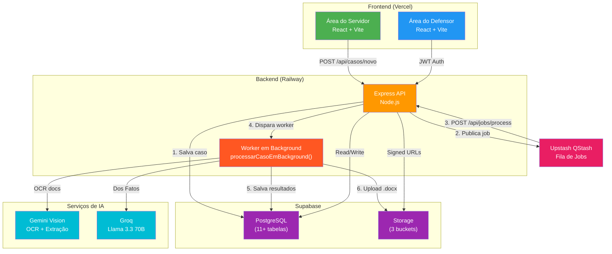
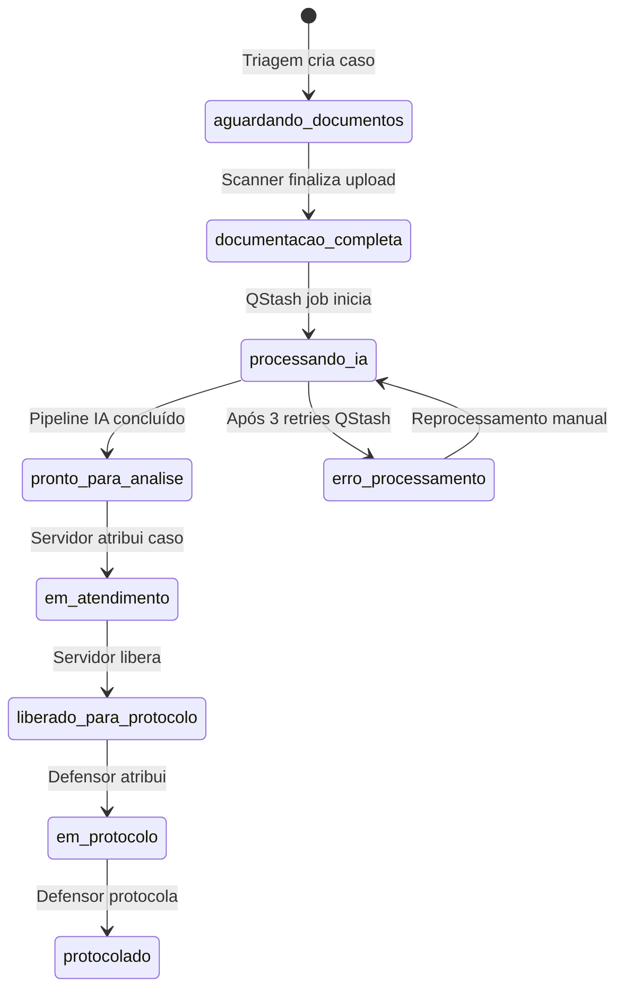
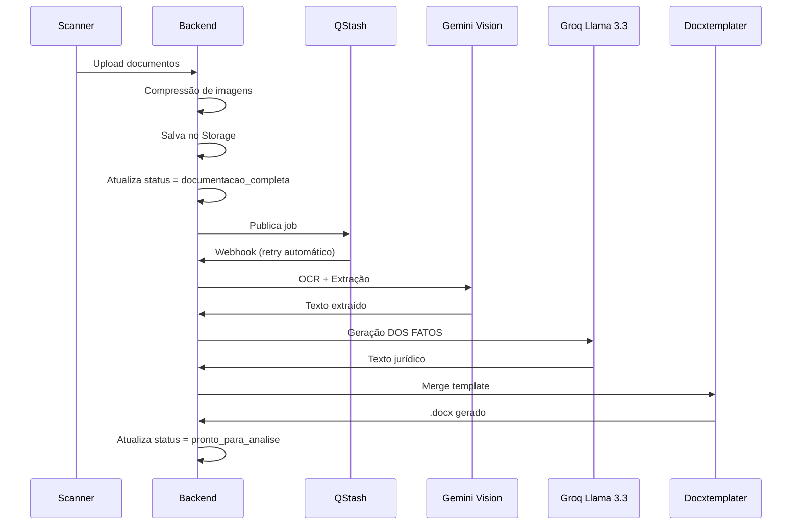
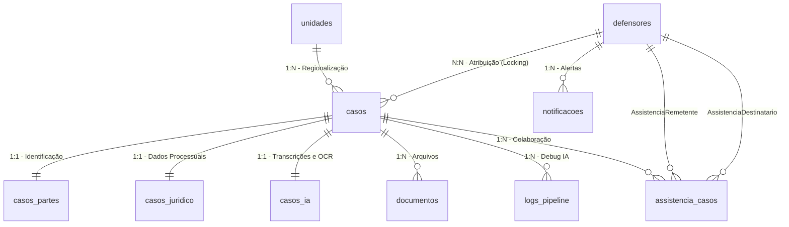

# MEGA CONTEXTO - MÃES EM AÇÃO

Este documento contém a compilação de todas as referências de arquitetura, regras de negócio, guias e histórico do projeto Mães em Ação para que o assistente de IA tenha contexto completo, não ignore nenhum detalhe e não gere código que quebre os padrões estabelecidos.

---


---

# ==========================================
# CONTEXTO INJETADO: ARCHITECTURE.md
# ==========================================

# Arquitetura do Sistema — Mães em Ação · DPE-BA

> **Versão:** 5.0 · **Atualizado em:** 2026-04-30 (Announcements + Unit Soft-Lock + Guide Integration)
> **Contexto:** Mutirão estadual da Defensoria Pública da Bahia

---

## 1. Visão Geral

O **Mães em Ação** é um sistema Full Stack desenvolvido para apoiar o mutirão estadual da Defensoria Pública da Bahia, cobrindo **35 a 52 sedes simultaneamente** durante **~5 dias úteis**. O sistema automatiza triagem, processamento de documentos via IA e geração de petições de Direito de Família para mães solo e em situação de vulnerabilidade.

**Diferença crítica:** Projetado para escalar de ~17 casos (versão anterior) para centenas de casos em poucos minutos, exigindo arquitetura robusta e processamento assíncrono.

---

## 2. Stack Tecnológica

### Frontend
- **React 18 + Vite** → Vercel (SPA estática)
- **Vanilla CSS** → Estilização personalizada via `index.css` (Tailwind v4 + Design Tokens)
- **React Router** → Navegação SPA

### Backend
- **Node.js + Express** → Railway Pro
- **ES Modules** → `"type": "module"` no `package.json`
- **Prisma ORM** → Abstração do banco (equipe/RBAC)
- **Supabase JS Client** → Core de casos e pipeline IA
- **Multer** → Upload de arquivos

### Banco de Dados
- **Supabase Pro** (PostgreSQL, sa-east-1) — projeto ISOLADO da versão anterior
- **Schema v1.0** → 11+ tabelas normalizadas (incluindo `assistencia_casos`, `notificacoes`)
- **Índices estratégicos** → CPF, protocolo, status, unidade

### Storage
- **Supabase Storage** (S3-compatible) — apenas signed URLs (1h de validade), nunca públicas
- **3 Buckets:** `audios`, `documentos`, `peticoes`
- **Compressão de imagens** → Redução automática antes do upload

### Fila & Processamento
- **Upstash QStash** — Fila de jobs assíncronos
- **Retry automático** → 3 tentativas com backoff de 30s
- **Fallback local** → `setImmediate()` quando QStash indisponível

### IA & OCR
- **Gemini Vision (Google)** → OCR primário para documentos (Opcional/Desativado no mutirão por performance)
- **Groq Llama 3.3 70B** → Geração de texto jurídico (DOS FATOS)
- **Fallbacks:** Gemini Flash (texto) para contingência

### Autenticação
- **JWT** gerado no próprio backend Express (não Supabase Auth)
- **Payload:** `{ id, nome, email, cargo, unidade_id }`
- **Expiração:** 12h (cobre um dia de mutirão)
- **Servidores do balcão:** `X-API-Key` (string aleatória 64 chars)
- **Download Ticket JWT:** token de curta duração com `purpose: "download"`. **Hardened:** Agora exige `casoId` explícito no payload e validação estrita contra o parâmetro da rota (bloqueio de IDOR).

---

## 3. Diagrama de Módulos



---

## 4. Fluxo Operacional (4 Etapas)

### Etapa 1 — Triagem (Atendente Primário)

- Busca por CPF na `BuscaCentral.jsx` → verifica cadastro existente
- Se CPF com caso existente → detecta vínculo de irmãos (pré-preenche dados do representante)
- Preenche qualificação da assistida + dados do requerido + relato informal em `TriagemCaso.jsx`
- Seleciona tipo de ação no seletor configuração-driven (`familia.js`)
- Define se vai "Anexar Agora" ou "Deixar para Scanner"
- Status inicial: `aguardando_documentos` + protocolo gerado

### Etapa 2 — Scanner (Servidor B / Balcão)

- **Página Dedicada:** `ScannerBalcao.jsx` (novo, commit `3c9bb9e`)
- **Endpoint Dedicado:** `/api/scanner/upload` — otimizado para alto volume
- Busca por CPF ou protocolo
- Dropzone única — todos os documentos de uma vez
- Backend comprime imagens > 1.5MB antes de salvar no Storage
- Ao finalizar: status → `documentacao_completa`, job publicado no QStash
- Frontend retorna 200 imediatamente — IA processa em background

### Etapa 3 — Atendimento Jurídico (Servidor Jurídico)

- Filtra fila por `pronto_para_analise` + sua `unidade_id`
- **Locking Nível 1:** Atribuição via botão "Travar Atendimento"
- Revisa relato, DOS FATOS gerado, documentos
- **Múltiplas Minutas:** IA gera Prisão + Penhora simultaneamente (se dívida ≥ 3 meses)
- Pode editar e clicar "Regerar com IA"
- Ao concluir: status → `liberado_para_protocolo`

### Etapa 4 — Protocolo (Defensor)

- Filtra casos com status `liberado_para_protocolo`
- **Locking Nível 2:** Atribuição explícita (`defensor_id` + `defensor_at`)
- Protocola no SOLAR ou SIGAD
- Salva `numero_processo` + upload da capa
- **Manual Unlock:** Botão "Liberar Caso" devolve o processo à fila global
- Status → `protocolado`

---

## 5. Máquina de Estados



### Locking — Sessões e Concorrência

- **Nível 1 (Servidor/Estagiário/Defensor/Coordenador):** Atribuição de `servidor_id` — bloqueia edição de dados jurídicos e relato. Ativo em `pronto_para_analise` e `em_atendimento`.
- **Nível 2 (Defensor/Coordenador/Admin):** Atribuição de `defensor_id` — bloqueia etapa de protocolo e finalização. Ativo em `liberado_para_protocolo` e `em_protocolo`. **`servidor` e `estagiario` NUNCA adquirem Nível 2.**
- **Isolamento de Unidade:** Middleware `requireSameUnit` bloqueia IDOR. **Admin e Gestor** possuem bypass global.
- **HTTP 423 (Locked):** Retorno padrão quando outro usuário detém o lock.
- **Unlock Privilegiado:** Administradores, Gestores e Coordenadores podem forçar destravamento via painel.
- **Distribuição Protegida:** Apenas `admin`, `gestor` e `coordenador` podem distribuir casos. Servidores e estagiários são bloqueados com HTTP 403.
- **Concorrência Atômica (Fallback Prisma):** Operações críticas de status (como distribuição) utilizam `updateMany` com cláusula `where` composta (ID + Status Permitido) para evitar condições de corrida (Race Conditions). Retorna HTTP 409 em caso de conflito.
- **Auto-release:** Lock liberado após 30min de inatividade.
- **Sistema de Avisos (Announcements):** Administradores podem emitir comunicados globais ou por unidade via `configuracoes_sistema`. Exibidos no topo de todas as áreas do sistema.
- **Soft-Lock de Unidade (Inactive State):** Unidades marcadas como `ativo: false` impedem a criação de novos casos e restringem o acesso operacional de membros vinculados, servindo como modo de manutenção ou encerramento de sede.

---

## 6. Banco de Dados (Schema Normalizado — v2.1)

### Principais Tabelas

| Tabela | Descrição | Relacionamentos |
|:-------|:----------|:----------------|
| `casos` | Núcleo do sistema | FK: unidades, defensores |
| `casos_partes` | Qualificação das partes | 1:1 com casos |
| `casos_juridico` | Dados jurídicos específicos | 1:1 com casos |
| `casos_ia` | Resultados de IA e URLs Duplas | 1:1 com casos |
| `documentos` | Arquivos enviados | N:1 com casos |
| `assistencia_casos` | Registro de colaboração/compartilhamento | N:N com casos e defensores |
| `unidades` | Sedes da DPE-BA | 1:N com casos |
| `defensores` | Usuários do sistema | N:1 com casos |
| `cargos` | Permissões por cargo | N:1 com defensores |
| `permissoes` | Sistema de RBAC | N:N com cargos |
| `notificacoes` | Alertas do sistema | N:1 com defensores |
| `logs_auditoria` | Auditoria de ações | N:1 com defensores, casos |
| `logs_pipeline` | Logs do pipeline IA | N:1 com casos |

### Campos Chave na Tabela `casos` (v2.1)

Além dos campos existentes, os seguintes campos foram adicionados nas fases recentes:

| Campo | Tipo | Descrição |
|:------|:-----|:----------|
| `compartilhado` | `Boolean` | `true` se o caso possui assistência colaborativa ativa |
| `agendamento_data` | `Timestamptz` | Data/hora do agendamento |
| `agendamento_link` | `String` | Link ou endereço do agendamento |
| `agendamento_status` | `String` | `"agendado"` ou `"pendente"` |
| `chave_acesso_hash` | `String` | Hash SHA-256 da chave de acesso pública |
| `feedback` | `String` | Feedback do defensor sobre o caso |
| `finished_at` | `Timestamptz` | Quando o caso foi finalizado/encaminhado |
| `url_capa_processual` | `String` | URL da capa processual no Storage |
| `assistencia_casos` | `Relation` | Vínculo N:N com `assistencia_casos` |

### Modelo `defensores` (v2.1)

| Campo novo | Descrição |
|:-----------|:----------|
| `supabase_uid` | UID do Supabase Auth (opcional, para integração futura) |
| `senha_hash` | Agora opcional (`String?`) — permite gestão externa de autenticação |
| `notificacoes` | Relação com nova tabela `notificacoes` |
| `assistencia_recebida` / `assistencia_enviada` | Relações de colaboração |

### Índices Estratégicos

```sql
-- Buscas frequentes
CREATE INDEX idx_casos_protocolo ON casos (protocolo);
CREATE INDEX idx_casos_status ON casos (status);
CREATE INDEX idx_casos_unidade_status ON casos (unidade_id, status);

-- Locking
CREATE INDEX idx_casos_lock_servidor ON casos (servidor_id);
CREATE INDEX idx_casos_lock_defensor ON casos (defensor_id);

-- Busca por CPF (query mais frequente)
CREATE INDEX idx_partes_cpf_assistido ON casos_partes (cpf_assistido);
CREATE INDEX idx_partes_representante_cpf ON casos_partes (representante_cpf);

-- BI e Performance (v3.0)
CREATE INDEX idx_casos_bi_status ON casos (arquivado, status);
CREATE INDEX idx_casos_bi_unidade_status ON casos (arquivado, unidade_id, status);
CREATE INDEX idx_casos_bi_tipo ON casos (arquivado, tipo_acao);
CREATE INDEX idx_casos_bi_processed_at ON casos (processed_at);
```

---

## 7. Sistema de Templates (docxtemplater)

### Modelos Disponíveis

| Modelo | Uso | Campos Principais |
|:-------|:---|:------------------|
| `executacao_alimentos_penhora.docx` | Execução de Alimentos — Rito da Penhora | {NOME_EXEQUENTE}, {data_nascimento_exequente}, {emprego_exequente} |
| `executacao_alimentos_prisao.docx` | Execução de Alimentos — Rito da Prisão | {NOME_EXECUTADO}, {emprego_executado}, {telefone_executado} |
| `executacao_alimentos_cumulado.docx` | Execução de Alimentos — Rito Cumulado | Todos os campos combinados |
| `cumprimento_penhora.docx` | Cumprimento de Sentença — Rito da Penhora | {valor_causa}, {valor_causa_extenso}, {data_pagamento} |
| `cumprimento_prisao.docx` | Cumprimento de Sentença — Rito da Prisão | {porcetagem_salario}, {data_inadimplencia}, {dados_conta} |
| `cumprimento_cumulado.docx` | Cumprimento de Sentença — Rito Cumulado | Todos os campos combinados |
| `fixacao_alimentos1.docx` | Fixação de Alimentos | {nome_representacao}, {endereço_exequente}, {email_exequente} |
| `termo_declaracao.docx` | Termo de Declaração | {relato_texto}, {protocolo} |

> **Nota:** Todos os templates foram revisados na sessão de 2026-04-22. Arquivos de lock temporários do LibreOffice (`.~lock.*.docx#`) foram removidos do repositório. A substituição manual de minutas via `POST /:id/upload-minuta` permite sobreescrever versões geradas pela IA.

---

## 8. Pipeline de IA (Assíncrono via QStash)

### Fluxo de Processamento



### Fallbacks

- **Gemini 429/500** → QStash retry automático (transparente)
- **Gemini 500** → status `erro_processamento` + alerta painel admin
- **Groq falha** → Gemini Flash como fallback de texto
- **Dos Fatos falha** → `buildFallbackDosFatos()` — texto templateado sem IA
- **QStash indisponível** → `setImmediate()` para processamento local síncrono

---

## 9. Segurança

### Regras Inegociáveis

- **Storage:** apenas `signed URLs` com expiração de 1 hora
- **Logs:** nunca registrar CPF, nome ou dados pessoais — apenas `caso_id`, `acao`, timestamps
- **Região:** sa-east-1 (Brasil) exclusivamente
- **JWT:** gerado no backend com `jsonwebtoken`, secret no Railway, expiração 12h
- **API Key servidores:** header `X-API-Key`, string aleatória 64 chars
- **Download Ticket:** `POST /:id/gerar-ticket-download` gera JWT `{ purpose: "download", caso_id }` para downloads sem expor o token principal nas URLs de download direto

### Permissões por Cargo (RBAC)

| Cargo | Leitura | Escrita | Protocolo/Finalizar | Admin/Global | Unlock | Gerenciar Equipe |
|:------|:--------|:--------|:--------------------|:-------------|:-------|:-----------------|
| `admin` | ✅ | ✅ | ✅ | ✅ | ✅ | ✅ |
| `gestor` | ✅ | ✅ | ✅ | ✅ | ✅ | ✅ |
| `coordenador` | ✅ | ✅ | ✅ | ❌ | ✅ | ✅ |
| `defensor` | ✅ | ✅ | ✅ | ❌ | ❌ | ❌ |
| `servidor` | ✅ | ✅ | ❌ | ❌ | ❌ | ❌ |
| `estagiario` | ✅ | ✅ | ❌ | ❌ | ❌ | ❌ |

> **Middleware:** `requireWriteAccess` usa whitelist positiva: apenas `admin`, `gestor`, `coordenador`, `defensor`, `servidor`, `estagiario` passam.
> **Isolamento de Unidade:** Middleware `requireSameUnit` bloqueia IDOR. Admins e Gestores possuem bypass global. **Novidade:** A busca por CPF e a distribuição de casos agora validam a unidade do profissional, restringindo o acesso apenas à sede de atuação (salvo bypass global).
> **Distribuição de Casos (L1/L2):** O sistema agora valida o cargo do usuário alvo na distribuição. Atendimentos (L1) podem ser distribuídos para qualquer cargo operacional. Protocolos (L2) são restritos a Defensores, Coordenadores, Gestores e Admins.
> **RBAC Case-Insensitive:** Todas as verificações de cargo no backend agora utilizam `.toLowerCase()` para garantir consistência entre o banco de dados e a lógica de aplicação, evitando bloqueios indevidos por capitalização.
> **Power User Bypass:** O cargo `gestor` foi adicionado ao bypass de lock na função `carregarCasoDetalhado`, permitindo auditoria e downloads administrativos de casos bloqueados por outros usuários.
> **Sistema de Avisos:** Permite broadcast de avisos críticos. Integrado ao `ConfiguracoesSistema.jsx` no frontend.

---

## 10. Sistema de Colaboração (Compartilhamento de Casos)

### Tabela `assistencia_casos`

Registra o histórico completo de colaborações entre defensores:

| Campo | Tipo | Descrição |
|:------|:-----|:----------|
| `caso_id` | `BigInt` | FK para `casos` |
| `remetente_id` | `UUID` | Defensor que iniciou o compartilhamento |
| `destinatario_id` | `UUID` | Defensor que recebeu o caso |
| `acao` | `String` | Tipo de ação: `"compartilhado"`, `"aceito"`, `"recusado"` |
| `created_at` | `Timestamptz` | Timestamp da ação |

### Flag `compartilhado`

- `casos.compartilhado = true` indica que o caso possui assistência ativa
- Visibilidade no Dashboard: defensores não envolvidos NÃO vêem casos compartilhados de outras unidades (privacidade por design)
- Notificação automática gerada ao compartilhar (`tipo: "assistencia"`)

---

## 11. Frontend — Estrutura Modular (Atual)

### Área do Servidor

```
frontend/src/areas/servidor/
├── components/
│   ├── StepTipoAcao.jsx
│   ├── StepDadosPessoais.jsx      ← Suporta multi-casos (pré-fill representante)
│   ├── StepRequerido.jsx
│   ├── StepDetalhesCaso.jsx
│   ├── StepRelatoDocs.jsx
│   ├── StepDadosProcessuais.jsx
│   └── secoes/                    ← Seções específicas por tipo de ação
│       ├── SecaoCamposGeraisFamilia.jsx
│       ├── SecaoDadosDivorcio.jsx
│       ├── SecaoValoresPensao.jsx
│       └── SecaoProcessoOriginal.jsx
├── hooks/
│   ├── useFormHandlers.js         ← Event handlers, formatação, áudio
│   ├── useFormValidation.js       ← Validação CPF, campos obrigatórios
│   └── useFormEffects.js          ← Rascunho, prefill, health check
├── services/
│   └── submissionService.js       ← Validação + envio para API
├── state/
│   └── formState.js               ← initialState + formReducer
├── utils/
│   └── formConstants.js           ← fieldMapping, digitsOnlyFields
└── pages/
    ├── BuscaCentral.jsx            ← Busca por CPF + detecção de irmãos
    ├── TriagemCaso.jsx             ← Formulário multi-step (~280 linhas)
    ├── ScannerBalcao.jsx           ← [NOVO v2.1] Tela de scanner dedicada
    └── EnvioDoc.jsx                ← Upload avançado de documentos
```

### Área do Defensor

```
frontend/src/areas/defensor/
├── pages/
│   ├── Dashboard.jsx              ← Grid 3.0 (1fr 350px) + Sidebar de Alertas
│   ├── Casos.jsx                  ← Listagem com filtros
│   ├── DetalhesCaso.jsx           ← Detalhe completo + ações
│   ├── GerenciarEquipe.jsx        ← CRUD membros + CRUD unidades
│   └── CasosArquivados.jsx        ← Arquivo de casos encerrados
└── contexts/
    └── AuthContext.jsx            ← JWT, cargo, unidade
```

### Configuração Declarativa de Ações (`familia.js`)

A pasta `frontend/src/config/formularios/acoes/` contém arquivos de configuração que determinam **quais campos** são exibidos, obrigatórios ou ocultados para cada tipo de ação. O formulário não possui lógica hardcoded — apenas consome a configuração.

Flags chave:
- `exigeDadosProcessoOriginal` — exibe campos do processo originário (e ativa validação de `valor_debito` + `calculo_arquivo`)
- `ocultarDadosRequerido` — oculta seção da parte contrária
- `labelAutor` — rótulo do autor (Mãe, Assistida, etc.)
- `ocultarDetalhesGerais` — oculta seção de campos gerais redundantes (fixação de alimentos)

---

## 12. Docker & Portabilidade

### Configuração Docker

```yaml
services:
  db:
    image: postgres:17
    ports: ["5432:5432"]

  backend:
    build: ./backend
    environment:
      DATABASE_URL: postgresql://maes:maes123@db:5432/maes_em_acao
      DIRECT_URL: postgresql://maes:maes123@db:5432/maes_em_acao
    ports: ["8001:8001"]
    depends_on: [db]

  frontend:
    build: ./frontend
    environment:
      VITE_API_URL: http://localhost:8001/api
    ports: ["3000:3000"]
    depends_on: [backend]
```

> **Nota:** `DIRECT_URL` é necessário no Prisma quando se usa o pooler do Supabase (Supabase Transaction Mode). Para Docker local, pode ser igual à `DATABASE_URL`.

---

## 13. Monitoramento & Logs

### Dois níveis de rastreabilidade

1. **`logs_auditoria`** → Rastreia ações humanas (quem fez o quê e quando)
2. **`logs_pipeline`** → Rastreia falhas técnicas na IA (etapa, erro, timestamp)
3. **`coverage_summary`** → O sistema agora gera um reporter `json-summary` no Jest (backend) e Vitest (frontend) para facilitar a integração com dashboards de qualidade no CI/CD.

> [!CAUTION]
> **LGPD:** NUNCA grave CPFs, nomes ou dados pessoais nas colunas de `detalhes` dos logs. Use apenas IDs e referências genéricas. A distribuição de casos foi auditada para remover PII dos metadados de auditoria.

---

## 14. Deploy & Produção

### Ambientes

- **Desenvolvimento:** Docker local + Prisma
- **Produção:** Railway Pro (backend) + Vercel (frontend) + Supabase Pro (banco/storage)

### Variáveis de Ambiente Essenciais

```bash
# Backend
SUPABASE_URL=https://xyz.supabase.co
SUPABASE_SERVICE_KEY=eyJ...
DATABASE_URL=postgresql://...       # Supabase pooler (para Prisma)
DIRECT_URL=postgresql://...         # Supabase direct (para migrations)
GEMINI_API_KEY=AIza...
GROQ_API_KEY=gsk_...
QSTASH_TOKEN=...
QSTASH_CURRENT_SIGNING_KEY=...
QSTASH_NEXT_SIGNING_KEY=...
JWT_SECRET=64_chars_random_string
API_KEY_SERVIDORES=64_chars_random
SALARIO_MINIMO_ATUAL=1621.00
ALLOWED_ORIGINS=https://maesemacao.defsulbahia.com.br,https://maes-acao.vercel.app

# Frontend
VITE_API_URL=https://api.mutirao.dpe.ba.gov.br
```

---

# ==========================================
# CONTEXTO INJETADO: BUSINESS_RULES.md
# ==========================================

# Regras de Negócio — Mães em Ação · DPE-BA

> **Versão:** 4.0 · **Atualizado em:** 2026-04-30 (Custody Validation + Unit Inactive State + SOLAR Export)  
> **Fonte:** Análise da codebase (controllers, services, middleware, config)  
> **Propósito:** Referência canônica para treinamento de IAs e orientação de defensores

---

## 1. Tipos de Ação (`tipo_acao`)

O campo `tipo_acao` da tabela `casos` determina qual template DOCX e qual prompt de IA serão utilizados. As chaves internas (`acaoKey`) são mapeadas no **dicionário de ações** (`dicionarioAcoes.js`).

### 1.1 Mapeamento completo

| 1 | `fixacao_alimentos` | `fixacao_alimentos1.docx` | ✅ Ativo (Família) | Vara de Família |
| 2 | `execucao_alimentos` | `executacao_alimentos_penhora.docx` | ✅ Ativo (Família - Multi) | Vara de Família |
| 3 | `termo_declaracao` | `termo_declaracao.docx` | ✅ Ativo (Apoio) | — |
| 4 | `default` | `fixacao_alimentos1.docx` | ❌ Fallback | — |

> **Nota:** As chaves `exec_penhora`, `exec_prisao`, `exec_cumulado` etc., são consideradas legadas ou sub-tipos internos. O frontend utiliza prioritariamente as chaves acima.

> **Regra de fallback:** Se `acaoKey` está vazio ou não existe no dicionário, a config `default` é usada com log de aviso.

### 1.2 Descrição jurídica de cada tipo

| Tipo | Descrição | Quando é aplicável |
|:-----|:----------|:-------------------|
| **Fixação de Alimentos** | Ação para obrigar o genitor a pagar pensão alimentícia aos filhos. | Quando a criança/adolescente não recebe contribuição financeira regular do genitor ausente. |
| **Execução de Alimentos — Prisão** | Cumprimento de sentença que já fixou alimentos, sob pena de prisão civil. | Quando já existe uma decisão judicial fixando alimentos que não está sendo cumprida (inadimplente nos últimos 3 meses). |
| **Execução de Alimentos — Penhora** | Cumprimento de sentença com penhora de bens ou desconto em folha. | Quando já existe decisão judicial fixando alimentos e o devedor possui bens ou emprego formal para penhora. |
| **Execução Cumulada** | Execução com ambos os ritos (prisão e penhora). | Quando se busca tanto a prisão quanto a penhora de bens. |
| **Cumprimento de Sentença — Penhora** | Cumprimento de sentença definitiva com penhora. | Quando há sentença transitada em julgado. |
| **Cumprimento de Sentença — Prisão** | Cumprimento de sentença definitiva com prisão. | Quando há sentença transitada em julgado e inadimplência. |
| **Cumprimento Cumulado** | Cumprimento com ambos os ritos. | Quando se busca tanto a prisão quanto a penhora em sentença definitiva. |
| **Alimentos Gravídicos** | Alimentos durante a gestação. | Quando a genitora necessita de alimentos durante a gravidez. |
| **Termo de Declaração** | Documento que formaliza o relato do assistido perante a Defensoria. | Gerado sob demanda pelo defensor para formalizar o depoimento do assistido. Não é uma ação judicial. |

### 1.3 Determinação da `acaoKey`

A chave da ação é extraída no backend pela seguinte lógica de prioridade:

```
acaoKey = dados_formulario.acaoEspecifica
       || dados_formulario.tipoAcao.split(" - ")[1]?.trim()
       || dados_formulario.tipoAcao.trim()
       || ""
```

O campo `tipoAcao` pode vir do frontend no formato `"Família - fixacao_alimentos"`, onde a parte após o `" - "` é a chave do dicionário.

### 1.4 Mapeamento de Varas (`varasMapping.js`)

O `tipo_acao` (versão descritiva, ex: "Fixação de Pensão Alimentícia") é mapeado para a vara competente:

| Rótulo descritivo | Vara |
|:-------------------|:-----|
| Fixação de Pensão Alimentícia | Vara de Família |
| Divórcio Litigioso / Consensual | Vara de Família |
| Reconhecimento e Dissolução de União Estável | Vara de Família |
| Dissolução Litigiosa de União Estável | Vara de Família |
| Guarda de Filhos | Vara de Família |
| Execução de Alimentos Rito Penhora/Prisão | Vara de Família |
| Revisão de Alimentos (Majoração/Redução) | Vara de Família |

> **Escopo:** Ações de Sucessões (Alvará, Post Mortem) foram removidas do escopo do mutirão Mães em Ação.

> Se o tipo não for encontrado no mapeamento, retorna `"[VARA NÃO ESPECIFICADA]"`.

---

## 2. Estrutura do `dados_formulario` (JSONB)

O campo `dados_formulario` na tabela `casos` armazena todos os dados coletados no formulário multi-step do cidadão. É um objeto JSONB com chaves variáveis conforme o tipo de ação.

### 2.1 Campos universais (presentes em todos os tipos)

| Chave | Tipo | Obrigatório | Descrição |
|:------|:-----|:------------|:----------|
| `nome` | `string` | ✅ | Nome completo do assistido |
| `cpf` | `string` | ✅ | CPF do assistido (validado algoritmicamente) |
| `telefone` | `string` | ✅ | Telefone de contato |
| `whatsapp_contato` | `string` | ❌ | WhatsApp do assistido |
| `tipoAcao` | `string` | ✅ | Tipo de ação selecionado (ex: `"Família - fixacao_alimentos"`) |
| `acaoEspecifica` | `string` | ❌ | Chave limpa do dicionário (ex: `"fixacao_alimentos"`) |
| `relato` | `string` | ❌ | Relato textual do assistido |
| `documentos_informados` | `string (JSON)` | ❌ | Array serializado de nomes de documentos |
| `document_names` | `object` | ❌ | Mapa `{ nomeArquivo: rotuloAmigavel }` (gerado/atualizado pelo backend) |

### 2.2 Campos do assistido (requerente/autor)

| Chave | Tipo | Obrigatório | Descrição |
|:------|:-----|:------------|:----------|
| `assistido_eh_incapaz` | `"sim" \| "nao"` | ❌ | Se o assistido é incapaz (criança/adolescente representado) |
| `assistido_data_nascimento` | `string (YYYY-MM-DD)` | ❌ | Data de nascimento do assistido |
| `assistido_nacionalidade` | `string` | ❌ | Nacionalidade |
| `assistido_estado_civil` | `string` | ❌ | Estado civil |
| `assistido_ocupacao` | `string` | ❌ | Profissão/ocupação |
| `assistido_rg_numero` | `string` | ❌ | Número do RG |
| `assistido_rg_orgao` | `string` | ❌ | Órgão emissor do RG |
| `endereco_assistido` | `string` | ❌ | Endereço completo |
| `email_assistido` | `string` | ❌ | E-mail de contato |
| `dados_adicionais_requerente` | `string` | ❌ | Informações complementares sobre o requerente |
| `situacao_financeira_genitora` | `string` | ❌ | Descrição da situação financeira da genitora |

### 2.3 Campos do representante legal

Preenchidos quando `assistido_eh_incapaz === "sim"` (a mãe/pai representando o(s) filho(s)).

| Chave | Tipo | Obrigatório (quando incapaz) | Descrição |
|:------|:-----|:-----------------------------|:----------|
| `representante_nome` | `string` | ✅ | Nome do representante legal |
| `representante_nacionalidade` | `string` | ❌ | Nacionalidade |
| `representante_estado_civil` | `string` | ❌ | Estado civil |
| `representante_ocupacao` | `string` | ❌ | Profissão |
| `representante_cpf` | `string` | ✅ | CPF do representante (obrigatório) |
| `representante_rg_numero` | `string` | ❌ | RG número |
| `representante_rg_orgao` | `string` | ❌ | RG órgão emissor |
| `representante_endereco_residencial` | `string` | ❌ | Endereço residencial |
| `representante_endereco_profissional` | `string` | ❌ | Endereço profissional |
| `representante_email` | `string` | ❌ | E-mail |
| `representante_telefone` | `string` | ❌ | Telefone |

### 2.4 Campos da parte contrária (requerido/executado)

| Chave | Tipo | Obrigatório | Descrição |
|:------|:-----|:------------|:----------|
| `nome_requerido` | `string` | ❌ | Nome do requerido |
| `cpf_requerido` | `string` | ❌ | CPF do requerido (validado, mas gera apenas **aviso** — não bloqueia) |
| `endereco_requerido` | `string` | ❌ | Endereço residencial |
| `dados_adicionais_requerido` | `string` | ❌ | Informações adicionais |
| `requerido_nacionalidade` | `string` | ❌ | Nacionalidade |
| `requerido_estado_civil` | `string` | ❌ | Estado civil |
| `requerido_ocupacao` | `string` | ❌ | Profissão |
| `requerido_endereco_profissional` | `string` | ❌ | Endereço profissional |
| `requerido_email` | `string` | ❌ | E-mail |
| `requerido_telefone` | `string` | ❌ | Telefone |
| `requerido_tem_emprego_formal` | `string` | ❌ | Se possui emprego formal |
| `empregador_requerido_nome` | `string` | ❌ | Nome do empregador |
| `empregador_requerido_endereco` | `string` | ❌ | Endereço do empregador |
| `empregador_email` | `string` | ❌ | E-mail do empregador |

### 2.5 Campos específicos por tipo de ação

#### Fixação/Revisão de Alimentos

| Chave | Tipo | Descrição |
|:------|:-----|:----------|
| `valor_mensal_pensao` | `string \| number` | Valor mensal pretendido |
| `dia_pagamento_requerido` | `string` | Dia do mês para pagamento |
| `dados_bancarios_deposito` | `string` | Dados bancários para depósito |
| `filhos_info` | `string` | Informações sobre filhos |
| `descricao_guarda` | `string` | Descrição da situação de guarda |
| `outros_filhos_detalhes` | `string (JSON)` | Array serializado com `{ nome, cpf, dataNascimento, rgNumero, rgOrgao, nacionalidade }` |

#### Execução de Alimentos

| Chave | Tipo | Descrição |
|:------|:-----|:----------|
| `numero_processo_originario` | `string` | Número do processo que fixou os alimentos |
| `vara_originaria` | `string` | Vara do processo original |
| `percentual_ou_valor_fixado` | `string` | Percentual ou valor fixado na decisão |
| `dia_pagamento_fixado` | `string` | Dia de pagamento conforme decisão |
| `periodo_debito_execucao` | `string` | Período de inadimplência |
| `valor_total_debito_execucao` | `string \| number` | Valor total do débito |
| `valor_total_extenso` | `string` | Valor por extenso |
| `valor_debito_extenso` | `string` | Valor do débito por extenso |
| `processo_titulo_numero` | `string` | Número do título executivo |
| `percentual_definitivo_salario_min` | `string` | Percentual do salário mínimo |
| `percentual_definitivo_extras` | `string` | Percentual para despesas extras |

#### Divórcio

| Chave | Tipo | Descrição |
|:------|:-----|:----------|
| `data_inicio_relacao` | `string (YYYY-MM-DD)` | Data de início do relacionamento |
| `data_separacao` | `string (YYYY-MM-DD)` | Data da separação de fato |
| `bens_partilha` | `string` | Descrição dos bens a partilhar |
| `regime_bens` | `string` | Regime de bens do casamento |
| `retorno_nome_solteira` | `string` | Se deseja retornar ao nome de solteira |
| `alimentos_para_ex_conjuge` | `string` | Se solicita alimentos para ex-cônjuge |

#### Guarda

| Chave | Tipo | Descrição |
|:------|:-----|:----------|
| `descricao_guarda` | `string` | Situação atual da guarda |
| `filhos_info` | `string` | Informações sobre os filhos |

#### Campos calculados pelo backend (inseridos no processamento)

| Chave | Origem | Descrição |
|:------|:-------|:----------|
| `percentual_salario_minimo` | `calcularPercentualSalarioMinimo()` | `(valor_mensal_pensao / SALARIO_MINIMO_ATUAL) * 100` |
| `salario_minimo_formatado` | env `SALARIO_MINIMO_ATUAL` (padrão: R$ 1.621,00) | Valor do salário mínimo vigente formatado |
| `valor_causa` | `calcularValorCausa()` | `valor_mensal_pensao × 12` (anualizado) |

### 2.6 Estrutura de `outros_filhos_detalhes`

Quando há mais de um filho na ação, este campo contém um array JSON serializado:

```json
[
  {
    "nome": "Maria Silva Santos",
    "cpf": "12345678901",
    "dataNascimento": "2015-03-20",
    "rgNumero": "1234567",
    "rgOrgao": "SSP/BA",
    "nacionalidade": "brasileiro(a)"
  }
]
```

O primeiro filho é sempre extraído dos campos raiz (`nome`, `cpf`, `assistido_data_nascimento`). Os demais vêm deste array.

---

## 3. Regras de Validação

### 3.1 Normalização e Busca de CPF

Para garantir que a busca seja resiliente a diferentes formatos de entrada, o sistema aplica as seguintes regras:

| Regra | Descrição |
|:------|:----------|
| **Normalização** | CPFs informados na busca são limpos (removendo `.` e `-`) antes da consulta. |
| **Busca Resiliente** | O backend consulta simultaneamente o CPF "sujo" (como digitado) e o CPF "limpo" na tabela `casos_partes`. |
| **Escopo de Busca** | A busca verifica os campos `cpf_assistido` e `representante_cpf` para garantir que o caso seja encontrado independente de quem iniciou o processo. |
| **Filtro de Unidade** | **Segurança:** A busca por CPF no painel administrativo filtra resultados pela unidade do profissional logado ou casos explicitamente compartilhados com ele (salvo bypass global para Admins e Gestores). |
| **Validação** | CPF do assistido e do representante são **obrigatórios e validados** algoritmicamente (Bloqueante). |

### 3.2 Unicidade de CPF e Arquitetura Multi-Casos

| Regra | Comportamento |
|:------|:-------------|
| **Não há unicidade de CPF na tabela `casos`** | Um mesmo CPF pode ter múltiplos casos vinculados. |
| **Múltiplos Assistidos por Representante** | Uma representante (mãe) pode criar múltiplos casos distintos para filhos diferentes com requeridos diferentes, reusando seus próprios dados, mas gerando protocolos independentes. |
| O campo `protocolo` é UNIQUE | Cada caso/filho possui um protocolo único e tracking separado. |
| O campo `email` na tabela `defensores` é UNIQUE | Não é possível cadastrar dois defensores com o mesmo e-mail. |
| O campo `numero_solar` possui constraint UNIQUE | Retorna `409` se tentar vincular um número Solar já usado. |


### 3.3 Validação de arquivos

| Regra | Valor |
|:------|:------|
| Tamanho máximo por arquivo | 50 MB |
| Formatos processados por OCR | `.jpg`, `.jpeg`, `.png`, `.pdf` |
| Quantidade máxima de documentos por upload | 20 |
| Quantidade máxima de áudios | 1 |

### 3.4 Validação de senha (defensores)

| Regra | Valor |
|:------|:------|
| Tamanho mínimo da senha | 6 caracteres |
| Algoritmo de hash | bcrypt (10 salt rounds) |

### 3.5 Validação de arquivamento

| Regra | Comportamento |
|:------|:-------------|
| Motivo é obrigatório ao arquivar | Mínimo 5 caracteres; retorna `400` se ausente |
| Ao restaurar (desarquivar) | Motivo é limpo (`null`) |

### 3.6 Validação do Formulário de Triagem

| Campo | Regra | Comportamento |
|:------|:------|:--------------|
| `relato` | Obrigatório (não vazio) | Bloqueia envio se vazio — **não** há mínimo de caracteres |
| `opcao_guarda` | Obrigatório para Ações de Família | Deve selecionar uma opção de guarda/convivência se houver filhos |
| `valor_debito` | Obrigatório quando `exigeDadosProcessoOriginal = true` | Bloqueia envio para execuções sem o valor do débito |
| `calculo_arquivo` | Obrigatório quando `exigeDadosProcessoOriginal = true` e "Enviar depois" = false | Bloqueia envio de execuções sem o demonstrativo de cálculo anexado |

### 3.6 Campos que o assistido preenche vs. apenas o defensor

| Quem preenche | Campos |
|:--------------|:-------|
| **Assistido** (via formulário público) | `nome`, `cpf`, `telefone`, `whatsapp_contato`, `tipoAcao`, `relato`, `documentos_informados`, todos os campos de `dados_formulario`, documentos e áudio |
| **Assistido** (pós-submissão) | Upload de documentos complementares, solicitação de reagendamento |
| **Defensor** (via painel protegido) | `status`, `descricao_pendencia`, `numero_solar`, `numero_processo`, `agendamento_data`, `agendamento_link`, `feedback`, `arquivado`, `motivo_arquivamento` |
| **Sistema** (automático) | `protocolo`, `chave_acesso_hash`, `resumo_ia`, `peticao_inicial_rascunho`, `peticao_completa_texto`, `url_documento_gerado`, `status` (durante processamento), `processed_at`, `processing_started_at` |

---

## 4. Fluxo de Geração de Documentos

### 4.1 Pipeline de processamento em background

```
criarNovoCaso() → QStash.publishJSON() → jobController.processJob()
                                              ↓
                                    processarCasoEmBackground()
                                              ↓
                               ┌──────────────┼──────────────┐
                               ↓              ↓              ↓
                            [OCR]         [Resumo IA]    [Dos Fatos IA]
                               ↓              ↓              ↓
                          textoCompleto    resumo_ia     dosFatosTexto
                                              ↓
                                    buildDocxTemplatePayload()
                                              ↓
                                    ┌─────────┼──────────┐
                                    ↓                    ↓
                              generateDocx()    gerarTextoCompletoPeticao()
                                    ↓                    ↓
                            url_documento_gerado   peticao_completa_texto
```

### 4.2 Quando uma petição pode ser gerada

| Condição | Geração automática | Geração manual |
|:---------|:-------------------|:---------------|
| **Criação do caso** | ✅ Gerada automaticamente via processamento background | — |
| **Regerar minuta** | — | ✅ Admin pode regerar via `POST /:id/regerar-minuta` |
| **Substituir minuta** | — | ✅ Servidor pode fazer upload manual via `POST /:id/upload-minuta` |
| **Regenerar Dos Fatos** | — | ✅ Admin pode regerar via `POST /:id/gerar-fatos` |
| **Reprocessar caso** | ✅ Re-executa todo o pipeline | — |

*Nota Especial - Execução de Alimentos (v2.0):* 
O sistema agora suporta a geração e visualização simultânea de múltiplos documentos para o mesmo protocolo:
1. **Ritos Combinados:** Se a ação registrar débito superior a 3 meses, o pipeline gera automaticamente uma peça de **Prisão** e outra de **Penhora**.
2. **Termo de Declaração:** Pode ser gerado e armazenado de forma independente das peças processuais.
3. **Download Dinâmico:** O frontend exibe abas para cada documento disponível no Storage.

### 4.3 O que a IA recebe como input

#### Para o Resumo Executivo (`analyzeCase`)

- **Input:** `textoCompleto` = relato do assistido + textos extraídos via OCR de todos os documentos
- **Temperatura:** 0.3
- **Output:** Resumo com: Problema Central, Partes Envolvidas, Pedido Principal, Urgência, Área do Direito
- **Destino:** Campo `resumo_ia` do caso

#### Para a seção "Dos Fatos" (`generateDosFatos`)

- **Input:** Dados normalizados do caso (nomes, CPFs, relato, situação financeira, filhos, documentos)
- **Sanitização PII:** Antes do envio, dados sensíveis são substituídos por placeholders (`[NOME_AUTOR_1]`, `[CPF_REU]`)
- **Temperatura:** 0.3
- **Output:** Texto jurídico no estilo da Defensoria Pública da Bahia
- **Destino:** Campo `peticao_inicial_rascunho` (prefixado com `"DOS FATOS\n\n"`)

#### Prompts de IA — Regras estilísticas obrigatórias

| Regra | Detalhes |
|:------|:---------|
| **Nunca usar "menor"** | Deve usar "criança", "adolescente" ou "filho(a)" |
| **Não citar documentos no texto** | CPF, RG e datas de nascimento não devem aparecer no texto narrativo |
| **Conectivos obrigatórios** | "Insta salientar", "Ocorre que, no caso em tela", "Como é sabido", "aduzir" |
| **Formato** | Parágrafos coesos, sem tópicos/listas |
| **Estilo** | Extremamente formal, culto e padronizado (juridiquês clássico) |

### 4.4 Diferença entre os campos de petição

| Campo | Conteúdo | Quando é preenchido |
|:------|:---------|:--------------------|
| `peticao_inicial_rascunho` | Texto da seção "Dos Fatos" gerado pela IA (prefixado com `"DOS FATOS\n\n"`) | Processamento background |
| `peticao_completa_texto` | Texto completo da petição (cabeçalho + qualificação + dos fatos + pedidos + assinatura) em texto puro | Processamento background |
| `url_documento_gerado` | Caminho no Storage do `.docx` da petição inicial renderizada via Docxtemplater | Processamento background |
| `url_termo_declaracao` | Caminho no Storage do `.docx` do Termo de Declaração | Gerado sob demanda (admin) |

### 4.5 Geração do Termo de Declaração

- **Quem pode gerar:** Apenas `admin`
- **Endpoint:** `POST /:id/gerar-termo`
- **Dados utilizados:** `dados_formulario` do caso + dados do caso (`nome_assistido`, `cpf_assistido`, `relato_texto`, `protocolo`, `tipo_acao`)
- **Template:** `termo_declaracao.docx`
- **Comportamento:** Remove o arquivo anterior do Storage antes de gerar um novo (geração limpa)
- **Destino:** `url_termo_declaracao` no caso

### 4.6 Fallbacks de geração

| Componente | Fallback |
|:-----------|:---------|
| OCR (Gemini Vision) | Tesseract.js (apenas para imagens, não PDFs) |
| Geração de texto (Groq) | Gemini 2.5 Flash |
| Dos Fatos (IA) | `buildFallbackDosFatos()` — texto templateado sem IA |
| QStash (fila) | `setImmediate()` — processamento local |

---

## 5. Regras de Permissão

### 5.1 Cargos do sistema

O campo `cargo` na tabela `defensores` define o nível de acesso. O cargo é incluído no token JWT no login.

| Cargo | Leitura | Escrita | Protocolo/Finalizar | Admin/Global | Unlock | Gerenciar Equipe |
|:------|:--------|:--------|:--------------------|:-------------|:-------|:-----------------|
| `admin` | ✅ | ✅ | ✅ | ✅ | ✅ | ✅ |
| `gestor` | ✅ | ✅ | ✅ | ✅ | ✅ | ✅ |
| `coordenador` | ✅ | ✅ | ✅ | ❌ | ✅ | ✅ |
| `defensor` | ✅ | ✅ | ✅ | ❌ | ❌ | ❌ |
| `servidor` | ✅ | ✅ | ❌ | ❌ | ❌ | ❌ |
| `estagiario` | ✅ | ✅ | ❌ | ❌ | ❌ | ❌ |

> O cargo padrão ao cadastrar um novo membro é `"estagiario"`. Apenas o admin pode criar cadastros e deve selecionar entre as opções disponíveis no formulário.


### 5.2 Middleware de controle

| Middleware | Função | Aplicação |
|:-----------|:-------|:----------|
| `authMiddleware` | Verifica JWT e injeta `req.user` | Todas as rotas protegidas |
| `requireWriteAccess` | Bloqueia operações de escrita para cargos não autorizados | Todas as rotas de escrita |
| `auditMiddleware` | Registra operações de escrita na tabela `logs_auditoria` | Todas as rotas protegidas |
| `requireSameUnit` | Bloqueia acesso a casos de outras unidades (IDOR) | Rotas de detalhe/edição |

> **Middleware:** `requireWriteAccess` usa whitelist positiva. Qualquer cargo fora da lista recebe HTTP 403.
> **Isolamento de Unidade:** Usuários (exceto Admins e Gestores) são restritos a casos de sua própria `unidade_id`. Admins e Gestores possuem bypass global para visualização e edição. **Novidade:** A busca por CPF filtra resultados pela unidade do profissional ou casos compartilhados.
> **Hierarquia de Distribuição:** 
> 1. **Quem pode distribuir:** Apenas usuários com cargo `admin`, `gestor` ou `coordenador`. Outros cargos recebem HTTP 403.
> 2. **Alvos da Distribuição:** Atendimentos (L1) são abertos a todos os cargos operacionais. Casos em fase de Protocolo (L2) só podem ser distribuídos para Defensor, Coordenador, Gestor ou Admin.
> 3. **Concorrência:** A distribuição utiliza `updateMany` para garantir atomicidade. Se o status do caso mudar durante a operação, o sistema retorna `409 Conflict`.
> **RBAC Case-Insensitive:** O sistema normaliza a verificação de cargos para letras minúsculas (`.toLowerCase()`), prevenindo falhas de permissão por divergência de casing no banco de dados e garantindo integridade no controle de acesso.

### 5.3 Operações exclusivas de Admin

As seguintes operações verificam **explicitamente** cargo privilegiado no controller:

| Operação | Endpoint | Cargos Autorizados |
|:---------|:---------|:-------------------|
| Regenerar Dos Fatos | `POST /:id/gerar-fatos` | `admin` |
| Gerar Termo de Declaração | `POST /:id/gerar-termo` | `admin` |
| Regerar Minuta DOCX | `POST /:id/regerar-minuta` | `admin` |
| Reverter Finalização | `POST /:id/reverter-finalizacao` | `admin` |
| Deletar Caso | `DELETE /:id` | `admin` |
| Liberar Caso (Unlock) | `PATCH /lock/unlock` | `admin`, `gestor`, `coordenador` |
| Registrar novo membro | `POST /api/defensores/register` | `admin` |
| Listar equipe global | `GET /api/defensores` | `admin`, `gestor` |
| Listar equipe local | `GET /api/defensores` | `coordenador` (filtra por unidade) |
| Resetar senha de membro | `POST /api/defensores/:id/reset-password` | `admin` |

### 5.4 Acesso público (sem autenticação)

O assistido (cidadão) pode realizar as seguintes ações **sem login**:

| Ação | Endpoint | Autenticação |
|:-----|:---------|:-------------|
| Submeter novo caso | `POST /api/casos/novo` | Nenhuma |
| Buscar casos por CPF | `GET /api/casos/buscar-cpf` | Nenhuma |
| Upload de documentos complementares | `POST /api/casos/:id/upload-complementar` | CPF + chave de acesso (no body) |
| Solicitar reagendamento | `POST /api/casos/:id/reagendar` | CPF + chave de acesso (no body) |
| Consultar status | `GET /api/status` | CPF + chave de acesso (na query) |

> **Segurança do assistido:** A chave de acesso é hasheada com SHA-256 + salt aleatório antes de ser armazenada no banco. A verificação é feita recomputando o hash.

### 5.5 Mapeamento de status públicos

O assistido não vê os status internos do sistema. O `statusController` converte:

| Status Interno | Status Público (para o cidadão) |
|:---------------|:-------------------------------|
| `recebido` | `enviado` |
| `processando` | `em triagem` |
| `processado` | `em triagem` |
| `em_analise` | `em triagem` |
| `aguardando_docs` | `documentos pendente` |
| `reuniao_agendada` | `reuniao agendada` |
| `reuniao_online_agendada` | `reuniao online` |
| `reuniao_presencial_agendada` | `reuniao presencial` |
| `aguardando_protocolo` | `Aguardando protocolo` |
| `reagendamento_solicitado` | `em analise` |
| `encaminhado_solar` | `encaminhamento solar` |
| `erro` | `enviado` |

---

## 6. Regras de Agendamento

### 6.1 Quem pode agendar

| Ação | Quem realiza |
|:-----|:-------------|
| **Agendar reunião** | Defensor (qualquer cargo com escrita) via `PATCH /:id/agendar` |
| **Solicitar reagendamento** | Assistido (cidadão) via `POST /:id/reagendar` |

### 6.2 Tipos de agendamento

Os tipos são inferidos pelo status do caso ao qual o agendamento está vinculado:

| Status | Tipo implícito |
|:-------|:---------------|
| `reuniao_agendada` | Genérico |
| `reuniao_online_agendada` | Online (link de videoconferência) |
| `reuniao_presencial_agendada` | Presencial (endereço físico) |

> O tipo é definido pelo defensor ao mudar o status via `PATCH /:id/status`.

### 6.3 Status do agendamento (`agendamento_status`)

| Valor | Quando é definido |
|:------|:------------------|
| `agendado` | Quando `agendamento_data` **E** `agendamento_link` estão preenchidos |
| `pendente` | Quando os campos estão vazios |

### 6.4 Fluxo de reagendamento

```
1. Assistido chama POST /:id/reagendar com { motivo, data_sugerida, cpf, chave }
2. Backend valida CPF (match exato) e chave de acesso (hash)
3. Se houver agendamento anterior:
   → Salva no historico_agendamentos com status "reagendado"
   → Tipo inferido: "presencial" se status contém "presencial", senão "online"
4. Atualiza o caso:
   → status = "reagendamento_solicitado"
   → motivo_reagendamento = motivo
   → data_sugerida_reagendamento = data_sugerida
   → agendamento_data = null (libera a agenda)
   → agendamento_link = null
5. Cria notificação para o defensor (tipo: "reagendamento")
```

### 6.5 O que fica registrado em `historico_agendamentos`

| Campo | Origem |
|:------|:-------|
| `caso_id` | ID do caso |
| `data_agendamento` | Data/hora do agendamento anterior |
| `link_ou_local` | Link da chamada ou endereço do agendamento anterior |
| `tipo` | `"online"` ou `"presencial"` (inferido do status) |
| `status` | Sempre `"reagendado"` |
| `created_at` | Timestamp automático |

---

## 7. Regras de Arquivamento e Finalização

### 7.1 Finalização (Encaminhamento ao Solar)

| Aspecto | Detalhe |
|:--------|:-------|
| **Endpoint** | `POST /:id/finalizar` |
| **Quem pode** | Qualquer cargo com acesso de escrita (protected + requireWriteAccess) |
| **Dados recebidos** | `numero_solar`, `numero_processo`, arquivo `capa` (capa processual) |
| **Efeitos no banco** | `status = "encaminhado_solar"`, `numero_solar`, `numero_processo`, `url_capa_processual`, `finished_at = now()` |
| **Upload da capa** | Salva em `documentos/capas/{id}_{timestamp}_{nomeOriginal}` |

### 7.2 Reversão da Finalização

| Aspecto | Detalhe |
|:--------|:-------|
| **Endpoint** | `POST /:id/reverter-finalizacao` |
| **Quem pode** | Apenas `admin` |
| **Efeitos no banco** | `status = "processado"`, `numero_solar = null`, `numero_processo = null`, `url_capa_processual = null`, `finished_at = null` |
| **Efeitos no Storage** | Exclui o arquivo da capa processual do bucket `documentos` |

### 7.3 Arquivamento (Soft Delete)

| Aspecto | Detalhe |
|:--------|:-------|
| **Endpoint** | `PATCH /:id/arquivar` |
| **Quem pode** | Qualquer cargo com acesso de escrita |
| **Campo no banco** | `arquivado` (boolean) — ortogonal ao `status` |
| **Motivo obrigatório** | Mínimo 5 caracteres ao arquivar; limpo ao restaurar |
| **Efeito na listagem** | `listarCasos` filtra por `arquivado = false` por padrão |
| **Reversível** | ✅ Basta chamar com `{ arquivado: false }` |

### 7.4 Exclusão permanente

| Aspecto | Detalhe |
|:--------|:-------|
| **Endpoint** | `DELETE /:id` |
| **Quem pode** | Apenas `admin` |
| **Efeitos** | Exclui o registro da tabela `casos` **e** todos os arquivos vinculados nos 3 buckets (áudio, documentos, petições) |
| **Irreversível** | ✅ Não há recuperação após exclusão |

### 7.5 Reprocessamento

| Aspecto | Detalhe |
|:--------|:-------|
| **Endpoint** | `POST /:id/reprocessar` |
| **Quem pode** | Qualquer cargo com acesso de escrita |
| **Quando usar** | Quando o caso está em `status = "erro"` |
| **Comportamento** | Re-executa `processarCasoEmBackground()` com os dados originais do banco, via `setImmediate` (sem passar pelo QStash) |

---

## 8. Notificações

### 8.1 Tipos de notificação

| Tipo | Quando é gerada | Mensagem |
|:-----|:-----------------|:---------|
| `upload` | Assistido envia documentos complementares | `"Novos documentos entregues por {nome}."` |
| `reagendamento` | Assistido solicita reagendamento | `"Solicitação de reagendamento para o caso {nome}."` |

### 8.2 Regras

- Notificações são armazenadas na tabela `notificacoes` com `lida = false`
- A listagem retorna as 20 mais recentes, ordenadas por `created_at DESC`
- Qualquer usuário autenticado com acesso de escrita pode marcar como lida

---

## 9. Geração do Protocolo e Chave de Acesso

### 9.1 Formato do Protocolo

```
{AAAA}{MM}{DD}{ID_CATEGORIA}{SEQUENCIAL_6_DIGITOS}
```

| Componente | Exemplo | Origem |
|:-----------|:--------|:-------|
| Data | `20260326` | `new Date()` |
| ID Categoria | `0` | Mapa: `familia=0, consumidor=1, saude=2, criminal=3, outro=4` |
| Sequencial | `345678` | Últimos 6 dígitos de `Date.now()` |

> **Observação:** O ID da categoria é determinado pelo parâmetro `casoTipo` recebido pela função, que recebe o `tipoAcao`. A maioria das ações mapeará para `"outro"` (4), já que o mapa usa chaves genéricas (`familia`, `consumidor`, etc.) e não as chaves específicas do dicionário. `[INFERIDO]`

<!-- VALIDAR COM DEFENSOR: O campo casoTipo que alimenta o mapa de categorias (familia=0, consumidor=1...) recebe o tipoAcao do formulário. Porém, o tipoAcao tem valor como "Família - fixacao_alimentos", e não as chaves do mapa (familia, consumidor...). Isso faz com que a maioria dos protocolos caia na categoria 4 (outro). É intencional? -->

### 9.2 Formato da Chave de Acesso

```
DPB-{5_DIGITOS}-0{5_DIGITOS}
Exemplo: DPB-01234-012345
```

- Gerada com `crypto.randomBytes(3)`
- Hasheada com SHA-256 + salt aleatório de 16 bytes antes do armazenamento
- O hash é armazenado no formato `{salt}:{hash}` no campo `chave_acesso_hash`

---

## 11. Session Locking e Concorrência

Para evitar que dois usuários editem o mesmo caso simultaneamente, o sistema utiliza um mecanismo de **Session Locking** no banco de dados.

### 11.1 Níveis de Bloqueio
- **Nível 1 (Servidor):** Ativado quando um servidor acessa o caso para análise jurídica. Bloqueia outros servidores.
- **Nível 2 (Defensor):** Ativado quando um defensor inicia a etapa de protocolo no Solar/Sigad. Bloqueia outros defensores.

### 11.2 Comportamento da API
- **Bloqueio Automático:** Ao abrir o detalhe do caso, o backend tenta realizar o lock (`UPDATE WHERE owner_id IS NULL`).
- **Bloqueio Manual:** Endpoints `PATCH /lock` e `PATCH /unlock` permitem controle explícito.
- **Conflito (HTTP 423):** Se o caso já estiver bloqueado por outro usuário (id diferente), a API retorna `423 Locked` com o nome do atual responsável.

### 11.3 Liberação
- O lock é liberado automaticamente após 30 minutos de inatividade ou manualmente pelo botão **Liberar Caso**.
- **Administradores** possuem bypass e podem forçar o destravamento de qualquer sessão.

---

## 12. Inteligência de Dados (Módulo BI)

O módulo de BI é restrito exclusivamente a administradores e foca em métricas de produtividade e throughput sem comprometer dados sensíveis.

### 12.1 Princípios de LGPD no BI
- **Zero PII (Personally Identifiable Information):** As queries de BI nunca acessam as tabelas `casos_partes` ou campos de qualificação.
- **Agregação Obrigatória:** Dados são exibidos apenas em formatos agregados (contagens, médias, percentuais).
- **Exportação Segura:** O arquivo XLSX gerado para download segue as mesmas restrições de vedação de dados pessoais.

### 12.2 Métricas Monitoradas
- **Métricas de Produtividade:** Ranking de profissionais por casos protocolados e atendimentos realizados.
- **Ações de Gestão:** Histórico de auditoria de distribuições e movimentações manuais de status.
- **Exportação Padrão:** O arquivo XLSX gerado agora inclui automaticamente as abas de Produtividade e Gestão para usuários com cargo `admin` ou `gestor`.

---

## 13. Integração SOLAR (Exportação)

A exportação para o sistema SOLAR exige uma normalização estrita de endereços e filiação.

### 13.1 Normalização de Endereço
O sistema converte a string única de endereço (`endereco_assistido`) em componentes estruturados:
- `logradouro`, `numero`, `bairro`, `cidade`, `estado`, `cep`.
- Caso a estrutura falhe, o sistema envia o endereço completo no campo `logradouro` como fallback para evitar perda de dados.

### 13.2 Filiação e Dependentes
- O campo `exequentes` (JSONB) armazena todos os filhos da ação.
- Na exportação, cada exequente é mapeado com nome, CPF e data de nascimento.

---

## 14. Controle Administrativo de Unidades

### 14.1 Estado Inativo (Soft-Lock)
Unidades podem ser desativadas via painel administrativo.
- **Bloqueio de Triagem:** Novos casos não podem ser criados para unidades inativas.
- **Restrição de Acesso:** Usuários vinculados a unidades inativas recebem um aviso de "Unidade Inativa" e acesso limitado.

### 14.2 Avisos do Sistema (Announcements)
- Administradores podem cadastrar avisos globais ou específicos para unidades.
- Avisos são exibidos como banners de alta visibilidade no dashboard.


---

# ==========================================
# CONTEXTO INJETADO: DATABASE_MODEL.md
# ==========================================

# Modelo de Dados e Persistência Híbrida — Mães em Ação

> **Versão:** 4.0 · **Atualizado em:** 2026-04-30 (System Configurations + Unit Soft-Lock Metadata)
> **Fonte:** `backend/prisma/schema.prisma`

O sistema utiliza uma abordagem híbrida para persistência, combinando o **Prisma ORM** (gestão de equipe e RBAC) com o **Supabase JS Client** (core dos casos e pipeline de IA).

---

## 1. Visão Geral Híbrida

| Componente | Ferramenta | Tabelas | Justificativa |
|:-----------|:-----------|:--------|:--------------|
| **Core & IA** | Supabase JS Client | `casos`, `casos_partes`, `casos_ia`, `casos_juridico`, `documentos` | Suporte a alto volume, JSONB, RLS e Storage integrado. |
| **Equipe & RBAC** | Prisma ORM | `defensores`, `unidades`, `cargos`, `permissoes`, `notificacoes`, `logs_auditoria` | Gestão robusta de FK e tipagem segura para usuários. |
| **Colaboração** | Prisma ORM | `assistencia_casos` | Auditoria de compartilhamentos com remetente + destinatário + ação. |

---

## 2. Diagrama de Relacionamentos



---

## 3. Detalhamento de Tabelas Principais

### 3.1 Tabela `casos`

O nó central. Cada registro representa **um filho (ou assistido direto)** dentro do sistema.

| Campo | Tipo | Descrição |
|:------|:-----|:----------|
| `id` | `BigInt` | PK auto-incremental |
| `protocolo` | `String UNIQUE` | Formato: `YYYYMMDD{categoria}{seq6}` |
| `unidade_id` | `UUID` | FK para `unidades` |
| `tipo_acao` | `Enum tipo_acao` | Tipo de petição selecionado |
| `status` | `Enum status_caso` | Estado atual na fila de trabalho |
| `dados_formulario` | `JSONB` | Todos os dados do formulário |
| `compartilhado` | `Boolean` | `true` se possui assistência colaborativa ativa |
| `servidor_id` | `UUID?` | Quem detém o Locking Nível 1 |
| `defensor_id` | `UUID?` | Quem detém o Locking Nível 2 |
| `agendamento_data` | `Timestamptz?` | Data/hora de agendamento |
| `agendamento_link` | `String?` | Link ou local do agendamento |
| `agendamento_status` | `String?` | `"agendado"` ou `"pendente"` |
| `chave_acesso_hash` | `String?` | Hash SHA-256 da chave pública do assistido |
| `feedback` | `String?` | Observações do defensor |
| `finished_at` | `Timestamptz?` | Timestamp de encaminhamento ao Solar |
| `url_capa_processual` | `String?` | URL Storage da capa processual |
| `url_capa` | `String?` | URL Storage de capa adicional |
| `numero_processo` | `String?` | Número do processo no Solar/SIGAD |
| `numero_vara` | `String?` | Número da vara |
| `arquivado` | `Boolean` | Soft delete (padrão: `false`) |
| `motivo_arquivamento` | `String?` | Obrigatório ao arquivar (mín. 5 chars) |

### 3.2 Tabela `casos_partes` (1:1)

Armazena a qualificação de assistidas, requeridos e representantes.

| Campo | Tipo | Descrição |
|:------|:-----|:----------|
| `cpf_assistido` | `String` | CPF do assistido (normalizado sem pontuação) |
| `representante_cpf` | `String` | CPF da mãe/representante legal (obrigatório) |
| `nome_assistido` | `String?` | Nome do filho/assistido |
| `exequentes` | `JSONB` | Array de filhos adicionais na mesma petição |

> **Multi-casos:** Uma representante (mãe) pode criar múltiplos casos para filhos diferentes, reaproveitando seus dados via `representante_cpf`. Cada caso tem `protocolo` único.

### 3.3 Tabela `casos_juridico` (1:1)

Campos técnicos que alimentam o template DOCX.

| Campo | Tipo | Descrição |
|:------|:-----|:----------|
| `debito_valor` | `String?` | Valor do débito (armazenado como string para preservar formatação) |
| `conta_banco` | `String?` | Dados bancários formatados |

### 3.4 Tabela `casos_ia` (1:1)

Resultados do processamento assíncrono.

| Campo | Tipo | Descrição |
|:------|:-----|:----------|
| `dos_fatos_gerado` | `String?` | Texto jurídico gerado pelo Groq Llama 3.3 |
| `dados_extraidos` | `JSONB?` | Resumo do OCR (Gemini Vision) para conferência |
| `url_documento_gerado` | `String?` | URL Supabase Storage do .docx da petição |
| `url_peticao_penhora` | `String?` | URL específica para rito de penhora |
| `url_peticao_prisao` | `String?` | URL específica para rito de prisão |
| `url_termo_declaracao` | `Virtual/JSONB` | Armazenado dentro de `dados_extraidos` para evitar coluna fantasma |
| `regenerado_por` | `UUID?` | FK para `defensores` (quem regenerou a IA) |

### 3.5 Tabela `assistencia_casos` (N:N)

Auditoria de colaborações entre defensores.

| Campo | Tipo | Descrição |
|:------|:-----|:----------|
| `caso_id` | `BigInt` | FK para `casos` |
| `remetente_id` | `UUID` | Defensor que iniciou o compartilhamento |
| `destinatario_id` | `UUID` | Defensor que recebeu |
| `acao` | `String` | `"compartilhado"`, `"aceito"`, `"recusado"` |
| `created_at` | `Timestamptz` | Timestamp da ação |

### 3.6 Tabela `notificacoes`

| Campo | Tipo | Descrição |
|:------|:-----|:----------|
| `defensor_id` | `UUID` | FK para `defensores` |
| `tipo` | `String` | `"upload"`, `"reagendamento"`, `"assistencia"` |
| `mensagem` | `String` | Texto da notificação |
| `referencia_id` | `BigInt?` | ID do caso relacionado |
| `lida` | `Boolean` | Padrão: `false` |
| `created_at` | `Timestamptz` | Timestamp |

### 3.7 Tabela `defensores` (v2.1)

| Campo novo | Tipo | Descrição |
|:-----------|:-----|:----------|
| `supabase_uid` | `String? UNIQUE` | UID do Supabase Auth (para integração futura) |
| `senha_hash` | `String?` | Agora opcional — permite auth externa |

### 3.8 Tabela `configuracoes_sistema`
Armazena configurações globais e avisos do sistema.
- `chave`: PK (ex: `AVISO_GLOBAL`, `BI_BLOCK_WINDOWS`).
- `valor`: Valor da configuração (string ou JSON serializado).
- `descricao`: Texto explicativo sobre a finalidade da chave.

---

## 4. Índices Estratégicos (Performance para o Mutirão)

```sql
-- Busca resiliente por CPF
CREATE INDEX idx_partes_cpf_assistido ON casos_partes (cpf_assistido);
CREATE INDEX idx_partes_representante_cpf ON casos_partes (representante_cpf);

-- Performance das filas de trabalho
CREATE INDEX idx_casos_unidade_status ON casos (unidade_id, status);
CREATE INDEX idx_casos_protocolo ON casos (protocolo);

-- Concorrência (Locking)
CREATE INDEX idx_casos_lock_servidor ON casos (servidor_id);
CREATE INDEX idx_casos_lock_defensor ON casos (defensor_id);

-- BI e Performance (v3.0)
CREATE INDEX idx_casos_bi_status ON casos (arquivado, status);
CREATE INDEX idx_casos_bi_unidade_status ON casos (arquivado, unidade_id, status);
CREATE INDEX idx_casos_bi_tipo ON casos (arquivado, tipo_acao);
CREATE INDEX idx_casos_bi_processed_at ON casos (processed_at);
```

---

## 5. Enums do Prisma

### `status_caso`

```
aguardando_documentos → documentacao_completa → processando_ia
→ pronto_para_analise → em_atendimento → liberado_para_protocolo
→ em_protocolo → protocolado
                     ↘ erro_processamento (→ reprocessamento)
```

### `tipo_acao`

Conforme `schema.prisma`: `exec_penhora`, `exec_prisao`, `exec_cumulado`, `def_penhora`, `def_prisao`, `def_cumulado`, `fixacao_alimentos`, `alimentos_gravidicos`

### `status_job`

`pendente`, `em_processamento`, `concluido`, `erro`

---

## 6. Configuração Prisma (Supabase Pooler)

```prisma
datasource db {
  provider  = "postgresql"
  url       = env("DATABASE_URL")   // Pooler mode (Transaction)
  directUrl = env("DIRECT_URL")     // Direct connection (migrations)
}
```

> **Importante:** O `directUrl` é necessário para que o Prisma execute migrations e introspections diretamente, sem passar pelo pooler de conexões do Supabase.

---

## 7. Auditoria e Logs

O sistema mantém dois níveis de rastreabilidade:
1. **`logs_auditoria`**: Rastreia ações humanas (ex: "Defensor Fulano alterou status do caso X").
2. **`logs_pipeline`**: Rastreia falhas técnicas na IA (ex: "Erro no OCR na etapa 3: Timeout").

> [!CAUTION]
> **Privacidade (LGPD):** NUNCA grave o conteúdo de campos sensíveis (como CPFs ou Nomes) nas colunas de `detalhes` dos logs. Use apenas IDs e referências genéricas.


---

# ==========================================
# CONTEXTO INJETADO: routes.md
# ==========================================

# Referência da API — Mães em Ação · DPE-BA

> **Versão:** 4.5 · **Atualizado em:** 2026-04-30 (System Configs + Announcements + BI Overrides)

Esta documentação lista as principais rotas do backend do Mães em Ação.  
Todas as rotas são prefixadas com `/api`. Exemplo: `https://api.mutirao.dpe.ba.gov.br/api/casos`.

---

## 🛡️ Autenticação

Para rotas marcadas como **Protegidas**, é exigido o envio de um token JWT no cabeçalho `Authorization`:
`Authorization: Bearer <seu_token_aqui>`

### Cargos e Permissões (`cargo`)
O sistema utiliza os seguintes cargos, extraídos do JWT:
* `admin`, `gestor`: Acesso total (leitura, escrita e ações críticas/destrutivas). Bypass global de unidade. Pode listar e gerenciar defensores de todas as sedes.
* `coordenador`: Acesso de leitura e escrita. Restricted a casos da própria unidade via `requireSameUnit`. Pode gerenciar defensores da sua própria unidade.
* `defensor`, `servidor`, `estagiario`: Acesso de leitura e escrita. Restricted a casos da própria unidade. **Novidade:** Distribuição de casos agora valida o cargo do profissional alvo conforme o nível de atendimento (L1/L2).
* `visualizador`: Apenas leitura (bloqueado pelo middleware `requireWriteAccess`). Restricted a casos da própria unidade.

> **RBAC Case-Insensitive:** O sistema normaliza todos os cargos para minúsculas antes da validação, garantindo consistência técnica independente da entrada no banco de dados.

---

## 1. Casos (`/api/casos`)

### Rotas Públicas
Rotas acessíveis por qualquer usuário (ex: assistidos submetendo demandas).

| Método | Rota                       | Descrição                                                                    |
| :----- | :------------------------- | :--------------------------------------------------------------------------- |
| `POST` | `/novo`                    | Cria um novo caso. Aceita `multipart/form-data` contendo áudio e documentos. |
| `GET`  | `/buscar-cpf`              | Busca casos pelo CPF do assistido.                                           |
| `POST` | `/:id/upload-complementar` | Envio de documentos complementares para um caso existente.                   |
| `POST` | `/:id/reagendar`           | Solicita o reagendamento de um caso pelo assistido.                          |

### Rotas de Controle de Sessão (Locking)
Exigem autenticação. Fundamentais para evitar edição concorrente.

| Método | Rota            | Descrição                                                |
| :----- | :-------------- | :------------------------------------------------------- |
| `PATCH`| `/:id/lock`     | Tenta travar o caso para o usuário (Retorna 423 se ocupado)|
| `PATCH`| `/:id/unlock`   | Libera o caso manualmente para outros usuários           |

> **Nota:** Todas as rotas que utilizam o parâmetro `/:id` (exceto uploads públicos) aplicam o middleware `requireSameUnit`, impedindo acesso cruzado entre unidades.

### Rotas de Scanner (Balcão)
Endpoint otimizado para alto volume.

| Método | Rota            | Descrição                                         |
| :----- | :-------------- | :------------------------------------------------ |
| `POST` | `/api/scanner/upload` | Upload em lote de documentos via aplicativo/web |

### Rotas Protegidas (Leitura)
Exigem autenticação do Defensor.

| Método | Rota             | Descrição                                                             |
| :----- | :--------------- | :-------------------------------------------------------------------- |
| `GET`  | `/`              | Lista e filtra os casos.                                              |
| `GET`  | `/resumo`        | Retorna o resumo de contagens para o Dashboard (sem dados sensíveis). |
| `GET`  | `/notificacoes`  | Lista notificações dos casos do defensor.                             |
| `GET`  | `/:id`           | Retorna os detalhes completos de um caso específico.                  |
| `GET`  | `/:id/historico` | Retorna a trilha de auditoria/histórico do caso.                      |

### Rotas Protegidas (Escrita)
Exigem autenticação e permissão de modificação.

| Método   | Rota                        | Descrição                                                              |
| :------- | :-------------------------- | :--------------------------------------------------------------------- |
| `PATCH`  | `/notificacoes/:id/lida`    | Marca notificação como lida.                                           |
| `POST`   | `/:id/gerar-fatos`          | Regenera o sumário dos fatos via IA.                                   |
| `POST`   | `/:id/gerar-termo`          | Gera o Termo de Declaração.                                            |
| `POST`   | `/:id/finalizar`            | Finaliza o caso e integra com sistema Solar (opcional upload de capa). |
| `POST`   | `/:id/reverter-finalizacao` | Desfaz a finalização do caso.                                          |
| `POST`   | `/:id/resetar-chave`        | Reseta a chave de acesso do caso.                                      |
| `PATCH`  | `/:id/status`               | Altera manualmente o status do caso.                                   |
| `DELETE` | `/:id`                      | Deleta completamente o caso.                                           |
| `PATCH`  | `/:id/feedback`             | Salva feedback do defensor sobre o caso.                               |
| `PATCH`  | `/:id/agendar`              | Realiza o agendamento de uma reunião.                                  |
| `POST`   | `/:id/regerar-minuta`       | Recria a minuta da petição via IA.                                     |
| `POST`   | `/:id/upload-minuta`        | Substitui a minuta do caso por um arquivo `.docx` enviado manualmente. |
| `POST`   | `/:id/reprocessar`          | Reprocessa arquivos do caso na fila.                                   |
| `PATCH`  | `/:id/documento/renomear`   | Renomeia um documento específico do caso.                              |
| `PATCH`  | `/:id/arquivar`             | Arquiva ou desarquiva um caso.                                         |
| `POST`   | `/:id/distribuir`           | Distribui o caso para um profissional. Exige cargo privilegiado.       |

### Rotas de Download Seguro (Ticket JWT)
Um ticket de curta duração deve ser obtido via `POST /:id/gerar-ticket-download` e usado nas rotas abaixo. O ticket evita expor o JWT principal em URLs de download.

| Método | Rota                         | Descrição                                                             |
| :----- | :--------------------------- | :---------------------------------------------------------------------- |
| `POST` | `/:id/gerar-ticket-download` | Gera ticket JWT `{ purpose: "download" }` para download autenticado.   |
| `GET`  | `/:id/download-zip`          | Baixa todos os documentos do caso como `.zip` (usando `?ticket=`).     |
| `GET`  | `/:id/documento/download`    | Baixa um documento individual (usando `?ticket=&path=`).               |

### Detalhamento das Rotas de Casos

#### `POST /novo`
*Pública* — Submissão de demanda pelo assistido.
* **Request:**
  * Headers: `Content-Type: multipart/form-data`
  * Body (Form Data): `audio` (File, Opc), `documentos` (Array de Files, máx 20, Opc), `nome` (String, Obrig), `cpf` (String, Obrig, 11 dígitos, sem restrição de unicidade), `telefone` (String, Obrig), `tipoAcao` (String, Obrig), `dados_formulario` (JSON Object).
* **Response (201 Created):** `{ "protocolo": "...", "chaveAcesso": "...", "message": "...", "status": "recebido", "avisos": [] }`
* **Erro:** `400` CPF inválido, `500` erro geral.
* **Observação:** Salva arquivos no Supabase e dispara o job QStash para processar a IA.

#### `GET /buscar-cpf`
*Pública* — Assistido consultando seus casos.
* **Request:** Query Param: `cpf`
* **Response (200 OK):** Array simplificado de casos.

#### `POST /:id/upload-complementar`
*Pública* — Para o assistido enviar documentos quando status `aguardando_docs`.
* **Request:** Form Data com `cpf`, `chave` e `documentos` (Array de Files).
* **Observação:** Requer autenticação por chave de acesso sem hash (o backend hasheia e verifica). Altera status para `documentos_entregues`.

#### `POST /:id/reagendar`
*Pública*
* **Request:** JSON com `cpf`, `chave`, `motivo`, `data_sugerida`.
* **Observação:** Move o atual para tabela de histórico, anula os dados do agendamento corrente e muda o status principal para `reagendamento_solicitado`.

#### `GET /`
*Protegida*
* **Request:** Query Params: `arquivado` (Boolean, default: false), `cpf` (String), `limite` (Number).
* **Response (200 OK):** Lista de casos ordenados temporalmente.

#### `GET /resumo`
*Protegida*
* **Response (200 OK):** Contagens agrupadas por status estatísticos, alimentando os cards no dashboard.

#### `GET /notificacoes`
*Protegida*
* **Response (200 OK):** As 20 notificações mais recentes do sistema (ex: de uplaods).

#### `GET /:id`
*Protegida*
* **Response (200 OK):** Objeto com todas urls de documentos, `dados_formulario` destrinchados.

#### `GET /:id/historico`
*Protegida*
* **Request:** Query Params: `entidade` (default: "casos").
* **Response (200 OK):** Array de logs de auditoria mostrando `acao`, `entidade` e nome preenchido do defensor vinculados àquele caso.
* **Segurança LGPD:** Metadados de auditoria em operações de distribuição e arquivamento são sanitizados para remover nomes e CPFs das partes, mantendo apenas IDs técnicos.

#### `PATCH /notificacoes/:id/lida`
*Protegida*
* **Observação:** Marca `lida = true` na notificação pelo ID.

#### `POST /:id/gerar-fatos`
*Protegida (Exclusiva para `admin`)*
* **Response (200 OK):** Caso atualizado com conteúdo da IA regerado e sanitizado (ex: sem expor dados originais via placeholders PII) e salvo em `peticao_inicial_rascunho`.
* **Erro:** `403` Acesso Negado (caso user logado não seja `admin`).

#### `POST /:id/gerar-termo`
*Protegida (Exclusiva para `admin`)*
* **Request:** Body vazio.
* **Observação:** Renderiza em background (via docxtemplater) o formato físico do Termo de Declaração no Bucket, salvando link gerado.

#### `POST /:id/finalizar`
*Protegida (Requer escrita `requireWriteAccess`)*
* **Request:** Form Data: `numero_solar` (Unique), `numero_processo`, `capa` (File Opcional).
* **Observação:** O processo é movido para o derradeiro status `encaminhado_solar` gravando metadatas.

#### `POST /:id/reverter-finalizacao`
*Protegida (Exclusiva para `admin`)*
* **Observação:** Estorna o status `encaminhado_solar` devolvendo o processo à doca `processado`, apagando da base da nuvem sua respectiva capa.

#### `PATCH /:id/status`
*Protegida (Requer escrita `requireWriteAccess`)*
* **Request:** JSON: `status`, `descricao_pendencia`.
* **Observação:** Altera o rumo prático da solicitação. Frontend infere as modalidades do agendamento (online, fisicos) baseado nas atualizações nominais deste endpoint.

#### `DELETE /:id`
*Protegida (Exclusiva para `admin`)*
* **Observação:** Destrutivo. Elimina a linha do caso do Supabase PostgreSQL e purga logicamente tudo ligado ao mesmo nos 3 buckets do Storage!

#### `PATCH /:id/agendar`
*Protegida (Requer escrita `requireWriteAccess`)*
* **Request:** JSON: `agendamento_data` (ISO), `agendamento_link`.
* **Observação:** Formalmente registra se agendamento está `agendado` ou `pendente`. 

#### `POST /:id/regerar-minuta`
*Protegida (Exclusiva para `admin`)*
* **Observação:** Através do PizZip, reescreve a `peticao_inicial_rascunho` para a nuvem da Docxtemplater, regerando o documento legível real na interface sem chamar IAs novamente (o texto vem do próprio request atual salvo no banco).

#### `POST /:id/reprocessar`
*Protegida (Requer escrita `requireWriteAccess`)*
* **Observação:** Roda por `setImmediate` local o `processarCasoEmBackground()` bypassando a assinatura de QStash para tentar reler de forma resiliente documentos de erro do OCR. 

---

## 2. Defensores (`/api/defensores`)

Gerenciamento de acesso e contas dos Defensores Públicos.

| Método   | Rota                  | Segurança    | Descrição                                |
| :------- | :-------------------- | :----------- | :--------------------------------------- |
| `POST`   | `/login`              | 🌐 Pública   | Autenticação do defensor; retorna o JWT. |
| `POST`   | `/register`           | 🔒 Protegida | Cria um novo usuário defensor.           |
| `GET`    | `/`                   | 🔒 Protegida | Lista todos os defensores cadastrados.   |
| `PUT`    | `/:id`                | 🔒 Protegida | Altera os dados de um defensor.          |
| `DELETE` | `/:id`                | 🔒 Protegida | Remove um usuário.                       |
| `POST`   | `/:id/reset-password` | 🔒 Protegida | Reseta a senha de um defensor.           |

### Detalhamento das Rotas de Defensores

#### `POST /login`
*Pública*
* **Request:** JSON: `email`, `senha`.
* **Response (200 OK):** Retorna `{ "token": "...", "defensor": { id, nome, email, cargo, unidade_id, unidade_nome } }`.
* **Erro:** `401 Unauthorized` (Credenciais falhas).
* **Observação:** O JWT agora inclui `unidade_id`, permitindo filtro automático de casos por unidade sem consultas extras ao banco.

#### `POST /register`
*Protegida (Exclusiva para `admin`)*
* **Request:** JSON: `nome`, `email` (único na view constraint DB), `senha` (>= 6 chr), `cargo` (válidos, bloqueado para 'operador', que inexiste dinamicamente), `unidade_id` (obrigatório — selecionar unidade de lotação).

#### `GET /`
*Protegida (Acesso: `admin`, `coordenador`, `gestor`)*
* **Response (200 OK):** Lista de perfis do time. Se o cargo for `admin`, vê todas as sedes. Se for `coordenador` ou `gestor`, vê apenas membros da própria `unidade_id`.
* **Observação:** Dados de senha são restritos. Senha_hash nunca é exposta.

#### `PUT /:id`
*Protegida*
* **Request:** JSON parameters to update (ex: `nome`, `cargo`, `unidade_id`).
* **Observação:** Modifica o perfil e gerencia acesso do operador. Inclui troca de unidade.

#### `DELETE /:id`
*Protegida (Exclusiva para `admin`)*
* **Observação:** Protege exclusão recursiva (`req.user.id !== id` bloqueia auto-exclusão).

#### `POST /:id/reset-password`
*Protegida (Exclusiva para `admin`)*
* **Request:** JSON: `senha`
* **Observação:** Reset forçado comandado pela administração, sem e-mail de recovery.

---

## 3. Unidades (`/api/unidades`)

Gerenciamento das sedes regionais da Defensoria Pública.

| Método   | Rota   | Segurança    | Descrição                                                           |
| :------- | :----- | :----------- | :------------------------------------------------------------------ |
| `GET`    | `/`    | 🔒 Protegida | Lista todas as unidades com contagem de membros e casos.            |
| `POST`   | `/`    | 🔒 Admin     | Cria uma nova unidade (nome, comarca, sistema judicial).            |
| `PUT`    | `/:id` | 🔒 Admin     | Atualiza dados da unidade.                                          |
| `DELETE` | `/:id` | 🔒 Admin     | Remove unidade (bloqueado se houver membros ou casos vinculados).   |

### Detalhamento das Rotas de Unidades

#### `GET /`
*Protegida* — Acessível a qualquer usuário logado (popula selects no frontend).
* **Response (200 OK):** Array de objetos: `{ id, nome, comarca, sistema, ativo, total_membros, total_casos }`.

#### `POST /`
*Protegida (Exclusiva para `admin`)*
* **Request:** JSON: `nome` (obrig), `comarca` (obrig), `sistema` (opcional, default: "solar").
* **Response (201 Created):** Objeto da unidade criada.
* **Observação:** A `comarca` é o campo-chave para vincular automaticamente os casos (comparação case-insensitive com `cidade_assinatura` do formulário).

#### `PUT /:id`
*Protegida (Exclusiva para `admin`)*
* **Request:** JSON com campos a atualizar: `nome`, `comarca`, `sistema`, `ativo`.

#### `DELETE /:id`
*Protegida (Exclusiva para `admin`)*
* **Validação de Integridade:** Retorna `400 Bad Request` se houver defensores ou casos vinculados à unidade, informando a contagem exata.

---

## 4. Background Jobs (`/api/jobs`)

Webhook para processamento assíncrono gerenciado pelo [Upstash QStash].

| Método | Rota       | Segurança     | Descrição                                                             |
| :----- | :--------- | :------------ | :-------------------------------------------------------------------- |
| `POST` | `/process` | 🔑 Assinatura | Endpoint consumido pelo QStash para processar transcrições e minutas. |

### Detalhamento 

#### `POST /process`
*Protegida (QStash Verify Signature)*
* **Request:** Headers possuindo assinatura, Body JSON com payload `protocolo`, `url_audio`, `urls_documentos`, `dados_formulario`.
* **Response (200):** Resposta imediata de sucesso para broker antes do I/O real pesadíssimo via callback `setImmediate`.

---

* **Response (200 OK):** Capaz de tratar colisões limpo de multi-casos em PostgreSQL relativos a este CPF numérico (pois podem existir vários casos perfeitamente válidos pro CPF pai), decifrando qual deles é visível a partir daquela `chave` recebida descritografada. Status é mapeado em strings mais humanas para o front (`em triagem` ao invés da linguagem back e IAs).

---

## 6. Configurações (`/api/config`)

Gerenciamento de parâmetros do sistema, janelas de BI e avisos.

| Método | Rota | Segurança | Descrição |
| :----- | :--- | :-------- | :---------- |
| `GET`  | `/`  | 🔒 Protegida | Retorna todas as configurações do sistema. |
| `POST` | `/`  | 🔒 Admin     | Atualiza ou cria configurações (aceita lote ou individual). |
| `GET`  | `/bi/overrides` | 🔒 Protegida | Retorna overrides de acesso ao BI. |
| `POST` | `/bi/overrides` | 🔒 Admin     | Define overrides de acesso para cargos específicos. |

---

## 7. BI e Relatórios (`/api/bi`)

| Método | Rota | Segurança | Descrição |
| :----- | :--- | :-------- | :---------- |
| `GET`  | `/stats` | 🔒 BI Access | Retorna estatísticas agregadas. |
| `GET`  | `/export` | 🔒 BI Access | Gera e baixa relatório XLSX. |

> **Acesso ao BI:** Protegido por janelas de horário e overrides configurados em `/api/config`.

---

## 6. Valores Extraídos (`ARCHITECTURE.md` / `BUSINESS_RULES.md`)

* **status (`casos`):** `recebido`, `processando`, `processado`, `erro`, `em_analise`, `aguardando_documentos`, `aguardando_docs` (legado), `documentos_entregues`, `documentocao_completa`, `reuniao_agendada`, `reuniao_online_agendada`, `reuniao_presencial_agendada`, `aguardando_protocolo`, `reagendamento_solicitado`, `encaminhado_solar`.
* **cargo (`defensores`):** `admin`, `defensor`, `estagiario`, `recepcao`, `visualizador`.
* **tipo_acao (`dicionarioAcoes`):** `fixacao_alimentos`, `exec_penhora`, `exec_prisao`, `exec_cumulado`, `def_penhora`, `def_prisao`, `def_cumulado`, `alimentos_gravidicos`, `termo_declaracao`.

---

## 7. Filtro por Unidade (Segurança Regional)

As seguintes rotas aplicam filtro automático por `unidade_id` extraído do JWT:

| Rota | Comportamento |
|:-----|:-------------|
| `GET /api/casos` | Admin vê tudo; demais veem apenas casos da sua unidade |
| `GET /api/casos/resumo` | Estatísticas filtradas pela unidade do usuário logado |
| `POST /api/casos/novo` | Vincula o caso à unidade correspondente à `cidade_assinatura` |


---

# ==========================================
# CONTEXTO INJETADO: SOURCE OF TRUTH DO BANCO DE DADOS - schema.prisma
# ==========================================

NOTA: O arquivo guia_dev_maes_em_acao_v1.0.md indicava que o Prisma mapeava apenas cargos, mas a realidade é que o prisma mapeia TODAS as tabelas em snake_case. ESTE ARQUIVO ABAIXO É A VERDADE ABSOLUTA.


```prisma
generator client {
  provider = "prisma-client-js"
}

datasource db {
  provider  = "postgresql"
  url       = env("DATABASE_URL")
  directUrl = env("DIRECT_URL")
}

model cargos {
  id               String             @id @default(dbgenerated("gen_random_uuid()")) @db.Uuid
  nome             String             @unique
  descricao        String?
  ativo            Boolean            @default(true)
  created_at       DateTime           @default(now()) @db.Timestamptz(6)
  cargo_permissoes cargo_permissoes[]
  defensores       defensores[]
}

model permissoes {
  id               String             @id @default(dbgenerated("gen_random_uuid()")) @db.Uuid
  chave            String             @unique
  descricao        String
  cargo_permissoes cargo_permissoes[]
}

model cargo_permissoes {
  cargo_id     String     @db.Uuid
  permissao_id String     @db.Uuid
  cargo        cargos     @relation(fields: [cargo_id], references: [id], onDelete: Cascade, onUpdate: NoAction)
  permissao    permissoes @relation(fields: [permissao_id], references: [id], onDelete: Cascade, onUpdate: NoAction)

  @@id([cargo_id, permissao_id])
}

model unidades {
  id         String           @id @default(dbgenerated("gen_random_uuid()")) @db.Uuid
  nome       String
  comarca    String
  sistema    sistema_judicial @default(solar)
  ativo      Boolean          @default(true)
  created_at DateTime         @default(now()) @db.Timestamptz(6)
  regional   String?
  casos      casos[]
  defensores defensores[]
}

model defensores {
  id                   String              @id @default(dbgenerated("gen_random_uuid()")) @db.Uuid
  supabase_uid         String?             @unique
  nome                 String
  email                String              @unique
  senha_hash           String?
  cargo_id             String              @db.Uuid
  unidade_id           String?             @db.Uuid
  regional             String?
  ativo                Boolean             @default(true)
  created_at           DateTime            @default(now()) @db.Timestamptz(6)
  updated_at           DateTime            @default(now()) @updatedAt @db.Timestamptz(6)
  assistencia_recebida assistencia_casos[] @relation("AssistenciaDestinatario")
  assistencia_enviada  assistencia_casos[] @relation("AssistenciaRemetente")
  casos_criado_por     casos[]             @relation("CasoCriadoPor")
  casos_defensor       casos[]             @relation("CasoDefensor")
  casos_servidor       casos[]             @relation("CasoServidor")
  casos_ia_regenerado  casos_ia[]          @relation("IaRegeneradoPor")
  cargo                cargos              @relation(fields: [cargo_id], references: [id], onDelete: NoAction, onUpdate: NoAction)
  unidade              unidades?           @relation(fields: [unidade_id], references: [id], onDelete: NoAction, onUpdate: NoAction)
  logs_auditoria       logs_auditoria[]
  notificacoes         notificacoes[]
}

model casos {
  id                          BigInt              @id @default(autoincrement())
  protocolo                   String              @unique
  unidade_id                  String              @db.Uuid
  tipo_acao                   tipo_acao
  status                      status_caso         @default(aguardando_documentos)
  numero_vara                 String?
  servidor_id                 String?             @db.Uuid
  servidor_at                 DateTime?           @db.Timestamptz(6)
  defensor_id                 String?             @db.Uuid
  defensor_at                 DateTime?           @db.Timestamptz(6)
  numero_processo             String?
  url_capa                    String?
  protocolado_at              DateTime?           @db.Timestamptz(6)
  status_job                  status_job?         @default(pendente)
  erro_processamento          String?
  retry_count                 Int                 @default(0)
  last_retry_at               DateTime?           @db.Timestamptz(6)
  processed_at                DateTime?           @db.Timestamptz(6)
  arquivado                   Boolean             @default(false)
  motivo_arquivamento         String?
  criado_por                  String?             @db.Uuid
  created_at                  DateTime            @default(now()) @db.Timestamptz(6)
  updated_at                  DateTime            @default(now()) @updatedAt @db.Timestamptz(6)
  agendamento_data            DateTime?           @db.Timestamptz(6)
  agendamento_link            String?
  agendamento_status          String?
  chave_acesso_hash           String?
  data_sugerida_reagendamento String?
  descricao_pendencia         String?
  feedback                    String?
  finished_at                 DateTime?           @db.Timestamptz(6)
  motivo_reagendamento        String?
  processing_started_at       DateTime?           @db.Timestamptz(6)
  url_capa_processual         String?
  compartilhado               Boolean             @default(false)
  numero_solar                String?
  observacao_arquivamento     String?
  assistencia_casos           assistencia_casos[]
  criador                     defensores?         @relation("CasoCriadoPor", fields: [criado_por], references: [id], onDelete: NoAction, onUpdate: NoAction)
  defensor                    defensores?         @relation("CasoDefensor", fields: [defensor_id], references: [id], onDelete: NoAction, onUpdate: NoAction)
  servidor                    defensores?         @relation("CasoServidor", fields: [servidor_id], references: [id], onDelete: NoAction, onUpdate: NoAction)
  unidade                     unidades            @relation(fields: [unidade_id], references: [id], onDelete: NoAction, onUpdate: NoAction)
  ia                          casos_ia?
  juridico                    casos_juridico?
  partes                      casos_partes?
  documentos                  documentos[]
  logs_auditoria              logs_auditoria[]
  logs_pipeline               logs_pipeline[]

  @@index([protocolo], map: "idx_casos_protocolo")
  @@index([status], map: "idx_casos_status")
  @@index([unidade_id], map: "idx_casos_unidade")
  @@index([tipo_acao], map: "idx_casos_tipo")
  @@index([status_job], map: "idx_casos_status_job")
  @@index([servidor_id, status], map: "idx_casos_servidor")
  @@index([defensor_id, status], map: "idx_casos_defensor")
  @@index([servidor_at], map: "idx_casos_servidor_at")
  @@index([defensor_at], map: "idx_casos_defensor_at")
  @@index([protocolado_at], map: "idx_casos_protocolado_at")
  @@index([created_at], map: "idx_casos_created_at")
  @@index([arquivado], map: "idx_casos_arquivado")
  @@index([arquivado, status], map: "idx_casos_bi_status")
  @@index([arquivado, unidade_id, status], map: "idx_casos_bi_unidade_status")
  @@index([arquivado, tipo_acao], map: "idx_casos_bi_tipo")
  @@index([processed_at], map: "idx_casos_bi_processed_at")
}

model casos_partes {
  id                            String   @id @default(dbgenerated("gen_random_uuid()")) @db.Uuid
  caso_id                       BigInt   @unique
  nome_assistido                String
  cpf_assistido                 String
  rg_assistido                  String?
  emissor_rg_assistido          String?
  estado_civil                  String?
  profissao                     String?
  nome_mae_assistido            String?
  nome_pai_assistido            String?
  nome_mae_representante        String?
  nome_pai_representante        String?
  endereco_assistido            String?
  telefone_assistido            String?
  email_assistido               String?
  nome_requerido                String?
  cpf_requerido                 String?
  rg_requerido                  String?
  emissor_rg_requerido          String?
  profissao_requerido           String?
  nome_mae_requerido            String?
  nome_pai_requerido            String?
  endereco_requerido            String?
  telefone_requerido            String?
  email_requerido               String?
  exequentes                    Json     @default("[]")
  created_at                    DateTime @default(now()) @db.Timestamptz(6)
  updated_at                    DateTime @default(now()) @updatedAt @db.Timestamptz(6)
  cpf_representante             String?
  emissor_rg_representante      String?
  estado_civil_representante    String?
  nacionalidade_representante   String?
  nome_representante            String?
  profissao_representante       String?
  rg_representante              String?
  nacionalidade                 String?
  assistido_eh_incapaz          String?
  data_nascimento_assistido     String?
  data_nascimento_representante String?
  data_nascimento_requerido     String?
  caso                          casos    @relation(fields: [caso_id], references: [id], onDelete: Cascade, onUpdate: NoAction)

  @@index([cpf_assistido], map: "idx_casos_cpf")
  @@index([cpf_representante], map: "idx_casos_cpf_rep")
  @@index([caso_id], map: "idx_partes_caso")
}

model casos_juridico {
  id                     String   @id @default(dbgenerated("gen_random_uuid()")) @db.Uuid
  caso_id                BigInt   @unique
  numero_processo_titulo String?
  percentual_salario     Decimal? @db.Decimal(5, 2)
  vencimento_dia         Int?
  periodo_inadimplencia  String?
  debito_valor           String?
  debito_extenso         String?
  debito_penhora_valor   String?
  debito_penhora_extenso String?
  debito_prisao_valor    String?
  debito_prisao_extenso  String?
  dados_bancarios_deposito String?
  conta_banco            String?
  conta_agencia          String?
  conta_operacao         String?
  conta_numero           String?
  empregador_nome        String?
  empregador_cnpj        String?
  empregador_endereco    String?
  memoria_calculo        String?
  descricao_guarda       String?
  opcao_guarda           String?
  bens_partilha          String?
  situacao_financeira_genitora String?
  created_at             DateTime @default(now()) @db.Timestamptz(6)
  updated_at             DateTime @default(now()) @updatedAt @db.Timestamptz(6)
  cidade_originaria      String?
  tipo_decisao           String?
  vara_originaria        String?
  caso                   casos    @relation(fields: [caso_id], references: [id], onDelete: Cascade, onUpdate: NoAction)
}

model casos_ia {
  id                       String      @id @default(dbgenerated("gen_random_uuid()")) @db.Uuid
  caso_id                  BigInt      @unique
  relato_texto             String?
  dados_extraidos          Json?
  dos_fatos_gerado         String?
  resumo_ia                String?
  peticao_inicial_rascunho String?
  peticao_completa_texto   String?
  url_peticao              String?
  url_peticao_penhora      String?
  url_peticao_prisao       String?
  versao_peticao           Int         @default(1)
  regenerado_at            DateTime?   @db.Timestamptz(6)
  regenerado_por           String?     @db.Uuid
  created_at               DateTime    @default(now()) @db.Timestamptz(6)
  updated_at               DateTime    @default(now()) @updatedAt @db.Timestamptz(6)
  caso                     casos       @relation(fields: [caso_id], references: [id], onDelete: Cascade, onUpdate: NoAction)
  regenerou                defensores? @relation("IaRegeneradoPor", fields: [regenerado_por], references: [id], onDelete: NoAction, onUpdate: NoAction)

  @@index([caso_id], map: "idx_casos_ia_caso")
}

model documentos {
  id                     String   @id @default(dbgenerated("gen_random_uuid()")) @db.Uuid
  caso_id                BigInt
  storage_path           String
  nome_original          String?
  tipo                   String?
  tamanho_bytes          BigInt?
  tamanho_original_bytes BigInt?
  created_at             DateTime @default(now()) @db.Timestamptz(6)
  caso                   casos    @relation(fields: [caso_id], references: [id], onDelete: Cascade, onUpdate: NoAction)

  @@index([caso_id], map: "idx_docs_caso")
}

model logs_auditoria {
  id          String      @id @default(dbgenerated("gen_random_uuid()")) @db.Uuid
  usuario_id  String?     @db.Uuid
  caso_id     BigInt?
  acao        String
  detalhes    Json?
  criado_em   DateTime    @default(dbgenerated("timezone('America/Sao_Paulo'::text, now())")) @db.Timestamptz(6)
  entidade    String?
  registro_id String?
  caso        casos?      @relation(fields: [caso_id], references: [id], onDelete: SetNull, onUpdate: NoAction)
  usuario     defensores? @relation(fields: [usuario_id], references: [id], onDelete: NoAction, onUpdate: NoAction)

  @@index([caso_id], map: "idx_logs_auditoria_caso")
  @@index([usuario_id], map: "idx_logs_auditoria_user")
  @@index([acao], map: "idx_logs_auditoria_acao")
}

model logs_pipeline {
  id            String         @id @default(dbgenerated("gen_random_uuid()")) @db.Uuid
  caso_id       BigInt
  job_tentativa Int            @default(1)
  etapa         etapa_pipeline
  status        String
  duracao_ms    Int?
  detalhes      Json?
  erro_mensagem String?
  criado_em     DateTime       @default(dbgenerated("timezone('America/Sao_Paulo'::text, now())")) @db.Timestamptz(6)
  caso          casos          @relation(fields: [caso_id], references: [id], onDelete: Cascade, onUpdate: NoAction)

  @@index([caso_id], map: "idx_logs_pipeline_caso")
  @@index([etapa, status], map: "idx_logs_pipeline_etapa")
  @@index([criado_em], map: "idx_logs_pipeline_tempo")
}

model assistencia_casos {
  id              String             @id @default(dbgenerated("gen_random_uuid()")) @db.Uuid
  caso_id         BigInt
  remetente_id    String             @db.Uuid
  destinatario_id String             @db.Uuid
  status          status_assistencia @default(pendente)
  created_at      DateTime           @default(now()) @db.Timestamptz(6)
  caso            casos              @relation(fields: [caso_id], references: [id], onDelete: Cascade)
  destinatario    defensores         @relation("AssistenciaDestinatario", fields: [destinatario_id], references: [id])
  remetente       defensores         @relation("AssistenciaRemetente", fields: [remetente_id], references: [id])

  @@index([caso_id])
  @@index([destinatario_id])
}

model configuracoes_sistema {
  chave      String   @id @db.VarChar(100)
  valor      String
  descricao  String?
  updated_at DateTime @default(now()) @updatedAt @db.Timestamptz(6)

  @@map("configuracoes_sistema")
}

model notificacoes {
  id            String     @id @default(dbgenerated("gen_random_uuid()")) @db.Uuid
  usuario_id    String     @db.Uuid
  titulo        String?
  mensagem      String
  lida          Boolean    @default(false)
  tipo          String?
  link          String?
  created_at    DateTime   @default(now()) @db.Timestamptz(6)
  referencia_id String?    @db.Uuid
  usuario       defensores @relation(fields: [usuario_id], references: [id], onDelete: Cascade)

  @@index([usuario_id])
}

enum status_assistencia {
  pendente
  aceito
  recusado
}

enum status_caso {
  aguardando_documentos
  documentacao_completa
  processando_ia
  pronto_para_analise
  em_atendimento
  liberado_para_protocolo
  em_protocolo
  protocolado
  erro_processamento
}

enum status_job {
  pendente
  processando
  concluido
  erro
}

enum tipo_acao {
  exec_penhora
  exec_prisao
  exec_cumulado
  def_penhora
  def_prisao
  def_cumulado
  fixacao_alimentos
  alimentos_gravidicos
}

enum sistema_judicial {
  solar
  sigad
}

enum etapa_pipeline {
  upload_recebido
  compressao_imagem
  ocr_gpt
  extracao_dados
  geracao_dos_fatos
  merge_template
  upload_docx
  status_atualizado
}

```

---

# ==========================================
# CONTEXTO INJETADO: walkthrough.md
# ==========================================

# Walkthrough de Implementações — Mães em Ação

> **Última atualização:** 2026-04-13 · Compilado automaticamente do histórico git

---

## 📋 Histórico de Commits (9 commits — Lineagem Completa)

| Hash | Data | Mensagem |
|:-----|:-----|:---------|
| `3c9bb9e` | 2026-04-13 | Correcoes baiscas |
| `601877e` | 2026-04-10 | FIX: Visualizacao dos casos e bloquio pro admin |
| `2dadee3` | 2026-04-10 | FEAT: antes do plano de refatoracao das logica de configuracoes |
| `a8fa31c` | 2026-04-09 | teste |
| `a502be6` | 2026-04-08 | Progresso |
| `24add10` | 2026-04-07 | correcoes |
| `f28e70c` | 2026-04-06 | Progresso |
| `9f0a9bf` | 2026-04-06 | progresso |
| `09a7bea` | 2026-04-04 | backup (commit inicial — projeto completo) |

---

## 🏗️ Fase 0 — Commit Inicial (`09a7bea` · 2026-04-04)

### O que foi criado

Este commit representa a exportação inicial de um sistema já funcional derivado da versão anterior. Foram incluídos **207 arquivos** (~40.000 linhas de código).

#### Infraestrutura
- `docker-compose.yml` — Orquestra 3 serviços: `db` (PostgreSQL 17), `backend`, `frontend`
- `docker/init.sql` — Schema SQL completo v1.0 (~530 linhas)
- `backend/Dockerfile` + `frontend/Dockerfile`

#### Backend
- Express API com ES Modules (`"type": "module"`)
- Prisma ORM configurado com `backend/prisma/schema.prisma`
- Controllers: `casosController.js`, `defensoresController.js`, `jobController.js`, `scannerController.js`, `statusController.js`, `lockController.js`
- Serviços: `documentGenerationService.js`, `geminiService.js`
- Middleware: `auth.js`, `auditMiddleware.js`
- Suite de testes Jest: `geminiService.test.js`, `dicionarioAcoes.test.js`, `documentGenerationService.test.js`, `auditMiddleware.test.js`, `submissionFlow.test.js`

#### Frontend
- React 18 + Vite — SPA modular
- **Área do Servidor:** `BuscaCentral.jsx`, `TriagemCaso.jsx`, `EnvioDoc.jsx`, `ScannerBalcao.jsx`
- **Área do Defensor:** `Dashboard.jsx`, `Casos.jsx`, `DetalhesCaso.jsx`, `GerenciarEquipe.jsx`, `Cadastro.jsx`
- **Formulário modular:** `StepDadosPessoais.jsx`, `StepRequerido.jsx`, `StepTipoAcao.jsx`, etc.
- **Hooks:** `useFormHandlers.js`, `useFormValidation.js`, `useFormEffects.js`
- **Serviço:** `submissionService.js`
- **Config:** `familia.js` (configuração declarativa das ações de família)

---

## 🔄 Fase 1 — Progresso Inicial (`9f0a9bf` + `f28e70c` · 2026-04-06)

### O que mudou
Ajustes e evolução do sistema. Maior volume de mudanças concentrado na reorganização do frontend e backend pós-exportação inicial.

---

## 🔧 Fase 2 — Correções (`24add10` · 2026-04-07)

### O que mudou
Correções pontuais pós-evolução inicial.

---

## 🚀 Fase 3 — Progresso Significativo (`a502be6` · 2026-04-08)

### O que foi entregue (maior commit em estrutura)
- **Templates DOCX** adicionados ao `backend/templates/word/` (exec_penhora, exec_prisao, def_cumulado, fixacao_alimentos, etc.)
- **Suite de Testes Jest** completa adicionada em `backend/tests/`
- **Infraestrutura Docker** consolidada

---

## ✨ Fase 4 — Reorganização do Conhecimento e Novas Features (`2dadee3` · 2026-04-10)

### O que foi entregue

Este é o commit mais significativo após o inicial (**56 arquivos, +3.920 linhas**).

#### Base de Conhecimento Reorganizada
- Pasta `arquivos/Conhecimento/` reestruturada em 4 subpastas: `01-Referencia`, `02-Estrategia`, `03-Guias`, `04-Historico`
- Novos documentos criados: `DATABASE_MODEL.md`, `CADASTRO_NOVA_ACAO.md`, `TROUBLESHOOTING.md`, `README.md`

#### Backend — Novos Módulos
- `lockController.js` criado — **Session Locking** (Nível 1 e Nível 2)
- `scannerController.js` criado — Endpoint dedicado `/api/scanner/upload`
- `casosController.js` expandido massivamente (~1.559 linhas de diff)
- `middleware/auth.js` expandido com RBAC detalhado
- Rotas: `scanner.js` criada, `defensores.js` expandida
- `RESTAURACAO_COMPLETA_SUL.sql` gerado para restauração do banco

#### Frontend — Evoluções
- `StepDadosPessoais.jsx` refatorado (suporte a multi-casos)
- `DetalhesCaso.jsx` expandido para suportar workflow colaborativo
- `NotificacoesBell.jsx` com lógica de notificações em tempo real
- `AuthContext.jsx` refatorado com controle de cargo/unidade
- Adição de `PLAYBOOK_CAMPOS_E_TAGS.md` nos guias

#### Prisma Schema — Evolução Significativa
- `supabase_uid` adicionado em `defensores`
- `assistencia_casos[]` (colaboração) adicionada em `defensores` e `casos`
- Campo `compartilhado` (boolean) adicionado em `casos`
- Novos campos em `casos`: `agendamento_data`, `agendamento_link`, `agendamento_status`, `chave_acesso_hash`, `feedback`, `finished_at`, `url_capa_processual`, `compartilhado`
- `notificacoes` (nova tabela) relacionada a `defensores`
- `directUrl` adicionada ao datasource (Supabase pooler)

---

## 🛠️ Fase 5 — FIX: Visualização e Bloqueio Admin (`601877e` · 2026-04-10)

### O que foi corrigido

Commit focado em **11 arquivos** com correções críticas.

#### Backend
- `casosController.js` — Correções na recuperação de casos com JOINs de partes/juridico
- `lockController.js` — Ajuste no bypass de admin no destravamento de sessão

#### Frontend
- `DetalhesCaso.jsx` — Reescrita significativa (~1.176 linhas de diff): melhoria na exibição segura de casos compartilhados, visibilidade baseada em papel (role-based)
- `Dashboard.jsx` — Refatorado para mostrar casos compartilhados corretamente por unidade
- `Casos.jsx` — Filtros corrigidos para visualização por unidade do defensor
- `AuthContext.jsx` — Correção no parse do token JWT
- `apiBase.js` — Normalização da URL base da API

#### Base de Conhecimento
- `DATABASE_MODEL.md` atualizado com nota sobre `compartilhado`
- `tags.md` expandido (+111 linhas) com mapeamento detalhado de tags

---

## 🔨 Fase 6 — Correções Básicas (`3c9bb9e` · 2026-04-13)

### O que foi entregue

**7 arquivos modificados** — o commit mais recente.

#### Backend
- `casosController.js` — Correções na lógica de busca/visualização de casos

#### Frontend
- `App.jsx` — Rota para `ScannerBalcao` adicionada
- `DetalhesCaso.jsx` — Correções UI e lógica de detalhes do caso
- `BuscaCentral.jsx` — Melhorias na busca por CPF com SSE (Server-Sent Events?) e vínculo de irmãos
- `ScannerBalcao.jsx` — **Novo componente criado** (~140 linhas): tela dedicada ao balcão de scanner de documentos

#### Documentação
- `implementation_planracto.md` — Plano de refatoração atualizado (+94 linhas net)
- `relatorio_consolidado_v2.md` — Relatório de análise atualizado

---

## 🛡️ Fase 7 — BI Premium & Hardening RBAC (`26/04/2026`)

### O que foi entregue
- **Módulo de BI Premium:** Relatórios v4.0 com rankings de produtividade individual (Defensores vs Servidores).
- **Cargo Gestor:** Implementação completa do perfil de Gestor com bypass global e acesso administrativo ao BI.
- **Bloqueio de Horário:** Sistema de controle de acesso ao BI baseado em janelas de tempo com overrides emergenciais.
- **Hardening Segurança:** Isloamento de unidade (IDOR protection) em rotas de busca por CPF e distribuição.
- **Distribuição L1/L2:** Regras estritas de cargo para distribuição de atendimentos e protocolos.

---

## ⚡ Fase 8 — Sistema de Controle & Treinamento (`30/04/2026`)

### O que foi entregue
- **Sistema de Avisos (Announcements):** Broadcast de comunicados globais ou por unidade via `configuracoes_sistema`.
- **Soft-Lock de Unidade (Inactive State):** Togle administrativo para desativar unidades e bloquear novos casos.
- **Treinamentos Integrados:** Nova página de Treinamentos com tutoriais em vídeo e PDF (fallback SharePoint).
- **Validação de Guarda:** Obrigatoriedade de seleção de rito de guarda em ações de família com filhos.
- **Normalização SOLAR:** Refinamento dos campos de endereço e filiação (`exequentes` JSONB) para exportação ZIP.
- **Integridade de Coordenadores:** Correção de bugs de stripping de unidade em atualizações de membros da equipe.

---

## 🧹 Fase 9 — Reconciliação e Limpeza de Regras Obsoletas (`30/04/2026`)

### O que foi entregue
- **Pruning de Regras:** Remoção de regras de negócio de "Sucessões" e status legados (`documentos_entregues`) para foco total em Família.
- **Sincronização de Docs:** `ARCHITECTURE.md`, `BUSINESS_RULES.md` e `DATABASE_MODEL.md` reconciliados com o código real.
- **Desativação de OCR:** Clarificação arquitetural de que o OCR está desativado por padrão no mutirão para priorizar latência.
- **Pruning de Planos:** Movimentação de documentos de estratégia v2.0 e planos de refatoração antigos para a pasta de Legado (`arquivos/Conhecimento/99-Legado`).
- **Otimização do Master File:** Regeneração do `claude.md` removendo ruídos e focando na fonte da verdade técnica.

---

## 🐳 Docker + Prisma — Comandos de Ambiente

### Subir o ambiente Docker
```bash
# Na raiz do projeto (defsul_maes/)
docker compose up -d          # Sobe tudo em background
docker compose logs -f        # Acompanha os logs
docker compose down           # Para tudo
docker compose down -v        # Para tudo E apaga o volume do banco (reset)
```

### Prisma no Docker
```bash
docker compose exec backend npx prisma studio    # GUI do banco na porta 5555
docker compose exec backend npx prisma db pull   # Puxa schema do banco → schema.prisma
docker compose exec backend npx prisma generate  # Gera o client
```

### Prisma local (sem Docker)
```bash
cd backend
npx prisma generate       # Gera o client
npx prisma db push        # Empurra schema para o banco
npx prisma studio         # GUI do banco
```

### Usar Prisma nos Controllers
```javascript
import { prisma } from "../config/prisma.js";

// Exemplo: buscar caso por protocolo
const caso = await prisma.casos.findUnique({
  where: { protocolo: "MAE-2025-0001" },
  include: { partes: true, juridico: true, ia: true }
});
```

---

## ✅ Status Atual do Sistema (2026-04-13)

| Componente | Status |
|:-----------|:-------|
| Docker | ✅ Todos os containers configurados |
| Banco de Dados | ✅ Schema v1.0 com evoluções aplicadas |
| Prisma | ✅ Configurado com `directUrl` para Supabase pooler |
| Backend API | ✅ Express + Session Locking + Scanner + RBAC |
| Frontend | ✅ React 18 + Vite — SPA modular |
| Pipeline IA | ✅ QStash + GPT-4o-mini + Groq Llama 3.3 |
| Colaboração | ✅ `assistencia_casos` + flag `compartilhado` |
| BI Premium | ✅ Rankings + Overrides + Gestor Role |
| Avisos & Unidades| ✅ Broadcast de Avisos + Soft-Lock Inativo |
| Treinamento | ✅ Portal de Treinamento Integrado |
| Testes | ✅ Jest suite completa + reporter coverage |


---
