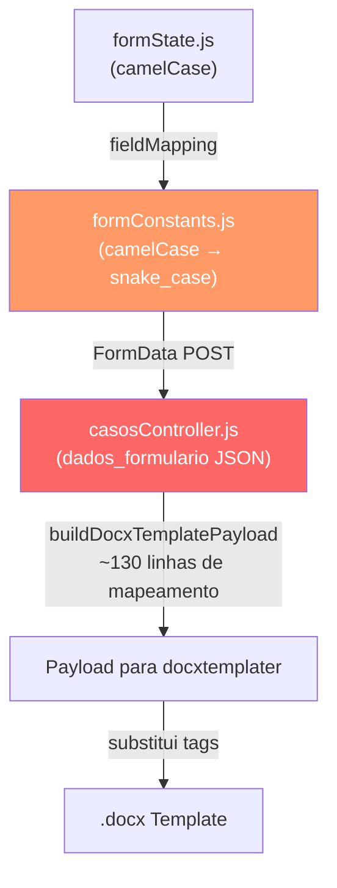
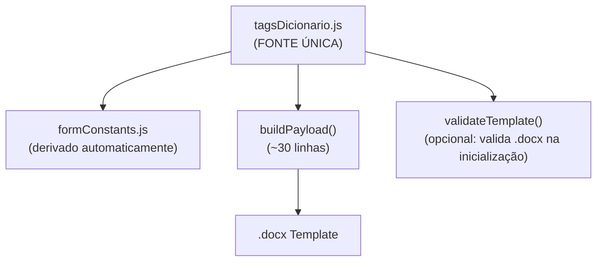

# Plano: Centralização do Dicionário de Tags

## Contexto

Hoje o mapeamento entre campos do formulário ↔ tags do Word está espalhado em **4 arquivos diferentes** com nomes inconsistentes. Isso causa bugs silenciosos e dificulta a adição de novos modelos.



O nó vermelho (`casosController.js`) é onde mora a bagunça: 130 linhas de mapeamento manual com aliases redundantes.

---

## Objetivo

Criar **1 arquivo** que seja a fonte da verdade para:
1. Quais campos o frontend envia (e com qual nome)
2. Quais tags o template Word espera
3. Como transformar um no outro

---

## Proposta de Arquitetura

### Novo Arquivo: `backend/src/config/tagsDicionario.js`



O dicionário terá esta estrutura:

```javascript
{
  tagWord: "executado_nome",           // Nome exato no .docx
  campoFormulario: "nomeRequerido",    // Nome no formState (camelCase)  
  campoApi: "nome_requerido",          // Nome enviado na API (snake_case)
  transform: "uppercase",             // Transformação a aplicar (opcional)
  acoes: ["*"],                        // Em quais ações esta tag aparece: "*" = todas
}
```

---

## Proposed Changes

### Backend

---

#### [NEW] [tagsDicionario.js](file:///c:/Users/weslley.santos/Downloads/maes_acao/backend/src/config/tagsDicionario.js)

Arquivo central com ~3 seções:

1. **`TAGS_GERAIS`** — Tags presentes em todos os modelos (partes, sistema)
2. **`TAGS_POR_ACAO`** — Tags específicas por tipo de ação (`execucao_alimentos`, `fixacao_alimentos`)
3. **`ALIASES`** — Mapeamento de nomes alternativos usados em templates legados
4. **`TAGS_LOOP`** — Definição da estrutura `lista_filhos` (loop)
5. Funções utilitárias: `buildPayloadFromDicionario(formData, acaoKey)` e `getTagsParaAcao(acaoKey)`

---

#### [MODIFY] [casosController.js](file:///c:/Users/weslley.santos/Downloads/maes_acao/backend/src/controllers/casosController.js)

- **Remover**: a função `buildDocxTemplatePayload` inteira (~130 linhas, L628-890)
- **Substituir por**: chamada a `buildPayloadFromDicionario(formData, acaoKey)` importada do dicionário
- **Manter**: `processarDadosFilhosParaPeticao` (lógica de loop de filhos é complexa demais para declarativa)
- **Manter**: `gerarTextoCompletoPeticao` (não é tag, é IA)

> [!IMPORTANT]
> A função `processarDadosFilhosParaPeticao` (linhas 553-626) precisa continuar existindo porque envolve lógica condicional complexa (calcular idade, decidir "representado" vs "assistido", montar separadores). Ela será **chamada de dentro** do `buildPayloadFromDicionario`, não substituída.

---

#### [MODIFY] [dicionarioAcoes.js](file:///c:/Users/weslley.santos/Downloads/maes_acao/backend/src/config/dicionarioAcoes.js)

- Adicionar referência ao conjunto de tags de cada ação (para validação)

---

### Frontend

---

#### [MODIFY] [formConstants.js](file:///c:/Users/weslley.santos/Downloads/maes_acao/frontend/src/areas/servidor/utils/formConstants.js)

- O `fieldMapping` será **gerado automaticamente** a partir de uma cópia local do dicionário, em vez de ser mantido manualmente
- Na prática: copiamos a lista de `{campoFormulario → campoApi}` do dicionário para cá em build-time ou como constante derivada

---

#### [MODIFY] [familia.js](file:///c:/Users/weslley.santos/Downloads/maes_acao/frontend/src/config/formularios/acoes/familia.js)

- Atualizar `tagsTemplate` para usar as chaves reais do dicionário
- Isso permite validação cruzada: "o form captura tudo que o template precisa?"

---

## Estimativa de Esforço

| Etapa | Tempo | Risco |
|:---|:---:|:---:|
| Criar `tagsDicionario.js` com mapeamento completo | 30 min | Baixo |
| Criar `buildPayloadFromDicionario()` | 30 min | Médio |
| Refatorar `buildDocxTemplatePayload` no controller | 20 min | Médio |
| Atualizar `formConstants.js` | 10 min | Baixo |
| Atualizar `familia.js` | 5 min | Baixo |
| Testar geração de Penhora + Prisão | 15 min | — |
| **Total** | **~2h** | — |

---

## Open Questions

> [!IMPORTANT]
> **Compartilhamento real vs convencional?**  
> Frontend e backend são projetos separados (Vite vs Express). Temos duas opções:
> 
> **Opção A — Arquivo espelhado**: Manter o dicionário no backend e um "espelho" derivado no frontend (`formConstants.js` continua existindo, mas baseado nas mesmas chaves).
> 
> **Opção B — Pacote compartilhado**: Criar um `shared/` na raiz do monorepo e configurar ambos os projetos para importar dele. Mais elegante, mas requer ajustar os resolvers do Vite e do Express.
> 
> **Recomendação:** Opção A. É mais simples, funciona imediatamente, e o risco de dessincronização é mínimo porque o `formConstants.js` raramente muda.

---

## Verification Plan

### Automated Tests
1. Gerar Penhora + Prisão via Docker e verificar que todas as tags foram substituídas (sem `{tag}` residual no .docx)
2. Comparar output antes/depois da refatoração para garantir igualdade byte-a-byte no Word gerado

### Manual Verification
1. Submeter um caso de teste completo pelo formulário do frontend
2. Verificar no painel do defensor que os documentos baixados estão corretos
