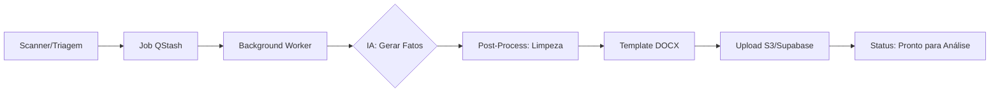

# Plano de Implementação: Liberação de Vínculo e Redirecionamento

Este plano descreve as alterações necessárias para garantir que os casos sejam desvinculados automaticamente ao retornarem para o status "Pronto para Análise" e que os usuários sejam redirecionados para o dashboard após concluírem transições de status importantes.

## Revisão do Usuário Necessária

> [!IMPORTANT]
> Confirmar se a mudança de um caso para "Pronto para Análise" deve limpar as atribuições de Servidor e Defensor para torná-lo disponível para toda a equipe.

## Alterações Propostas

---

### [Componente: Backend]

#### [MODIFY] [casosController.js](file:///c:/Users/weslley/Downloads/defensoria/maes%20em%20acao/defsul_maes/backend/src/controllers/casosController.js)

- Atualizar `atualizarStatusCaso` para anular `servidor_id`, `servidor_at`, `defensor_id` e `defensor_at` quando o novo status for `pronto_para_analise`.
- Manter a lógica existente para `liberado_para_protocolo` (liberando apenas o vínculo do servidor).

---

### [Componente: Frontend]

#### [MODIFY] [DetalhesCaso.jsx](file:///c:/Users/weslley/Downloads/defensoria/maes%20em%20acao/defsul_maes/frontend/src/areas/defensor/pages/DetalhesCaso.jsx)

- Modificar `handleStatusChange` para:
  - Interceptar o status `pronto_para_analise` e exibir uma janela de confirmação usando `useConfirm`.
  - Redirecionar o usuário para `/painel` (Dashboard) após uma atualização de status bem-sucedida para `pronto_para_analise` ou `liberado_para_protocolo`.

---

### [Componente: Frontend - Triage]

#### [MODIFY] [submissionService.js](file:///c:/Users/weslley/Downloads/defensoria/maes%20em%20acao/defsul_maes/frontend/src/areas/servidor/services/submissionService.js)

- Corrigir a lógica de `isEnviarDepois` para evitar que a string `"false"` seja interpretada como verdadeira devido à coerção booleana.

## Plano de Verificação

### Testes Automatizados

- Não há testes automatizados disponíveis; verificação manual necessária.

### Verificação Manual

1. Abrir um caso atribuído a um usuário.
2. Alterar o status para "Pronto para Análise".
3. Verificar se uma janela de confirmação aparece.
4. Confirmar a alteração e verificar o redirecionamento para o dashboard.
5. Verificar no banco de dados (ou na lista de casos) se o caso não está mais atribuído ao usuário.
6. Repetir para "Liberado para Protocolo" e verificar o redirecionamento.
   Listed directory src
   Listed directory services
   Listed directory controllers
   Searched for "processarCaso"
   Searched for "gerarMinuta"
   Viewed documentGenerationService.js:1-283
   Searched for "processarCasoEmBackground"
   Ran command: `grep -n "processarCasoEmBackground =" "c:\Users\weslley\Downloads\defensoria\maes em acao\defsul_maes\backend\src\controllers\casosController.js"`
   Ran command: `Select-String -Path "c:\Users\weslley\Downloads\defensoria\maes em acao\defsul_maes\backend\src\controllers\casosController.js" -Pattern "processarCasoEmBackground ="`
   Viewed casosController.js:1681-2480
   Viewed aiService.js:1-202
   Viewed geminiService.js:1-624

O fluxo de **geração da minuta** no sistema "Mães em Ação" é um processo automatizado (pipeline assíncrono) que ocorre em background assim que o servidor finaliza o upload de documentos ou solicita o reprocessamento.

Aqui está o passo a passo detalhado baseado na codebase:

### 1. Início e Preparação (Backend)

O ponto de entrada é a função `processarCasoEmBackground` no [`casosController.js`](file:///c:/Users/weslley/Downloads/defensoria/maes%20em%20acao/defsul_maes/backend/src/controllers/casosController.js#L1960).

- **Status**: O caso é movido para o status `processando_ia`.
- **Enriquecimento**: O sistema recupera os dados das partes (`partes`), dados jurídicos (`juridico`) e calcula automaticamente valores como o **Valor da Causa** (ex: 12x o valor da pensão para fixação) e o **Percentual do Salário Mínimo**.

### 2. Geração do Texto Jurídico ("DOS FATOS")

O sistema utiliza o [`geminiService.js`](file:///c:/Users/weslley/Downloads/defensoria/maes%20em%20acao/defsul_maes/backend/src/services/geminiService.js) para redigir a narrativa:

- **Proteção de Dados (PII)**: Antes de enviar para a IA, os nomes e CPFs são substituídos por placeholders (ex: `[NOME_REPRESENTANTE]`) para garantir a privacidade (LGPD).
- **Motor de IA**: O sistema tenta primeiro o **Groq (Llama 3.3)** por ser mais rápido e, se falhar, usa o **Gemini 2.5 Flash** como fallback.
- **Refinamento Semântico**: O texto gerado passa por um pós-processamento que:
  - Remove a 1ª pessoa (ex: muda "Meu filho" para "O alimentando").
  - Substitui termos proibidos (ex: remove "menor" e usa "criança/adolescente").
  - Normaliza nomes para papéis jurídicos ("a genitora", "o requerido").

### 3. Montagem do Documento (.docx)

Com o texto dos fatos pronto, o [`documentGenerationService.js`](file:///c:/Users/weslley/Downloads/defensoria/maes%20em%20acao/defsul_maes/backend/src/services/documentGenerationService.js) assume o controle:

- **Seleção de Template**: Com base no `acaoKey` (ex: `fixacao_alimentos`), ele escolhe o arquivo `.docx` correspondente na pasta `/templates`.
- **Lógica Multi-Minuta**: Para casos de Execução, o sistema pode gerar **até 3 minutas simultâneas** (Prisão, Penhora e Cumulado) dependendo do tempo de dívida calculado.
- **Renderização**: Utiliza a biblioteca `docxtemplater` para mesclar todos os dados (nomes, endereços, valores, dos fatos) no arquivo Word.

### 4. Armazenamento e Finalização

- **Storage**: Os arquivos gerados são enviados para o bucket `peticoes` no **Supabase Storage**.
- **Banco de Dados**: O texto da petição e os links dos arquivos são salvos na tabela `casos_ia`.
- **Conclusão**: O status do caso é atualizado para `pronto_para_analise`, liberando-o para revisão no painel do Defensor.

### Resumo Visual do Fluxo

Deseja que eu aprofunde em alguma dessas etapas ou verifique o código de um componente específico deste fluxo?
